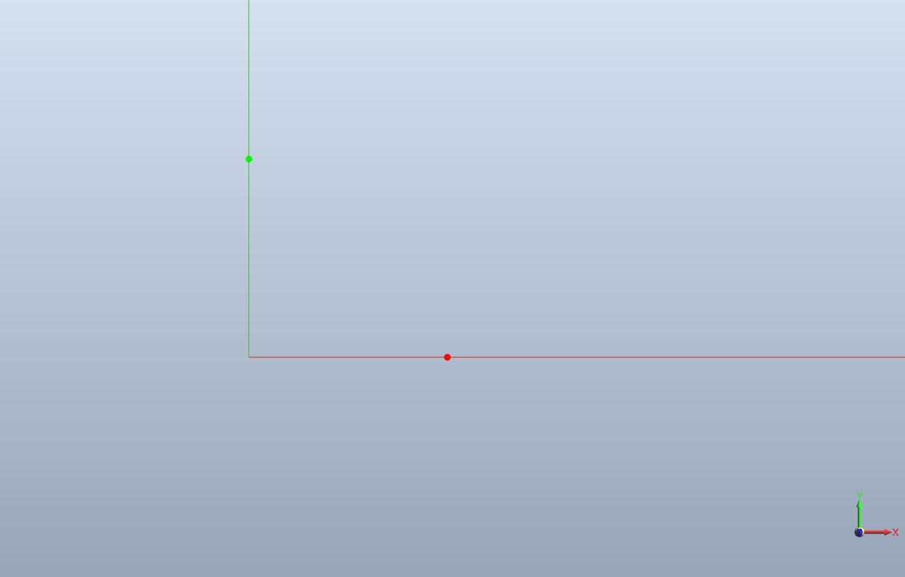

Знакомство с ядром C3D
======================
----------------------
### [Построение точек](#title_1)
* [Двумерные точки](#title_2)
* [Трехмерные точки](#title_3)

### [Построение кривых](#title_4)
* [Прямые линии в двумерном пространстве](#title_5)
* [Отрезки в двумерном пространстве](#title_6)
* [Прямые линии в трехмерном пространстве](#title_7)
* [Эллиптические дуги](#title_8)
* [Пространственные кривые](#title_9)

### [Построение поверхностей](#title_10)
* [Элементарные поверхности](#title_11)
* [Операции с поверхностями](#title_12)

### [Построение твердых тел](#title_13)
* [Элементарные твердые тела](#title_14)

### [Заключение](#title_15)

---------------------
### <a name="title_1"> []()Построение точек</a>
[]В данном уроке будут рассмотрены несколько примеров построения геометрических моделей из простейших объектов. Подробное описание классов этих объектов будет приведено в последующих работах.  

#### <a name="title_2"> []()Двумерные точки</a>
[]В качестве первого примера построим простейший геометрический объект – двумерную точку. Для ее представления в C3D используется класс [MbCartPoint](doc::/MbCartPoint) (точка в декартовой системе координат).  
[]Попробуем построить точку с координатами (1, 0), которая должна попасть на горизонтальную ось используемой для построения системы координат (СК).  
[]В начало редактора после строки с подключением заголовка setup.h добавьте команду подключения пространства имен с переменными и константами ядра c3d.  
Эти две строки в начале файла должны выглядеть так:

```cpp
#include "setup.h"
using namespace c3d;
```

Теперь добавьте в редактор функцию входа run():

**Пример 1.1.1. Построение двумерной точки.**
```cpp
bool run()
{
    // Создание двумерной точки в виде объекта MbCartPoint ядра C3D
    MbCartPoint pnt( 1, 0 );
    // Вызов метода отображения у объекта тестового приложения
    show(pnt);
    return true;
}
```
<button id="code_block_1"></button>

[]В приведенном обработчике выполняются две операции – создание простейшей геометрической модели в виде единственной точки и операция отображения. Первая операция выполняется средствами ядра C3D, вторая – с помощью песочницы. Метод show() выполняет довольно много действий: преобразует двумерную точку в трехмерную [MbCartPoint3D](doc::/MbCartPoint3D), строит на ее базе точечный каркас [MbPointFrame](doc::/MbPointFrame) и добавляет этот каркас в геометрическую модель [MbModel](doc::/MbModel), которая и отображается в окне приложения. Пока эти действия подробно рассматривать не будем, полагая, что мы имеем дело с одной геометрической моделью, в которую в виде объектов ядра C3D можем добавлять новые геометрические объекты и отображать их в окне приложения.  
[]Запустите пример. Результат может оказаться неожиданным – точка не будет видна, хотя мировая система координат построена. Для того, чтобы выяснить, произведено ли построение, нажмите клавиши Ctrl+\*, чтобы центрировать модель в окне с автоматическим подбором масштаба отображения. Теперь точка окажется в центре окна, однако мировой системы координат не видно. Клавишей “–“ или колесиком мыши отрегулируйте масштаб отображения, чтобы одновременно была видна и точка, и система координат (рис.1).  

  
**Рис. 1.** Отображение точки в окне тестового приложения в двух различных масштабах (пример 1.1.1).

[]Как и во многих других библиотеках компьютерной графики, при построении геометрических объектов в C3D необходимо учитывать расположение и ориентацию используемыхmсистем координат. При построении двумерных объектов их необходимо преобразовывать в трехмерные, для чего требуется явно указывать используемую трехмерную СК.  
[]До сих пор локальная система координат не указывалась, так что ее положение было не определено (оно зависит от действий пользователя в окне редактора). Измените пример для построения точки так, чтобы явно указать систему координат, используемую при построении – она будет совпадать с мировой СК (пример 1.1.2).  
[]Для использования класса [MbPlacement3D](doc::/MbPlacement3D) в начале примера добавьте команду для включения соответствующего заголовочного
файла:

```cpp
#include "mb_placement3d.h"
```

**Пример 1.1.2 Построение двумерной точки в локальной СК.**
```cpp
bool run()
{
    // Локальная система координат - по умолчанию совпадает с мировой СК
    MbPlacement3D pl;
    // Создание двумерной точки в виде объекта MbCartPoint ядра C3D
    MbCartPoint pnt( 1, 0 );
    // Добавление точки в геометрическую модель тестового приложения
    show(pnt, &pl);
    return true;
}
```

<button id="code_block_2"></button>

[]Повторите запуск примера и убедитесь, что точка отображается на оси X мировой СК. Измените код так, чтобы на двух осях этой СК отображались точки различных цветов: красным на оси X и зеленым на оси Y (пример 1.1.3). Теперь для каждой точки будет передаваться стиль, с помощью которого в примере можно указать толщину линии (в пикселях, а не в единицах геометрической СК) и цвет для отображения геометрического объекта. Запустите пример и увеличьте масштаб, чтобы убедиться в корректности отображения двух точек (рис. 2).

**Пример 1.1.3 Построение двумерных точек с указанием стиля отображения**
```cpp
bool run()
{
    // Система координат - по умолчанию совпадает с мировой СК
    MbPlacement3D pl;
    // Создание двух двумерных точек на осях X и Y
    MbCartPoint pntX( 1, 0 ), pntY( 0, 1 );
    // Добавление точек в модель c назначением им стилей отображения различными цветами
    show(Style(5, RGB(255, 0, 0)), pntX, &pl);
    show(Style(5, RGB(0, 255, 0)), pntY, &pl);
    return true;
}
```

<button id="code_block_3"></button>

  
**Рис. 2.** Отображение пары точек на осях X и Y мировой СК (пример 1.1.3).

[]Теперь рассмотрим, как можно изменить ориентацию системы координат, в которой выполняется построение двумерных точек (пример 1.1.4.). Используем локальную СК, полученную из мировой СК правым поворотом на 45° вокруг оси Z. Выполните приведенные далее вызовы и убедитесь, что радиус-вектор точки pntX будет повернут на 45° в плоскости XY, а точки pntY – на 135°.

**Пример 1.1.4. Построение двумерных точек в локальной СК, повернутой относительно мировой СК**
```cpp
bool run()
{
    // Создание локальной СК, повернутой на 45 градусов относительно оси Z мировой СК
    MbPlacement3D pl;
    MbAxis3D axisZ( MbVector3D(0, 0, 1) );
    pl.Rotate( axisZ, 45*M_PI/180 );
    // Создание двух двумерных точек на осях X и Y
    MbCartPoint pntX( 10, 0 ), pntY( 0, 10 );
    // Добавление точек в модель c указанием локальной СК
    show(Style(5, RGB(255, 0, 0)), pntX, &pl);
    show(Style(5, RGB(0, 255, 0)), pntY, &pl);
    return true;
}
```

<button id="code_block_4"></button>

#### <a name="title_3"> []()Трехмерные точки</a>
[]Теперь изменим обработчик так, чтобы построить три точки на трех осях СК. Для этого вместо класса двумерной точки [MbCartPoint](doc::/MbCartPoint) потребуется использовать класс трехмерной точки [MbCartPoint3D](doc::/MbCartPoint3D). При создании трехмерной точки используется мировая СК.  
[]Каждая трехмерная точка будет добавляться в виде вершины, принадлежащей геометрическому объекту «точечный каркас» [MbPointFrame](doc::/MbPointFrame). Потребуется три таких объекта, чтобы можно было каждому из них назначить собственный стиль отображения (рис. 3).

**Пример 1.2.1. Построение трехмерных точек**
```cpp
bool run()
{
    // Создание трех трехмерных точек на осях X, Y и Z
    MbCartPoint3D pntX( 1, 0, 0 ), pntY( 0, 1, 0 ), pntZ( 0, 0, 1 );
    // Добавление точек в модель c назначением им стилей отображения различными цветами
    // Каждая точка добавляется в виде "вырожденного" точечного каркаса, состоящего
    // из единственной точки
    show(Style(5, RGB(255,0,0)), new MbPointFrame(pntX));
    show(Style(5, RGB(0,255,0)), new MbPointFrame(pntY));
    show(Style(5, RGB(0,0,255)), new MbPointFrame(pntZ));
    return true;
}
```

<button id="code_block_5"></button>

[]Обратите внимание, что эти объекты [MbPointFrame](doc::/MbPointFrame) создаются динамически, но освобождения памяти не производится. При удалении геометрической модели [MbModel](doc::/MbModel), которая поддерживается внутри приложения, все добавленные в нее геометрические объекты будут удалены автоматически (например, при закрытии приложения или при загрузке новой модели из файла \*.c3d).  
[]Для использования класса [MbPointFrame](doc::/MbPointFrame) добавьте в начало исходного файла команду включения соответствующего заголовочного файла:
```cpp
#include "point_frame.h"
```

  
**Рис. 3.** Отображение трех точек на осях мировой СК – пример 1.2.1 (после увеличения масштаба).

[]Рассмотрим пример формирования точечного каркаса [MbPointFrame](doc::/MbPointFrame), состоящего из некоторого множества точек. Выполните следующий пример, в котором выполняется размещение точек на плоскости XY мировой СК посредством равномерной выборки на одном периоде синусоиды.

**Пример 1.2.2. Построение набора трехмерных точек в виде одного точечного каркаса**
```cpp
bool run()
{
    // Динамическое создание геометрического объекта "Точечный каркас"
    MbPointFrame* pPnts = new MbPointFrame();
    // Добавление точек в каркас pPnts - равномерная выборка одного периода синусоиды
    const int STEP_COUNT = 10;
    for (int i = 0; i <= STEP_COUNT; i++)
    {
        double x = 2*M_PI/STEP_COUNT * i;
        MbCartPoint3D pnt( x, sin(x), 0 );
        pPnts->AddVertex( pnt );
    }
    // Добавление точечного каркаса в геометрическую модель
    show(Style(5, RGB(255,0,0)), pPnts);
    return true;
}
```

<button id="code_block_6"></button>

  
**Рис. 4.** Точечный каркас, содержащий 11 точек, и окно свойств для просмотра содержимого модели (пример 1.2.2).

#### Задания(1)
1. Выполните все примеры построения двумерных и трехмерных точек из примеров.
2. Воспользуйтесь справочной системой C3D и найдите описание классов, которые использовались при построении двумерных и трехмерных точек:
* [MbCartPoint](doc::/MbCartPoint),
* [MbCartPoint3D](doc::/MbCartPoint3D),
* [MbPointFrame](doc::/MbPointFrame),
* [MbPlacement3D](doc::/MbPlacement3D),
* [MbAxis3D](doc::/MbAxis3D),
* [MbVector3D](doc::/MbVector3D).

3. Постройте точки, лежащие в вершинах четырехгранной пирамиды, основание которой лежит в плоскости XZ, а ось направлена вдоль оси Y.
4. На основе примера реализуйте построение точечного каркаса с равномерным размещением точек по окружности с центром в начале координат, лежащей в плоскости XY.
5. На основе примера 1.2.2 реализуйте построение точечного каркаса с равномерным размещением точек по окружности с центром в начале координат, лежащей в плоскости XY.

### <a name="title_4"> []()Построение кривых</a>
---------------------
[]Кривые являются базовыми геометрическими объектами ядра C3D. Они используются для построения поверхностей, для представления линий пересечения поверхностей, для построения вспомогательных объектов. В C3D есть два абстрактных базовых класса для представления двумерных и трехмерных кривых: [MbCurve](doc::/MbCurve) и [MbCurve3D](doc::/MbCurve3D). В ядре имеются наборы классов, унаследованных от этих базовых классов, которые предназначены для представления кривых конкретного вида: прямых, отрезков, ломаных, эллипсов, сплайнов, и др. Допустимо описывать новые классы, унаследованные от базовых – их можно будет использовать для построения геометрических моделей C3D наряду с встроенными классами кривых. Далее приведены несколько примеров, демонстрирующих построение простейших кривых с использованием готовых классов C3D. Для ознакомления с их действием, выполните следующие примеры.

#### <a name="title_5"> []()Прямые линии в двумерном пространстве</a>
[]Прямая линия является частным простейшим видом кривых линий. Прямые часто используются в качестве вспомогательных объектов при построении геометрических моделей и решении геометрических задач. В C3D есть отдельные классы для построения прямых в двумерном и трехмерном пространстве. Сначала рассмотрим построение двумерных прямых. В начало исходного файла добавьте команды для включения заголовочных файлов:
```cpp
#include "curve.h" // Класс двумерной кривой MbCurve
#include "cur_line.h" // Класс двумерной прямой MbLine
```
[]В приведенном далее примере 2.1 показаны вызовы для построения пары прямых двумя различными способами – по двум точкам и по точке и направлению.

**Пример 2.1 Построение прямой линии в двумерном пространстве**
```cpp
bool run()
{
    MbPlacement3D pl; // Локальная СК (по умолчанию совпадает с мировой СК)
    // ПОСТРОЕНИЕ ДВУМЕРНОЙ ПРЯМОЙ – ПО ДВУМ ТОЧКАМ
    MbCartPoint p1(0, 0), p2(1, 1); // Пара точек для построения прямой
    // Динамическое создание объекта-прямой посредством вызова конструктора MbLine
    MbLine* pLine1 = new MbLine( p1, p2 );
    // В случае успешного создания объекта-прямой этот объект передается для сохранения
    // в геометрической модели тестового приложения и для последующего отображения
    // (будет отображаться красным цветом)
    if ( pLine1 != nullptr )
        show(Style( 1, RGB(255,0,0)), pLine1, &pl);
    // ПРИМЕЧАНИЕ: удаление pLine1 не производится - за это отвечает
    // объект - геометрическая модель внутри тестового приложения
    // ПОСТРОЕНИЕ ДВУМЕРНОЙ ПРЯМОЙ – ПО ТОЧКЕ И УГЛУ
    // Коэффициент для преобразования значений углов из градусов в радианы
    const double DEG_TO_RAD = M_PI/180.0;
    // Точка на оси Y
    MbCartPoint pnt( 0, 5 );
    // Направление (нормированный вектор) 15 градусов относительно оси X
    MbDirection dir( 15*DEG_TO_RAD );
    // Создание объекта-прямой с указанием точки и угла
    MbLine* pLine2 = new MbLine( pnt, dir );
    // Передача объекта-прямой тестовому приложению (будет отображаться синим цветом)
    if ( pLine2 )
        show( Style(1, RGB(0,0,255)), pLine2, &pl);
    return true;
}
```

<button id="code_block_7"></button>

[]В приведенном фрагменте демонстрируется типичный порядок действий по созданию геометрических объектов:
1. Создание вспомогательных объектов для представления параметров, необходимых для создания геометрического объекта (например, локальная СК, описание точек и векторов).
2. Динамическое создание геометрического объекта в виде объекта класса, унаследованного от базового [MbPlaneItem](doc::/MbPlaneItem) (для двумерных объектов, в данном примере это класс [MbLine](doc::/MbLine)) или [MbSpaceItem](doc::/MbSpaceItem) (для трехмерных объектов).
3. Добавление созданного объекта в геометрическую модель (в данном примере это действие выполняется внутри метода приложения show).

[]Перенесите код в редактор и запустите для построения пары прямых. Чтобы увидеть расположение прямых в плоскости XY, выполните команду меню вид спереди.

  
**Рис. 5.** Две прямые в плоскости XY, построенные с использованием классадвумерных прямых MbLine (пример 2.1).

#### <a name="title_6"> []()Отрезки в двумерном пространстве</a>
[]Двумерный отрезок представляется классом [MbLineSegment](doc::/MbLineSegment) (цепочка наследования:[MbLineSegment](doc::/MbLineSegment)->[MbCurve](doc::/MbCurve)->[MbPlaneItem](doc::/MbPlaneItem)).
[]Ниже приведен пример построения отрезка по двум точкам в плоскости XZ (указание плоскости построения выполняется с помощью локальной СК). Чтобы увидеть перпендикулярную проекцию плоскости XZ мировой СК, выберите вид сверху.

**Пример 2.2. Построение двумерного отрезка**
```cpp
#include "cur_line_segment.h" // Класс двумерного отрезка MbLineSegment

bool run()
{
    // Локальная СК (расположена так, чтобы ее плоскость XY совпадала с
    // плоскостью XZ мировой СК)
    MbPlacement3D pl;
    pl.SetAxisY( MbVector3D(0, 0, 1) );
    // Вершины отрезка
    MbCartPoint p1(5, 5), p2(15, 7);
    // Динамическое создание объекта-отрезка
    MbLineSegment* pSeg = new MbLineSegment( p1, p2 );
    // Сохранение и отображение в тестовом приложении
    if ( pSeg )
        show( pSeg, &pl );
    return true;
}
```

<button id="code_block_8"></button>

#### <a name="title_7"> []()Прямые линии в трехмерном пространстве</a>
[]С помощью функций ядра C3D решим задачу нахождения точки пересечения пары прямых в трехмерном пространстве. Прямые будут строиться по двум точкам.  
[]Если прямые пересекаются, то будет отображаться точка пересечения. Если прямые не пересекаются, то отображаются ближайшие точки этих прямых, а в окне сообщения показывается расстояние между этими точками.  
[]Заголовочные файлы, которые потребуются для рассматриваемого примера:
```cpp
#include "cur_line3d.h" // Класс прямой MbLine3D
#include "point_frame.h" // Класс MbPointFrame для отладочного отображения точек
#include "action_point.h" // Описание алгоритмов трехмерной вычислительной геометрии
```

[]Решение задачи показано ниже (пример 2.3). Первая прямая строится по точкам p1(0, 5, 0) и p2(3, 7, 5). Вторая прямая строится по точкам p3(0, 3, 0) и p4(3, –7, 5). Эти прямые пересекаются. Для удобного отображения пространственного построения, в тестовом приложении пользуйтесь клавишами для поворота модели и для изменения масштаба.

  
**Рис. 6.** Две пересекающиеся прямые. Показаны точки, по которым построены прямые, а также точка их пересечения (пример 2.3).

**Пример 2.3 Построение прямых линий в трехмерном пространстве**
```cpp
// Построение пары прямых по двум точкам и проверка их пересечения
bool run()
{
    // Построение трехмерной прямой по двум точкам
    MbCartPoint3D p1(0, 5, 0), p2(3, 7, 5);
    MbLine3D* pLine1 = new MbLine3D( p1, p2 );
    // Прямая и точки, по которым она построена, отображаются синим цветом
    if (pLine1)
    {
        show(Style( 2, BLUE ), pLine1);
        show(Style( 1, BLUE ), new MbPointFrame(p1));
        show(Style( 1, BLUE ), new MbPointFrame(p2));
    }
    // Построение второй прямой по двум точкам
    MbCartPoint3D p3(0, 3, 0), p4(3, -7, 5);
    MbLine3D* pLine2 = new MbLine3D( p3, p4 );
    // Отображение второй прямой и пары ее точек пурпурным цветом
    if ( pLine2 )
    {
        show( Style( 2, LIGHTMAGENTA ), pLine2              );
        show( Style( 1, LIGHTMAGENTA ), new MbPointFrame(p3));
        show( Style( 1, LIGHTMAGENTA ), new MbPointFrame(p4));
    }
    // Применение алгоритма для нахождения ближайших точек двух прямых и для
    // вычисления расстояния между ними
    MbCartPoint3D pntRes1, pntRes2;
    double distMin = LineLineNearestPoints( *pLine1, *pLine2, pntRes1, pntRes2 );
    // Поскольку точность компьютерных вычислений конечна, то для проверки
    // пересечения прямых минимальное расстояние следует сравнивать не с
    // точным нулевым значением 0.0, а с малой конечной величиной - допуском
    if (distMin > 1e-10 )
    {
        // Отображение красным цветом ближайших точек пары прямых
        show( Style( 1, LIGHTRED ), new MbPointFrame(pntRes1) );
        show( Style( 1, LIGHTRED ), new MbPointFrame(pntRes2) );
        message("Расстояние между прямыми: " + std::to_string(distMin));
    }
    else
    {
        // Отображение красным цветом точки пересечения прямых
        show( Style( 1, LIGHTRED ), new MbPointFrame(pntRes1) );
        message("Прямые пересекаются");
    }
    return true;
}
```

<button id="code_block_9"></button>

[]Попробуйте изменить точки, по которым строится вторая прямая, для построения скрещивающейся (например, p3(0, 3, 0) и p4(5, 0, 0)) и параллельной прямой (например, p3(0, 2.5, 0) и p4(1.5, 3.5, 2.5)).

#### <a name="title_8"> []()Эллиптические дуги</a>
[]Дуги эллипсов и окружностей в трехмерном пространстве представляются классом [MbArc3D](doc::/MbArc3D) (цепочка наследования: [MbArc3D](doc::/MbArc3D)->[bCurve3D](doc::/bCurve3D)->[MbSpaceItem](doc::/MbSpaceItem)). В классе предусмотрены несколько конструкторов для построения дуги с использованием различных наборов параметров. В каноническом виде в декартовой системе координат эллипс с центром в начале координат описывается каноническим уравнением:  
  
[]В интерфейсах классов геометрических объектов поддерживается работа с параметрами канонических уравнений. Для расчетов в ядре используется общепринятый в области вычислительный геометрии подход с использованием параметрических уравнений. Возможно, оно менее наглядно для восприятия человеком, но обладает достоинствами с точки зрения организации вычислений. Классы, представляющие геометрические объекты, могут поддерживать оба способа работы с объектами – и в каноническом виде, и в параметрическом. Далее рассмотрим, как построить несколько различных эллиптических дуг. В приведенном примере описываются окружность (эллипс с равными полуосями), эллипс (замкнутая эллиптическая дуга), и дуга эллипса (составляющая четверть от полного эллипса).

Заголовочный файл для подключения описания класса [MbArc3D](doc::/MbArc3D):
```cpp
#include "cur_arc3d.h"
```

**Пример 2.4 Построение эллиптических дуг**
```cpp
#include "cur_arc3d.h"

bool run()
{
    // Коэффициент для преобразования значений углов из градусов в радианы
    const double DEG_TO_RAD = M_PI/180.0;
    // Построение окружности в плоскости XY с центром в точке (5, 0) и радиусом 2
    MbCartPoint3D pntCenter( 5, 0, 0 );
    // Пара точек на окружности
    MbCartPoint3D pntOnCircle1( 7, 0, 0 );
    MbCartPoint3D pntOnCircle2( 5, 2, 0 );
    // Вызываемый конструктор позволяет строить как окружности, так и дуги окружностей
    // (в зависимости от передаваемых параметров)
    // Четвертый параметр определяет смысл первого параметра – при n=0 его следует
    // рассматривать в качестве центра окружности
    // Пятый параметр при closed=true задает построение замкнутой окружности (а не дуги)
    MbArc3D* pCircle = new MbArc3D(pntCenter, pntOnCircle1, pntOnCircle2,
    0 /* n */, true /* closed */ );
    if (pCircle)
        show( Style( 1, LIGHTBLUE ), pCircle );
    // Построение эллипса в плоскости XY с поворотом осей на 45 градусов
    // pl - локальная система координат, в которой эллипс имеет каноническую форму
    // (в ней оси эллипса параллельны осям координат)
    MbPlacement3D pl;
    pl.Rotate( MbAxis3D(pl.GetAxisZ()), 45*DEG_TO_RAD );
    // Построение эллипса с указанием локальной СК и величин полуосей
    // Последний параметр задает конец дуги в случае построения эллиптической дуги,
    // для замкнутого эллипса должно быть angle=0
    MbArc3D* pEllipse = new MbArc3D( pl, 10, 5, 0 /* angle */ );
    if (pEllipse)
        show( Style( 1, LIGHTRED ), pEllipse );
    // Построение четверти эллиптической дуги для уже построенного эллипса.
    // Начало и конец дуги расположены под углами 60 и 150 градусов относительно
    // большой полуоси эллипса.
    // Последний параметр initSense=1 задает направление движения против часовой стрелки
    // от начальной до конечной точки дуги.
    MbArc3D* pQuarterArc = new MbArc3D( *pEllipse, 60*DEG_TO_RAD,
    150*DEG_TO_RAD, 1 /* initSense */ );
    if (pQuarterArc)
        show( Style( 2, LIGHTMAGENTA ), pQuarterArc );
    return true;
}
```

<button id="code_block_10"></button>

  
**Рис. 7.** Пример построения объектов класса MbArc3D: окружность, эллипс и дуга эллипса (пример 2.4).

[]Результаты работы примера 2.4 показаны на рис.7. Найдите в справочной системе описание конструкторов [MbArc3D](doc::/MbArc3D), использовавшихся в приведенном примере и уточните назначение параметров этих конструкторов.

#### <a name="title_9"> []()Пространственные кривые</a>
[]Ядро C3D содержит более 10 классов-кривых, унаследованных от базового [MbCurve3D](doc::/MbCurve3D). До сих пор рассматривались классы для построения плоских кривых. Однако кривые совершенно не обязательно должны быть плоскими, и в качестве примера рассмотрим построение пространственной кривой.  
[]С использованием алгоритмов ядра решим задачу по обнаружению точек пересечения конической спирали и заданной плоскости. Коническая спираль и вычисленные точки пересечения будут отображаться в приложении (рис. 8).

  
**Рис. 8.** Пример построения пространственной кривой MbConeSpiral и вычисления ее точек пересечения с плоскостью (пример 2.5).

[]Потребуется использовать классы: коническая спираль (цепочка наследования [MbConeSpriral](doc::/MbConeSpriral)->[MbSpiral](doc::/MbSpiral)->[MbCurve3D](doc::/MbCurve3D)), плоскость ([MbPlane](doc::/MbPlane)->[MbElementarySurface](doc::/MbElementarySurface)->[MbSpaceItem](doc::/MbSpaceItem)), точка [MbCartPoint3D](doc::/MbCartPoint3D). Для вычисления точек пересечения поверхности и кривой будет использоваться алгоритм [IntersectionPoints](doc::/IntersectionPoints) из набора операций с точками.  
[]Подключаемые заголовочные файлы:  

```cpp
#include "mb_placement3d.h" // Система координат MbPlacement3D
#include "cur_cone_spiral.h" // Коническая спираль MbConeSpiral
#include "cur_polyline.h" // Ломаная двумерная линия MbPolyline
#include "cur_polyline3d.h" // Ломаная линия MbPolyline3D
#include "mb_axis3d.h" // Ось в пространстве MbAxis3D
#include "surf_plane.h" // Плоскость MbPlane
#include "point_frame.h" // Точечный каркас MbPointFrame
#include "action_point.h" // Операции с точками
```

**Пример 2.5. Трехмерная кривая и ее точки пересечения с заданной плоскостью**
```cpp
bool run()
{
    // Построение конической спирали, ось которой направлена вдоль оси Y мировой СК.
    // При построении ось конической спирали направлена вдоль оси Z локальной СК.
    // Поэтому требуется локальная СК, у которой ось Z направлена вдоль оси Y мировой СК.
    MbPlacement3D plSpiral( MbVector3D(1, 0, 0), /* Ось X локальной СК */
    MbVector3D(0, 0, -1), /* Ось Y локальной СК */
    MbCartPoint3D(0,0,0) /* Начало координат локальной СК */ );
    // Создание конической спирали.
    // Параметры конструктора:
    // 1) Локальная СК, в направлении +Z которой будет ориентирована ось спирали
    // 2) Радиус нижнего основания усеченного конуса, на боковой поверхности
    // которого располагается спираль. Основание конуса располагается в
    // плоскости XY локальной СК
    // 3) Радиус верхнего основания усеченного конуса
    // 4) Высота конуса
    // 5) Шаг спирали
    MbConeSpiral* pSpiral = new MbConeSpiral( plSpiral, 5, 3, 10, 1.5 );
    // Добавление в модель и отображение спирали красным цветом
    if (pSpiral)
        show( Style( 1, LIGHTRED ), pSpiral );
    // Создание плоскости - она совпадает с плоскостью XY локальной СК.
    // Локальная СК для плоскости - мировая СК, повернутая на 45 градусов вокруг оси X
    MbPlacement3D plPlane( MbVector3D(1,0,0), MbVector3D(0, 1, 1), MbCartPoint3D(0,0,0));
    MbPlane* pPlane = new MbPlane( plPlane );
    if (pPlane)
    {
        // Для отображения плоскости построим в виде ломаной линии прямоугольник
        // со стороной 40
        MbRect rRect(-20, -20, 20, 20); // Двумерные координаты вершин прямоугольника
        // Прямоугольник на плоскости в виде двумерной ломаной линии.
        // Это вспомогательный геометрический объект, который не добавляется в модель.
        // Поэтому он создается в виде автоматической стековой переменной, а не в виде
        // динамического объекта
        MbPolyline rect2D ( rRect );
        // Прямоугольник в трехмерном пространстве, лежащий в плоскости plPlane
        MbPolyline3D* pRect3D = new MbPolyline3D( rect2D, plPlane );
        // Добавление прямоугольника в модель и отображение синим цветом
        if (pRect3D)
            show(Style(1, LIGHTBLUE), pRect3D );
    }
    // Вычисление точек пересечения спирали и плоскости.
    // Результат возвращается в виде значений параметров параметрических уравнений
    // плоскости и спирали, которые соответствуют точкам пересечения.
    SArray<MbCartPoint> uvPlane;
    SArray<double> ttSpiral;
    IntersectionPoints( *pPlane, true, *pSpiral, false, uvPlane, ttSpiral );
    // Количество точек пересечения
    int pntCnt = ttSpiral.Count();
    // Отображение точек пересечения
    for (int i = 0; i < pntCnt; i++)
    {
        // Вычисление декартовых координат i-й точки пересечения посредством
        // подстановки параметра ttSpiral[i] в параметрическое уравнение спирали.
        MbCartPoint3D pnt;
        pSpiral->_PointOn(ttSpiral[i], pnt);
        show( Style(2, LIGHTMAGENTA), new MbPointFrame(pnt) );
    }
    return true;
}
```

<button id="code_block_11"></button>

#### Задания(2)
1. Запустите примеры.
2. На плоскости постройте множество из 10 прямых, пересекающихся в одной точке, с одинаковым угловым шагом между соседними прямыми (используйте класс [MbLine](doc::/MbLine), конструктор с указанием точки и угла). В тестовом приложении обеспечьте отображение прямых и точки пересечения. **Замечание.** В  приложении при просмотре прямых в окрестности точки пересечения не используйте слишком большой масштаб. Например, при масштабном коэффициенте более 100000 (значение коэффициента M выводится в строке состояния) при отображении могут проявляться ошибки приближенного представления экранных координат. Этот эффект не связан с точностью вычислений в ядре C3D и является следствием упрощенного способа отображения геометрических объектов в приложении.
3. Постройте треугольник (с использованием класса двумерных отрезков [MbLineSegment](doc::/MbLineSegment)) и вписанную в него окружность ([MbArc](doc::/MbArc)). Центр вписанной окружности лежит на пересечении биссектрис внутренних углов. Построение окружности можно разделить на три этапа:
* построение биссектрис любых двух углов треугольника;
* нахождение точки пересечения биссектрис;
* вычисление радиуса вписанной окружности.
[]Для построения биссектрис используйте функцию [LineBisector](doc::/LineBisector) (из набора операций по построению кривых в двумерном пространстве, заголовочный файл alg_curve_distance.h). Для поиска точки пересечения биссектрис используйте функцию [LineLine](doc::/LineLine) (заголовочный файл action_point.h), а для вычисления радиуса окружности – метод [DistanceToLineSeg](doc::/MbCartPoint::DistanceToLineSeg) класса [MbCartPoint](doc::/MbCartPoint). **Замечание о функции [LineBisector](doc::/LineBisector)**. При пересечении пары прямых образуются две пары смежных углов. Указание угла, для которого надо получить биссектрису с помощью [LineBisector](doc::/LineBisector), выполняется за счет порядка указания прямых-сторон угла. Например, в треугольнике **P1P2P3** требуется получить биссектрису угла при вершине **P1**. Тогда при вызове [LineBisector](doc::/LineBisector) надо передать следующие параметры:
* вершину угла – точку **P1**;
* прямую **P1P2**, построенную по точкам **P1** и **P2** (в конструктор прямой [MbLine](doc::/MbLine) эти точки должны быть переданы именно таком порядке); 
* прямую **P1P3**, построенную по точкам **P1** и **P3**;
* прямую-выходной параметр, в виде которого будет возвращена вычисленная биссектриса угла. **Замечание о функции [LineLine](doc::/LineLine)**. При вызове [LineLine](doc::/LineLine) надо в качестве параметров передать две прямые (в данном примере – биссектрисы двух углов треугольника) и выходной параметр – двумерную точку – для получения вычисленной точки пересечения прямых. Эта функция возвращает значение 1, если прямые пересекаются, или 0, если они параллельны или совпадают. **Замечание о методе [MbCartPoint::DistanceToLineSeg](doc::/MbCartPoint::DistanceToLineSeg)**. Этот метод предназначен для вычисления расстояния от точки до отрезка. Допустим, вершины стороны треугольника P1P2 представлены в виде объектов [MbCartPoint](doc::/MbCartPoint) с именами p1 и p2, а центр вписанной окружности хранится в виде объекта [MbCartPoint](doc::/MbCartPoint) с именем cnt. Тогда вызов метода будет иметь вид: cnt.DistanceToLineSeg( p1, p2). Полученное значение можно использовать в качестве искомого радиуса вписанной окружности.
4. Постройте куб из отрезков, представляющих его стороны, с использованием класса [MbLineSegment3D](doc::/MbLineSegment3D).
5. Постройте набор из нескольких параллельных прямых, расположенных на равном расстоянии друг от друга, с использованием класса [MbLine3D](doc::/MbLine3D).
6. Постройте два эллипса с непараллельными осями, пересекающиеся в четырех точках (класс [MbArc3D](doc::/MbArc3D)). Вычислите и отобразите точки пересечения эллипсов (функция Curve-CurveIntersection).
7. Постройте коническую спираль ([MbConeSpiral](doc::/MbConeSpiral)) и эллипс ([MbArc3D](doc::/MbArc3D)). Найдите ближайшие точки этих кривых (функция [NearestPoints](doc::/NearestPoints), заголовочный файл curve3d.h). Отобразите кривые и найденные точки. Постройте отрезок между этими точками. Вычислите расстояние между точками и отобразите его в диалоговом окне. Вычислите длину отрезка, пользуясь данными из окна свойств геометрической модели.

### <a name="title_10"> []()Построение поверхностей</a>
--------------------------
[]Поверхности, как и кривые, относятся к базовым объектам геометрической модели ядра C3D. Для описания поверхностей используются параметрические уравнения, зависящие от двух параметров (обычно обозначаются u и v). Базовым классом для представления поверхностей в трехмерном пространстве является класс [MbSurface](doc::/MbSurface). Он унаследован от класса «Геометрический объект в трехмерном пространстве» [MbSpaceItem](doc::/MbSpaceItem). Наследование от [MbSurface](doc::/MbSurface) обеспечивает унифицированную обработку поверхностей функциями ядра (например, для реализации вычислительных алгоритмов определения пересечений геометрических объектов, расстояний между ними и т.п.)  
[]В C3D имеется набор готовых классов, унаследованных от [MbSurface](doc::/MbSurface) и предназначенных для представления различных поверхностей. При необходимости можно разрабатывать новые классы, унаследованные от [MbSurface](doc::/MbSurface).

#### <a name="title_11"> []()Элементарные поверхности</a>
[]Рассмотрим построение нескольких различных поверхностей из набора элементарных поверхностей. К ним относятся поверхности, для которых известны непараметрические аналитические уравнения, представляемые в каноническом виде в локальной СК. Базовым классом для элементарных поверхностей является [MbElementarySurface](doc::/MbElementarySurface) (цепочка наследования: [MbElementarySurface](doc::/MbElementarySurface)->[MbSurface](doc::/MbSurface)->[MbSpaceItem](doc::/MbSpaceItem)). В ядре представлены следующие унаследованные классы элементарных поверхностей: [MbPlane](doc::/MbPlane) (плоскость, этот класс уже использовался в примере), MbConeSurface (коническая поверхность), [MbCylinderSurface](doc::/MbCylinderSurface) (цилиндрическая поверхность), [MbSphereSurface](doc::/MbSphereSurface) (сферическая поверхность), [MbTorusSurface](doc::/MbTorusSurface) (тороидальная поверхность).  
[]Для построения элементарных поверхностей можно использовать такой же подход, как в рассмотренных выше примерах – явное создание объектов класса с вызовом подходящего конструктора. Конструкторов в каждом классе-поверхности, как правило, несколько, из которых можно выбрать наиболее подходящий для решаемой задачи. Вторым способом создания объектов-поверхностей является использование функции ядра [ElementarySurface()](doc::/ElementarySurface) (входит в набор функций построения поверхностей, заголовочный файл action_surface.h). Преимуществом второго способа является то, что функции ядра по созданию геометрических объектов (в т.ч. [ElementarySurface](doc::/ElementarySurface)) выполняют внутреннюю диагностику успешности процедуры построения, и возвращают результат в виде значения [MbResultType](doc::/MbResultType). Тип [MbResultType](doc::/MbResultType) используется в ядре в качестве кода выполнения геометрических операций (код успешного выполнения rt_Success). Использование функций, возвращающих значения [MbResultType](doc::/MbResultType), упрощает обнаружение и обработку логических ошибок.  
[]В приведенном ниже примере 3.1. демонстрируется создание нескольких элементарных поверхностей. В плоскости XZ мировой СК создается плоская поверхность. На ней размещаются две сферические, две цилиндрические и две конические поверхности. Поверхности каждого типа создаются двумя различными способами (они отображаются различными цветами).

  
**Рис. 9.** Построение элементарных поверхностей MbSphereSurface, MbCylinderSurface и MbConeSurface (пример 3.1).

**Пример 3.1. Построение элементарных поверхностей**
```cpp
#include "mb_axis3d.h" // Ось в пространстве MbAxis3D
#include "mb_placement3d.h" // Система координат MbPlacement3D
#include "point_frame.h" // Точечный каркас MbPointFrame
#include "cur_line_segment3d.h" // Отрезок MbLineSegment3D
#include "surf_plane.h" // Плоскость MbPlane
#include "surf_sphere_surface.h" // Сферическая поверхность MbSphereSurface
#include "surf_cylinder_surface.h" // Цилиндрическая поверхность MbCylinderSurface
#include "surf_cone_surface.h" // Коническая поверхность MbConeSurface
#include "action_surface.h" // Функции построения поверхностей

bool run()
{
    // Коэффициент для преобразования значений углов из градусов в радианы
    const double DEG_TO_RAD = M_PI/180.0;
    // Построение плоскости, совпадающей с координатной плоскостью XZ.
    // Производится вызов конструктора плоскости по трем точкам.
    // В данном случае могут быть переданы произвольные точки, лежащие в плоскости XZ.
    // Значения координат влияют на размеры плоскости при отображении в
    // тестовом приложении.
    MbCartPoint3D planePnt1( 0, 0, 0 );
    MbCartPoint3D planePnt2( 50, 0, 0 );
    MbCartPoint3D planePnt3( 0, 0, 50 );
    MbPlane* pPlane = new MbPlane( planePnt1, planePnt2, planePnt3 );
    // Отображение плоскости синим цветом
    if ( pPlane )
        show( Style( 1, LIGHTBLUE ), pPlane );
    // Далее производится построение элементарных поверхностей, касающихся плоскости XZ
    // и лежащих в ее положительном полупространстве.
    // Построение сферы посредством явного вызова конструктора с указанием центра и
    // радиуса сферической поверхности
    double radius_Sph1 = 10;
    MbCartPoint3D centerPnt_Sph1( -radius_Sph1*3, radius_Sph1, -radius_Sph1*3 );
    MbSphereSurface* pSphere1 = new MbSphereSurface( centerPnt_Sph1, radius_Sph1 );
    
    if ( pSphere1 )
        show( Style( 1, LIGHTRED ), pSphere1 );
    // Построение сферы вызовом функции ядра для создания элементарной поверхности
    // Назначение точек-параметров:
    // 1) начало локальной СК поверхности;
    // 2) точка, определяющая направление оси Х локальной СК и радиус поверхности;
    // 3) точка, определяющая направление оси Y локальной СК.
    // Параметры задаются так, чтобы центры двух сфер располагались по разные стороны и
    // на равном расстоянии от оси OY мировой СК
    MbSurface* pSphere2 = NULL;
    double radius_Sph2 = 7;
    MbCartPoint3D centerPnt_Sph2( -centerPnt_Sph1.x, radius_Sph2, -centerPnt_Sph1.z );
    MbCartPoint3D pntOX_Sph2 = centerPnt_Sph2 + MbVector3D( radius_Sph2, 0, 0 );
    MbCartPoint3D pntOY_Sph2 = centerPnt_Sph2 + MbVector3D( 0, radius_Sph2, 0 );
    MbResultType resSph2 = ::ElementarySurface( centerPnt_Sph2, pntOX_Sph2,
    pntOY_Sph2, st_SphereSurface, pSphere2 );
    if ( resSph2 == rt_Success )
        show( Style( 1, LIGHTGREEN ), pSphere2 );
    // Построение первой цилиндрической поверхности
    // Вызов конструктора с указанием центра локальной СК, радиуса основания и высоты.
    // Ось цилиндра ориентируется вдоль оси Z локальной СК
    double radius_Cyl1 = 4;
    double height_Cyl1 = 15;
    MbPlacement3D plCyl1;
    // Локальная СК цилиндра: мировая СК смещается на заданный вектор и поворачивается
    // так, чтобы ось Z локальной СК была параллельна оси OY мировой СК
    plCyl1.Rotate(MbAxis3D(MbVector3D(1,0,0)), -90*DEG_TO_RAD );
    plCyl1.Move( MbVector3D( radius_Cyl1*5, 0, -radius_Cyl1*5 ) );
    MbCylinderSurface* pCyl1 = new MbCylinderSurface( plCyl1, radius_Cyl1, height_Cyl1 );
    if ( pCyl1 )
        show( Style( 1, LIGHTRED ), pCyl1 );
    // Построение второй цилиндрической поверхности
    // Вызов функции ядра для создания элементарной поверхности
    MbSurface* pCyl2 = NULL;
    double radius_Cyl2 = 2.5;
    double height_Cyl2 = 10;
    // Центр нижнего основания цилиндра (начало координат локальной СК) получаем
    // отражением центра основания первого цилиндра относительно оси OY мировой СК
    MbCartPoint3D centerPnt_Cyl2 = plCyl1.GetOrigin();
    centerPnt_Cyl2.x = -centerPnt_Cyl2.x;
    centerPnt_Cyl2.z = -centerPnt_Cyl2.z;
    // Точка, задающая ось X локальной СК и определяющая высоту цилиндра
    // В данном случае ось X локальной СК параллельна оси Y мировой СК
    MbCartPoint3D pntOX_Cyl2 = centerPnt_Cyl2 + MbVector3D( 0, height_Cyl2, 0 );
    // Точка, задающая ось Y локальной СК и определяющая радиус основания
    // В данном случае ось Y локальной СК параллельна оси Z мировой СК
    MbCartPoint3D pntOY_Cyl2 = centerPnt_Cyl2 + MbVector3D( 0, 0, radius_Cyl2 );
    MbResultType resCyl2 = ::ElementarySurface( centerPnt_Cyl2, pntOX_Cyl2,
    pntOY_Cyl2, st_CylinderSurface, pCyl2 );
    if ( resCyl2 == rt_Success )
        show( Style( 1, LIGHTGREEN ), pCyl2 );
    // Построение первой конической поверхности
    // Эта поверхность касается плоскости XZ мировой СК в одной точке
    // Вызывается конструктор конической поверхности по трем точкам.
    double height_Cone1 = 15;
    double radius_Cone1 = 7.5;
    // Вершина конической поверхности
    MbCartPoint3D pntCone1_origin( 10, 0, 0 );
    // Центр основания
    MbCartPoint3D pntCone1_base = pntCone1_origin + MbVector3D(0, height_Cone1, 0 );
    // Точка на боковой поверхности в плоскости основания
    MbCartPoint3D pntCone1_surf = pntCone1_base + MbVector3D(radius_Cone1, 0, 0 );
    MbConeSurface* pCone1 = new MbConeSurface( pntCone1_origin, pntCone1_base,
    pntCone1_surf );
    if (pCone1)
        show( Style( 1, LIGHTRED ), pCone1 );
    // Построение второй конической поверхности
    // Основание этой поверхности лежит на плоскости XZ мировой СК
    double height_Cone2 = 8;
    double radius_Cone2 = 4;
    // Вершина конической поверхности
    MbCartPoint3D pntCone2_origin( -pntCone1_origin.x, height_Cone2, 0 );
    // Центр основания
    MbCartPoint3D pntCone2_base = pntCone2_origin + MbVector3D(0, -height_Cone2, 0 );
    // Точка на боковой поверхности в плоскости основания
    MbCartPoint3D pntCone2_surf = pntCone2_base + MbVector3D(radius_Cone2, 0, 0 );
    MbSurface* pCone2 = NULL;
    MbResultType resCone2 = ::ElementarySurface( pntCone2_origin, pntCone2_base,
    pntCone2_surf, st_ConeSurface, pCone2 );
    if ( resCone2 == rt_Success )
        show( Style( 1, LIGHTGREEN ), pCone2 );
    // Уменьшение счетчика ссылок на динамически созданные объекты.
    // При достижении счетчиком 0 объект будет удален вызовом деструктора.
    ::DeleteItem( pPlane );
    ::DeleteItem( pSphere1 );
    ::DeleteItem( pSphere2 );
    ::DeleteItem( pCyl1 );
    ::DeleteItem( pCyl2 );
    ::DeleteItem( pCone1 );
    ::DeleteItem( pCone2 );

    return true;
}
```

<button id="code_block_12"></button>

[]Убедитесь, что поверхности касаются плоскости XZ, поворачивая модель в окне приложения.  
[]В завершении обработчика обратите внимание на вызовы функции ядра [DeleteItem](doc::/DeleteItem). Выше отмечалось, что динамически созданные геометрические объекты, добавленные в модель C3D, будут автоматически удалены при создании модели. Несмотря на это, для предотвращения случайных утечек памяти лучше следовать правилу вызова функций удаления динамически созданных геометрических объектов при выходе из области видимости указателя на этот объект.  
[]Для этой цели следует использовать функцию ядра [DeleteItem](doc::/DeleteItem), а не оператор Си++ delete. Функция [DeleteItem](doc::/DeleteItem) корректно работает с механизмом подсчета ссылок на динамические объекты и вызывает деструктор тогда, когда счетчик ссылок становится равным 0.  
[]После вызова [DeleteItem](doc::/DeleteItem) переданный указатель на геометрический объект возвращается равным значению NULL.

#### <a name="title_12"> []()Операции с поверхностями</a>
[]Как и для кривых, в ядре C3D для работы с поверхностями предусмотрен большой набор геометрических алгоритмов. Они реализованы в виде глобальных функций ядра, например, функции построения поверхностей (заголовочный файл action_surface.h) и функции вычислений с кривыми и поверхностями в трехмерном пространстве (action_surface_curve.h). Типичной операцией с поверхностями является определение линии пересечения двух поверхностей. Результатом выполнения этой операции могут быть одна или несколько кривых. Для их представления в ядре предусмотрен специальный класс [MbSurfaceIntersectionCurve](doc::/MbSurfaceIntersectionCurve) (cur_surface_intersection.h). В качестве примера выполнения операций с поверхностями рассмотрим задачу определения линии пересечения сферы и плоскости (это окружность, рис. 10).

  
**Рис. 10.** Сечение сферической поверхности плоскостью (пример 4.2).

**Пример 4.2. Определение линии пересечения сферической поверхности и плоскости**
```cpp
#include "mb_placement3d.h" // Система координат MbPlacement3D
#include "curve3d.h" // Кривая в трехмерном пространстве MbCurve3D
#include "surf_plane.h" // Плоскость MbPlane
#include "surf_sphere_surface.h" // Сферическая поверхность MbSphereSurface
#include "action_surface_curve.h" // Функции построения трехмерных кривых
#include "wire_frame.h" // Проволочный каркас MbWireFrame

bool run()
{
    // Сфера с центром в начале координат
    double radius_Sphere = 15;
    MbPlacement3D plSphere;
    MbSphereSurface* pSphere = new MbSphereSurface( plSphere, radius_Sphere );
    if ( pSphere )
        show(Style(1, LIGHTRED), pSphere);
    // Плоскость, пересекающая сферу
    MbCartPoint3D planePnt1( 0, 5, 0 );
    MbCartPoint3D planePnt2( 30, 15, 0 );
    MbCartPoint3D planePnt3( 30, 15, 30 );
    MbPlane* pPlane = new MbPlane( planePnt1, planePnt2, planePnt3 );
    if ( pPlane )
        show( Style( 1, LIGHTBLUE ), pPlane );
    // Генератор имен для именования геометрических объектов
    MbSNameMaker snMaker( -1, MbSNameMaker::i_SideNone, 0 );
    // Проволочный каркас для приема результатов определения пересечений поверхностей
    MbWireFrame* pTmpFrame = NULL;
    // Массив указателей на объекты класса MbCurve3D
    RPArray<MbCurve3D> arrCurves( 4 /* Начальная емкость массива */ );
    // Вызов функции для вычисления кривых пересечения двух поверхностей
    MbResultType res = ::IntersectionCurve( *pSphere, *pPlane, snMaker, pTmpFrame );
    if (res == rt_Success)
    {
        // Извлечение результатов из проволочного каркаса в виде массива
        // указателей на кривые. В случае сечения сферы плоскостью там
        // должна оказаться одна кривая.
        ::ExtractCurvesDeleteFrame( pTmpFrame, arrCurves );
        for (int i=0; i < arrCurves.size(); i++)
            show(Style(5, LIGHTMAGENTA), arrCurves[i] );
    }
    return true;
}
```

<button id="code_block_13"></button>

[]В обработчике, показанном в примере 4.2 , обратите внимание на организацию вызова функции ядра [::IntersectionCurve](doc::/IntersectionCurve) для вычисления кривых пересечения. Перед вызовом выполняется подготовка вспомогательных объектов, которые необходимы данной функции, а после вызова производится извлечение результатов обработки в виде набора указателей на геометрические объекты (указатели на объекты [MbCurve3D](doc::/MbCurve3D)).  
[]Кривая пересечения возвращается в виде указателя на базовый класс [MbCurve3D](doc::/MbCurve3D). Попробуйте вызвать у этой кривой следующие методы, предусмотренные в классе [MbCurve3D](doc::/MbCurve3D):
```cpp
MbeSpaceType curveType = arrCurves[0]->IsA();
bool isPlanar = arrCurves[0]->IsPlanar();
bool isClosed = arrCurves[0]->IsClosed();
```

#### Задания(3)
1. Постройте три пересекающихся плоскости, совпадающих с координатными плоскостями мировой СК. Отобразите эти плоскости различными цветами.
2. Постройте пересекающиеся коническую и цилиндрическую поверхности.
3. Постройте 5 непересекающихся тороидальных поверхностей с общим центром. Используйте класс [MbTorusSurface](doc::/MbTorusSurface) или функцию [ElementarySurface](doc::/ElementarySurface) для построения поверхности типа st_TorusSurface.
4. Разработайте функцию drawFrame( const MbPlacement3D& pl, double axLength ) для отображения системы координат. Параметрами функции являются объект-система координат и параметр axLength, задающий длину отрезков, изображающих оси. Для изображения осей используйте цилиндрические поверхности, в начало координат поместите сферическую поверхность, в качестве стрелок на осях используйте конические поверхности. Размеры этих поверхностей вычисляйте пропорционально значению axLength.
5. С использованием функции из задания (4) отобразите локальную систему координат, смещенную относительно мировой на вектор (10, 5, 3) и повернутую на 60° вокруг оси OX.
6. Постройте сечения конической поверхности плоскостями для получения конических сечений трех различных типов – эллипса, параболы и гиперболы. Постройте кривые пересечения, вычисленные с помощью функции [::IntersectionCurve](doc::/IntersectionCurve).

### <a name="title_13"> []()Построение твердых тел</a>
-------------------------
[]Выше рассматривались примеры построения точек, кривых и поверхностей. Это базовые геометрические объекты, которые в ядре C3D могут использоваться как в качестве самостоятельных элементов геометрической модели, так и в качестве вспомогательных элементов для построения более сложных объектов – в частности, твердых тел. В отличие от кривых и поверхностей, форму произвольного тела не удается описать с помощью одного уравнения. Для описания тела требуется комбинировать несколько разнотипных геометрических элементов. В ядре C3D для построения моделей формы тел используется подход B-Rep – граничное представление. В рамках этого подхода для представления тел используются геометрические объекты специальных типов, обладающие дополнительными по сравнению с кривыми и поверхностями свойствами (например, направлением). Эти свойства необходимы для построения корректной комбинации геометрических объектов, образующих геометрическую модель твердого тела в виде набора граней (грани могут иметь вид произвольных поверхностей), которые соединяются друг с другом вдоль ребер (ребра могут быть произвольными кривыми). Подробнее эти объекты и связанные с ними операции будут рассматривать в последующих работах.  
[]Модели тел в C3D представляются в виде объектов класса [MbSolid](doc::/MbSolid). Кратко перечислим основные геометрические объекты, которые используются в качестве составных элементов при построении моделей тел.
1. Вершина (класс [MbVertex](doc::/MbVertex)) – точка, в которой стыкуется некоторое количество ребер.
2. Ребро (класс [MbEdge](doc::/MbEdge)) – сегмент кривой, которому приписан признак направления. У ребра есть начальная и конечная вершины [MbVertex](doc::/MbVertex).
3. Грань (класс [MbFace](doc::/MbFace)) – фрагмент поверхности, ограниченный замкнутой последовательностью ребер (эта последовательность называется циклом грани). Для грани указывается направление нормали, которое позволяет отличать две стороны грани – внешнюю и внутреннюю.
4. Оболочка (класс [MbFaceShell](doc::/MbFaceShell)) – набор граней, образующих связную поверхность. Каждое твердое тело [MbSolid](doc::/MbSolid) состоит из одной или нескольких оболочек [MbFaceShell](doc::/MbFaceShell).
[]Одной из основных задач, решаемых ядром C3D, является построение и поддержание в корректном состоянии моделей тел, состоящих из перечисленных выше составных элементов. Это математическое численное описание формы объекта можно преобразовывать из представления B-Rep в другие виды – например, получать полигональное представление в виде набора треугольников (триангуляцию) для экранного отображения.  
[]Ядро содержит реализацию всех необходимых вычислительных алгоритмов по созданию и компоновке объектов в составе граничных моделей тел. Для их использования необходимо соблюдать определенный порядок действий и правила по компоновке составных элементов модели и по их модификации (в случае, если созданная геометрическая модель подвергается модификации в программном или интерактивном режиме, что требуется во многих приложениях).

#### <a name="title_14"> []()Элементарные твердые тела</a>
[]В качестве первого примера по построению модели тела рассмотрим построение цилиндра. В примере производилось построение цилиндрической поверхности MbCylinder-Surface как одной из разновидностей элементарных поверхностей. Построенный таким образом объект моделью тела считать нельзя – явно заметно (рис. 9), что цилиндрическая поверхность представляет собой боковую поверхность цилиндра. Для построения модели цилиндра необходимо создать геометрические объекты, представляющие основания цилиндра и скомбинировать их с боковой поверхностью так, чтобы они имели общие ребра (в виде окружностей). В терминах граничного представления тел, твердотельная модель цилиндра будет состоять из следующих элементов:
1. Одна оболочка, содержащая три грани. Нормали граней заданы так, чтобы у всех трех граней видимыми были внешние стороны.
2. Три грани – боковая поверхность и два основания.
3. Три ребра (два ребра – окружности, третье прямолинейное ребро – шов, по которому замыкается боковая поверхность)
4. Две вершины – точки пересечения шва и ребер-окружностей (обе вершины лежат на основаниях цилиндра).
[]В ядре C3D применяется унифицированный подход к формированию наборов геометрических операций и классов в модули одного назначения. В п. 4.1 рассматривалось построение цилиндрической поверхности вызовом функции ядра [::ElementarySurface](doc::/ElementarySurface) в виде объекта класса [MbSurface](doc::/MbSurface). Для выполнения этой операции требовалось указывать вспомогательные объекты – точки в трехмерном пространстве, задающие размеры и положение требуемой поверхности. Для построения элементарных твердых тел в ядре также есть подобная функция [::ElementarySolid](doc::/MbElementarySolid::ElementarySolid) (заголовочный файл action_solid.h). Предусмотрены два варианта этой функции, которые отличаются типами передаваемых параметров. Одна из них предназначена для построения твердого тела на основе элементарной поверхности, а вторая – на основе массива точек. Применение этих функций демонстрируется в примере 5.1 для построения цилиндра (на базе элементарной поверхности) и пирамиды (по точкам).  
[]Функция построения элементарного тела [::ElementarySolid](doc::/MbElementarySolid::ElementarySolid) скрывает выполнение всех необходимых операций. Для построения тел используются объекты-строители. В виде объектов классов-строителей реализованы алгоритмы построения твердых тел, которые генерируют или используют готовые вспомогательные объекты и возвращают указатель на новый объект-тело. Функция [::ElementarySolid](doc::/MbElementarySolid::ElementarySolid) пользуется объектом-строителем класса [::MbElementarySolid](doc::/MbElementarySolid). Важно не путать классы-строители и классы, представляющие геометрические объекты. Классы-строители – это операции построения тел. Применяемые классы строители запоминаются в геометрической модели C3D, они фиксируются в журнале операций (в большинстве САПР твердотельного моделирования такие журналы обычно доступны пользователю, например, в виде дерева построения).  
[]Выполните код из примера 5.1. Построенные тела показаны на рис. 11 вместе с открытыми окнами свойств геометрической модели.

**Пример 5.1 Построение элементарных твердых тел – цилиндра и пирамиды**
```cpp
#include "surface.h" // Поверхность MbSurface
#include "solid.h" // Твердое тело MbSolid
#include "action_surface.h" // Функции построения поверхностей
#include "action_solid.h" // Функции построения твердых тел
#include "creator.h" // Построитель элементов твердотельных моделей

bool run()
{
    // Построение цилиндрической поверхности
    double height_Cyl = 10;
    double radius_Cyl = 3;
    MbCartPoint3D baseCenter1( 0, 0, 0 ); // Центр первого основания
    MbCartPoint3D baseCenter2( 0, height_Cyl, 0 ); // Центр второго основания

    // Точка на втором основании для указания радиуса цилиндра
    MbCartPoint3D pntOnBase2( radius_Cyl, height_Cyl, 0 );
    // Вызов функции ядра для создания элементарной поверхности
    MbSurface* pCylSurf = NULL;
    MbResultType resCylSurf = ::ElementarySurface( baseCenter1, baseCenter2, pntOnBase2,
    st_CylinderSurface, pCylSurf );
    // Построение цилиндрического тела
    MbSolid* pCyl = NULL;
    if (resCylSurf == rt_Success)
    {
        // Вспомогательный объект для именования составных элементов твердого тела
        MbSNameMaker namesCyl( ct_ElementarySolid, MbSNameMaker::i_SideNone, 0 );
        // Вызов функции ядра для построения тела на основе элементарной поверхности
        MbResultType resSolid = ::ElementarySolid( *pCylSurf, namesCyl, pCyl );
        if ( resSolid == rt_Success )
            show( Style( 1, LIGHTRED ), pCyl );
    }
    // Построение тела по характерным точкам (четырехгранная равносторонняя пирамида)
    MbSolid* pPyr = NULL;
    // Массив характерных точек – 4 вершины основания + вершина пирамиды
    SArray<MbCartPoint3D> arrPnts(5);
    arrPnts.Add(MbCartPoint3D( -5, 0, -5 ));
    arrPnts.Add(MbCartPoint3D( 5, 0, -5 ));
    arrPnts.Add(MbCartPoint3D( 5, 0, 5 ));
    arrPnts.Add(MbCartPoint3D( -5, 0, 5 ));
    arrPnts.Add(MbCartPoint3D( 0, 15, 0 ));
    MbSNameMaker namesPyr( ct_ElementarySolid, MbSNameMaker::i_SideNone, 0 );
    // Вызов функции ядра для построения тела типа et_Pyramid по массиву точек
    MbResultType resPyr = ::ElementarySolid( arrPnts, et_Pyramid, namesPyr, pPyr );
    if (resPyr == rt_Success)
    {
        // Смещение твердого тела на заданный вектор
        pPyr->Move( MbVector3D( 15, 0, 0 ) );
        show( Style( 1, LIGHTBLUE ), pPyr );
    }
    // Уменьшение счетчиков ссылок на динамически созданные объекты
    ::DeleteItem( pCylSurf );
    ::DeleteItem( pCyl );
    ::DeleteItem( pPyr );

    return true;
}
```

<button id="code_block_14"></button>

  
**Рис. 11** Элементарные твердые тела – цилиндр и четырехгранная равносторонняя пирамида (пример 5.1).

#### Задания(3)

1. Найдите в справочной системе описание двух функций [::ElementarySurface](doc::/MbElementarySolid::ElementarySolid) и выясните назначение передаваемых параметров.
2. На основе примера выполните построение конуса на основе элементарной конической поверхности.
3. Постройте треугольную призму с помощью функции [::ElementarySurface](doc::/MbElementarySolid::ElementarySolid), предназначенной для построения элементарного твердого тела по характерным точкам.
4. Разместите сферические твердые тела в вершинах произвольного куба. Все восемь сфер создавайте в одной и той же локальной СК (например, с центром в начале мировой СК) и перемещайте их в требуемое положение, вызывая метод [Move](doc::/MbSolid::Move) класса [MbSolid](doc::/MbSolid) с указанием соответствующего вектора смещения (аналогично перемещению пирамиды в примере 5.1).

###  <a name="title_15"> []()Заключение</a>
[]Основной целью данной работы является знакомство со средой для работы с ядром C3D.
В работе были рассмотрены следующие основные вопросы:
* Назначение основных файлов и каталогов, входящих в состав поставки ядра C3D.
* Построение некоторых геометрических объектов в среде тестового приложения: точек, кривых, элементарных поверхностей и элементарных твердых тел.