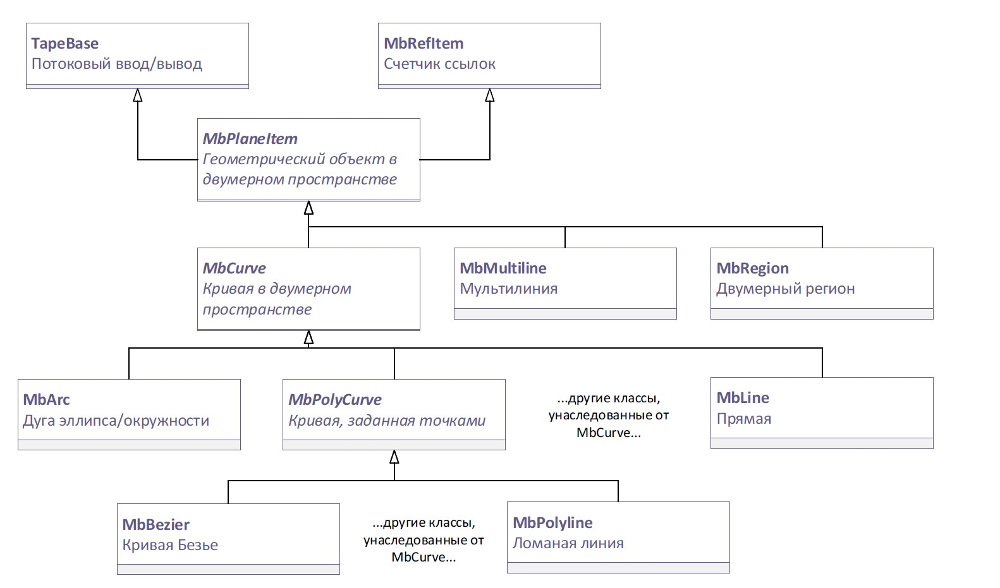
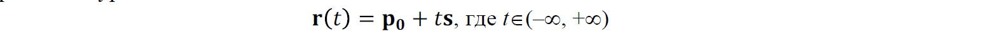
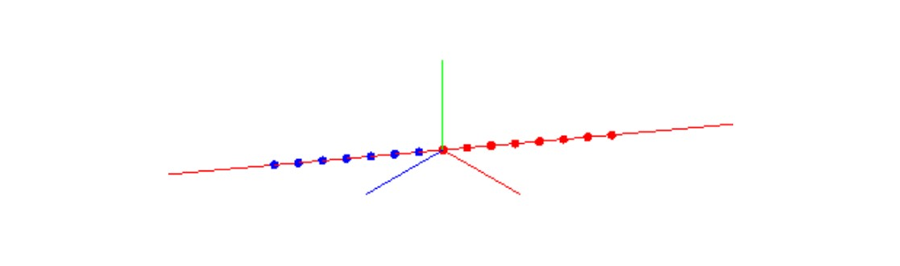
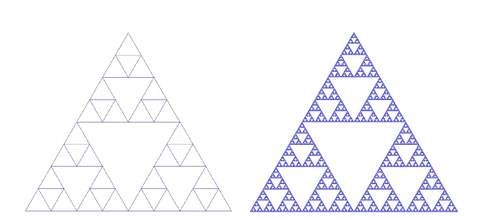
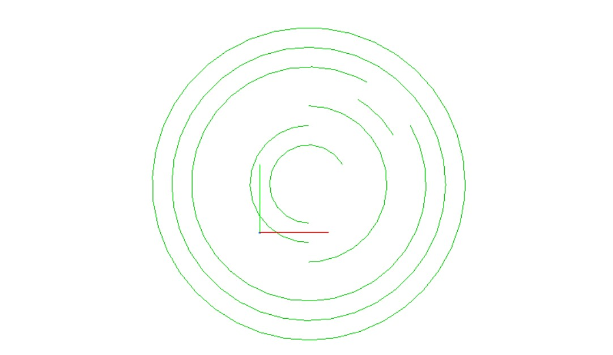
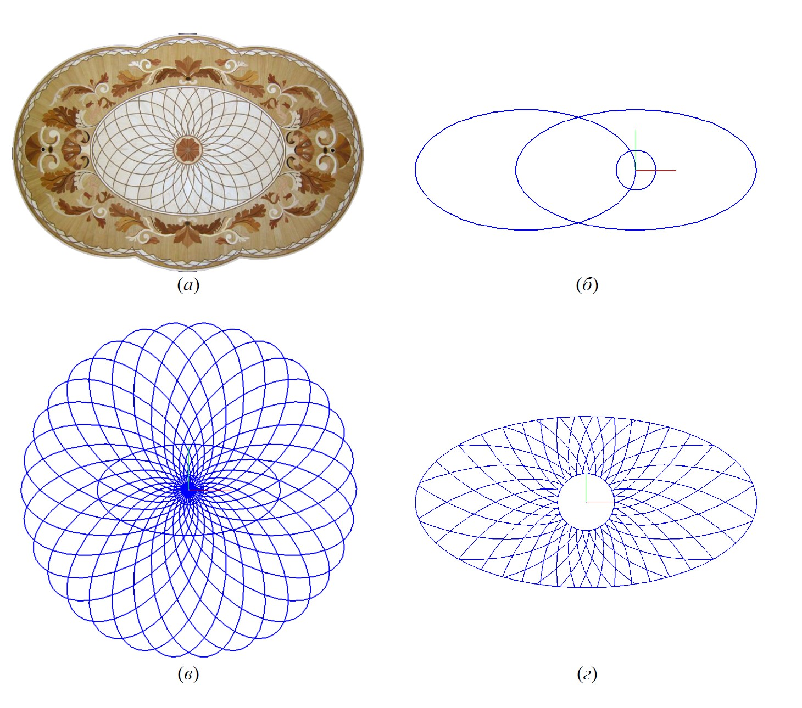
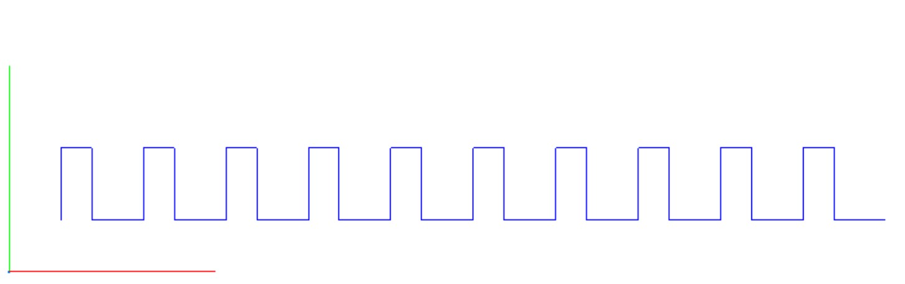
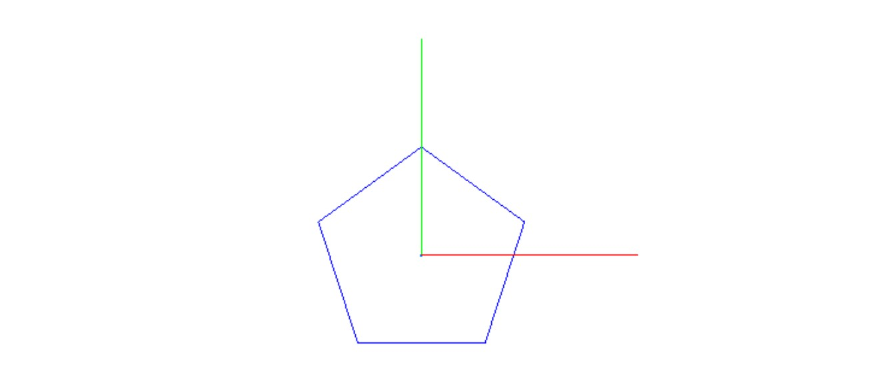
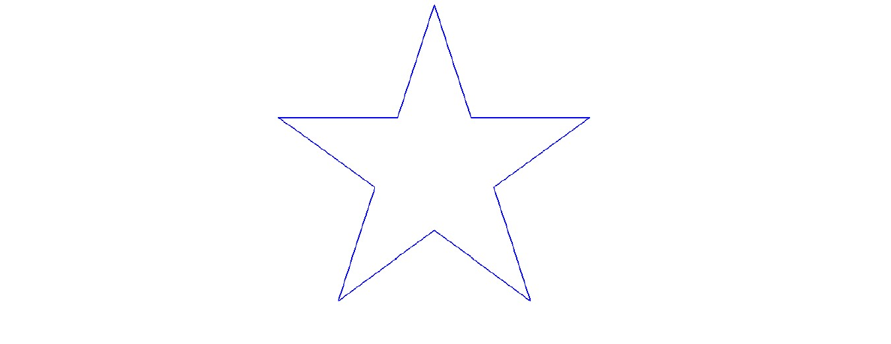

Кривые в двумерном пространстве
===============================
-------------------------------
### [Классы для представления кривых в двумерном пространстве](#title_1)
* [Базовый класс двумерных геометрических объектов MbPlaneItem](#title_2)
* [Родительский класс двумерных кривых MbCurve](#title_3)

### [MbLine – прямая в двумерном пространстве](#title_4)
### [MbLineSegment – отрезок в двумерном пространстве](#title_5)
### [MbArc – эллипсы, окружности и их дуги](#title_6)
### [MbCharacterCurve – кривая, задаваемая в символическом виде](#title_7)
### [MbPolyline – ломаная линия](#title_8)
### [Заключение](#title_9)
-------------------------------
[]В ядре C3D классы для представления кривых относятся к группе геометрических объектов. Кривые могут использоваться для построения чертежей и решения задач вычислительной геометрии. Также они часто применяются для построения поверхностей и оболочек – наиболее высокоуровневых элементов геометрических моделей твердых тел. Важная роль кривых при моделировании твердых тел на основе граничного представления B-Rep связана также с тем, что они используются для представления ребер, ограничивающих фрагменты поверхностей (граней) моделей твердых тел. В литературе по компьютерной графике часто рассматриваются полигональные модели с плоскими ребрами. В системах геометрического моделирования для САПР полигональные модели также применяются, однако в общем случае грани тел являются фрагментами криволинейных поверхностей, и ограничивающие их ребра являются сегментами произвольных кривых.  
[]В программной реализации объекты классов кривых C3D используются разными способами: могут применяться в явном виде для выполнения геометрических вычислений или в качестве параметров более высокоуровневых операций, а также неявно при выполнении других операций ядра (например, при вычислении ребер граней).  
[]Средства ядра C3D, связанные с работой с кривыми, можно разделить на несколько категорий:
1. Кривые в двумерном пространстве (базовый класс [MbCurve](doc::/MbCurve) и набор унаследованных от него классов).
2. Кривые в трехмерном пространстве (базовый класс [MbCurve3D](doc::/MbCurve3D) и унаследованные от него классы).
3. Функции для построения двумерных кривых. Реализуют геометрические алгоритмы, в результате которых формируется некоторая двумерная кривая.
4. Функции для построения трехмерных кривых.
5. Функции геометрических алгоритмов, не связанные с формированием новых кривых. К ним относятся операции с кривыми и точками, операции с кривыми в двумерном пространстве, операции с кривыми и поверхностями.  
В данной работе рассматриваются элементы ядра C3D для операций с простейшими кривыми в двумерном пространстве. В частности, к ним относятся: прямые линии, прямолинейные отрезки, окружности и эллипсы и их дуги. При работе с кривыми в C3D необходимо иметь представление о различных способах создания кривых, которые в конкретной задаче выбираются либо с учетом требований к их математическому описанию, либо требований, задаваемых в виде ограничений пользователя. Также необходимо уметь выполнять операции по расчету точек пересечения, расстояний между кривыми и другими геометрическими объектами. Операции такого типа позволяют выполнять геометрические построения, результаты которых также могут использоваться для последующих действий (аналогично вспомогательным построениям, которые часто производятся при работе в интерактивном режиме в типичных САПР).

### <a name="title_1"> []()Классы для представления кривых в двумерном пространстве</a>
------------------------------------------------------------
[]Часть диаграммы классов C3D, связанных с представлением двумерных кривых, показана на рис. 1. Классы [TapeBase](doc::/TapeBase) и [MbRefItem](doc::/MbRefItem) являются классами для реализации служебной функциональности, Классы [MbPlaneItem](doc::/MbPlaneItem) и [MbCurve](doc::/MbCurve) реализуют важные понятия ядра – геометрический объект и кривая в двумерном пространстве. Эти классы являются абстрактными (объекты таких классов не создаются, классы используются для построения более сложных классов путем наследования). Для представления кривых конкретных типов требуется создавать классы, унаследованные от [MbCurve](doc::/MbCurve). В состав ядра включено более 10 подобных классов, и при необходимости можно создавать новые. Некоторые из кривых, унаследованные от [MbCurve](doc::/MbCurve), также являются абстрактными классами, например, [MbPolyCurve](doc::/MbPolyCurve) (кривая, заданная по контрольным точкам). Такие классы являются базовыми для семейства кривых. В частности, членами семейства [MbPolyCurve](doc::/MbPolyCurve) являются унаследованные классы [MbBezier](doc::/MbBezier), [MbPolyline](doc::/MbPolyline) и ряд других.

  
**Рис. 1** Фрагмент диаграммы классов для представления кривых в двумерном пространстве. Курсивом выделены имена абстрактных базовых классов MbPlaneItem, MbCurve и MbPolyCurve.

#### <a name="title_2"> []()Базовый класс двумерных геометрических объектов [MbPlaneItem](doc::/MbPlaneItem)</a>
[]Класс [MbPlaneItem](doc::/MbPlaneItem) содержит виртуальные функции, образующие общий интерфейс геометрических объектов в двумерном пространстве. Кроме кривых [MbCurve](doc::/MbCurve), такими объектами являются мультилинии [MbMultiline](doc::/MbMultiline) (наборы кривых) и регионы [MbRegion](doc::/MbRegion) (наборы специальным образом организованных контуров [MbContour](doc::/MbContour)) (рис. 1).  
[]Класс [MbPlaneItem](doc::/MbPlaneItem) унаследован от двух классов: [MbRefItem](doc::/MbRefItem) и [TapeBase](doc::/TapeBase). Два этих класса предназначены для добавления в [MbPlaneItem](doc::/MbPlaneItem) вспомогательных возможностей, типичных для классов ядра.  
[]Класс [TapeBase](doc::/TapeBase) реализует базовые функции для записи/чтения атрибутов объектов из потоков (например, связанных с файлами). Этот механизм необходим, чтобы обеспечивать долговременное хранение объектов, например, в файле с данными о геометрической модели. Для его поддержки в классах конкретных геометрических объектов требуется предусмотреть ряд методов, главные из них – Read и Write.  
[]Класс [MbRefItem](doc::/MbRefItem) реализует механизм подсчета ссылок. Этот распространенный способ для обеспечения корректного удаления динамически созданных объектов. Он основан на использовании пары методов: [AddRef()](doc::/MbRefItem::AddRef) и [Release()](doc::/MbRefItem::Release). Когда какой-либо класс начинает пользоваться динамически созданным объектом, то у этого объекта счетчик ссылок увеличивается вызовом [AddRef()](doc::/MbRefItem::AddRef). Когда объект становится больше не нужен, счетчик ссылок уменьшается вызовом [Release()](doc::/MbRefItem::Release). В случае, если при очередном вызове [Release()](doc::/MbRefItem::Release) счетчик ссылок уменьшается до 0, то объект автоматически удаляется (вызовом его деструктора). В некотором смысле, этот механизм напоминает обычные функции типа Open/Close для доступа к различным ресурсам (например, к файлам).  
[]Класс [MbPlaneItem](doc::/MbPlaneItem) является абстрактным и его назначение – предоставление для наследования интерфейса, общего для всех геометрических объектов в двумерном пространстве.

Методы этого интерфейса можно разделить на несколько групп:
1. Получение информации о типе геометрического объекта.
2. Проверка на равенство, однотипность, приравнивание и копирование геометрических объектов.
3. Геометрические преобразования на плоскости.
4. Вычислительные операции.
5. Доступ к именованным свойствам геометрического объекта.
6. Получение служебных точек объекта: базовых точек и точек привязки.
7. Поддержка потоков чтения/записи.

[]Методы, относящиеся к перечисленным категориям, показаны ниже во фрагменте описания класса [MbPlaneItem](doc::/MbPlaneItem). Обратите внимание на то, что большинство методов являются абстрактными виртуальными функциями (отмечены с помощью равенства нулю). Такие функции должны быть обязательно реализованы в унаследованных классах. Атрибутов в классе [MbPlaneItem](doc::/MbPlaneItem) нет.

```cpp
class MbPlaneItem : public TapeBase, public MbRefItem {
    // Макрос для запрета элементов класса Си++, генерируемых компилятором автоматически:
    // конструктора копирования и оператора присваивания
    OBVIOUS_PRIVATE_COPY( MbPlaneItem )

protected :
    // Конструктор по умолчанию, не используется.
    // В унаследованных классах должны быть предусмотрены собственные конструкторы,
    // параметры которых учитывают особенности этих классов.
    MbPlaneItem();

public :
    // Деструктор. Обычно явно не вызывается.
    // Используется совместно с механизмом подсчета ссылок
    virtual ~MbPlaneItem();
    // ГРУППА #1: ПОЛУЧЕНИЕ ИНФОРМАЦИИ О ТИПЕ ГЕОМЕТРИЧЕСКОГО ОБЪЕКТА
    // Код класса, унаследованного от MbRefItem
    virtual MbeRefType RefType() const;
    // Код типа
    virtual MbePlaneType IsA() const = 0;
    // Код группового типа, обозначающий родительский класс
    virtual MbePlaneType Type() const = 0;
    // Код семейства, обозначающий базовый класс, унаследованный от MbPlaneItem
    virtual MbePlaneType Family() const = 0;
    // ГРУППА #2: СРАВНЕНИЕ И КОПИРОВАНИЕ ГЕОМЕТРИЧЕСКИХ ОБЪЕКТОВ
    // Создание копии объекта с возможностью использования служебного
    // объекта-регистратора, предотвращающего многократное копирование частей
    // составных объектов
    virtual MbPlaneItem& Duplicate( MbRegDuplicate* iReg = NULL ) const = 0;
    // Проверка объектов на равенство (их атрибуты должны иметь одинаковые значения)
    virtual bool IsSame( const MbPlaneItem& item ) const = 0;
    // Проверка однотипности объектов (у них должны быть однотипные атрибуты и
    // однотипные составные части, если таковые есть)
    virtual bool IsSimilar( const MbPlaneItem& item ) const;
    // Приравнивание объекта (допустимо для однотипных объектов)
    virtual bool SetEqual ( const MbPlaneItem& item ) = 0;
    // ГРУППА #3: ГЕОМЕТРИЧЕСКИЕ ПРЕОБРАЗОВАНИЯ
    // Произвольное преобразование, заданное в матричном виде.
    virtual void Transform( const MbMatrix& matr, MbRegTransform* iReg = NULL,
    const MbSurface* newSurface = NULL ) = 0;
    // Параллельный перенос на заданный вектор
    virtual void Move( const MbVector& to, MbRegTransform* iReg = NULL,
    const MbSurface* newSurface = NULL ) = 0;
    // Поворот вокруг точки на заданный угол (в радианах)
    virtual void Rotate( const MbCartPoint& pnt, const MbDirection& angle,
    MbRegTransform* iReg = NULL, const MbSurface* newSurface=NULL ) = 0;
    void Rotate( const MbCartPoint& pnt, double angle, MbRegTransform* iReg = NULL,
    const MbSurface* newSurface = NULL );
    // ГРУППА #4: ВЫЧИСЛИТЕЛЬНЫЕ ОПЕРАЦИИ
    // Расширение габаритного прямоугольника для включения в него данного объекта
    virtual void AddYourGabaritTo( MbRect& r ) const = 0;
    // Проверка попадания объекта в заданный габаритный прямоугольник
    virtual bool IsVisibleInRect( const MbRect& rect, bool exact = false ) const = 0;
    // Вычисление расстояния до точки
    virtual double DistanceToPoint( const MbCartPoint& to ) const = 0;
    virtual bool DistanceToPointIfLess( const MbCartPoint& to, double& d ) const = 0;
    // ГРУППА #5: ИМЕНОВАННЫЕ СВОЙСТВА ОБЪЕКТА
    /// Создать собственное свойство с заданием его имени.
    virtual MbProperty& CreateProperty( MbePrompt name ) const = 0;
    // Получить внутренние свойства объекта для их просмотра и модификации.
    virtual void GetProperties( MbProperties& properties ) = 0;
    // Изменение внутренних свойств объекта копированием значений из присланных свойств.
    virtual void SetProperties( MbProperties& properties ) = 0;
    // ГРУППА #6: СЛУЖЕБНЫЕ ТОЧКИ
    // Получить базовые точки
    virtual size_t GetBasisPoints( RPArray<MbCartPoint>& s ) = 0;
    // Получить точки привязки
    virtual void GetFastenPoints( SArray<MbCartPoint>& s ) const = 0;
    // ГРУППА #7: ПОДДЕРЖКА ПОТОКОВ ЧТЕНИЯ/ЗАПИСИ
    // Регистрация объекта для предотвращения его многократной записи.
    void PrepareWrite();
    // Макрос для добавления в класс методов, предусмотренных базовым классом TapeBase
    DECLARE_PERSISTENT_CLASS( MbPlaneItem )
};
```

[]Интерфейс класса [MbPlaneItem](doc::/MbPlaneItem) построен таким образом, чтобы обеспечить в ядре C3D возможности унифицированной обработки для всех геометрических объектов в двумерном пространстве (конечно, при условии их корректного наследования от данного класса).

#### <a name="title_3"> []()Родительский класс двумерных кривых [MbCurve](doc::/MbCurve)</a>
Для описания кривых в двумерном пространстве предназначен родительский класс [MbCurve](doc::/MbCurve), унаследованный от базового класса [MbPlaneItem](doc::/MbPlaneItem). В классе кривой наследуется интерфейс геометрического объекта [MbPlaneItem](doc::/MbPlaneItem), а также добавляются еще несколько групп методов (в следующем списке это группы 2-5):
1. Общие функции двумерного геометрического объекта (это часть интерфейса, унаследованная от [MbPlaneItem](doc::/MbPlaneItem));
2. Описание области определения кривой.
3. Методы для вычисления дифференциальных (определенных в точках) характеристик кривой (это координаты точек, значения производных, вектор нормали и касательный вектор).
4. Функции движения по кривой;
5. Общие функции кривой. Самая обширная группа, включающая функции для выполнения типичных вычислений с кривой, заданной с помощью параметрических уравнений.
[]Интерфейс класса [MbCurve](doc::/MbCurve) достаточно обширен, поэтому далее приведем его фрагменты с выделением основных методов из перечисленных групп.

```cpp
class MbCurve : public MbPlaneItem {
public :
    // ГРУППА #1: ОБЩИЕ ФУНКЦИИ ДВУМЕРНОГО ГЕОМЕТРИЧЕСКОГО ОБЪЕКТА
    // В эту группу входят методы, унаследованные от MbPlaneItem. Часть из них
    // реализована в MbCurve, часть – в унаследованных классах
    virtual MbePlaneType IsA() const = 0;
    virtual MbePlaneType Type() const;
    // ... и другие методы MbPlaneItem
    // ГРУППА #2: ОПИСАНИЕ ОБЛАСТИ ОПРЕДЕЛЕНИЯ КРИВОЙ
    // Получение предельных значений параметра кривой
    virtual double GetTMin() const = 0;
    virtual double GetTMax() const = 0;
    // Проверка, является ли кривая замкнутой
    virtual bool IsClosed() const = 0;
    // Проверка, является ли замкнутая кривая периодической
    virtual bool IsPeriodic() const;
    // Получение периода для периодической кривой
    virtual double GetPeriod() const;
    // ГРУППА #3: ВЫЧИСЛЕНИЕ ХАРАКТЕРИСТИК КРИВОЙ
    // Вычисление координат точки кривой, производных, касательного и нормального
    // векторов (с автоматической корректировкой параметра t при выходе за
    // пределы области определения)
    virtual void PointOn ( double& t, MbCartPoint& p ) const = 0;
    virtual void FirstDer ( double& t, MbVector& v ) const = 0;
    virtual void SecondDer( double& t, MbVector& v ) const = 0;
    virtual void ThirdDer ( double& t, MbVector& v ) const = 0;
    void Tangent ( double& t, MbVector& v ) const;
    void Tangent ( double& t, MbDirection& d ) const;
    void Normal ( double& t, MbVector& v ) const;
    void Normal ( double& t, MbDirection& d ) const;
    // Вычисление координат точки кривой, производных, касательного и нормального
    // векторов без контроля попадания значения параметра t в область определения.
    // При выходе за пределы области определения вычисляются характеристики точки
    // на продолжении кривой.
    virtual void _PointOn ( double t, MbCartPoint& p ) const;
    virtual void _FirstDer ( double t, MbVector& v ) const;
    virtual void _SecondDer( double t, MbVector& v ) const;
    virtual void _ThirdDer ( double t, MbVector& v ) const;
    void _Tangent ( double t, MbVector& v ) const;
    void _Tangent ( double t, MbDirection& d ) const;
    void _Normal ( double t, MbVector& v ) const;
    void _Normal ( double t, MbDirection& d ) const;
    // ГРУППА #4: ФУНКЦИИ ДВИЖЕНИЯ ПО КРИВОЙ
    // Вычисление шага параметра в окрестности точки с параметром t, чтобы
    // отклонение кривой от ее полигона не превышало пороговой величины sag
    virtual double Step( double t, double sag ) const;
    // Вычисление шага параметра в окрестности точки t, чтобы угловое отклонение
    // касательной кривой не превышало порогового угла ang.
    virtual double DeviationStep( double t, double ang ) const;
    // ГРУППА #5: ОБЩИЕ ФУНКЦИИ КРИВОЙ
    // Вычисление кривизны кривой
    virtual double Curvature( double t ) const;
    // Вычисление производной кривизны по параметру
    double CurvatureDerive( double t ) const;
    // Вычисление радиуса кривизны кривой со знаком
    double CurvatureRadius( double t ) const;
    // ... и еще более 50 методов для реализации алгоритмов для работы с кривыми
};
```

[]Как и базовый класс [MbPlaneItem](doc::/MbPlaneItem), класс [MbCurve](doc::/MbCurve) является абстрактным (рис. 1). Реализации виртуальных функций присутствуют в классах, унаследованных от [MbCurve](doc::/MbCurve) для представления кривых конкретных типов (таблица 1). Среди перечисленных в таблице 1 классов особое место занимает [MbPolyCurve](doc::/MbPolyCurve). Это родительский класс семейства кривых, заданных набором контрольных точек. В это семейство входит класс для представления ломаной линии и классы для представления различных сплайнов.

**Таблица 1.** Классы для представления различных двумерных кривых, унаследованные от класса MbCurve.

| № | Класс | Назначение |
| :-- | :------------------- | :------- |
| 1 | [MbLine](doc::/MbLine) | Прямая. |
| 2 | [MbLineSegment](doc::/MbLineSegment) | Отрезок. |
| 3 | [MbArc](doc::/MbArc) | Дуга эллипса/окружности. |
| 4 | [MbCosinusoid](doc::/MbCosinusoid) | Косинусоида. |
| 5 | [MbPolyCurve](doc::/MbPolyCurve) | Кривая, заданная по контрольным точкам. Это абстрактный родительский класс для семейства кривых, в которое входят: [MbPolyline](doc::/MbPolyline) (ломаная линия), [MbBezier](doc::/MbBezier) (кривая Безье), [MbCubicSpline](doc::/MbCubicSpline) (кубический сплайн), [MbHermit](doc::/MbHermit) (составной кубический сплайн Эрмита) и [MbNurbs](doc::/MbNurbs) (кривая NURBS). |
| 6 | [MbContour](doc::/MbContour) | Контур (составная кривая, состоящая из стыкующихся сегментов). В ядре есть разновидность контура – контур с разрывами [MbContourWithBreaks](doc::/MbContourWithBreaks), унаследованный от [MbContour](doc::/MbContour). |
| 7 | [MbOffsetCurve](doc::/MbOffsetCurve) | Эквидистантная (равноудаленная) кривая для заданной базовой кривой. |
| 8 | [MbCharacterCurve](doc::/MbCharacterCurve) | Кривая с заданием координатных функций в символьном виде. |
| 9 | [MbPointCurve](doc::/MbPointCurve) | Кривая, вырожденная в точку. |
| 10 | [MbProjCurve](doc::/MbProjCurve) | Проекционная кривая. |
| 11 | [MbReparamCurve](doc::/MbReparamCurve) | Репараметризованная кривая для заданной базовой кривой. |
| 12 | [MbTrimmedCurve](doc::/MbTrimmedCurve) | Усеченная кривая для заданной базовой кривой. |

### <a name="title_4"> []()[MbLine](doc::/MbLine) – прямая в двумерном пространстве</a>
Класс [MbLine](doc::/MbLine) предназначен для представления прямой, заданной векторным параметрическим уравнением:
  
[]В этом уравнении: p0 – радиус-вектор некоторой точки, принадлежащей прямой; s – направляющий вектор прямой, t – параметр. Каждому значению параметра t соответствует радиус-вектор r(t) некоторой точки прямой. Точку с радиус-вектором p0 будем называть начальной точкой, поскольку r(t)=p0 при t=0.
Для хранения параметров уравнения в классе [MbLine](doc::/MbLine) есть 2 атрибута:

```cpp
class MbLine : public MbCurve {
private :
    MbCartPoint origin; // Начальная точка
    MbDirection direct; // Направляющий вектор
```

[]У класса [MbLine](doc::/MbLine) имеется 6 конструкторов, из которых 5 предназначены для создания прямой с указанием параметров в различном виде. Также в классе [MbLine](doc::/MbLine) есть методы [Init](doc::/MbLine::Init) с аналогичными конструкторам наборами параметров, позволяющие изменять атрибуты у существующих объектов [MbLine](doc::/MbLine).

```cpp
// Построение прямой по начальной точке и направляющему вектору
MbLine( const MbCartPoint& initP, const MbDirection& initDirect );
MbLine( const MbCartPoint& initP, const MbVector& initV );
// Построение прямой по точке и углу (в радианах)
MbLine( const MbCartPoint& initP, double angle );
// Построение прямой по двумя точкам
MbLine( const MbCartPoint& p1, const MbCartPoint& p2 );
// Построение прямой по коэффициентам общего уравнения прямой Ax + By + C = 0
MbLine( double a, double b, double c );
```

[]В примере 3.1 выполняется построение прямой, проходящей под углом 45° к горизонтальной оси в плоскости XY мировой системы координат. После построения прямой в виде объекта [MbLine](doc::/MbLine) у него производится вызов некоторых функций интерфейса [MbPlaneItem](doc::/MbPlaneItem) и [MbCurve](doc::/MbCurve) для получения свойств объекта-прямой. В комментариях к вызовам методов, начиная с вызова [pLine->IsA()](doc::/MbLine::IsA), приведены возвращаемые значения. Из значений свойств объекта [MbLine](doc::/MbLine) видно, что этот объект является непериодической незамкнутой прямолинейной кривой, областью определения параметра t является диапазон ([–50000000, 50000000]) (бесконечно протяженная прямая является математической абстракцией, поэтому в практической реализации C3D диапазон значений t ограничен).

**Пример 3.1 Построение прямой линии в двумерном пространстве**
```cpp
#include "setup.h"
#include "mb_placement3d.h"
#include "cur_line.h" // MbLine - Прямая в двумерном пространстве

bool run()
{
    MbPlacement3D pl; // Локальная СК (по умолчанию совпадает с мировой СК)
    // Коэффициент для преобразования значений углов из градусов в радианы
    const double DEG_TO_RAD = M_PI/180.0;
    // ПОСТРОЕНИЕ ДВУМЕРНОЙ ПРЯМОЙ – ПО ТОЧКЕ И НАПРАВЛЯЮЩЕМУ ВЕКТОРУ
    MbCartPoint p1(0, 0);
    MbDirection dir( DEG_TO_RAD * 45 );
    // Динамическое создание объекта-прямой посредством вызова конструктора MbLine
    MbLine* pLine = new MbLine( p1, dir);
    // Отображение прямой
    if ( pLine != nullptr )
        show( Style( 1, RGB(255,0,0)), pLine, &pl );
    // Получение информации о типе геометрического объекта
    MbePlaneType type_obj = pLine->IsA(); // pt_Line
    // Код группового типа, обозначающий родительский класс
    MbePlaneType type_parent = pLine->Type(); // pt_Curve
    // Код семейства, обозначающий базовый класс, унаследованный от MbPlaneItem
    MbePlaneType type_family = pLine->Family(); // pt_Curve
    // Получение характеристик области определения параметра t
    // Получение предельных значений параметра кривой
    double tMin = pLine->GetTMin(); // -50000000
    double tMax = pLine->GetTMax(); // 50000000
    // Проверка, является ли кривая замкнутой
    bool bClosed = pLine->IsClosed(); // false
    // Проверка, является ли замкнутая кривая периодической
    bool bIsPeriodic = pLine->IsPeriodic(); // false
    // Получение периода для периодической кривой
    double tPeriod = pLine->GetPeriod(); // 0.0
    // Вычислить метрическую длину кривой
    double length = 0.0;
    bool bHasLength = pLine->HasLength( length ); // false
    // Проверка, является ли кривая ограниченной
    bool bIsBounded = pLine->IsBounded(); // false
    // Проверка, является ли кривая прямолинейной
    bool bIsStraight = pLine->IsStraight(); // true
    // Уменьшение счетчика ссылок динамического объекта-прямой
    ::DeleteItem( pLine );
    return true;
}
```

<button id="code_block_1"></button>

[]Пример 3.2 демонстрирует способ вычисления точек, принадлежащих прямой. Этот способ одинаков для всех классов, унаследованных от [MbCurve](doc::/MbCurve) – объекту-кривой передается значение параметра t, для которого необходимо вычислить декартовы координаты точки, принадлежащей кривой. В данном примере выполняется вычисление и построение PNT_CNT точек, параметры которых с равным шагом выбираются из диапазона [T1, T2]. При использовании диапазона [–50, +50] точки оказываются по разные стороны от начальной точки прямой (которая была передана в конструктор [MbLine](doc::/MbLine)). Точки, соответствующие отрицательным и положительным значениям t, отображаются, соответственно, синим и красным цветом (рис. 2). На рис. 2 видно, что равным интервалам значений t соответствуют одинаковые промежутки между соответствующими точками прямой. Таким свойством обладают векторно-параметрические уравнения не для всех кривых. При необходимости определить соответствие между значениями t и расстояниями между точками кривой можно с помощью методов класса [MbCurve](doc::/MbCurve).

**Пример 3.2 Вычисление точек, принадлежащих прямой линии**
```cpp
#include "setup.h"
#include "mb_placement3d.h"
#include "cur_line.h" // MbLine - Прямая в двумерном пространстве

bool run()
{
    MbPlacement3D pl; // Локальная СК (по умолчанию совпадает с мировой СК)
    // Коэффициент для преобразования значений углов из градусов в радианы
    const double DEG_TO_RAD = M_PI/180.0;
    // ПОСТРОЕНИЕ ДВУМЕРНОЙ ПРЯМОЙ – ПО ТОЧКЕ И НАПРАВЛЯЮЩЕМУ ВЕКТОРУ
    MbCartPoint p1(0, 0);
    MbDirection dir( DEG_TO_RAD * 30 );
    // Динамическое создание объекта-прямой посредством вызова конструктора MbLine
    MbLine* pLine = new MbLine( p1, dir);
    // Отображение прямой
    if ( pLine != nullptr )
        show( Style( 1, RGB(255,0,0)), pLine, &pl );
    // Вычисление и отображение PNT_CNT точек прямой, соответствующих равномерно
    // распределенным значениям параметра t из диапазона [T1, T2]
    const double T1 = -50;
    const double T2 = +50;
    const int PNT_CNT = 15;
    double dt = (T2 - T1)/(PNT_CNT - 1);
    MbCartPoint pnt;
    for (int i = 0; i < PNT_CNT; i++)
    {
        double t = T1 + dt * i;
        pLine->PointOn( t, pnt );
        show( Style(5, t < 0 ? RGB(0, 0, 255) : RGB(255,0,0)), pnt, &pl );
    }
    // Уменьшение счетчика ссылок динамического объекта-прямой
    ::DeleteItem( pLine );
    return true;
}
```

<button id="code_block_2"></button>

  
**Рис. 2** Прямая MbLine, проходящая под углом 30° к оси OX в плоскости XY мировой СК. Построены 15 точек, расположенные по разные стороны от начальной точки прямой (совпадает с началом координат) (пример 3.2).

#### Задания(1)
1. Постройте 5 параллельных прямых, пользуясь конструктором [MbLine](doc::/MbLine) с указанием точки и направляющего вектора.
2. Постройте 5 параллельных прямых. Для построения первой прямой используйте конструктор [MbLine](doc::/MbLine) с указанием двух точек прямой. Оставшиеся прямые постройте как копии первой (конструктор [MbLine](doc::/MbLine) с указанием исходной прямой для копирования) с последующим параллельным переносом (метод [MbLine::Move](doc::/MbLine::Move)).
3. Постройте пучок прямых с общей точкой и равным угловым шагом. Количество прямых задавайте с помощью константы-параметра. Для построения прямых используйте конструктор [MbLine](doc::/MbLine) с указанием точки и угла. **Замечание.** В тестовом приложении при просмотре прямых в окрестности точки пересечения не используйте слишком большой масштаб. Например, при масштабном коэффициенте более 100000 (значение коэффициента M выводится в строке состояния) при отображении могут проявляться ошибки приближенного представления экранных координат. Этот эффект является следствием упрощенного способа отображения геометрических объектов в тестовом приложении и не связан с точностью вычислений в ядре C3D.
4. Постройте прямую, вычислите вектор нормали к прямой (с помощью метода [MbCurve::Normal](doc::/MbCurve::Normal), который наследуется классом [MbLine](doc::/MbLine) от [MbCurve](doc::/MbCurve)) и постройте перпендикуляр к прямой, пользуясь вычисленным нормальным вектором в качестве направляющего при вызове конструктора прямой-перпендикуляра.
5. Постройте 4 пересекающихся прямых (две пары параллельных прямых), точки пересечения которых являются вершинами ромба. Вычислите и отобразите точки пересечения. Для вычисления точек пересечения прямых используйте функцию LineLine из набора операций с точками (заголовочный файл action_point.h).

###  <a name="title_5"> []()[MbLineSegment](doc::/MbLineSegment) – отрезок в двумерном пространстве</a>
[]Класс MbLineSegment представляет отрезок, заданный векторным параметрическим уравнением:
  
[]В этом уравнении: p0 и p1 – радиус-векторы концов отрезка, t – параметр, значения которого принадлежат единичному отрезку. Уравнение отрезка выглядит как линейная комбинация его вершин, а значение параметра t указывает, в какой пропорции складываются радиус-векторы концов для вычисления соответствующей точки отрезка. Предельным значениям t соответствуют концы отрезка.
[]Класс [MbLineSegment](doc::/MbLineSegment) описан в заголовочном файле cur_line_segment.h. С учетом структуры уравнения отрезка, в классе [MbLineSegment](doc::/MbLineSegment) имеются 2 атрибута:

```cpp
class MbLineSegment : public MbCurve {
private :
    MbCartPoint point1; // Начальная точка
    MbCartPoint point2; // Конечная точка
```

[]Интерфейс [MbLineSegment](doc::/MbLineSegment) содержит набор конструкторов и методов инициализации [Init()](doc::/MbLineSegment::Init), реализованные методы родительского класса [MbCurve](doc::/MbCurve) и набор методов, специфических для [MbLineSegment](doc::/MbLineSegment) (например, Get/Set-методы для получения и изменения концов отрезка). На рис. 3 приведены два примера построений, выполненных с использованием отрезков [MbLineSegment](doc::/MbLineSegment). С помощью отрезков построена фрактальная фигура – треугольник Серпинского. Построение данного треугольника проводится посредством повторяющегося половинного деления сторон равностороннего треугольника. Каждый треугольник делится на 4 части. Центральный треугольник из дальнейшей процедуры разбиения исключается. В примере 4.1 реализовано подобное построение с использованием отрезков, построенных по двум концевым точкам.

  
**Рис. 3** Фрактальный треугольник Серпинского (слева: глубина разбиения 4, количество построенных треугольников – 40; справа: глубина разбиения 9, количество треугольников 9841) (пример 4.1).

**Пример 4.1. Построение треугольника Серпинского с заданной глубиной разбиения**
```cpp
#include "setup.h"
#include "mb_placement3d.h"
#include "cur_line_segment.h" // MbLineSegment - Отрезок в двумерном пространстве
// std::queue - класс-контейнер "очередь" стандартной библиотеки Си++
#include <queue>

bool run()
{
    MbPlacement3D pl; // Локальная СК (по умолчанию совпадает с мировой СК)
    // Вспомогательная структура для описания треугольника с помощью координат его вершин
    struct Triangle {
        MbCartPoint p1, p2, p3;
        Triangle(const MbCartPoint& _p1, const MbCartPoint& _p2, const MbCartPoint& _p3) :
        p1(_p1), p2(_p2), p3(_p3) {}
    };
    // Исходный равносторонний треугольник для разбиения
    const double SIDE_SIZE = 10; // Размер стороны исходного треугольника
    // Вершины исходного треугольника (перечисляются по часовой стрелке)
    MbCartPoint p1( 5, 5 );
    MbCartPoint p2( p1.x + SIDE_SIZE*cos(M_PI/3.0), p1.y + SIDE_SIZE*sin(M_PI/3.0 ) );
    MbCartPoint p3( p1.x + SIDE_SIZE, p1.y );
    Triangle tr( p1, p2, p3 );
    // Очередь для хранения треугольников для последующего разбиения
    std::queue<Triangle> arrTr;
    arrTr.push( tr );
    // Глубина разбиения
    const int DIV_CNT = 4;
    // Суммарное количество треугольников в результате разбиения
    // Вычисляется как сумма геометрической прогрессии 3^0 + 3^1 + ...3^n,
    // Sn = (q^n - 1)/(q - 1), где q = 3, n = DIV_CNT
    const int TR_CNT = ( int(pow(3, DIV_CNT)) - 1)/2;
    // Отображение и деление треугольников
    for ( int i = 0; i < TR_CNT; i++ )
    {
        // Выборка очередного треугольника из очереди
        const Triangle& t = arrTr.front();
        // Отрезки - стороны треугольника t
        MbLineSegment* pS1 = new MbLineSegment( t.p1, t.p2 );
        MbLineSegment* pS2 = new MbLineSegment( t.p2, t.p3 );
        MbLineSegment* pS3 = new MbLineSegment( t.p3, t.p1 );
        // Вычисление середин сторон треугольника t
        MbCartPoint mid1, mid2, mid3;
        pS1->GetMiddlePoint( mid1 );
        pS2->GetMiddlePoint( mid2 );
        pS3->GetMiddlePoint( mid3 );
        // Сохранение в очереди треугольников, получающихся в
        // результате разбиение треугольника t
        arrTr.push( Triangle( t.p1, mid1, mid3 ) );
        arrTr.push( Triangle( mid1, t.p2, mid2 ) );
        arrTr.push( Triangle( mid3, mid2, t.p3 ) );
        // Отображение обработанного треугольника t
        show( pS1, &pl );
        show( pS2, &pl );
        show( pS3, &pl );
        // Удаление обработанного треугольника t из очереди
        arrTr.pop();
        // Уменьшение счетчика ссылок отрезков-сторон t
        ::DeleteItem( pS1 );
        ::DeleteItem( pS2 );
        ::DeleteItem( pS3 );
    }
    return true;
}
```

<button id="code_block_3"></button>

#### Задания(2)
1. Выполните вызовы методов для получения признаков объекта-отрезка и определите возвращаемые этими методами значения (аналогично примеру 3.1, начиная с вызова pLine->IsA()). Для проверки возвращаемых значений можно использовать отладчик в режиме пошагового выполнения.
2. С использованием объектов-отрезков постройте T-образную фигуру:
  
3. Выполните разбиение отрезка с помощью равномерно расположенных вертикальных отрезков меньшего размера:
  
Количество вертикальных отрезков задавайте с помощью параметра-константы. Местоположение центров вертикальных отрезков вычисляйте с помощью метода [MbLineSegment::PointOn](doc::/MbLineSegment::PointOn), вызываемого у разбиваемого отрезка.
4. Измените решение из задания (3) таким образом, чтобы разбивающие отрезки были направлены перпендикулярно разбиваемому. Для получения угла наклона разбиваемого отрезка используйте метод [MbLineSegment::GetAngle](doc::/MbLineSegment::GetAngle), а для поворота разбивающих отрезков – метод MbLineSegment::Rotate( pnt, MbDirection(angle) ), где pnt – центр отрезка (центр поворота), а angle – угол поворота (в радианах).
  

### <a name="title_6"> []()[MbArc](doc::/MbArc) – эллипсы, окружности и их дуги</a>
[]Класс [MbArc](doc::/MbArc) (заголовочный файл cur_arc.h) предназначен для представления эллиптических дуг с использованием следующего уравнения:
  
[]Здесь p – радиус-вектор начала координат локальной системы координат эллипса, ix и iy – базисные векторы локальной СК эллипса, a и b – полуоси эллипса, t – параметр, задающий точку эллипса. Начало локальной системы координат (точка p) располагается в центре эллипса, ее оси (ix и iy) направлены параллельно осям эллипса.  
[]Диапазон [tmin, tmax], которому принадлежит параметр t, задает начальную и конечную точку дуги. Например, диапазон [0, 2p] соответствует полному эллипсу (или окружности, если a=b), а [0, p/4] – дуге эллипса в первом квадранте системы координат.  
[]В приведенном уравнении довольно много характеристик – местоположение и ориентация локальной СК эллипса, размеры его полуосей и границы диапазона параметра t. Конструктор с указанием всех этих характеристик оказывается громоздким и не всегда удобным для использования, поэтому в [MbArc](doc::/MbArc) предусмотрен набор конструкторов и методов инициализации [Init()](doc::/MbLineSegment::Init), подходящих для создания четырех типичных разновидностей эллиптических дуг: окружностей, дуг окружностей, эллипсов и дуг эллипсов.  
[]Рассмотрим построение нескольких концентрических окружностей и дуг окружностей (рис 4). В примере 5.1 производится вызов конструкторов [MbArc](doc::/MbArc) для построения окружности по центру и радиусу, по радиусу и точке на окружности, а также дуг окружностей несколькими способами. Построенные объекты [MbArc](doc::/MbArc) показаны на рис. 4. В программном тексте примера 5.1 они представлены объектами с именами pc1-pc7 (у объекта pc1 радиус наибольший, у pc7 – наименьший).

  
**Рис. 4** Примеры окружностей и дуг, построенные с использованием объектов
класса MbArc (пример 5.1).

**Пример 5.1. Построение концентрических окружностей и дуг окружностей**
```cpp
#include "setup.h"
#include "cur_arc.h" // MbArc - Эллиптическая дуга в двумерном пространстве
#include <vector> // std::vector - динамический массив из стандартной библиотеки C++

bool run()
{
    MbPlacement3D pl; // Локальная СК (по умолчанию совпадает с мировой СК)
    // Центр окружностей и дуг в локальной СК
    MbCartPoint cnt( 5, 5 );
    // Построение окружности по центру и радиусу
    const double RAD1 = 16;
    MbArc* pc1 = new MbArc(cnt, RAD1);
    // Окружность по центру и по точке на окружности
    const double RAD2 = 14;
    MbArc* pc2 = new MbArc( cnt, MbCartPoint(cnt.x + RAD2, cnt.y) );
    // Дуга окружности: задается центр, радиус, точки-концы дуги и направление
    // обхода от первой до второй концевой точки (-1 - по часовой стрелке, +1 - против).
    // Координаты точек-концов дуги вычисляются с использованием координатных функций:
    // x(t) = R*cos(t), y(t) = R*sin(t)
    // Радиус-векторы концов дуги выбраны расположенными под углом 30 и 60 градусов к
    // горизонтальной оси.
    // Дуга pc3 строится по часовой стрелке, дуга pc4 - против
    const double RAD3 = 12;
    MbCartPoint p31(cnt.x + RAD3*cos(M_PI/6), cnt.y + RAD3*sin(M_PI/6) );
    MbCartPoint p32(cnt.x + RAD3*cos(M_PI/3), cnt.y + RAD3*sin(M_PI/3) );
    MbArc* pc3 = new MbArc( cnt, RAD3, p31, p32, -1 );
    const double RAD4 = 10;
    MbCartPoint p41(cnt.x + RAD4*cos(M_PI/6), cnt.y + RAD4*sin(M_PI/6) );
    MbCartPoint p42(cnt.x + RAD4*cos(M_PI/3), cnt.y + RAD4*sin(M_PI/3) );
    MbArc* pc4 = new MbArc( cnt, RAD4, p41, p42, 1 );
    // Дуга окружности: задается центр, радиус, параметры точек-концов дуги и
    // направление обхода дуги: -1 - по часовой стрелке, +1 - против
    const double RAD5 = 8;
    MbArc* pc5 = new MbArc( cnt, RAD5, M_PI/2, 3*M_PI/2, -1 );
    const double RAD6 = 6;
    MbArc* pc6 = new MbArc( cnt, RAD6, M_PI/2, 3*M_PI/2, 1 );
    // Дуга окружности: по трем точкам.
    // Координаты точек p71, p72 и p73, принадлежащих дуге окружностей,
    // вычисляются в локальной СК окружности.
    const double RAD7 = 4;
    MbCartPoint p71( RAD7*cos(M_PI/6), RAD7*sin(M_PI/6) );
    MbCartPoint p72( RAD7*cos(M_PI/2), RAD7*sin(M_PI/2) );
    MbCartPoint p73( RAD7*cos(3*M_PI/2), RAD7*sin(3*M_PI/2) );
    // Смещение координат точек для перемещения центра СК окружности в точку cnt
    p71.Move( cnt );
    p72.Move( cnt );
    p73.Move( cnt );
    MbArc* pc7 = new MbArc( p71, p72, p73 );
    // Помещение указателей на окружности в массив для отображения с помощью цикла
    std::vector<MbArc*> arrArcs = { pc1, pc2, pc3, pc4, pc5, pc6, pc7 };
    for (int i = 0; i < arrArcs.size(); i++)
    {
        show( arrArcs[i], &pl );
        ::DeleteItem( arrArcs[i] );
    }
    return true;
}
```

<button id="code_block_4"></button>

[]Построение эллипсов и эллиптических дуг выполняется аналогично окружностям. Рассмотрим применение класса [MbArc](doc::/MbArc) для построения совокупности эллиптических дуг, эллипсов и окружностей, напоминающих центральный элемент художественного паркета (рис. 5). Этот узор построен на основе розетки эллипсов, для которых выполнено отсечение по двум границам – по внешнему эллипсу и по внутренней окружности. Количество эллипсов в примере 5.2 задается константой ELLIPSE_CNT. Первый эллипс для построения розетки показан на рис. 5(б). Остальные эллипсы получаются поворотом первого на заданный угол вокруг начала координат, так что полюсы всех эллипсов розетки лежат в начале координат.
  
**Рис. 5** Узор из эллиптических дуг (пример 5.2). (а) Пример похожего узора на
центральном элементе паркета. (б) Один эллипс и две границы для построения
узора. (в) Розетка эллипсов до отсечения граничными кривыми. (г) Узор после
отсечения граничными кривыми.

**Пример 5.2. Построение узора на основе розетки эллипсов**
```cpp
#include "setup.h"
#include "cur_arc.h" // MbArc - Эллиптическая дуга в двумерном пространстве
#include "mb_cross_point.h" // MbCrossPoint - Точка пересечения двух кривых
#include "action_point.h" // Функции-утилиты для операций с точками

bool run()
{
    MbPlacement3D pl; // Локальная СК (по умолчанию совпадает с мировой СК)
    // Граница 1: внешний эллипс
    // Полуоси эллипса равны 120 и 60.
    // Локальная СК pl1 совпадает с системой плоскости XOY системы координат pl.
    // В конструкторе pl1 задается начало координат и угол поворота СК (в виде объекта
    // класса MbDirection).
    MbPlacement pl1( MbCartPoint(0,0), MbDirection(0.0) );
    MbArc* pBound1 = new MbArc( 120, 60, pl1 );
    show( Style( 2, RGB(0,0,255) ), pBound1, &pl );
    // Граница 2: внутренняя окружность
    MbArc* pBound2 = new MbArc( MbCartPoint(0,0), 20 );
    show( Style( 2, RGB(0,0,255) ), pBound2, &pl );
    // Первый эллипс для построения розетки
    // Локальная СК для этого эллипса размещается так, чтобы его правый полюс
    // располагался в точке (0, 0), а большая ось лежала на оси OX
    const double RADA = 110, RADB = 60;
    MbPlacement plEllipse( MbCartPoint( -RADA, 0 ), MbDirection(0.0) );
    MbArc* pEllipse = new MbArc( RADA, RADB, plEllipse );
    // Построение эллипсов розетки - они размещаются по окружности с равным угловым шагом
    const int ELLIPSE_CNT = 30;
    for (int i = 0; i < ELLIPSE_CNT; i++)
    {
        // Очередной эллипс pEl получается поворотом первого эллипса на угол angle
        MbArc* pEl = new MbArc( *pEllipse );
        double angle = 2*M_PI/ELLIPSE_CNT*i;
        pEl->Rotate(MbCartPoint(0, 0), MbDirection(angle));
        // Вычисление точек пересечения pEl с внешней границей-эллипсом pBound1
        // В классе MbCrossPoint хранятся координаты точки пересечения, параметрические
        // координаты этой точки на обеих кривых, а также тип (пересечение или касание).
        SArray<MbCrossPoint> arrExt;
        int pntCntExt = ::IntersectTwoCurves( *pEl, *pBound1, arrExt );
        // Вычисление точек пересечения pEl с внутренней границей-окружностью pBound2
        SArray<MbCrossPoint> arrInt;
        int pntCntInt = ::IntersectTwoCurves( *pEl, *pBound2, arrInt );
        // Если вычислено предполагаемое количество точек пересечения (должно быть по 2
        // с каждой границей), то строятся дуги эллипса pEl с концами в найденных точках
        if ( pntCntExt == 2 && pntCntInt == 2 )
        {
            MbArc* pElArc1 = new MbArc( pEl->GetRadiusA(), pEl->GetRadiusB(),
            pEl->GetPlacement(), arrInt[0].p, arrExt[0].p, 1 );
            MbArc* pElArc2 = new MbArc( pEl->GetRadiusA(), pEl->GetRadiusB(),
            pEl->GetPlacement(), arrInt[1].p, arrExt[1].p, -1 );
            show( Style( 2, RGB(0,0,255) ), pElArc1, &pl );
            show( Style( 2, RGB(0,0,255) ), pElArc2, &pl );
            ::DeleteItem( pElArc1 );
            ::DeleteItem( pElArc2 );
        }
        // Объект pEl не передавался для отображения, поэтому при следующем вызове
        // он будет удален (т.к. его счетчик ссылок уменьшится до 0)
        ::DeleteItem( pEl );
    }
    ::DeleteItem( pBound1 );
    ::DeleteItem( pBound2 );
    ::DeleteItem( pEllipse );
    return true;
}
```

<button id="code_block_5"></button>

#### Задания(3)
1. В заголовочном файле cur_arc.h найдите описание класса [MbArc](doc::/MbArc) и посмотрите, какие в нем предусмотрены атрибуты. Часть атрибутов соответствует элементам векторно-параметрического уравнения этого геометрического объекта, часть предназначена для повышения эффективности внутренних вычислений класса.
2. У любого объекта класса [MbArc](doc::/MbArc) вызовите методы для получения признаков этого геометрического объекта: IsA(), Type(), Family(), GetTMin(), GetTMax(), IsClosed(), IsPeriodic(), GetPeriod(), IsBounded(), IsStraight() (аналогично примеру 3.1).
3. Постройте эллипс и прямую, пересекающиеся в двух точках. Вычислите точки пересечения (либо функцией IntersectTwoCurves, как в примере 5.2, либо с помощью метода [MbArc::EllipticIntersect](doc::/MbArc::EllipticIntersect)). Постройте дугу эллипса с концами в вычисленных точках. Выясните зависимость получаемого результата от порядка указания концов эллипса в конструкторе и от значения параметра-направления обхода.
4. Постройте эллипс и отобразите на нем точки, вычисленные с равным шагом по значению параметра t в диапазоне от 0 до 2p (с помощью метода [MbArc::PointOn](doc::/MbArc::PointOn)). Выполните построение для 5 и для 20 точек. С помощью метода [MbArc::CalculateLength](doc::/MbArc::CalculateLength) вычислите расстояние между соседними точками вдоль кривой и определите, является ли параметризация натуральной (при натуральной параметризации в качестве параметра используется длина дуги).
5. При выполнении задания 4) выясняется, что расстояние между точками кривой [MbArc](doc::/MbArc) при равномерном изменении параметра непостоянно. Постройте эллипс и набор равномерно распределенных вдоль него точек. Для вычисления координат таких точек используйте метод [MbArc::GetPointsByEvenLengthDelta](doc::/MbArc::GetPointsByEvenLengthDelta).
6. Вычисляя координаты точек, как в задании 4), постройте в этих точках отрезки, изображающие касательный вектор и вектор нормали к эллипсу. Для вычисления касательного вектора и вектора нормали используйте методы класса [MbArc](doc::/MbArc), унаследованные от [MbCurve](doc::/MbCurve): [MbCurve::Tangent](doc::/MbCurve::Tangent) и [MbCurve::Normal](doc::/MbCurve::Normal).

### <a name="title_7"> []()[MbCharacterCurve](doc::/MbCharacterCurve) – кривая, задаваемая в символическом виде</a>
[]Класс [MbCharacterCurve](doc::/MbCharacterCurve) (файл cur_character_curve.h) позволяет построить кривую, указывая в символическом виде координатные функции этой кривой. Кривая в этом классе представляется с помощью двух координатных функций x(t) и y(t):
  
[]Для представления скалярных функций от одного параметра в C3D предназначен специальный класс [MbFunction](doc::/MbFunction). Обе координатные функции x(t) и y(t) должны быть представлены в виде объектов [MbFunction](doc::/MbFunction) и переданы в конструктор [MbCharacterCurve](doc::/MbCharacterCurve). Этот конструктор имеет следующий вид:

```cpp
MbCharacterCurve( MbFunction& x, MbFunction& y, MbeLocalSystemType cs,
const MbPlacement& place, double tmin, double tmax );
```

[]Кроме координатных функций, указывается тип используемой локальной системы координат (декартова или полярная), локальная система координат place, а также границы диапазона значений параметра.  
[]Применение класса [MbCharacterCurve](doc::/MbCharacterCurve) позволяет представить кривые с известным аналитическим выражением без необходимости проектирования и реализации отдельного класса, унаследованного от MbCurve.  
[]В примере 6.1 демонстрируется построение окружности с использованием класса [MbCharacterCurve](doc::/MbCharacterCurve). Для получения координатных функций в виде объектов MbFunction применяется класс-генератор функций MbFunctionFactory.

**Пример 6.1. Построение окружности с использованием координатных функций в символическом виде**
```cpp
#include "setup.h"

#include "mb_placement3d.h"
// MbCharacterCurve - кривая, заданная в символическом виде
#include "cur_character_curve.h"
#include "function.h" // MbFunction - скалярная функция одной переменной
#include "function_factory.h" // MbFunctionFactory – генератор объектов-функций

bool run()
{
    MbPlacement3D pl; // Локальная СК (по умолчанию совпадает с мировой СК)
    // Объект – генератор функций (осуществляет синтаксический разбор выражения
    // функции и готовит служебные структуры данных для вычисления значений функции).
    MbFunctionFactory ff;
    // Координатные функции в символическом виде для окружности
    // с центром в начале координат и радиусом 10
    c3d::string_t sXFunc = _T("10*cos(t)");
    c3d::string_t sYFunc = _T("10*sin(t)");
    // Предельные значения параметра t
    const double T_MIN = 0.0, T_MAX = 2*M_PI;
    // Координатные функции в виде объектов MbFunction
    MbFunction* pXFunc = ff.CreateAnalyticalFunction( sXFunc, _T("t"), T_MIN, T_MAX );
    MbFunction* pYFunc = ff.CreateAnalyticalFunction( sYFunc, _T("t"), T_MIN, T_MAX );
    if ( pXFunc != nullptr  && pYFunc != nullptr )
    {
        // Локальная двумерная СК кривой - совпадает с XOY трехмерной системы pl
        MbPlacement plCurve( MbCartPoint(0,0), MbDirection(0.0) );
        // Объект-кривая
        MbCharacterCurve* pCurve = new MbCharacterCurve( *pXFunc, *pYFunc, ls_CartesSystem,
        plCurve, T_MIN, T_MAX );
        // Отображение кривой
        if ( pCurve )
            show( Style( 1, RGB(0,0,255) ), pCurve, &pl );
        ::DeleteItem( pCurve );
    }
    // Удаление динамически созданных объектов-функций
    ::DeleteItem( pXFunc );
    ::DeleteItem( pYFunc );
    return true;
}
```

<button id="code_block_6"></button>

[]Выполните пример 6.1 и убедитесь в успешном построении окружности данным способом. Откройте заголовочный файл function.h и ознакомьтесь с интерфейсом класса [MbFunction](doc::/MbFunction) (или посмотрите его описание в справочной системе). Обратите внимание на сходство интерфейса [MbFunction](doc::/MbFunction) и [MbCurve](doc::/MbCurve) в части вычисления значений функции и ее производных.

#### Задания(4)
1. На основе примера 6.1 постройте кривые, задаваемые следующими парами координатных функций в диапазоне значений [tmin, tmax]:

| № | Кривая | x(t) | y(t) | tmin | tmax |
| :-- | :------------------- | :------- | :------- | :------- | :------- |
| 1 | Улитка Паскаля | (1 + 2cos(t))cos(t) | (1 + 2cos(t))sin(t) | 0 | 2pi |
| 2 | Кардиоида (частный случай улитки Паскаля) | 2cos(t)-cos(2t) | 2sin(t)-sin(2t) | 0 | 2pi |
| 3 | Циклоида | 5(t-sin(t)) | 5(1 - cos(t)) | 0 | 4pi |
| 4 | Логарифмическая спираль | exp(0.1t)cos(t) | exp(0.1t)sin(t) | 0 | 10pi |
| 5 | Биения (сложение колебаний с близкими частотами) | t | 10(sin(t) + sin(0.9t)) | 0 | 50pi |

### <a name="title_8"> []()[MbPolyline](doc::/MbPolyline) – ломаная линия</a>
[]В ядре C3D есть набор классов для представления кривых, построенных по набору точек. Родительским классом для таких кривых является класс [MbPolyCurve](doc::/MbPolyCurve) (рис. 1). Это абстрактный класс, от которого унаследованы следующие классы: [MbPolyline](doc::/MbPolyline) (ломаная линия), [MbBezier](doc::/MbBezier) (кривая Безье), [MbCubicSpline](doc::/MbCubicSpline) (кубический сплайн), [MbHermit](doc::/MbHermit) (составной кубический сплайн Эрмита) и [MbNurbs](doc::/MbNurbs) (кривая NURBS). Все эти кривые играют важную роль в геометрическом моделировании, в особенности, кривая NURBS, представляющая собой основной способ унифицированного представления произвольных кривых. (В данной работе рассматривается класс [MbPolyline](doc::/MbPolyline), классы для сплайнов будут обсуждаться в работе №3).  
[]Класс [MbPolyCurve](doc::/MbPolyCurve) унаследован от [MbCurve](doc::/MbCurve). Для кривых, построенных по точкам, в нем определяется набор атрибутов и методов. Точки, по которым строится кривая, называются контрольными точками. Их местоположение влияет на форму кривой, но кривая не обязательно проходит через все эти точки. Связь между характерными точками и формой кривой зависит от ее типа. Например, ломаная [MbPolyline](doc::/MbPolyline) проходит через все контрольные точки, а кривая Безье – через первую и последнюю. Однако, независимо от типа кривой, в классе хранятся координаты всех контрольных точек и предусмотрены методы для работы с массивом этих точек.
[]Ниже приведен фрагмент родительского класса [MbPolyCurve](doc::/MbPolyCurve) с перечислением некоторых методов для операций с контрольными точками.

```cpp
class MbPolyCurve : public MbCurve {
protected :
    SArray<MbCartPoint> pointList; // Массив контрольных точек
    // Другие атрибуты...
public :
    // Методы, унаследованные от MbPlaneItem и MbCurve...
    // НАБОР ОБЩИХ МЕТОДОВ ПОЛИГОНАЛЬНЫХ КРИВЫХ
    // Получение количества контрольных точек
    Virtual size_t GetPointsCount() const;
    // Получение координат контрольной точки по ее индексу
    virtual void GetPoint( int index, MbCartPoint& pnt ) const;
    const MbCartPoint& GetPointList( size_t i ) const { return pointList[i]; }
    // Получить количество контрольных точек
    size_t GetPointListCount() const { return pointList.Count(); }
    // Получить максимальный индекс массива контрольных точек.
    int GetPointListMaxIndex() const { return pointList.MaxIndex(); }
    // Получить копию массива контрольных точек
    void GetPointList( SArray<MbCartPoint>& pnts ) const { pnts = pointList; }
    // Получение индекса контрольной точки, ближайшей к переданной точке
    virtual int GetNearPointIndex( const MbCartPoint& pnt ) const;
    // Удалить контрольную точку с заданным индексом
    virtual void RemovePoint( int index );
    // Удалить все контрольные точки
    virtual void RemovePoints();
    // Добавить точку в конец массива контрольных точек
    virtual void AddPoint( const MbCartPoint& pnt );
    // Вставить точку в массив контрольных точек после точки с индексом index.
    virtual void AddAfter( const MbCartPoint& pnt, int index );
    // Вставить точку в массив характерных точек в позицию с индексом index
    virtual void InsertPoint(int index, const MbCartPoint& pnt ) = 0;
    // Вставить в массив контрольных точек точку, которая будет соответствовать
    // параметру t кривой
    virtual void InsertPoint( double t, const MbCartPoint& pnt,
    double xEps, double yEps ) = 0;
    // Вставить в массив контрольных точек точку и ее производную, которые будут
    // соответствовать параметру t кривой
    virtual void InsertPoint( double t, const MbCartPoint & pnt, const MbVector& v,
    double xEps, double yEps );
    // Заменить контрольную точку с заданным индексом
    virtual void ChangePoint(int index, const MbCartPoint & pnt );
    // Заменить массив контрольных точек (количество точек должно совпадать с имеющимся)
    virtual bool ChangePointsValue( const SArray<MbCartPoint>& pntList );
    // Получить количество интервалов кривой
    size_t GetSegmentsCount() const;
    // Получение параметрических координат интервала, на который влияет
    // контрольная точка с заданным индексом
    virtual void GetRuleInterval( int index, double &t1, double &t2 ) const = 0;
    // Перестроение кривой
    virtual void Rebuild() = 0;
    // Другие методы MbPolyCurve
};
```

[]Применительно к ломаной линии контрольные точки имеют простой геометрический смысл: ломаная линия состоит из прямолинейных сегментов. Эти сегменты последовательно соединяют контрольные точки. Таким образом, ломаные удобно использовать для представления образов, состоящих из соединяющихся отрезков. Такое представление предпочтительнее отдельных объектов [MbLineSegment](doc::/MbLineSegment), поскольку позволяет избежать повторного указания совпадающих вершин для смежных отрезков. Ломаные могут быть замкнутыми, в таком случае первая и последняя контрольные точки должны совпадать.  
[]На рис. 6 показан пример незамкнутой ломаной линии, полученной копированием одного прямоугольного импульса. Исходный текст представлен в примере 7.1.
  
**Рис. 6** Ломаная линия в форме последовательности из 10 прямоугольных импульсов (пример 7.1).

**Пример 7.1. Построение ломаной в форме последовательности прямоугольных импульсов**
```cpp
#include "setup.h"

#include "mb_placement3d.h"
#include "cur_polyline.h" // MbPolyline - ломаная линия

bool run()
{
    MbPlacement3D pl; // Локальная СК (по умолчанию совпадает с мировой СК)
    // Характеристики прямоугольного импульса
    const double PERIOD = 8; // Период
    const double DURATION = 3; // Длительность
    const double AMPL = 7; // Амплитуда
    // Массив из 5 точек - вершин ломаной, представляющей один
    // прямоугольный импульс с началом в точке (0, 0)
    SArray<MbCartPoint> arrPnts(5);
    arrPnts.Add( MbCartPoint(0, 0) );
    arrPnts.Add( MbCartPoint(0, AMPL ) );
    arrPnts.Add( MbCartPoint(DURATION, AMPL) );
    arrPnts.Add( MbCartPoint(DURATION, 0) );
    arrPnts.Add( MbCartPoint(PERIOD, 0) );
    // Ломаная линия с вершинами arrPnts
    MbPolyline* pPolyline = new MbPolyline( arrPnts, false /* Флаг незамкнутой линии */);
    // Добавление к ломаной линии COPY_CNT экземпляров импульса
    const int COPY_CNT = 9;
    for (int i = 0; i < COPY_CNT; i++)
    {
        // Каждая точка в очередной копии смещается на один период.
        // Эти смещения накапливаются в массиве arrPnts.
        for (int j = 0; j < arrPnts.size(); j++)
        {
            arrPnts[j].Move( PERIOD, 0 );
            pPolyline->AddPoint( arrPnts[j] );
        }
    }
    // Смещение ломаной, чтобы ее первая точка располагалась в точке (5, 5)
    pPolyline->Move( MbVector(5, 5) );
    // Отображение ломаной
    show( Style( 1, RGB(0,0,255) ), pPolyline, &pl );
    ::DeleteItem( pPolyline );
    return true;
}
```

<button id="code_block_7"></button>

[]Построение замкнутой ломаной демонстрируется в примере 7.2. В нем проводится построение границы многоугольника, вписанного в окружность (рис. 7). Совпадение начальной и конечной контрольных точек обеспечивается за счет указания флага замкнутой линии в конструкторе ломаной.
  
**Рис. 7** Ломаная линия, представляющая границу пятиугольника (пример 7.2).

**Пример 7.2. Построение границы многоугольника, вписанного в окружность**
```cpp
#include "setup.h"

#include "mb_placement3d.h"
#include "cur_polyline.h" // MbPolyline - ломаная линия

bool run()
{
    MbPlacement3D pl; // Локальная СК (по умолчанию совпадает с мировой СК)
    // Количество сторон многоугольника
    const int SIDE_CNT = 5;
    // Радиус описывающей окружности многоугольника
    const double RAD = 5.0;
    // Массив для хранения вершин ломаной
    SArray<MbCartPoint> arrPnts(SIDE_CNT);
    // Вычисление вершин ломаной равномерным делением окружности
    for (int i = 0; i < SIDE_CNT; i++)
    {
        // Угловое положение i-й вершины на описывающей окружности.
        // Угловое положение начальной вершины - M_PI/2 (эта вершина
        // расположена на вертикальной оси).
        double angle = M_PI/2 + 2*M_PI/SIDE_CNT*i;
        MbCartPoint pnt( RAD*cos(angle), RAD*sin(angle) );
        arrPnts.Add( pnt );
    }
    // Замкнутая ломаная линия с вершинами arrPnts
    MbPolyline* pPolyline = new MbPolyline( arrPnts, true /* Флаг замкнутой линии */ );
    // Отображение ломаной
    if ( pPolyline )
        show( Style( 1, RGB(0,0,255) ), pPolyline, &pl );
    ::DeleteItem( pPolyline );
    return true;
}
```

<button id="code_block_8"></button>

#### Задания(5)
1. Ознакомьтесь с интерфейсом класса [MbPolyline](doc::/MbPolyline) в справочной системе C3D и в заголовочном файле cur_polyline.h. Найдите перечень конструкторов и методов [MbPolyline::Init](doc::/MbPolyline::Init), представляющих различные способы инициализации нового или существующего объекта-ломаной.
2. Постройте замкнутую ломаную линию, изображающую границу T-образной фигуры (эта линия ранее строилась в виде совокупности отрезков в п. 4.1):
  
В тестовом приложении вызовите окно свойств для построенной фигуры. Убедитесь, что это один геометрический объект, содержащий массив точек, количество которых совпадает с количеством вершин ломаной.
3. Постройте незамкнутую ломаную следующего вида:
  
4. С использованием примера 7.2 постройте многоугольники с разным количеством сторон: 3, 4, 5, 6 7, 9, 50.
5. Для замкнутой ломаной, представляющей многоугольник, вызовите методы для получения признаков этого геометрического объекта: IsA(), Type(), Family(), GetTMin(), GetTMax(), IsClosed(), IsPeriodic(), GetPeriod(), IsBounded(), IsStraight() (аналогично примеру 3.1).
6. Для ломаной – границы пятиугольника (пример 7.2) с помощью метода [MbPolyline::PointOn](doc::/MbPolyline::PointOn) вычислите координаты точек ломаной, соответствующие целочисленным значениям параметра t в диапазоне от MbPolyline::GetTMin() до MbPolyline::GetTMax(). Отобразите эти точки.
7. Постройте замкнутую ломаную линию в виде звезды. (Концевые вершины ломаной совпадают с вершинами правильного пятиугольника. Для вычисления местоположения внутренних вершин можно воспользоваться вспомогательным построением – вычислить точки пересечения прямых, содержащих стороны звезды.)
  

### <a name="title_9"> []()Заключение</a>
[]В данной работе были рассмотрены способы представления простейших кривых в двумерном пространстве: прямые, отрезки, ломаные линии, эллипсы, окружности, дуги эллипсов и окружностей. Также были описаны способы задания кривых с помощью координатных функций в символическом виде.  
[]Все кривые в двумерном пространстве в C3D построены на основе общего родительского класса [MbCurve](doc::/MbCurve), рассчитанного на представление кривых с использованием векторно-параметрических уравнений. Такая унификация позволяет однотипным образом вычислять точки кривых с использованием метода PointOn, а также значения производных, векторы касательной и нормали для произвольного значения параметра t из области определения. Наследование от [MbCurve](doc::/MbCurve) классов, представляющих различные кривые, позволяет однотипным образом использовать эти кривые в функциях, реализующих алгоритмы вычислительной геометрии (например, для определения точек пересечения кривых).  
[]В данной работе рассмотрены далеко не все возможности ядра C3D для представления и операций с кривыми. Существенную роль в геометрическом моделировании играют сплайновые кривые, а также составные кривые, построенные из фрагментов различных однотипных или разнотипных кривых. Эти вопросы рассматриваются в следующей работе.