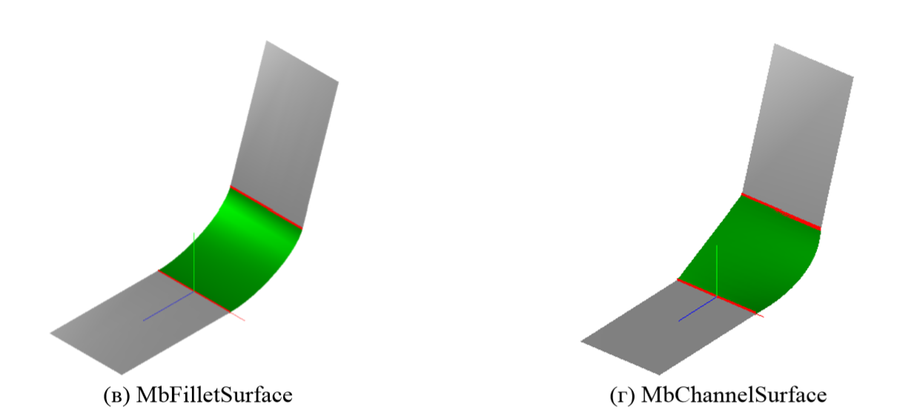
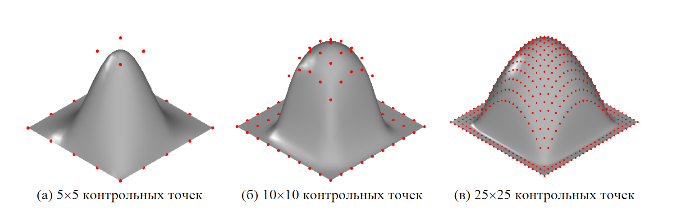

Основные типы поверхностей
==========================
-------------------------------
### [Геометрические объекты в трехмерном пространстве](#title_1)
### [MbSurface – родительский класс «Поверхность»](#title_2)
### [Классы для представления различных поверхностей](#title_3)
* [Элементарные поверхности](#title_4)
* [Поверхности движения](#title_5)
* [Поверхности, построенные по набору кривых](#title_6)
* [Поверхности сопряжения](#title_7)
* [Поверхности, построенные по набору точек](#title_8)
* [Поверхности, ограниченные кривыми](#title_9)
* [Поверхности с другими способами построения](#title_10)

### [Построение элементарных поверхностей](#title_11)
### [Заключение](#title_12)
### [Приложение – программные фрагменты для построения примеров поверхностей](#title_13)
-------------------------------
Поверхности применяются в геометрическом моделировании для описания формы объектов. Требования, которым должна удовлетворять форма проектируемых объектов, могут быть весьма разнообразными, но в целом их можно разделить на две категории – (1) требования, связанные с достижением некоторых численных характеристик поверхности (например, поверхность должна проходить через множество известных точек или кривых, в заданных точках поверхность должна иметь заданные производные и т.п.) и (2) требования эстетического характера (например, привлекательный внешний вид корпуса изделия). На практике при построении поверхностей часто требуется совместно учитывать как численные, так и эстетические требования.
Форму проектируемых объектов далеко не всегда удается представить с помощью одной поверхности с известным математическим описанием. В твердотельном моделировании форма объекта часто представляется в виде набора фрагментов разнотипных поверхностей (граней), границами которых являются кривые (ребра). Кривые и поверхности являются основными типами геометрических объектов, используемых при граничном моделировании твердых тел (B-Rep). 
Для представления поверхностей в C3D применяется подход, аналогичный представлению кривых – математическое представление в виде параметрических уравнений. При параметрическом представлении кривой координаты любой ее точки (а также числовые характеристики, определенные в точке, например, производные) можно получить, подставив в уравнение кривой соответствующее значение параметра t. У поверхностей параметрические уравнения зависят от двух числовых параметров, обозначаемых u и v, поэтому для указания точки поверхности требуется указывать пару значений (u, v). Задавая все возможные значения u и v из их области определения, можно перебрать все точки поверхности (конечно, при практических вычислениях существует предел точности для указания этих значений).
В геометрическом моделировании используется большое количество поверхностей, отличающихся видом параметрических уравнений. В ядре C3D содержится более 30 классов, реализующих различные поверхности. Их можно разделить на несколько видов, в частности:
* элементарные поверхности (например, коническая, цилиндрическая, торическая); 
* поверхности движения (такие поверхности можно представить в виде движения некоторой кривой – образующей – относительно другой кривой – направляющей);
* поверхности на основе набора непересекающихся кривых (например, построенные по семейству сечений требуемой поверхности набором параллельных плоскостей);
* поверхности, построенные на сетке кривых (похожи на поверхности предыдущей категории, но обеспечивают повышение точности представления поверхности за счет использования наборов кривых по двум направлениям);
* сплайновые поверхности (Безье и NURBS, позволяют построить поверхности произвольной формы).
В данной работе рассматриваются основные классы C3D, применяемые для представления поверхностей, а также приводятся примеры операций с поверхностями на примере классов элементарных поверхностей.
Подробное описание параметрических уравнений рассматриваемых поверхностей, а также математические методы для их построения и вычисления характеристик, можно найти в следующих книгах:
1. Голованов Н.Н. Геометрическое моделирование. М.: ИНФРА-М, 2016 (Глава 3 «Поверхности»).
2. Роджерс Д., Адамс Дж. Математические основы машинной графики. М.: Мир, 2001 (Глава 6 «Поверхности»).

### <a name="title_1"> []()Геометрические объекты в трехмерном пространстве</a>
----------------------------------------------------
Для представления геометрических объектов в трехмерном пространстве в C3D реализован набор специальных классов, образующих отдельную иерархию. Фрагмент диаграммы классов показан на рис. 1. На этой диаграмме показаны классы, представляющие основные понятия, связанные с трехмерными геометрическими объектами в C3D. Большинство из них (за исключением [MbPoint3D](doc::/MbPoint3D)) являются абстрактными классами и используются в качестве родительских классов для реализации геометрических объектов соответствующих категорий.


**Рис. 1.** Фрагмент диаграммы классов для представления геометрических объектов в трехмерном пространстве. Курсивом выделены имена абстрактных базовых классов.

Класс [MbSpaceItem](doc::/MbSpaceItem). Это наиболее важный абстрактный класс, используемый в качестве базового для всех трехмерных геометрических объектов. В интерфейсе этого класса содержатся методы, представляющие следующие функциональные возможности, общие для всех трехмерных объектов:
1. Получение информации о типе геометрического объекта.
2. Проверка на равенство, однотипность, приравнивание и копирование геометрических объектов.
3. Геометрические преобразования в пространстве (перенос, поворот, произвольное преобразование в матричном виде).
4. Вычислительные операции (расстояние до точки, определение габаритного куба).
5. Доступ к именованным свойствам геометрического объекта.
6. Получение служебных точек объекта: базовых точек и точек привязки.
7. Поддержка потоков чтения/записи.
Перечисленные группы методов аналогичны методам базового класса двумерных геометрических объектов [MbPlaneItem](doc::/MbPlaneItem) (Работа №2, п. 2.1). Роль класса [MbSpaceItem](doc::/MbSpaceItem) в C3D для трехмерных объектов аналогична роли [MbPlaneItem](doc::/MbPlaneItem) для двумерных – представление наиболее общих операций, которые должны поддерживаться каждым трехмерным геометрическим объектом.
Класс [MbPoint3D](doc::/MbPoint3D). Этот класс является оболочкой класса «Трехмерная точка» [MbCartPoint3D](doc::/MbCartPoint3D). Наследование от [MbSpaceItem](doc::/MbSpaceItem) дополняет возможности класса-точки методами MbSpaceItem, что позволяет использовать данный класс подобно любому другому трехмерному геометрическому объекту (например, выполнять геометрические преобразования и учитывать при расчете габаритных кубов).
Класс [MbCurve3D](doc::/MbCurve3D). Это абстрактный родительский класс для представления трехмерных кривых. Структура интерфейса и возможности аналогичны классу двумерных кривых MbCurve (Работа №2, п. 2.2). В качестве параметров методов в этом классе используются классы – трехмерные аналоги геометрических объектов, использовавшихся в случае MbCurve: например, MbCartPoint3D вместо MbCartPoint, MbVector3D вместо MbVector и т.п. От класса MbCurve3D унаследованы классы, представляющие конкретные разновидности пространственных кривых, например: кривая, заданная точками MbPolyCurve3D, прямая в трехмерном пространстве MbLine3D и т.п.
Класс [MbSurface](doc::/MbSurface). Абстрактный родительский класс для представления поверхностей. Рассчитан на параметрическое представление поверхности, согласно которому поверхность задается функцией от двух числовых параметров. Интерфейс MbSurface содержит методы, которые должны быть реализованы любым классом-поверхностью, в частности, вычисление дифференциальных характеристик поверхности, методы движения по поверхности, методы для выполнения типичных вычислений. В C3D содержится более 30 классов, унаследованных от класса MbSurface и представляющих различные виды поверхностей. Такое большое количество унаследованных классов связано с исключительной ролью поверхностей геометрического моделирования – поверхности и их фрагменты используются для описания формы трехмерных геометрических моделей.
Класс [MbItem](doc::/MbItem). Абстрактный родительский класс трехмерной геометрической модели. Этот класс расширяет трехмерный геометрический объект за счет того, что хранит не только информацию о форме, но и информацию о способе построения объекта. Для этого в MbItem содержится журнал построения и контейнер атрибутов. Понятия «геометрический объект» и «объект геометрической модели» – разные. Первый из них представляет собой геометрическое понятие, для которого имеется определенный способ математического описания (параметрическое уравнение, множество координат точек) и набор типовых операций. «Объект модели» рассчитан на использование в качестве составного элемента геометрической модели MbModel и для этого поддерживает возможности именования, хранения атрибутов и журнала построения.
Класс [MbLegend](doc::/MbLegend). Абстрактный родительский класс для представления вспомогательных геометрических объектов в трехмерном пространстве. В частности, к этим объектам относятся маркерные точки MbMarker, выносные линии MbLeader, обозначения резьбы MbThread и шероховатости MbRough.
Можно заметить, что среди родительских классов трехмерных и двумерных геометрических объектов есть классы с похожим назначением и одинаковой структурой интерфейса: класс [MbSpaceItem](doc::/MbSpaceItem) аналогичен классу MbPlaneItem, класс MbCurve3D – классу MbCurve. Схожие по назначению классы также можно обнаружить среди классов кривых, унаследованных от MbCurve3D и от класса MbCurve (например, прямая в пространстве MbLine3D и двумерная прямая MbLine). Однако следует иметь в виду, что иерархии классов двумерных и трехмерных геометрических объектов различаются и они не связаны друг с другом отношением наследования. Это объясняется стремлением повысить вычислительную эффективность и упростить использование ядра. С геометрической точки зрения, для представления двумерных объектов можно было бы применять классы трехмерных объектов и игнорировать одну из координат, однако реализация такого решения сопряжена с выполнением избыточных действий и нерациональным использованием памяти, что существенно при работе с крупными геометрическими моделями. Кроме того, контекст использования двумерных и трехмерных геометрических объектов обычно различен и конкретные выполняемые операции (например, построение тела вращения) требуют указания геометрических объектов заранее известного типа без возможности произвольной взаимозаменяемости двумерных и трехмерных объектов. В целом, кажущаяся избыточность наличия похожих иерархий классов для двумерных и трехмерных геометрических объектов направлена на уменьшение количества неоднозначностей и повышение эффективности использования геометрического ядра. 

### <a name="title_2"> []()[MbSurface](doc::/MbSurface) – родительский класс «Поверхность»</a>
-----------------------------------------------
Класс [MbSurface](doc::/MbSurface) является родительским классом для представления поверхностей. Этот класс унаследован от базового класса [MbSpaceItem](doc::/MbSpaceItem) и дополнительно реализует методы, которые можно разделить на следующие группы:
1. Общие функции геометрического объекта в трехмерном пространстве (это часть интерфейса, унаследованная от [MbSpaceItem](doc::/MbSpaceItem)).
2. Описание области определения поверхности (интервалы допустимых значений параметров u и v).
3. Методы для вычисления дифференциальных (определенных в точках) характеристик поверхности (это координаты точек, значения частных производных, векторы нормали и касательные векторы).
4. Функции движения по поверхности.
5. Общие функции поверхности (методы для вычисления различных характеристик поверхности).
6. Методы для представления поверхности в виде NURBS (любую поверхность можно представить в таком унифицированном виде).
7. Вычислительные алгоритмы для операций с поверхностями.
 
Функциональное разбиение методов интерфейса [MbSurface](doc::/MbSurface) на группы напоминает структуру родительских классов для представления кривых MbCurve и MbCurve3D. Сходство объясняется однотипностью используемого математического представления для кривых и поверхностей – в обоих случаях используются параметрические уравнения.
Ниже приведен фрагмент интерфейса класса [MbSurface](doc::/MbSurface), в котором выделены основные методы из перечисленных выше групп.

```cpp
class MbSurface : public MbSpaceItem {
public :
    // ГРУППА #1: ОБЩИЕ ФУНКЦИИ ГЕОМЕТРИЧЕСКОГО ОБЪЕКТА В ТРЕХМЕРНОМ ПРОСТРАНСТВЕ
    // В эту группу входят методы, унаследованные от MbSpaceItem. Часть из них
    // реализована в MbSurface, часть – в унаследованных классах
    virtual MbeSpaceType IsA() const = 0;
    virtual MbeSpaceType Type() const;
    // ... и другие методы MbSpaceItem
    
    // ГРУППА #2: ОПИСАНИЕ ОБЛАСТИ ОПРЕДЕЛЕНИЯ ПОВЕРХНОСТИ
    // Получение предельных значений параметров поверхности u и v
    virtual double GetUMin() const = 0;
    virtual double GetVMin() const = 0;
    virtual double GetUMax() const = 0;
    virtual double GetVMax() const = 0;
    // Проверка, является ли поверхность замкнутой по параметрам u и v
    virtual bool IsUTouch() const;
    virtual bool IsVTouch() const;
    // Проверка, является ли поверхность периодической.
    // Возвращаемое значение:
    // 0/1/2/3 - не периодическая поверхность/периодическая по u, или v, или по u и v
    virtual int Periodicity() const;
    // Получение значения периода для замкнутой поверхности (если поверхность незамкнута,
    // то возвращается нулевое значение).
    virtual double GetUPeriod() const;
    virtual double GetVPeriod() const;
    // ГРУППА #3: ВЫЧИСЛЕНИЕ ХАРАКТЕРИСТИК ПОВЕРХНОСТИ
    // По заданным значениям параметров вычисляются следующие характеристики:
    // - координаты точки поверхности;
    // - первая, вторая и третья частные производные;
    // - касательный и нормальный векторы;
    // Далее приведены методы с автоматической корректировкой u и v при выходе за
    // пределы области определения. Есть группа аналогичных методов, не осуществляющих
    // корректировки – их имена начинаются с символа "_", например, _PointOn.
    virtual void PointOn ( double& u, double& v, MbCartPoint3D& p ) const = 0;
    virtual void DeriveU ( double& u, double& v, MbVector3D& ) const = 0;
    virtual void DeriveV ( double& u, double& v, MbVector3D& ) const = 0;
    virtual void DeriveUU ( double& u, double& v, MbVector3D& ) const = 0;
    virtual void DeriveVV ( double& u, double& v, MbVector3D& ) const = 0;
    virtual void DeriveUV ( double& u, double& v, MbVector3D& ) const = 0;
    virtual void DeriveUUU( double& u, double& v, MbVector3D& ) const = 0;
    virtual void DeriveUUV( double& u, double& v, MbVector3D& ) const = 0;
    virtual void DeriveUVV( double& u, double& v, MbVector3D& ) const = 0;
    virtual void DeriveVVV( double& u, double& v, MbVector3D& ) const = 0;
    virtual void TangentU ( double& u, double& v, MbVector3D& ) const;
    virtual void TangentV ( double& u, double& v, MbVector3D& ) const;
    virtual void Normal ( double& u, double& v, MbVector3D& ) const;
    virtual void NormalU ( double& u, double& v, MbVector3D& ) const;
    virtual void NormalV ( double& u, double& v, MbVector3D& ) const;
    // Вычисление значений всех производных в точке с заданными значениями u и v.
    virtual void _PointNormal( double u, double v,
        MbCartPoint3D& pnt, MbVector3D& deru, MbVector3D& derv,
        MbVector3D& norm, MbVector3D& noru, MbVector3D& norv,
        MbVector3D& deruu, MbVector3D& dervv, MbVector3D& deruv ) const;
        
    // ГРУППА #4: ФУНКЦИИ ДВИЖЕНИЯ ПО ПОВЕРХНОСТИ
    // Вычисление шага параметра вдоль линии с параметром u или v, с условием, что
    // отклонение кривой от ее полигона не должно превышать пороговой величины sag.
    virtual double StepU( double u, double v, double sag ) const;
    virtual double StepV( double u, double v, double sag ) const;
    // Вычисление параметра вдоль линии с постоянным значением u или v, с условием,
    // что отклонение касательной к кривой не должно превышать порогового угла ang.
    virtual double DeviationStepU( double u, double v, double angle ) const;
    virtual double DeviationStepV( double u, double v, double angle ) const;
    // Вычисление параметра вдоль линии с постоянным значением u или v по заданной
    // метрической длине.
    virtual double MetricStepU ( double u, double v, double length ) const;
    virtual double MetricStepV ( double u, double v, double length ) const;
    
    // ГРУППА #5: ОБЩИЕ ФУНКЦИИ ПОВЕРХНОСТИ
    // Получение граничной точки (одной из точек, параметры которой u и v принимают
    // наибольшие или наименьшие значения).
    // Тип граничной точки number = 1/2/3/4.
    // В зависимости от number, возвращается точка: (umin, vmin), (umax, vmin),
    // (umax, vmax) или (umin, vmax)
    virtual void GetLimitPoint( int number, MbCartPoint3D& pnt ) const;
    virtual void GetLimitPoint( int number, MbCartPoint& pnt ) const;
    // Вычисление кривизны вдоль координатной u-линии (при v=Const).
    virtual double CurvatureU( double u, double v ) const;
    // Вычисление кривизны вдоль координатной v-линии (при u=Const).
    virtual double CurvatureV( double u, double v ) const;
    // ... другие методы для вычисления характеристик поверхности
    
    // ГРУППА #6: МЕТОДЫ ДЛЯ ПРЕДСТАВЛЕНИЯ ПОВЕРХНОСТЕЙ В ФОРМЕ NURBS
    // Построение NURBS копии поверхности.
    MbSplineSurface* Nurbs( bool bmatch = false ) const;
    virtual MbSurface* NurbsSurface( const MbNurbsParameters& uParam, 
    const MbNurbsParameters& vParam ) const;
    // Построение NURBS копии усеченной поверхности.
    virtual MbSplineSurface* Nurbs( double u1, double u2, double v1, double v2,
        bool bmatch = false ) const;
    // Подготовка параметров для преобразования в NURBS-поверхность.
    bool NurbsParam( const MbNurbsParameters& tParam, bool uParam,
        double op1, double op2, bool& isClosedNurbs, double& epsilon,
    SArray<double>& params ) const;
    
    // ГРУППА #7: ВЫЧИСЛИТЕЛЬНЫЕ АЛГОРИТМЫ ДЛЯ ОПЕРАЦИЙ С ПОВЕРХНОСТЯМИ
    // Построение эквидистантной поверхности на расстоянии, заданном вдоль нормали.
    virtual MbSurface* Offset( double d, bool same ) const;
    // Построение копии координатной u-линии на поверхности при v=Const
    // для заданного интервала значений u.
    virtual MbCurve3D* CurveU( double v, MbRect1D* pRgn, bool bApprox = true ) const;
    // Построение копии координатной v-линии на поверхности при u=Const
    // для заданного интервала значений v.
    virtual MbCurve3D* CurveV( double u, MbRect1D* pRgn, bool bApprox = true ) const;
    // Определение расположения точки относительно поверхности.
    // Возможные варианты: 1/0/-1 (iloc_InItem/iloc_OnItem/iloc_OutOfItem) - точка над
    // поверхностью (со стороны нормали), точка на поверхности или ниже поверхности.
    virtual MbeItemLocation PointRelative(const MbCartPoint3D& pnt,
        double eps = ANGLE_REGION) const;
    // Вычисление точек пересечения поверхности с заданной кривой.
    virtual void CurveIntersection( const MbCurve3D& curv, SArray<MbCartPoint>& uv,
        SArray<double>& tt, bool ext0, bool ext, bool touchInclude = false ) const;
    // Вычисление минимального расстояния между поверхностью и кривой, а также
    // параметров точек поверхности и кривой, соответствующих этому расстоянию.
    virtual double DistanceToCurve( const MbCurve3D& curve, double& u, double& v,
        double &t, bool tCalc = false ) const;
    // Вычисление минимального расстояние между парой поверхностей, а также параметров
    // соответствующих точек.
    virtual double DistanceToSurface( const MbSurface& surf1, double& u0, double& v0,
        double& u1, double& v1 ) const;
    // Вычисление габаритного куба поверхности.
    const MbCube& GetGabarit() const;
    // Вычисление ломаной, аппроксимирующей линию на поверхности вдоль интервала
    // значений параметра u или v.
    void CalculatePolygon( double minPar, double maxPar, double constPar,
        MbeParamDir dir, double sag, MbPolygon3D& polygon ) const;
    // Вычисление сетки, аппроксимирующей поверхность (используется для отображения
    // поверхности).
    virtual void CalculateSurfaceWire( double sag, int beg, MbMesh& mesh,
        int uMeshCount = WIRE_MAX, int vMeshCount = WIRE_MAX ) const;
    // Аппроксимация поверхности треугольными пластинами.
    virtual void CalculateSurfaceGrid( const MbStepData& stepData, bool sense,
        MbGrid& grid ) const;
    void CalculateMesh( const MbStepData& stepData, const MbFormNote& note,
        MbMesh& mesh ) const;
    // ... и еще несколько десятков методов для выполнения типичных вычислений
};
```

Класс MbSurface является абстрактным (рис. 1). От него унаследован набор классов, реализующих различные виды поверхностей, некоторые из которых объединены в иерархии классов с собственными базовыми классами (например, классы семейства элементарных поверхностей унаследованы не непосредственно от MbSurface, а от родительского класса MbElementarySurface). Классы поверхностей, входящие в состав C3D, перечислены в следующем разделе. Ниже рассмотрим примеры использования методов класса MbSurface на примере элементарной сферической поверхности MbSphereSurface. 
В примере 3.1 показано построение сферической поверхности с центром в начале координат. В тексте примера приведены вызовы методов для получения информации о типе и о характеристиках поверхности. Возвращаемые значения приведены в комментариях к вызовам этих методов. Затем производится вычисление координат точек, лежащих на поверхности сферы. Для этой цели диапазон значений параметров u и v разбивается на DIV_CNT интервалов и выполняется вычисление пар параметров, равномерно расположенных на прямоугольной области (umin, vmin)-(umax, vmax). Для каждой пары значений параметров вычисляются координаты соответствующей точки на поверхности сферы. В отличие от значений параметров, заполняющих область определения с равномерным шагом, точки на поверхности сферы могут располагаться на различных расстояниях друг от друга. На рис. 2 показана построенная сферическая поверхность и поверхность с отображением массива принадлежащих ей точек.


**Рис. 2.** (а) Сферическая поверхность. (б) Точки на сферической поверхности, вычисленные с равномерным шагом по значениям параметров u и v. (Пример 3.1.)

**Пример 3.1. Сферическая поверхность MbSphereSurface: пример вызова методов для получения характеристик поверхности и расчет точек на поверхности (рис. 2).**
```cpp
#include "surface.h" // MbSurface - родительский класс "Поверхность"
#include "surf_sphere_surface.h"// MbSphereSurface - класс "Сферическая поверхность"
#include "point_frame.h" // MbPointFrame - класс - объект геометрической модели "Точечный каркас"

bool run()
{
    // Построение сферической поверхности по центру и радиусу
    MbCartPoint3D center( 0, 0, 0 );
    double radius = 10;
    MbSphereSurface* pSphere = new MbSphereSurface( center, radius );
    
    // Получение информации о типе геометрического объекта
    MbeSpaceType type_obj = pSphere->IsA(); // st_SphereSurface
    // Код группового типа, обозначающий родительский класс
    MbeSpaceType type_parent = pSphere->Type(); // st_ElementarySurface
    // Код семейства, обозначающий базовый класс, унаследованный от MbSpaceItem
    MbeSpaceType type_family = pSphere->Family(); // st_Surface
    
    // Получение характеристик области определения параметров u и v
    // Получение предельных значений параметров поверхности
    double uMin = pSphere->GetUMin(); // 0.0
    double uMax = pSphere->GetUMax(); // 6.28
    double vMin = pSphere->GetVMin(); // -1.57
    double vMax = pSphere->GetVMax(); // +1.57
    // Проверка, является ли поверхность замкнутой по параметрам u и v
    bool bClosedU = pSphere->IsUTouch(); // true
    bool bClosedV = pSphere->IsVTouch(); // false
    // Проверка, является ли поверхность периодической.
    int typePeriod = pSphere->Periodicity(); // 1 - поверхность периодическая по u
    // Получение значения периода для замкнутой поверхности.
    double uPeriod = pSphere->GetUPeriod(); // 6.28
    double vPeriod = pSphere->GetVPeriod(); // 0.0
    
    // Отображение поверхности
    show(Style(1, LIGHTGRAY), pSphere);
    
    // Вычисление координат точек поверхности, параметры которых с
    // равным шагом заполняют прямоугольную область допустимых
    // значений параметров (umin, vmin) - (umax, vmax).
    // DIV_CNT - количество интервалов по каждому параметру
    const int DIV_CNT = 15;
    // Шаг по значениям параметров
    const double DU = ( uMax - uMin )/DIV_CNT;
    const double DV = ( vMax - vMin )/DIV_CNT;
    
    // Объект "Точечный каркас", в котором сохраняются вычисленные точки
    // поверхности для последующего отображения.
    MbPointFrame* pPntsFrame = new MbPointFrame();
    
    // Цикл для вычисления параметров точек поверхности
    for (double u=uMin; u<=uMax; u+=DU)
      for (double v = vMin; v <=vMax; v += DV)
      {
        // Вычисление координат точки с параметрами (u, v)
        MbCartPoint3D pnt;
        pSphere->_PointOn( u, v, pnt );
        // Сохранение координат точки в точечном каркасе.
        pPntsFrame->AddVertex( pnt );
      }
    // Отображение массива точек
    show( Style( 1, LIGHTRED ), pPntsFrame );
    
    // Уменьшение счетчика ссылок динамически созданных объектов ядра
    
    ::DeleteItem( pPntsFrame );
    ::DeleteItem( pSphere );
    
    return true;
}
```
<button id="code_block_1"></button>

На рис. 2(б) заметно, что через построенные точки можно провести круговые линии, аналогичные меридианам (линии постоянной долготы) и параллелям (линии постоянной широты) на земной поверхности. Это координатные линии, вдоль которых один из параметров (u или v) имеет постоянное значение. Координатные линии определяют криволинейную систему координат на поверхности. Вид координатных линий зависит от типа поверхности и способа параметризации, но, в общем, эти линии покрывают поверхность регулярной сеткой. В примере 3.2 демонстрируется построение координатных линий на сфере. Интервал значений каждого параметра разбивается с равномерным шагом и выполняется построение координатных линий. Каждая линия создается динамически в виде трехмерной кривой MbCurve3D с помощью вызова метода поверхности CurveV (координатная v-линия при u=Const) или CurveU (uлиния при v=Const). С помощью цвета обозначается тип линии (рис. 3). 


**Рис. 3.** Координатные линии на поверхности сферы. V-линии (соответствующие постоянным значениям u) показаны красным цветом, u-линии – синим цветом. (Пример 3.2).

**Пример 3.2. Отображение координатных линий на сферической поверхности (рис. 3).**
```cpp
#include "surface.h" // MbSurface - родительский класс "Поверхность"
#include "surf_sphere_surface.h"// MbSphereSurface - класс "Сферическая поверхность"
#include "curve3d.h" // MbCurve3D - "Кривая в трехмерном пространстве"
bool run()
{
    // Построение сферической поверхности по центру и радиусу
    MbCartPoint3D center( 0, 0, 0 );
    double radius = 10;
    MbSphereSurface* pSphere = new MbSphereSurface( center, radius );
    
    // Отображение поверхности
    show(Style(1, LIGHTGRAY), pSphere);
    
    // Получение предельных значений параметров поверхности
    const double uMin = pSphere->GetUMin(); // 0.0
    const double uMax = pSphere->GetUMax(); // 6.28
    const double vMin = pSphere->GetVMin(); // -1.57
    const double vMax = pSphere->GetVMax(); // +1.57
    
    // Построение ULINE_CNT координатных линий при u=Const с равными промежутками
    // по параметру u между линиями
    const int ULINE_CNT = 10;
    const double DU = (uMax - uMin)/ULINE_CNT;
    MbRect1D rgnV( vMin, vMax );
    for (int i = 0; i < ULINE_CNT; i++)
    {
        double curU = uMin + DU*i;
        MbCurve3D* pCoordLine = pSphere->CurveV( curU, &rgnV );
        show( Style( 1, LIGHTRED ), pCoordLine );
        ::DeleteItem( pCoordLine );
    }
    
    // Построение VLINE_CNT координатных линий при v=Const с равными промежутками по
    // параметру v между линиями
    const int VLINE_CNT = 10;
    const double DV = (vMax - vMin)/VLINE_CNT;
    MbRect1D rgnU( uMin, uMax );
    for (int i = 0; i < VLINE_CNT; i++)
    {
        double curV = vMin + DV*i;
        MbCurve3D* pCoordLine = pSphere->CurveU( curV, &rgnU );
        show( Style( 1, LIGHTBLUE ), pCoordLine );
        ::DeleteItem( pCoordLine );
    }
    // Уменьшение счетчиков ссылок динамически созданных объектов ядра
    ::DeleteItem( pSphere );
    return true;
}
```
<button id="code_block_2"></button>

Для описания формы поверхности в малых окрестностях, кроме координат точек, часто используются касательные векторы и векторы нормали. В отличие от кривой, для которой направление касательной в обыкновенной точке может быть указано единственным образом, в точке поверхности можно построить много касательных векторов. Эти касательные вектора лежат в касательной плоскости. Чтобы построить эту плоскость, достаточно вычислить пару касательных векторов – удобнее всего для этого использовать касательные вектора в направлениях координатных линий u и v. Для вычисления этих касательных векторов в классе MbSurface имеются методы TangentU и TangentV (и аналогичные по назначению методы \_TangentU и \_TangentV, не проверяющие попадание значений параметров в их область определения).
Вектор нормали к поверхности в ее точке перпендикулярен касательной плоскости. Для вычисления вектора нормали предназначены методы MbSurface::Normal и MbSurface::\_Normal.
На рис. 4 показаны множества векторов нормали и касательных векторов по направлениям u и v. Тройки этих векторов вычислены в точках с равномерным шагом по параметрам (как на рис. 2(б)). Можно заметить, что каждый из касательных векторов является касательным вектором для соответствующей координатной линии. Программные вызовы для построения этих векторов приведены в примере 3.3. Вычисление координат точек на поверхности выполняется аналогично примеру 3.1.  


**Рис. 4.** Множества векторов нормали и касательных векторов вдоль направлений координатных линий поверхности. Красным цветом показаны касательные векторы в направлении v-линий, синим цветом – в направлении u-линий, зеленым цветом – векторы нормали. (Пример 3.3).

**Пример 3.3. Отображение векторов нормали и касательных векторов в точках сферической поверхности (рис. 4).**
```cpp
#include "surface.h" // MbSurface - родительский класс "Поверхность"
#include "surf_sphere_surface.h"// MbSphereSurface - класс "Сферическая поверхность"
#include "point_frame.h" // MbPointFrame - класс - объект геометрической
// модели "Точечный каркас"
#include "cur_line_segment3d.h" // MbLineSegment3D - "Трехмерный отрезок"

bool run()
{
    // Построение сферической поверхности по центру и радиусу
    MbCartPoint3D center( 0, 0, 0 );
    double radius = 10;
    MbSphereSurface* pSphere = new MbSphereSurface( center, radius );
    
    // Получение предельных значений параметров поверхности
    const double uMin = pSphere->GetUMin(); // 0.0
    const double uMax = pSphere->GetUMax(); // 6.28
    const double vMin = pSphere->GetVMin(); // -1.57
    const double vMax = pSphere->GetVMax(); // +1.57

    // Отображение поверхности
    show(Style(1, LIGHTGRAY), pSphere);
    // Вычисление координат точек поверхности, параметры которых с
    // равным шагом заполняют прямоугольную область допустимых
    // значений параметров (umin, vmin) - (umax, vmax).
    // DIV_CNT - количество интервалов по каждому параметру
    const int DIV_CNT = 15;
    // Шаг по значениям параметров
    const double DU = ( uMax - uMin )/DIV_CNT;
    const double DV = ( vMax - vMin )/DIV_CNT;
    
    // Объект "Точечный каркас", в котором сохраняются вычисленные точки
    // поверхности для последующего отображения.
    MbPointFrame* pPntsFrame = new MbPointFrame();
    
    // Цикл для вычисления параметров точек поверхности
    for (double u=uMin; u<=uMax; u+=DU)
        for (double v = vMin; v <=vMax; v += DV)
        {
            // Вычисление координат точки с параметрами (u, v)
            MbCartPoint3D pnt;
            pSphere->_PointOn( u, v, pnt );
            // Сохранение координат точки в точечном каркасе.
            pPntsFrame->AddVertex( pnt );
            // Вычисление в точке pnt касательных векторов вдоль направлений u и v
            MbVector3D vecTangU, vecTangV;
            pSphere->_TangentU( u, v, vecTangU );
            pSphere->_TangentV( u, v, vecTangV );
            // Отображение касательных векторов в виде отрезков длиной SEG_LEN
            const double SEG_LEN = 1.0;
            MbCartPoint3D pU, pV; // Точки - концы отрезков (с началом в точке pnt)
            pU = pnt + vecTangU*SEG_LEN;
            pV = pnt + vecTangV*SEG_LEN;
            MbLineSegment3D* pSegU = new MbLineSegment3D( pnt, pU );
            MbLineSegment3D* pSegV = new MbLineSegment3D( pnt, pV );
            show( Style( 1, LIGHTBLUE ), pSegU );
            show( Style( 1, LIGHTRED ), pSegV );
        
            ::DeleteItem( pSegU );
            ::DeleteItem( pSegV );
        
        
            // Вычисление и отображение вектора нормали в точке pnt (здесь не показано).
            // Выполняется аналогично действиям для касательных векторов
            // с использованием метода MbSurface::_Normal.
            // ...
        }
    // Отображение массива точек
    show( Style( 1, LIGHTRED ), pPntsFrame );
    
    // Уменьшение счетчика ссылок динамически созданных объектов ядра
    
    ::DeleteItem( pPntsFrame );
    ::DeleteItem( pSphere );
    
    return true;
}
```
<button id="code_block_3"></button>

#### Задания(1)

1. Модифицируйте пример 3.2 для построения нескольких первых координатных линий из показанных на рис. 3. Какой вид имеют координатные линии на сферической поверхности? Если считать их аналогами меридианов и параллелей на земной поверхности, какие значения параметров соответствуют: нулевому меридиану, экватору, южному и северному полюсам?
2. В примере 3.3 в цикле для построения векторов, как на рис. 4, не показаны вызовы для построения векторов нормали. В соответствующем месте (после комментария перед выходом из цикла) добавьте построение этих векторов. Для вычисления вектора нормали используйте метод MbSurface::\_Normal. Отобразите векторы нормали в виде отрезков светло-зеленого цвета (LIGHTGREEN) длиной SEG_LEN (как у касательных векторов). В результате должно получиться изображение, показанное на рис. 4.
3. Постройте касательную плоскость в некоторой точке поверхности. Для представления плоскости используйте класс MbPlane (заголовочный файл surf_plane.h) и его конструктор, предназначенный для построения плоскости по трем точкам. В качестве этих точек используйте точку на поверхности и две точки в направлениях касательных (например, точки, по которым на рис. 4 в примере 3.3 выполнялось построение отрезков, изображающих касательные векторы).  
 
### <a name="title_3"> []()Классы для представления различных поверхностей</a>
---------------------------------------------------
В ядре C3D содержится более 30 классов, унаследованных от MbSurface и предназначенных для представления различных поверхностей. Поверхности при геометрическом моделировании произвольных форм обычно можно строить различными способами, и выбор конкретного варианта построения зависит от решаемой задачи – на практике имеет смысл использовать те классы, которые обеспечивают наиболее простую и понятную программную реализацию.
Классы поверхностей C3D можно разделить на несколько категорий, на основе общих характеристик используемых параметрических уравнений и способов построения. Далее кратко перечислены эти категории и отнесенные к ним классы. Программные фрагменты, которые использовались для построения примеров поверхностей для приведенных далее иллюстраций, представлены в приложении (п. 7). Классы элементарных поверхностей подробнее рассматриваются в п. 5, а классы других категорий – в следующей работе. 

#### <a name="title_4"> []()Элементарные поверхности</a>
Элементарную поверхность в некоторой локальной системе координат можно представить с помощью уравнения, в котором используются аналитические функции и различные геометрические свойства поверхностей (например, радиус для сферической поверхности или радиус, высота и угол для конической поверхности). Классы элементарных поверхностей унаследованы от абстрактного родительского класса MbElementarySurface (рис. 5). В этом классе есть атрибут для хранения локальной системы координат, в которой уравнение поверхности имеет наиболее простой вид. Хотя элементарные поверхности можно строить и другими способами (например, как поверхности движения или сплайновые NURBS-поверхности), во многих случаях для моделирования более удобными оказываются классы, унаследованные от MbElementarySurface. Эти классы обеспечивают представление поверхностей с использованием свойств, имеющих очевидный геометрический смысл.
От MbElementarySurface унаследованы следующие классы (рис. 5): плоскость MbPlane, сферическая поверхность MbSphereSurface, цилиндрическая поверхность MbCylinderSurface, коническая поверхность MbConeSurface, тороидальная поверхность MbTorusSurface. Примеры этих поверхностей показаны на рис. 6. 
 

**Рис. 5.** Диаграмма классов элементарных поверхностей, унаследованных от абстрактного родительского класса MbElementarySurface. 


**Рис. 6.** Примеры элементарных поверхностей.

#### <a name="title_5"> []()Поверхности движения</a>
Элементарные поверхности обладают наглядными геометрическими свойствами, однако при моделировании произвольных поверхностей далеко не всегда удается представить их в виде наборов элементарных фрагментов. Более широкие возможности в области построения произвольных поверхностей с сохранением легко интерпретируемых геометрических свойств предоставляют поверхности движения. К ним относятся поверхности, построение которых можно выполнить посредством движения некоторой кривой (образующей) вдоль заданной траектории (направляющей). Образующая и направляющая в общем случае могут быть произвольными кривыми. В зависимости от особенностей траектории и способа движения вдоль нее можно выделить несколько видов поверхностей движения. Классы всех поверхностей движения в ядре унаследованы от абстрактного родительского класса MbSweptSurface. В нем предусмотрен атрибут-пространственная кривая для хранения образующей. Классы, унаследованные от MbSweptSurface, обеспечивают построение поверхностей с использованием различных траекторий движения (рис. 7, 8):
1. MbRevolutionSurface – поверхность вращения. Образующая поворачивается вокруг оси вращения на заданный угол, т.е. направляющей является дуга окружности.
2. MbExtrusionSurface – поверхность выдавливания. Образующая перемещается вдоль направляющей в виде прямолинейного отрезка.
3. MbExpansionSurface – поверхность плоскопараллельного движения. Образующая плоскопараллельно перемещается вдоль произвольной направляющей.
4. MbSpiralSurface – спиральная поверхность. Образующая перемещается вдоль спирали.
5. MbEvolutionSurface и MbExactionSurface – кинематические поверхности. Образующая перемещается вдоль произвольной направляющей, так, что одна из осей локальной СК образующей совпадает с направлением касательной для направляющей. 


**Рис. 7.** Диаграмма классов поверхностей движения. 


**Рис. 8.** Примеры поверхностей движения, классы которых унаследованы от MbSweptSurface. Красным цветом показаны образующие кривые, синим – направляющие. 

#### <a name="title_6"> []()Поверхности, построенные по набору кривых</a>
К данной категории можно отнести поверхности, проходящие через некоторый набор заданных кривых. К ним относятся (рис. 9):
1. MbRuledSurface – линейчатая поверхность, построенная на основе двух граничных кривых. Поверхность образуется посредством соединения отрезками соответствующих точек этих кривых.
2. MbSectorSurface – секториальная поверхность. Это разновидность линейчатой поверхности, у которой вместо одной из граничных кривых используется точка.
3. MbLoftedSurface – поверхность, проходящая через заданное семейство кривых. В качестве кривых могут использоваться кривые, получаемые посредством сечения поверхности некоторым множеством плоскостей. В таком случае поверхность MbLoftedSurface может рассматриваться как реализация известного способа построения поверхности произвольной формы – построение по набору сечений.
4. MbElevationSurface – поверхность, проходящая через семейство кривых с заданной направляющей. Эта поверхность является разновидностью MbLoftedSurface, позволяющей явно указать кривую перехода между сечениями.  Основным способом для управления формой перечисленных поверхностей является форма кривых, набор которых зависит от типа поверхности. Примеры таких поверхностей показаны на рис. 10.  


**Рис. 9.** Диаграмма классов поверхностей, построенных по набору кривых.


**Рис. 10.** Примеры поверхностей, построенных по набору кривых. Красным цветом показаны кривые, задающие форму поверхности (а также точка для MbSectorSurface). Синим цветом показана направляющая для MbElevationSurface.

#### <a name="title_7"> []()Поверхности сопряжения</a>
При построении составных поверхностей часто требуется организовать сопряжение пары поверхностных фрагментов в виде фаски, скругления или каким-то иным образом (похожие задачи применительно к сопряжению контуров составных кривых рассматривались в Работе 3, п. 3.1). Для решения подобных задач в C3D предназначены следующие классы (рис. 11, 12):
1. MbJoinSurface – поверхность соединения, построенная на основе семейства однонаправленных непересекающихся кривых (за исключением концевых точек). Может использоваться не только для сопряжения поверхностей, но и любой пары непересекающихся пространственных кривых.
2. MbSmoothSurface – поверхность сопряжения, соединяющая две кривые на сопрягаемых поверхностях. Это абстрактный родительский класс, от которого унаследованы три класса-поверхности, реализующие построение фасок и скруглений.
3. MbChamferSurface – поверхность фаски, построенная для соединения двух кривых на сопрягаемых поверхностях.
4. MbFilletSurface – поверхность скругления с постоянным радиусом в виде сплайновой NURBS-поверхности, построенной по трем кривым.
5. MbChannelSurface – поверхность скругления с переменным радиусом в виде сплайновой NURBS-поверхности, построенной по трем кривым.  Использование перечисленных классов упрощает решение задачи сопряжения фрагментов произвольных поверхностей по сравнению с подбором параметров формы этих фрагментов в окрестности кривой, вдоль которой они соединяются. 


**Рис. 11.** Диаграмма классов поверхностей сопряжения



**Рис. 12.** Примеры поверхностей сопряжения (выделены зеленым цветом). Красным цветом обозначены граничные кривые сопрягаемых поверхностей. Синим цветом для MbJoinSurface показаны кривые, используемые для управления формой поверхностей сопряжения (одна из этих кривых частично загорожена поверхностью).

#### <a name="title_8"> []()Поверхности, построенные по набору точек</a>
К данной категории относится класс MbSplineSurface – NURBS-поверхность, заданная массивом контрольных точек. Этот класс унаследован от абстрактного родительского класса MbPolySurface (рис. 13). Класс MbPolySurface (поверхность, заданная двумерным массивом точек) реализует для MbSplineSurface внутренние средства для хранения массива контрольных точек. На рис. 14 показаны примеры сплайновых поверхностей, для которых координатными линиями являются NURBS-сплайны 3-го порядка.  Использование NURBS-сплайнов предоставляет гибкие средства управления формой поверхностей. У NURBS-поверхностей порядок базовых сплайнов не ограничивает количество контрольных точек, которые можно использовать при построении поверхностей. Как и NURBS-кривые (Работа 3, п. 3.4), NURBS-поверхности не обязательно проходят через все свои контрольные точки (рис. 14). На форму поверхности влияет положение контрольных точек, их весовые коэффициенты и компоненты узловых векторов. В ядре C3D (и в твердотельном геометрическом моделировании в целом) NURBSповерхности играют такую же важную роль, как и NURBS-кривые. И те, и другие могут служить универсальным средством для точного представления любых других поверхностей и кривых. Любую поверхность в C3D можно преобразовать в NURBS-поверхность MbSplineSurface. Для этой цели предусмотрены специальные методы в базовом классе MbSurface (п. 3). После преобразования произвольной поверхности в MbSplineSurface к ней можно применять операции по изменению формы посредством изменения свойств NURBS-поверхности. 


**Рис. 13.** Диаграмма наследования для класса MbSplineSurface (NURBS-поверхность, построенная по набору точек).


**Рис. 14.** Примеры сплайновых поверхностей, построенных с помощью класса MbSplineSurface с использованием разного количества контрольных точек (эти точки выделены красным цветом).

#### <a name="title_9"> []()Поверхности, ограниченные кривыми</a>
К этой категории относятся поверхности, форма которых определяется посредством указания граничных кривых (рис. 15, 16). Для этих поверхностей требуется задавать три или четыре граничные кривые, в отличие от поверхностей сопряжения (п. 4.4), обеспечивающих генерацию фрагмента поверхности для сопряжения двух пространственных кривых. Поверхности данной категории могут использоваться для сопряжения нескольких поверхностных фрагментов.
1. MbCornerSurface – треугольная поверхность, заданная тремя граничными кривых. Если эти кривые пересекаются, то построенная поверхность будет проходить через них. В случае, если кривые скрещиваются, то они влияют на форму поверхности, но не будут ее точными границами. Параллельность граничных кривых не допускается.
2. MbCoverSurface – билинейная поверхность, заданная четырьмя граничными кривыми. Расширение поверхности MbCornerSurface на случай четырехугольного фрагмента поверхности. Граничные кривые могут попарно пересекаться или быть скрещивающимися.
3. MbCurveBoundedSurface – поверхность, заданная замкнутыми контурами на некоторой другой базовой поверхности. Позволяет описывать фрагменты поверхностей с вырезами произвольной формы. Для этого сначала строится базовая поверхность любого другого типа, на которой указываются замкнутые контуры. Один из контуров (внешний) представляет внешнюю границу базовой поверхности, а остальные (внутренние) – вырезы на ней. Внутренних контуров может быть несколько, при условии, что результирующая поверхность остается связной.  


**Рис. 15.** Диаграмма классов поверхностей, ограниченных кривыми. 


**Рис. 16.** Примеры поверхностей, ограниченных кривыми. Граничные кривые обозначены красным цветом.

#### <a name="title_10"> []()Поверхности с другими способами построения</a>
В данном разделе перечислены еще несколько классов поверхностей, не отнесенные ни к одной из категорий из пп. 4.1-4.7 (рис. 17, 18).
MbMeshSurface – сеточная поверхность, заданная сеткой кривых. Этот класс реализует способ построения поверхности по набору сечений. В отличие от поверхности MbLoftedSurface (п. 4.3), сеточная поверхность описывается двумя семействами пересекающихся или скрещивающихся кривых. Эти семейства кривых используются в качестве координатных линий для построенной поверхности.
MbGridSurface – поверхность на базе триангулированной сетки. Эта сетка представляет собой набор соединяющихся треугольников. Для представления такой сетки в ядре используется класс MbGrid, по данным которого можно построить поверхность MbGridSurface. Любую поверхность можно триангулировать и получить ее описание в виде объекта MbGrid с помощью метода родительского класса MbSurface::CalculateSurdfaceGrid. Наряду с NURBSпредставлением, триангулированное представление также является универсальным способом описания поверхностей. Однако, в отличие от NURBS, данное представление является приближенным (точность приближения может задаваться при построении).
MfOffsetSurface – эквидистантная поверхность. Эта поверхность строится на основе некоторой базовой поверхности таким образом, что расстояние между точками эквидистантной и базовой поверхности остается постоянным. 


**Рис. 17.** Диаграмма классов поверхностей с другими способами построения.


**Рис. 18.**  Примеры поверхностей классов, показанных на рис. 17. 

### <a name="title_11"> []()Построение элементарных поверхностей</a>
----------------------------------------
Для построения любых поверхностей в C3D можно использовать два способа: (1) явный вызов конструктора требуемого класса поверхности или (2) вызов подходящей функции-утилиты из группы методов построения поверхностей (заголовочный файл action_surface.h). Первый способ предоставляет больше возможностей для указания набора свойств для создания поверхностей (можно вызвать любой конструктор класса поверхности в зависимости от того, какой лучше подходит для конкретной задачи). Однако в таком случае проверка корректности значений параметров обязательно должна осуществляться до вызова конструктора класса. Передача некорректных параметров может привести к аварийному завершению работы программы. Во втором способе, функции-утилиты осуществляют проверку значений параметров автоматически, и в случае некорректных значений вместо указателя на динамически созданный объект-поверхность будет возвращено нулевое значение.
Рассмотрим применение обоих способов для создания поверхностей на примере элементарных поверхностей. В таблице 1 перечислены классы этих поверхностей (диаграмма классов была показана на рис. 5) и указаны способы построения, для каждого из которых в классе предусмотрен соответствующий конструктор. 

**Таблица 1.** Классы для представления элементарных поверхностей.

|  № |  Класс |  Заголовочные файлы | Код поверхности (MbSurface::IsA()) |  Наборы значений для разных способов построения |
| :----- | :------ | :------- | :--------- | :------------------ |
| 1 | MbPlane (плоскость)  | surf_plane.h |  st_Plane | 1. Три точки. 2. Локальная система координат. 3. Центр локальной СК и две координатных оси. 4. Смещение относительно базовой плоскости. 
| 2 | MbSphereSurface (сферическая поверхность) | surf_sphere_surface.h | st_SphereSurface | 1. Три точки. 2. Локальная СК и радиус. 3. Центр и радиус. 
| 3 | MbCylinderSurface (цилиндрическая поверхность) | surf_cylinder_surface.h | st_CylinderSurface | 1. Три точки. 2. Локальная СК, радиус и высота. 3. Центр локальной СК, ось Z и радиус. 
| 4 | MbConeSurface (коническая поверхность) | surf_cone_surface.h | st_ConeSurface | 1. Три точки. 2. Локальная СК, радиус, угол и высота. 3. Локальная СК, радиус, угол, высота, предельные значения параметра v. 4. Отрезок и точка.
| 5 | MbTorusSurface (тороидальная поверхность) | surf_torus_surface.h | st_TorusSurface | 1. Три точки. 2. Три точки и радиус трубки тора (малый радиус). 3. Локальная СК, большой и малый радиус. 4. Локальная СК, большой и малый радиус, предельные значения параметра v. 

Под «локальной СК» для каждой элементарной поверхности понимается система координат, в которой параметрическое уравнение этой поверхности имеет наиболее простой вид. Задать требуемую ориентацию и местоположение поверхности можно посредством указания положения центра и осей ее локальной СК. Также можно изменить положение и ориентацию поверхности уже после ее построения, с помощью методов базового класса MbSpaceItem::Move и MbSpaceItem::Rotate. В примере 5.1 демонстрируется построение цилиндрических и конических поверхностей для визуализации произвольной системы координат, представленной в виде объекта MbPlacement3D. На рис. 19 приведен пример изображения нескольких СК: одна из них совпадает с глобальной (ее оси на изображении имеют наибольшую длину), а три других получены преобразованиями поворота и переноса относительно глобальной СК. Функцию DrawCoordSystem из примера 5.1 можно использовать в отладочных целях, для отображения произвольных систем координат, представленных в виде объектов MbPlacement3D. 


**Рис. 19.** Изображение нескольких систем координат с использованием элементарных поверхностей. (Пример 5.1).

**Пример 5.1. Отображение локальной системы координат в виде набора элементарных поверхностей (рис. 19).**
```cpp
#include <mb_axis3d.h>
#include "surf_sphere_surface.h" // MbSphereSurface – сферическая поверхность
#include "surf_cylinder_surface.h" // MbCylinderSurface – цилиндрическая поверхность
#include "surf_cone_surface.h" // MbConeSurface - коническая поверхность"

// Функция для отображения локальной СК _cs в виде набора элементарных поверхностей
void DrawCoordSystem( const MbPlacement3D& _cs, const double _axesLen )
{
    // Центр и оси СК _cs
    MbCartPoint3D csCnt( _cs.GetOrigin() );
    // При создании осей в виде объектов MbAxis3D необходимо корректно указывать
    // не только направление, но и начало оси – иначе повороты вокруг этих
    // осей будут вычисляться некорректно.
    MbAxis3D csAxX( csCnt, _cs.GetAxisX() );
    MbAxis3D csAxY( csCnt, _cs.GetAxisY() );
    MbAxis3D csAxZ( csCnt, _cs.GetAxisZ() );
    
    // Характеристики цилиндрических поверхностей, изображающих оси координат:
    // - высота цилиндров - _axesLen
    // - радиус цилиндров - 5% от высоты, но не менее MIN_CYL_RAD
    double cylHeight = _axesLen;
    const double MIN_CYL_RAD = 0.5;
    double cylRadius = std::max<double>( cylHeight*0.05, MIN_CYL_RAD );
    
    // Вычисление локальных СК для цилиндров, изображающих
    // координатные оси: plCylX, plCylY, plCylZ.
    // Центры СК цилиндров совпадают с центром _cs.
    // В локальной СК каждого цилиндра ось Z ориентирована вдоль одной из осей _cs,
    // поэтому plCyZ совпадает с _cs, а plCylX и plCylY вычисляются посредством
    // поворота _cs вокруг одной из осей на 90 градусов.
    MbPlacement3D plCylX(_cs), plCylY(_cs), plCylZ(_cs);
    plCylX.Rotate( csAxY, M_PI/2 );
    plCylY.Rotate( csAxX, -M_PI/2 );
    
    // Цилиндрические поверхности, изображающие оси X, Y и Z системы координат _cs
    MbCylinderSurface* pCylX = new MbCylinderSurface( plCylX, cylRadius, cylHeight );
    MbCylinderSurface* pCylY = new MbCylinderSurface( plCylY, cylRadius, cylHeight );
    MbCylinderSurface* pCylZ = new MbCylinderSurface( plCylZ, cylRadius, cylHeight );
    
    // Сферическая поверхность, изображающая начало координат.
    // Радиус сферы превышает радиус цилиндров, чтобы сферу было видно при отображении.
    double sphereRadius = cylRadius*2;
    MbSphereSurface* pSphere = new MbSphereSurface( _cs.GetOrigin(), sphereRadius );
    
    // Характеристики конических поверхностей, изображающих стрелки на осях координат:
    // - радиусы конусов совпадают с радиусом сферы, изображающей начало координат;
    // - высота конусов - 20% от высоты цилиндров;
    // - угол между образующей и высотой конуса определяется радиусом и высотой.
    double coneRadius = sphereRadius;
    double coneHeight = cylHeight*0.2;
    double coneAngle = atan( coneRadius/coneHeight );
    
    // Вычисление локальных СК конических поверхностей, изображающих
    // стрелки осей координат: plConeX, plConeY и plConeZ.
    // Ось конуса в его локальной СК направлена в сторону "-Z", а вершина конуса
    // располагается в начале этой СК.
    // Для вычисления локальной СК каждого конуса производятся действия:
    // 1) СК конуса совмещается с СК цилиндра;
    // 2) СК поворачивается вокруг своей оси X, чтобы изменить направление
    // оси Z на противоположное;
    // 3) СК смещается вдоль оси Z на величину -coneOfs так, чтобы основание
    // конуса располагалось на "конце оси".
    MbPlacement3D plConeX = plCylX;
    double coneOfs = (cylHeight + coneHeight);
    MbAxis3D cylX_axX(plCylX.GetOrigin(), plCylX.GetAxisX());
    plConeX.Rotate(cylX_axX, M_PI);
    plConeX.Move( plConeX.GetAxisZ() * -coneOfs );
    
    MbPlacement3D plConeY = plCylY;
    MbAxis3D cylY_axX(plCylY.GetOrigin(), plCylY.GetAxisX());
    plConeY.Rotate(cylY_axX, M_PI);
    plConeY.Move( plConeY.GetAxisZ() * -coneOfs );
    
    MbPlacement3D plConeZ = plCylZ;
    MbAxis3D cylZ_axX(plCylZ.GetOrigin(), plCylZ.GetAxisX());
    plConeZ.Rotate(cylZ_axX, M_PI);
    plConeZ.Move( plConeZ.GetAxisZ() * -coneOfs );
    // При построении конических поверхностей в качестве радиуса указывается 0 - в таком
    // случае строится конус с вершиной. Если указывается значение радиуса >0 - то
    // строится поверхность усеченного конуса.
    MbConeSurface* pConeX = new MbConeSurface( plConeX, 0.0, coneAngle, coneHeight );
    MbConeSurface* pConeY = new MbConeSurface( plConeY, 0.0, coneAngle, coneHeight );
    MbConeSurface* pConeZ = new MbConeSurface( plConeZ, 0.0, coneAngle, coneHeight );
    
    // Отображение поверхностей
    show(Style(1, LIGHTRED), pCylX );
    show(Style(1, LIGHTRED), pConeX );
    show(Style(1, LIGHTGREEN), pCylY );
    show(Style(1, LIGHTGREEN), pConeY );
    show(Style(1, LIGHTBLUE), pCylZ );
    show(Style(1, LIGHTBLUE), pConeZ );
    show(Style(1, LIGHTGRAY), pSphere );
    
    // Уменьшение счетчика ссылок динамически созданных объектов ядра
    
    ::DeleteItem( pCylX );
    ::DeleteItem( pCylY );
    ::DeleteItem( pCylZ );
    ::DeleteItem( pConeX );
    ::DeleteItem( pConeY );
    ::DeleteItem( pConeZ );
    ::DeleteItem( pSphere );
    
}

bool run()
{
    // Отображение мировой СК с осями в виде цилиндров длиной 10.0
    MbPlacement3D pl;
    DrawCoordSystem( pl, 10.0 );
    
    // Локальная СК, смещенная относительно мировой вдоль оси Y
    MbPlacement3D pl1 = pl;
    pl1.Move(MbVector3D(0, 15, 0));
    DrawCoordSystem( pl1, 5.0 );
    
    // Локальная СК, полученная преобразованиями относительно мировой СК:
    // - поворот вокруг Z;
    // - смещение вдоль оси Z.
    MbPlacement3D pl2 = pl;
    MbAxis3D global_axZ( MbCartPoint3D(0,0,0), MbVector3D(0,0,1) );
    pl2.Rotate( global_axZ, M_PI/4 );
    pl2.Move(MbVector3D(0, 0, 25));
    DrawCoordSystem( pl2, 5.0 );
    
    // Локальная СК, полученная преобразованиями относительно мировой СК:
    // - поворот вокруг оси X
    // - поворот вокруг оси Y
    // - смещение вдоль направления (1, 1, 1)
    // Замечание: При отображении этой СК в тестовом приложении в изометрической
    // проекции может показаться, что СК отображается неправильно и ее начало
    // координат совпадает с началом мировой СК.
    // Чтобы убедиться в корректности построения, измените вид проекции с
    // помощью команды меню тестового приложения Окно->Ориентировать или
    // поверните модель нажатием комбинации клавиш Ctrl+стрелка.
    MbPlacement3D pl3 = pl;
    MbAxis3D global_axX( MbCartPoint3D(0,0,0), MbVector3D(1,0,0) );
    MbAxis3D global_axY( MbCartPoint3D(0,0,0), MbVector3D(0,1,0) );
    pl3.Rotate( global_axX, M_PI/3 );
    pl3.Rotate( global_axY, M_PI/3 );
    pl3.Move(40 * MbVector3D(1, 1, 1));
    DrawCoordSystem( pl3, 5.0 );
    return true;
}
```
<button id="code_block_4"></button>

В примере 5.1 для построения сферической поверхности указывается центр и радиус, для цилиндрических поверхностей – локальная СК, радиус и высота, для конических поверхностей – локальная СК, половина угла при вершине и высота конуса. Обратите внимание на способ вычисления локальных СК в этом примере. Порядок выполнения преобразований (поворотов и переносов) имеет важное значение. При выполнении переносов методом MbPlacement::Move необходимо учитывать, что вектор переноса задается в мировой СК. Поэтому при необходимости выполнить перенос вдоль какого-либо известного направления, необходимо вычислить вектор смещения именно вдоль него. Подобная операция в примере 5.1 выполняется для смещения локальных СК конусов plConeX, plConeY, plConeZ.
В последнем столбце таблицы 1 можно заметить, что у всех классов элементарных поверхностей имеется способ построения по трем точкам, хотя в зависимости от вида поверхности эти точки p0, p1, p2 имеют различный геометрический смысл:
1. MbPlane: p0, p1, p2 – три точки, не лежащие на одной прямой и однозначно определяющие плоскость.
2. MbSphereSurface: p0 – центр, длина вектора p0p1 – радиус, вектор p0p2 определяет направление оси Z локальной СК сферической поверхности.
3. MbCylinderSurface: p0 – центр локальной СК, вектор p0p1 – направление оси Z локальной СК, вектор p0p2 – ось X локальной СК и радиус цилиндра.
4. MbConeSurface: точка p0 определяет вершину конуса, в которой располагается центр локальной СК, вектор p0p1 определяет центр основания конуса и ось Z локальной СК, вектор p0p2 – ось X локальной СК. Точка p2 лежит на конической поверхности, т.е., угол p1p0p2 равен половине угла при вершине конуса.
5. MbTorusSurface: p0 – центр локальной СК, длина вектора p0p1 – радиус тора (большой радиус), направление p0p1 – ось X локальной СК, длина вектора p1p2 – радиус трубки тора (малый радиус). 
Дополнительные иллюстрации, поясняющие использование перечисленных выше параметров для построения элементарных поверхностей, можно найти в руководстве разработчика C3D (файл C3D_Manual_Russian.pdf из комплекта поставки ядра, раздел М.5.1. «Построение элементарной поверхности»).
Наличие конструкторов с одинаковым набором параметров позволяет использовать для построения всех элементарных поверхностей общую функцию-утилиту ::ElementarySurface из набора методов построения поверхностей (файл action_surface.h). Заголовок этой функции имеет следующий вид: 
```cpp
MbResultType ElementarySurface(
    const MbCartPoint3D& p0, const MbCartPoint3D& p1, const MbCartPoint3D& p2,
    MbeSpaceType surfaceType, MbSurface*& result ); 
```
 В качестве типа поверхности, который требуется построить, этой функции передается код соответствующего класса, например, st_Plane или st_ConeSurface. Эти целочисленные коды уникальны для каждого класса поверхности (коды приведены в таблице 1). У произвольного класса его код можно узнать вызовом метода родительского класса MbSurface::IsA(). Таким способом всегда можно узнать тип поверхности, даже если он заранее неизвестен и для доступа к поверхности используется указатель типа MbSurface\*.
 Поверхность, построенная функцией ::ElementarySurface, возвращается в виде указателя result. Этот указатель имеет тип MbSurface\*, поэтому при необходимости доступа к специфическим методам конкретных классов поверхностей необходимо выполнять преобразование типа.
 На рис. 20 показаны 2 цилиндрических поверхности. Первая из них построена вызовом функции ::ElementarySurface (пример 5.2). Вторая получена посредством копирования первой поверхности и изменением ее радиуса и высоты. Изменение радиуса и высоты производится вызовом методов MbCylinderSurface::SetR и MbCylinderSurface::SetHeight. Для этих вызовов используется указатель на поверхность типа MbCylinderSurface\*. Локальные СК поверхностей, показанные на рис. 20, были построены с помощью функции DrawCoordSystem() из примера 5.1. Для краткости текст этой функции в тексте примера 5.2 повторно не показан. Обратите внимание на уменьшение счетчика ссылок динамически созданных объектов. Второй цилиндр pCyl2, полученный копированием pCyl1 с помощью вызова метода MbSpaceItem::Duplicate(), также является динамическим объектом и его необходимо корректно освобождать. 
 
 
**Рис. 20.** Цилиндрические поверхности с параллельными осями симметрии. Радиус и высота поверхностей отличается в два раза (пример 5.2).

**Пример 5.2. Построение цилиндрических поверхностей вызовом ::ElementarySurface и копированием (рис. 20).**
```cpp
#include "surf_sphere_surface.h" // MbSphereSurface – сферическая поверхность
#include "surf_cylinder_surface.h" // MbCylinderSurface – цилиндрическая поверхность
#include "surf_cone_surface.h" // MbConeSurface - коническая поверхность
#include "action_surface.h" // Функции-утилиты для построения поверхностей

// Функция для отображения локальной СК _cs в виде набора элементарных поверхностей
void DrawCoordSystem( const MbPlacement3D& _cs, const double _axesLen )
{
 // Реализация этой функции представлена в примере 5.1.
}
bool run()
{
    // Создание цилиндрической поверхности вызовом функции-утилиты ::ElementarySurface
    // Радиус и высота цилиндра
    const double RADIUS1 = 5;
    const double HEIGHT1 = 25;
    MbSurface* pSurfCyl1 = NULL;
    MbCartPoint3D p0(0, 0, 0), p1(HEIGHT1, 0, 0), p2(0, RADIUS1, 0);
    ::ElementarySurface( p0, p1, p2, st_CylinderSurface, pSurfCyl1 );
    if ( pSurfCyl1 == NULL )
        return false;
        
    // Преобразование указателя pSurfCyl1 на указатель типа MbCylinderSurface*.
    // Если преобразование невозможно, то pCyl1 будет равен 0.
    MbCylinderSurface* pCyl1 = dynamic_cast<MbCylinderSurface*>(pSurfCyl1);
    if ( pCyl1 == NULL )
        return false;
    
    // Отображение цилиндра pCyl1 и его локальной СК
    show(Style(1, LIGHTGRAY), pCyl1 );
    MbPlacement3D plCyl1 = pCyl1->GetPlacement();
    DrawCoordSystem( plCyl1, 5 );
    
    // Построение цилиндра вдвое меньшей высоты и радиуса.
    // Выполняется создание копии первого цилиндра и изменение его свойств.
    MbCylinderSurface* pCyl2 = dynamic_cast<MbCylinderSurface*>(&pCyl1->Duplicate());
    if ( pCyl2 )
    {
        double RADIUS2 = pCyl1->GetR()/2;
        double HEIGHT2 = pCyl1->GetHeight()/2;
        pCyl2->SetR( RADIUS2 );
        pCyl2->SetHeight( HEIGHT2 );
        // Смещение второго цилиндра вправо по оси X и вверх по оси Y
        pCyl2->Move(MbVector3D( (HEIGHT1 - HEIGHT2)/2, RADIUS1+RADIUS2*1.5, 0 ));
        
        // Отображение цилиндра pCyl2 и его локальной СК
        show(Style(1, LIGHTGRAY), pCyl2 );
        MbPlacement3D plCyl2 = pCyl2->GetPlacement();
        DrawCoordSystem( plCyl2, 5 );
    }
    
    // Уменьшение счетчика ссылок динамически созданных объектов ядра
    
    ::DeleteItem( pCyl1 );
    ::DeleteItem( pCyl2 );
    
    return true;
}
```
<button id="code_block_5"></button>

#### Задания(2)
1. Модифицируйте пример 5.2 для построения нескольких цилиндрических поверхностей, высота и радиус которых уменьшаются на 20%. Для построения этих поверхностей используйте цикл, в котором выполняйте построение копии предыдущей поверхности и изменение ее радиуса и высоты. Для каждой поверхности отобразите ее локальную СК
2. Постройте элементарные поверхности и для каждой из них отобразите семейство координатных линий (аналогично рис. 3 и примеру 3.2 для сферической поверхности). Для построения координатных линий реализуйте функцию, принимающую поверхность в виде ссылки на родительский класс MbSurface&. Кривые, представляющие координатные u- и v-линии, отображайте различными цветами.
3. Постройте сферические поверхности с центрами в углах куба. В качестве параметров этой геометрической модели используйте размер стороны куба, параметры его местоположения (центр или координаты одной из вершин) и радиус сферической поверхности. Например, реализуйте построение модели в виде функции, которой в качестве параметров передаются координаты центра куба, размер стороны куба и радиус сферической поверхности.
4. Измените решение предыдущей задачи так, чтобы стороны куба изображались в виде цилиндрических поверхностей. 
5. Постройте цилиндрическую поверхность, окруженную снаружи сферами. Сферы должны касаться цилиндрической поверхности и не должны пересекаться друг с другом. Касание сфер допустимо, но не обязательно. Центры сфер должны лежать на окружности, расположенной на середине высоты цилиндра. Количество сфер указывайте с помощью параметраконстанты и в зависимости от ее значения вычисляйте радиус сфер и координаты их центров. 

### <a name="title_12"> []()Заключение</a>
В данной работе были рассмотрены основные вопросы, связанные с представлением поверхностей с помощью классов ядра C3D. Обработка поверхностей в C3D выполняется с использованием параметрического представления. Родительским классом для всех поверхностей является класс MbSurface. Его интерфейс обеспечивает общие операции с поверхностями, представленными в параметрическом виде, в частности, вычисление координат точек, производных, нормалей и касательных векторов. Для указания местоположения точек на поверхностях используются пары значений параметров (u, v).
В C3D содержится более 30 классов, предназначенных для представления поверхностей различных типов. Эти поверхности можно разделить на несколько категорий в зависимости от способа построения и вида уравнений, применяемых для описания поверхностей. В работе были приведены примеры различных поверхностей. Подробно в данной работе были описаны элементарные поверхности, которые удается представить в виде известного аналитического уравнения в локальной системе координат. При моделировании поверхностей часто не удается указать единственно возможный способ построения, поэтому при решении конкретной задачи приходится выбирать классы поверхностей, наиболее удобные для решаемой задачи.
Два типа поверхностей имеют универсальный характер и могут применяться для представления любых других поверхностей – это сплайновые NURBS- поверхности и триангуляционные поверхности. NURBS-поверхности обеспечивают точное представление, триангуляционные – приближенное, например, в целях отображения на экране (точность приближения может быть указана при построении такой поверхности). Преобразование любой поверхности в универсальный вид можно выполнить с помощью методов родительского класса MbSurface. Обратное преобразование, как правило, невозможно или затруднительно. Роль NURBSповерхностей и триангуляционных поверхностей в области моделирования поверхностей аналогична роли NURBS-кривых и ломаных линий применительно к моделированию кривых. 
Сложной задачей при моделировании поверхностей является обеспечение сопряжения фрагментов нескольких различных поверхностей. Кроме того, что они должны соединяться вдоль некоторой общей кривой, могут быть требования к направлению каждого из фрагментов в окрестности общего ребра. Решение подобных задач при использовании C3D существенно упрощается при использовании средств для построения моделей твердых тел. В процессе твердотельного моделирования грани тел (фрагменты различных поверхностей) и ребра (кривые, вдоль которых соединяются фрагменты) вычисляются автоматически. Эти средства будут рассматриваться в последующих работах. 

### <a name="title_13"> []()Приложение – программные фрагменты для построения примеров поверхностей</a>
---------------------------------------------------------------------------
В данном приложении приведены программные фрагменты, которые использовались для построения иллюстраций в п. 4 данной работы. Способы использования элементарных поверхностей были рассмотрены в п. 5. Классы других категорий будут подробнее обсуждаться в следующей работе. 

#### Элементарные поверхности

**MbPlane – плоскость, рис. 6а**
```cpp
#include "surf_plane.h"
bool run()
{
    // Плоскость - построение по трем точкам
    MbCartPoint3D p1( -15, 0, 0 ), p2( 15, 0, 0 ), p3( 0, 0, 15 );
    MbPlane* pPlane = new MbPlane( p1, p2, p3 );
    // Отображение поверхности
    show(Style(1, LIGHTGRAY), pPlane );
    // Уменьшение счетчика ссылок динамически созданных объектов ядра
    ::DeleteItem( pPlane );
    return true;
}
```
<button id="code_block_6"></button>

**MbSphereSurface – сферическая поверхность, рис. 6б**
```cpp
#include "surf_sphere_surface.h"
bool run()
{
    // Сферическая поверхность - построение по центру и радиусу
    MbSphereSurface* pSurf = new MbSphereSurface( MbCartPoint3D(0,0,0), 10 );
    // Отображение поверхности
    show(Style(1, LIGHTGRAY), pSurf );
    // Уменьшение счетчика ссылок динамически созданных объектов ядра
    ::DeleteItem( pSurf );
    return true;
}
```
<button id="code_block_7"></button>

**MbCylinderSurface – цилиндрическая поверхность, рис. 6в**
```cpp
#include "surf_cylinder_surface.h"
bool run()
{
    // Цилиндрическая поверхность - построение по трем точкам
    const MbCartPoint3D p0( 0, 0, 0 ); // Центр локальной СК цилиндра (центр основания)
    const MbCartPoint3D p1( 0, 10, 0 ); // Вектор p0-p1 задает ось Z локальной СК
    // и высоту цилиндра
    const MbCartPoint3D p2( 2, 0, 0 ); // Вектор p0-p2 задает ось X локальной СК и
    // радиус основания
    MbCylinderSurface* pSurf = new MbCylinderSurface( p0, p1, p2 );
    // Отображение поверхности
    show(Style(1, LIGHTGRAY), pSurf );
    // Уменьшение счетчика ссылок динамически созданных объектов ядра
    ::DeleteItem( pSurf);
    return true;
}
```
<button id="code_block_8"></button>

**MbConeSurface – коническая поверхность, рис. 6г**
```cpp
#include "surf_cone_surface.h"
bool run()
{
    // Коническая поверхность - конструктор по локальной системе координат,
    // радиусу, углу и высоте.
    const MbPlacement3D pl; // Локальная СК совпадает с мировой
    const double radius = 0; // Радиус в плоскости XY локальной СК
    // (если 0 - строится коническая поверхность конуса,
    // если >0 - строится поверхность усеченного конуса)
    // Угол между осью Z локальной СК и боковой образующей
    const double angle = 22.5*M_PI/180.0;
    const double height = 10; // Высота конуса (вдоль оси Z)
    MbConeSurface* pSurf = new MbConeSurface( pl, radius, angle, height );
    // Отображение поверхности
    show(Style(1, LIGHTGRAY), pSurf );
    // Уменьшение счетчика ссылок динамически созданных объектов ядра
    ::DeleteItem( pSurf );
    return true;
}
```
<button id="code_block_9"></button>

**MbTorusSurface – тороидальная поверхность, рис. 6д**
```cpp
#include "surf_torus_surface.h"
bool run()
{
    // Тороидальная поверхность: конструктор по локальной СК и двум радиусам
    // Ось Z локальной СК является осью вращательной симметрии торической поверхности
    const MbPlacement3D pl; // Локальная СК совпадает с мировой.
    const double radius1 = 10; // Радиус центров трубки тора
    const double radius2 = 3; // Радиус трубки тора
    MbTorusSurface* pSurf = new MbTorusSurface( pl, radius1, radius2 );
    // Отображение поверхности
    show(Style(1, LIGHTGRAY), pSurf );
    // Уменьшение счетчика ссылок динамически созданных объектов ядра
    ::DeleteItem( pSurf );
    return true;
}
```
<button id="code_block_10"></button>

**Поверхности движения**
**MbRevolutionSurface – поверхность вращения, рис. 8а**
```cpp
#include "surf_revolution_surface.h"
#include "surf_plane.h"
#include "cur_surface_intersection.h"
#include "cur_bezier3d.h"
#include "mb_axis3d.h"
#include "action_surface_curve.h"
#include "name_item.h"
#include "wire_frame.h"
bool run()
{ 
    // Построение поверхности вращения по образующей, оси вращения и углу
    SArray<MbCartPoint3D> arrGenPnts(7);
    arrGenPnts.Add(MbCartPoint3D(2.5, 20, 0));
    arrGenPnts.Add(MbCartPoint3D(4, 10, 0));
    arrGenPnts.Add(MbCartPoint3D(9.7, 7.4, 0));
    arrGenPnts.Add(MbCartPoint3D(9.7, 4, 0));
    arrGenPnts.Add(MbCartPoint3D(7.6, 2.2, 0));
    arrGenPnts.Add(MbCartPoint3D(10, -7, 0));
    arrGenPnts.Add(MbCartPoint3D(9.8, -11, 0));
    MbBezier3D* pGenCurve = MbBezier3D::Create( arrGenPnts, false );
    MbAxis3D axRev( MbCartPoint3D(0,0,0), MbVector3D(0, 1, 0) );
    MbRevolutionSurface* pSurf = new MbRevolutionSurface(
    *pGenCurve, axRev, 2*M_PI, false );
    // Вычисление сечения поверхности pSurf горизонтальной плоскостью
    MbPlane* pPlane = new MbPlane( MbCartPoint3D( -20, 0, 0 ),
    MbCartPoint3D( 20, 0, -20 ), MbCartPoint3D( 20, 0, 20 ) );
    MbSNameMaker names( ct_Curve3DCreator, MbSNameMaker::i_SideNone, 0 );
    MbWireFrame* pFrCurve = new MbWireFrame();
    // Получение кривых пересечения поверхности pSurf плоскостью pPlane
    IntersectionCurve( *pSurf, *pPlane, names, pFrCurve );
    RPArray<MbCurve3D> arrCurves( 4 /* Начальная емкость массива */ );
    ::ExtractCurvesDeleteFrame( pFrCurve, arrCurves );
    // Кривая pC, изображающая направляющую - это вычисленная кривая сечения,
    // к которой применяется преобразование масштабирования, чтобы
    // это сечение было видно поверх поверхности вращения
    MbCurve3D* pC = ((MbSurfaceIntersectionCurve*)(arrCurves[0]))->MakeCurve();
    MbMatrix3D mScale = MbMatrix3D::identity;
    mScale.Scale( 1.05, 1, 1.05 );
    pC->Transform( mScale );
    // Отображение образующей, направляющей и поверхности
    show(Style(5, LIGHTRED), pGenCurve);
    show(Style(5, LIGHTBLUE), pC );
    show(Style(1, LIGHTGRAY), pSurf);
    // Уменьшение счетчика ссылок динамически созданных объектов ядра
    
    ::DeleteItem( pGenCurve);
    ::DeleteItem( pFrCurve);
    ::DeleteItem( pSurf );
    
    return true;
}
```
<button id="code_block_11"></button>

**MbExtrusionSurface – поверхность выдавливания, рис. 8б**
```cpp
#include "surf_extrusion_surface.h"
#include "cur_line_segment3d.h"
#include "cur_bezier3d.h"
#include "mb_axis3d.h"
bool run()
{
    // Построение поверхности выдавливания по образующей и направлению выдавливания
    SArray<MbCartPoint3D> arrGenPnts(9);
    arrGenPnts.Add(MbCartPoint3D(14.2875, -88.9000, 0));
    arrGenPnts.Add(MbCartPoint3D(17.4625, -63.5000, 0));
    arrGenPnts.Add(MbCartPoint3D(41.2750, -63.5000, 0));
    arrGenPnts.Add(MbCartPoint3D(47.6250, -44.7145, 0));
    arrGenPnts.Add(MbCartPoint3D(58.7375, -31.4854, 0));
    arrGenPnts.Add(MbCartPoint3D(74.0833, -37.0417, 0));
    arrGenPnts.Add(MbCartPoint3D(87.5771, -24.8708, 0));
    arrGenPnts.Add(MbCartPoint3D(80.1687, -16.9333, 0));
    arrGenPnts.Add(MbCartPoint3D(85.9896, -9.2604, 0));
    MbBezier3D* pGenCurve = MbBezier3D::Create( arrGenPnts, false );
    MbVector3D dir( 0, 0, 50 );
    MbExtrusionSurface* pSurf = new MbExtrusionSurface( *pGenCurve, dir, false );
    // Отрезок, представляющий направляющую выдавливания
    MbLineSegment3D* pTrajCurve = new MbLineSegment3D(arrGenPnts.back(),
    arrGenPnts.back() + dir );
    // Отображение образующей, направляющей и поверхности
    show(Style(5, LIGHTRED), pGenCurve);
    show(Style(5, LIGHTBLUE), pTrajCurve);
    show(Style(1, LIGHTGRAY), pSurf);
    // Уменьшение счетчика ссылок динамически созданных объектов ядра
    
    ::DeleteItem( pGenCurve );
    ::DeleteItem( pTrajCurve );
    ::DeleteItem( pSurf );
    
    return true;
}
```
<button id="code_block_12"></button>

**MbExpansionSurface – поверхность плоскопараллельного движения, рис. 8в**
```cpp
#include "surf_expansion_surface.h"
#include "cur_bezier3d.h"
#include "cur_polyline3d.h"
#include "mb_axis3d.h"
bool run()
{
    // Построение поверхности плоскопараллельного движения по образующей и направляющей
    // Образующая строится в виде кривой Безье, проходящей через заданные точки
    SArray<MbCartPoint3D> arrGenPnts(7);
    arrGenPnts.Add(MbCartPoint3D(0, 0, 0));
    arrGenPnts.Add(MbCartPoint3D(25.4, -7.94, 0));
    arrGenPnts.Add(MbCartPoint3D(43.39, 6.09, 0));
    arrGenPnts.Add(MbCartPoint3D(44.19, 33.34, 0));
    arrGenPnts.Add(MbCartPoint3D(30.69, 56.62, 0));
    arrGenPnts.Add(MbCartPoint3D(51.85, 79.40, 0));
    arrGenPnts.Add(MbCartPoint3D(57.41, 94.75, 0));
    MbBezier3D* pGenCurve = MbBezier3D::Create( arrGenPnts, false );
    // Направляющая строится в виде ломаной линии
    SArray<MbCartPoint3D> arrTrajPnts (6);
    arrTrajPnts.Add(MbCartPoint3D(0, 0, 0));
    arrTrajPnts.Add(MbCartPoint3D(10, 0, 0));
    arrTrajPnts.Add(MbCartPoint3D(10, 0, 20));
    arrTrajPnts.Add(MbCartPoint3D(5, 0, 20));
    arrTrajPnts.Add(MbCartPoint3D(5, 0, 40));
    arrTrajPnts.Add(MbCartPoint3D(0, 0, 50));
    MbPolyline3D* pTrajCurve = new MbPolyline3D( arrTrajPnts, false );
    // Построение поверхности
    MbExpansionSurface* pSurf = new MbExpansionSurface( *pGenCurve, *pTrajCurve,
    false, false, NULL );
    // Отображение образующей, направляющей и поверхности
    show(Style(5, LIGHTRED), pGenCurve);
    show(Style(5, LIGHTBLUE), pTrajCurve);
    show(Style(1, LIGHTGRAY), pSurf);
    // Уменьшение счетчика ссылок динамически созданных объектов ядра
    ::DeleteItem( pGenCurve);
    ::DeleteItem( pTrajCurve);
    ::DeleteItem( pSurf );
    return true;
}
```
<button id="code_block_13"></button>

**MbSpiralSurface – спиральная поверхность, рис. 8г**
```cpp
#include "surf_spiral_surface.h"
#include "cur_arc3d.h"
#include "cur_cone_spiral.h"
#include "mb_cart_point3d.h"
bool run()
{
    // Построение образующей и направляющей
    MbArc3D* pGenCurve = new MbArc3D(
    MbCartPoint3D(5, 0, 0), MbCartPoint3D(6, 0, 0),
    MbCartPoint3D(5, 0, -1), 0, true );
    MbPlacement3D pl( MbCartPoint3D(0,0,0 ) );
    MbConeSpiral* pCS = new MbConeSpiral( pl, 5, 5, 17, 3 );
    // Построение спиральной поверхности
    MbSpiralSurface* pSurf = new MbSpiralSurface( *pGenCurve, *pCS, false );
    // Отображение образующей, направляющей и поверхности
    show(Style(5, LIGHTRED), pGenCurve);
    show(Style(5, LIGHTBLUE), pCS );
    show(Style(1, LIGHTGRAY), pSurf);
    // Уменьшение счетчика ссылок динамически созданных объектов ядра
    ::DeleteItem( pCS );
    ::DeleteItem( pGenCurve);
    ::DeleteItem( pSurf );
    return true;
}
```
<button id="code_block_14"></button>

**MbEvolutionSurface – кинематическая поверхность, рис. 8д**
```cpp
#include "surf_evolution_surface.h"
#include "cur_arc3d.h"
#include "cur_bezier3d.h"
#include "mb_cart_point3d.h"
bool run()
{
    // Построение образующей (окружность по трем точкам)
    MbArc3D* pGenCurve = new MbArc3D( MbCartPoint3D(6.6, 1.3, 0),
    MbCartPoint3D(0, 0, 0),
    MbCartPoint3D(11.7, 6.1, 0));
    // Построение направляющей (кривая Безье по точкам)
    SArray<MbCartPoint3D> arrTrajPnts(7);
    arrTrajPnts.Add(MbCartPoint3D(0, 0, 0));
    arrTrajPnts.Add(MbCartPoint3D(7.6, 0, 18.2));
    arrTrajPnts.Add(MbCartPoint3D(18.5, 0, 20.6));
    arrTrajPnts.Add(MbCartPoint3D(36.0, 0, 14.7));
    arrTrajPnts.Add(MbCartPoint3D(40.1, 0.0, 0));
    arrTrajPnts.Add(MbCartPoint3D(69.7, 0.0, 0));
    arrTrajPnts.Add(MbCartPoint3D(80.4, 0.0, 0));
    MbBezier3D* pTrajCurve = new MbBezier3D(arrTrajPnts, false);
    // Описание направляющей для кинематической поверхности
    MbSpine::Create(*pTrajCurve, false, false);
    // Построение кинематической поверхности
    MbEvolutionSurface* pSurf = new MbEvolutionSurface(*pGenCurve,
    MbSpine::Create(*pTrajCurve, false, false), false, false);
    // Отображение образующей, направляющей и поверхности
    show(Style(5, LIGHTRED), pGenCurve);
    show(Style(5, LIGHTBLUE), pTrajCurve);
    show(Style(1, LIGHTGRAY), pSurf);
    // Уменьшение счетчика ссылок динамически созданных объектов ядра
    ::DeleteItem(pGenCurve);
    ::DeleteItem(pTrajCurve);
    ::DeleteItem(pSurf);
    return true;
}
```
<button id="code_block_15"></button>

**MbExactionSurface – кинематические поверхность с адаптацией, рис. 8е**
```cpp
#include "surf_exaction_surface.h"
#include "cur_arc3d.h"
#include "cur_bezier3d.h"
#include "mb_cart_point3d.h"
bool run()
{
    // Построение образующей (окружность по трем точкам)
    MbArc3D* pGenCurve = new MbArc3D(MbCartPoint3D(6.6, 1.3, 0),
    MbCartPoint3D(0, 0, 0), MbCartPoint3D(11.7, 6.1, 0));
    // Построение направляющей (кривая Безье по точкам)
    SArray<MbCartPoint3D> arrTrajPnts(7);
    arrTrajPnts.Add(MbCartPoint3D(0, 0, 0));
    arrTrajPnts.Add(MbCartPoint3D(7.6, 0, 18.2));
    arrTrajPnts.Add(MbCartPoint3D(18.5, 0, 20.6));
    arrTrajPnts.Add(MbCartPoint3D(36.0, 0, 14.7));
    arrTrajPnts.Add(MbCartPoint3D(40.1, 0.0, 0));
    arrTrajPnts.Add(MbCartPoint3D(69.7, 0.0, 0));
    arrTrajPnts.Add(MbCartPoint3D(80.4, 0.0, 0));
    // Описание направляющей для кинематической поверхности.
    MbBezier3D* pTrajCurve = MbBezier3D::Create(arrTrajPnts, false);
    // Построение кинематической поверхности с адаптацией
    // Для поверхности с адаптацией с помощью векторов нормали задается ориентация
    // сечений на границах поверхности
    MbVector3D n0(0, 5, -5);
    MbVector3D n1(5, 5, 0);
    MbExactionSurface* pSurf = new MbExactionSurface(*pGenCurve, false,
        MbSpine::Create(*pTrajCurve, false, false),n0, M_PI / 4, n1, M_PI / 4, 0);
    // Отображение образующей, направляющей и поверхности
    show(Style(5, LIGHTRED), pGenCurve);
    show(Style(5, LIGHTBLUE), pTrajCurve);
    show(Style(1, LIGHTGRAY), pSurf);
    // Уменьшение счетчика ссылок динамически созданных объектов ядра
    ::DeleteItem(pGenCurve);
    ::DeleteItem(pTrajCurve);
    ::DeleteItem(pSurf);
    return true;
}
```
<button id="code_block_16"></button>

#### Поверхности, построенные по набору кривых

**MbRuledSurface – линейчатая поверхность, рис. 10а**
```cpp
#include "surf_ruled_surface.h"
#include "cur_polyline3d.h"
#include "cur_arc3d.h"
bool run()
{
    // Первая граничная кривая – дуга окружности
    MbCartPoint3D p1(-1.5, 0, 0), p2(1, 2, 0), p3(3.5, 0, 0);
    MbArc3D* pC1 = new MbArc3D(p1, p2, p3, 1, false);
    // Вторая граничная кривая – ломаная по точкам
    SArray<MbCartPoint3D> arrPnts(8);
    arrPnts.Add(MbCartPoint3D(-3, 0, -5));
    arrPnts.Add(MbCartPoint3D(-3, 6, -5));
    arrPnts.Add(MbCartPoint3D(0, 6, -5));
    arrPnts.Add(MbCartPoint3D(0, 4, -5));
    arrPnts.Add(MbCartPoint3D(2, 4, -5));
    arrPnts.Add(MbCartPoint3D(2, 6, -5));
    arrPnts.Add(MbCartPoint3D(5, 6, -5));
    arrPnts.Add(MbCartPoint3D(5, 0, -5));
    MbPolyline3D* pC2 = new MbPolyline3D(arrPnts, false);
    // Построение линейчатой поверхности по двум граничным кривым
    MbRuledSurface* pSurf = new MbRuledSurface(*pC1, *pC2, false);
    // Отображение граничных кривых и поверхности
    show(Style(5, LIGHTRED), pC1);
    show(Style(5, LIGHTRED), pC2);
    show(Style(1, LIGHTGRAY), pSurf);
    // Уменьшение счетчика ссылок динамически созданных объектов ядра
    ::DeleteItem(pC1);
    ::DeleteItem(pC2);
    ::DeleteItem(pSurf);
    return true;
}
```
<button id="code_block_17"></button>
**MbSectorSurface – секториальная поверхность, рис. 10б**
```cpp
#include "surf_sector_surface.h"
#include "cur_polyline3d.h"
#include "cur_arc3d.h"
#include "point_frame.h"
bool run()
{
    // Граничная кривая – ломаная по точкам
    SArray<MbCartPoint3D> arrPnts(8);
    arrPnts.Add(MbCartPoint3D(-3, 0, -5));
    arrPnts.Add(MbCartPoint3D(-3, 6, -5));
    arrPnts.Add(MbCartPoint3D(0, 6, -5));
    arrPnts.Add(MbCartPoint3D(0, 4, -5));
    arrPnts.Add(MbCartPoint3D(2, 4, -5));
    arrPnts.Add(MbCartPoint3D(2, 6, -5));
    arrPnts.Add(MbCartPoint3D(5, 6, -5));
    arrPnts.Add(MbCartPoint3D(5, 0, -5));
    MbPolyline3D* pC = new MbPolyline3D( arrPnts, false );
    // Построение секториальной поверхности по граничной кривой и точке
    MbSectorSurface* pSurf = new MbSectorSurface( *pC, MbCartPoint3D( 1, 0, 0 ), false );
    // Отображение граничной кривой, точки и поверхности
    show(Style(5, LIGHTRED), pC );
    show(Style(5, LIGHTRED),
    new MbPointFrame(MbCartPoint3D(1, 0, 0)) );
    show(Style(1, LIGHTGRAY), pSurf);
    // Уменьшение счетчика ссылок динамически созданных объектов ядра
    ::DeleteItem( pC );
    ::DeleteItem( pSurf );
    return true;
}
```
<button id="code_block_18"></button>

**MbLoftedSurface – поверхность, проходящая через заданное семейство кривых, рис. 10в**
```cpp
#include "surf_lofted_surface.h"
#include "cur_polyline3d.h"
#include "cur_arc3d.h"
bool run()
{
    // 5 кривых сечений: дуга окружности, ломаная, дуга, ломаная, дуга
    MbArc3D* pC1 = new MbArc3D(MbCartPoint3D(-3, 0, 0),
    MbCartPoint3D(0, 2, 0), MbCartPoint3D(3, 0, 0), 1, false );
    std::vector<MbCartPoint3D> arrPnts2 = { { -3, 0, -5 }, { -3, 2, -5 },
    { 3, 2, -5 }, { 3, 0, -5 } };
    MbPolyline3D* pC2 = new MbPolyline3D( arrPnts2, false );
    MbArc3D* pC3 = new MbArc3D(MbCartPoint3D(-3, 5, -10),
    MbCartPoint3D(0, 7, -10), MbCartPoint3D(3, 5, -10), 1, false );
    std::vector<MbCartPoint3D> arrPnts4 = { { -3, 0, -15 }, { -3, 2, -15 },
    { 3, 2, -15 }, { 3, 0, -15 } };
    MbPolyline3D* pC4 = new MbPolyline3D( arrPnts4, false );
    MbArc3D* pC5 = new MbArc3D(MbCartPoint3D(-3, 0, -20),
    MbCartPoint3D(0, 2, -20), MbCartPoint3D(3, 0, -20), 1, false );
    // Помещение указателей на сечения в массив
    RPArray<MbCurve3D> arrCurves;
    arrCurves.Add( pC1 );
    arrCurves.Add( pC2 );
    arrCurves.Add( pC3 );
    arrCurves.Add( pC4 );
    arrCurves.Add( pC5 );
    // Построение поверхности по сечениям
    MbVector3D v1( 0, 0, 1 );
    MbVector3D v2( 0, 0, -1 );
    MbLoftedSurface* pSurf = new MbLoftedSurface( arrCurves, false, v1, v2, false );
    // Отображение кривых-сечений
    for (int i = 0, iLim = arrCurves.size(); i<iLim; i++)
    show(Style(5, LIGHTRED), arrCurves[i] );
    // Отображение поверхности
    show(Style(1, LIGHTGRAY), pSurf);
    // Уменьшение счетчика ссылок динамически созданных объектов ядра
    for (int i = 0, iLim = arrCurves.size(); i<iLim; i++)
    ::DeleteItem(arrCurves[i]);
    ::DeleteItem( pSurf );
    return true;
}
```
<button id="code_block_19"></button>

**MbElevationSurface – поверхность, проходящая через семейство кривых с заданной направляющей, рис. 10г**
```cpp
#include "surf_elevation_surface.h"
#include "cur_polyline3d.h"
#include "cur_bezier3d.h"
#include "cur_arc3d.h"
bool run()
{
    // 5 кривых сечений: дуга окружности, ломаная, дуга, ломаная, дуга
    MbArc3D* pC1 = new MbArc3D(MbCartPoint3D(-3, 0, 0),
    MbCartPoint3D(0, 2, 0), MbCartPoint3D(3, 0, 0), 1, false );
    std::vector<MbCartPoint3D> arrPnts2 = { { -3, 0, -5 }, { -3, 2, -5 },
    { 3, 2, -5 }, { 3, 0, -5 } };
    MbPolyline3D* pC2 = new MbPolyline3D( arrPnts2, false );
    MbArc3D* pC3 = new MbArc3D(MbCartPoint3D(-3, 5, -10),
    MbCartPoint3D(0, 7, -10), MbCartPoint3D(3, 5, -10), 1, false );
    std::vector<MbCartPoint3D> arrPnts4 = { { -3, 0, -15 }, { -3, 2, -15 },
    { 3, 2, -15 }, { 3, 0, -15 } };
    MbPolyline3D* pC4 = new MbPolyline3D( arrPnts4, false );
    MbArc3D* pC5 = new MbArc3D(MbCartPoint3D(-3, 0, -20),
    MbCartPoint3D(0, 2, -20), MbCartPoint3D(3, 0, -20), 1, false );
    // Помещение указателей на сечения в массив
    RPArray<MbCurve3D> arrCurves;
    arrCurves.Add( pC1 );
    arrCurves.Add( pC2 );
    arrCurves.Add( pC3 );
    arrCurves.Add( pC4 );
    arrCurves.Add( pC5 );
    // Направляющая кривая – кривая Безье
    SArray<MbCartPoint3D> arrPnts(9);
    arrPnts.Add(MbCartPoint3D(0, 2, 0));
    arrPnts.Add(MbCartPoint3D(0, 3, -2.5));
    arrPnts.Add(MbCartPoint3D(0, 2, -5));
    arrPnts.Add(MbCartPoint3D(0, 6.0, -7.5));
    arrPnts.Add(MbCartPoint3D(0, 7, -10));
    arrPnts.Add(MbCartPoint3D(0, 6.0, -12.5));
    arrPnts.Add(MbCartPoint3D(0, 2, -15));
    arrPnts.Add(MbCartPoint3D(0, 3, -17.5));
    arrPnts.Add(MbCartPoint3D(0, 2, -20));
    MbBezier3D* pSpine = MbBezier3D::Create(arrPnts, false);
    // Построение поверхности по сечениям с заданной направляющей
    MbElevationSurface* pSurf = new MbElevationSurface(arrCurves, false, *pSpine, false);
    // Отображение сечений
    for (int i = 0, iLim = arrCurves.size(); i<iLim; i++)
    show(Style(5, LIGHTRED), arrCurves[i] );
    // Отображение направляющей
    show(Style(5, LIGHTBLUE), pSpine );
    // Отображение поверхности
    show(Style(1, LIGHTGRAY), pSurf);
    // Уменьшение счетчика ссылок динамически созданных объектов ядра
    for (int i = 0, iLim = arrCurves.size(); i<iLim; i++)
    ::DeleteItem(arrCurves[i]);
    ::DeleteItem( pSurf );
    return true;
}
```
<button id="code_block_20"></button>

#### Поверхности сопряжения

**MbJoinSurface – поверхность соединения, рис. 12а**
```cpp
#include "surf_extrusion_surface.h" // MbExtrusionSurface - Поверхность выдавливания
// MbJoinSurface - Поверхность сопряжения по набору кривых
#include "surf_join_surface.h"
#include "cur_line_segment3d.h" // MbLineSegment3D - Отрезок в трехмерном пространстве
#include "cur_bezier3d.h" // MbBezier3D - Сплайновая кривая Безье
bool run()
{
    // Фрагменты плоскостей (прямоугольники), для которых надо построить сопрягающую
    // поверхность.
    // Поскольку класс "Плоскость" MbPlane предназначен для представления
    // бесконечной плоскости, то прямоугольник удобнее построить как поверхность
    // выдавливания с указанием отрезка в качестве образующей.
    MbLineSegment3D* pBoundSeg1 = new MbLineSegment3D(
    MbCartPoint3D( -5, 0, 0 ), MbCartPoint3D ( 5, 0, 0 ) );
    MbVector3D vecGen1( 0, 0, 15 );
    MbExtrusionSurface* pPlane1 = new MbExtrusionSurface( *pBoundSeg1, vecGen1, false );
    MbLineSegment3D* pBoundSeg2 = new MbLineSegment3D(
    MbCartPoint3D( -5, 5, -10 ), MbCartPoint3D ( 5, 5, -10 ) );
    MbVector3D vecGen2( 0, 15, -5 );
    MbExtrusionSurface* pPlane2 = new MbExtrusionSurface( *pBoundSeg2, vecGen2, false );
    // Сопрягающая поверхность по набору кривых MbJoinSurface.
    // Для ее построения указывается набор кривых, содержащий граничные кривые
    // сопрягаемых поверхностей, а также промежуточные кривые, регулирующие форму
    // сопряжения (в данном случае это пара незамкнутых кривых Безье,
    // напоминающих волнистую линию).
    SArray<MbCartPoint3D> arrPnts(7);
    arrPnts.Add(MbCartPoint3D(-5, 2, -2));
    arrPnts.Add(MbCartPoint3D(-4, 3, -2));
    arrPnts.Add(MbCartPoint3D(-3, 2, -2));
    arrPnts.Add(MbCartPoint3D(0, 1, -2));
    arrPnts.Add(MbCartPoint3D(3, 2, -2));
    arrPnts.Add(MbCartPoint3D(4, 3, -2));
    arrPnts.Add(MbCartPoint3D(5, 2, -2));
    MbBezier3D* pCurve1 = MbBezier3D::Create( arrPnts, false );
    MbBezier3D* pCurve2 = MbBezier3D::Create( arrPnts, false );
    pCurve2->Move(MbVector3D( 0, 3, -3 ));
    RPArray<MbCurve3D> arrCurves;
    arrCurves.Add( pBoundSeg1 );
    arrCurves.Add( pCurve1 );
    arrCurves.Add( pCurve2 );
    arrCurves.Add( pBoundSeg2 );
    MbJoinSurface* pSurf = new MbJoinSurface( arrCurves, false );
    // Отображение сопрягаемых плоскостей
    show(Style(1, LIGHTGRAY), pPlane1 );
    show(Style(1, LIGHTGRAY), pPlane2 );
    // Отображение сопрягающей поверхности
    show(Style(1, GREEN), pSurf );
    // Отображение граничных кривых (в данном примере - отрезков)
    // сопрягаемых поверхностей
    show(Style(5, LIGHTRED), pBoundSeg1 );
    show(Style(5, LIGHTRED), pBoundSeg2 );
    // Отображение кривых, используемых для задания формы сопрягающей поверхности
    // (за исключением первой и последней - они совпадают с граничными кривыми)
    for (int i = 1, iLim = arrCurves.size()-1; i<iLim; i++)
    show(Style(5, LIGHTBLUE), arrCurves[i] );
    // Уменьшение счетчика ссылок динамически созданных объектов ядра
    // (pBoundSeg1 и pBoundSeg1 освобождаются в составе arrCurves)
    for (int i = 0, iLim = arrCurves.size(); i<iLim; i++)
    ::DeleteItem( arrCurves[i] );
    ::DeleteItem( pPlane1 );
    ::DeleteItem( pPlane2 );
    ::DeleteItem( pSurf );
    return true;
}
```
<button id="code_block_21"></button>

**MbChamferSurface – поверхность фаски, рис. 12б**
```cpp
#include "surf_extrusion_surface.h" // MbExtrusionSurface - Поверхность выдавливания
// MbChamferSurface - Сопрягающая поверхность фаски
#include "surf_chamfer_surface.h"
#include "cur_bezier3d.h" // MbBezier3D - Кривая Безье в трехмерном пространстве
#include "cur_surface_curve.h" // MbSurfaceCurve - Кривая на базовой поверхности
// Алгоритмы для построения кривых в трехмерном пространстве
#include "action_surface_curve.h"
bool run()
{
    // Фрагменты плоскостей, для которых надо построить сопрягающую поверхность.
    // Эти фрагменты строятся как поверхности выдавливания с образующими в виде
    // кривых Безье.
    SArray<MbCartPoint3D> arrPnts1(4);
    arrPnts1.Add(MbCartPoint3D(-5, 0, 0));
    arrPnts1.Add(MbCartPoint3D(0, 0, 0));
    arrPnts1.Add(MbCartPoint3D(0, 0, 3));
    arrPnts1.Add(MbCartPoint3D(5, 0, 0));
    MbBezier3D* pBoundBezier1 = MbBezier3D::Create( arrPnts1, false );
    MbVector3D vecGen1( 0, 0, 15 );
    MbExtrusionSurface* pPlane1 = new MbExtrusionSurface(*pBoundBezier1, vecGen1, false);
    SArray<MbCartPoint3D> arrPnts2(4);
    arrPnts2.Add(MbCartPoint3D(-5, 5, -10));
    arrPnts2.Add(MbCartPoint3D(0, 4, -11));
    arrPnts2.Add(MbCartPoint3D(1, 5, -12));
    arrPnts2.Add(MbCartPoint3D(5, 5, -10));
    MbBezier3D* pBoundBezier2 = MbBezier3D::Create( arrPnts2, false );
    MbVector3D vecGen2( 0, 15, -5 );
    MbExtrusionSurface* pPlane2 = new MbExtrusionSurface(*pBoundBezier2, vecGen2, false);
    // Сопрягаемые граничные кривые областей pPlane1 и pPlane2 необходимо
    // представить в виде объектов MbSurfaceCurve - "Кривая на поверхности".
    // Эти кривые рассчитываются как проекции pBoundBezier1 и pBoundBezier2 на
    // pPlane1 и pPlane2.
    // Проекционные кривые совпадают с проецируемыми кривыми Безье, но представляются
    // в виде необходимых объектов MbSurfaceCurve.
    RPArray<MbCurve3D> arrCurves1;
    CurveProjection( *pPlane1, *pBoundBezier1, NULL, true, true, arrCurves1 );
    RPArray<MbCurve3D> arrCurves2;
    CurveProjection( *pPlane2, *pBoundBezier2, NULL, true, true, arrCurves2 );
    MbSurfaceCurve* pBoundCurve1 = static_cast<MbSurfaceCurve*>(arrCurves1[0]);
    MbSurfaceCurve* pBoundCurve2 = static_cast<MbSurfaceCurve*>(arrCurves2[0]);
    // Сопрягающая поверхность фаски MbChamferSurface.
    MbChamferSurface* pSurf = new MbChamferSurface( *pBoundCurve1, *pBoundCurve2,
        0, 0, st_Chamfer );
    // Отображение сопрягаемых плоскостей
    show(Style(1, LIGHTGRAY), pPlane1 );
    show(Style(1, LIGHTGRAY), pPlane2 );
    // Отображение сопрягающей поверхности
    show(Style(1, GREEN), pSurf );
    // Отображение граничных кривых сопрягаемых поверхностей
    show(Style(5, LIGHTRED), pBoundCurve1 );
    show(Style(5, LIGHTRED), pBoundCurve2 );
    // Уменьшение счетчика ссылок динамически созданных объектов ядра
    
    ::DeleteItem( pBoundBezier1 );
    ::DeleteItem( pBoundBezier2 );
    ::DeleteItem( pBoundCurve1 );
    ::DeleteItem( pBoundCurve2 );
    ::DeleteItem( pPlane1 );
    ::DeleteItem( pPlane2 );
    ::DeleteItem( pSurf );
    
    return true;
}
```
<button id="code_block_22"></button>

**MbFilletSurface – поверхность скругления, рис. 12в**
```cpp
// MbFilletSurface - Сопрягающая поверхность скругления с постоянным радиусом
#include "surf_fillet_surface.h"
#include "surf_extrusion_surface.h" // MbExtrusionSurface - Поверхность выдавливания
#include "cur_line_segment3d.h" // MbLineSegment3D Отрезок в трехмерном пространстве
#include "cur_surface_curve.h" // MbSurfaceCurve - Кривая на поверхности
// Алгоритмы для построения кривых в трехмерном пространстве
#include "action_surface_curve.h"
bool run()
{
    // Фрагменты плоскостей, для которых надо построить сопрягающую поверхность.
    // Эти фрагменты (прямоугольники) строятся как поверхности выдавливания
    // с образующими в виде отрезков.
    MbLineSegment3D* pBoundSeg1 = new MbLineSegment3D(
    MbCartPoint3D( -5, 0, 0 ), MbCartPoint3D ( 5, 0, 0 ) );
    MbVector3D vecGen1( 0, 0, 15 );
    MbExtrusionSurface* pPlane1 = new MbExtrusionSurface( *pBoundSeg1, vecGen1, false );
    MbLineSegment3D* pBoundSeg2 = new MbLineSegment3D(
    MbCartPoint3D( -5, 5, -10 ), MbCartPoint3D ( 5, 5, -10 ) );
    MbVector3D vecGen2( 0, 15, -5 );
    MbExtrusionSurface* pPlane2 = new MbExtrusionSurface( *pBoundSeg2, vecGen2, false );
    // Сопрягаемые граничные кривые областей pPlane1 и pPlane2 необходимо
    // представить в виде объектов MbSurfaceCurve - "Кривая на поверхности".
    // Эти кривые рассчитываются как проекции pBoundSeg1 и pBoundSeg2 на
    // pPlane1 и pPlane2.
    // Проекционные кривые совпадают с проецируемыми отрезками, но представляются в виде
    // необходимых объектов MbSurfaceCurve.
    RPArray<MbCurve3D> arrCurves1;
    CurveProjection( *pPlane1, *pBoundSeg1, NULL, true, true, arrCurves1 );
    RPArray<MbCurve3D> arrCurves2;
    CurveProjection( *pPlane2, *pBoundSeg2, NULL, true, true, arrCurves2 );
    MbSurfaceCurve* pBoundCurve1 = static_cast<MbSurfaceCurve*>(arrCurves1[0]);
    MbSurfaceCurve* pBoundCurve2 = static_cast<MbSurfaceCurve*>(arrCurves2[0]);
    // Сопрягающая поверхность фаски MbChamferSurface.
    MbFilletSurface* pSurf = new MbFilletSurface( *pBoundCurve1, *pBoundCurve2,
    -15, -15, st_Fillet, true, true );
    // Отображение сопрягаемых плоскостей
    show(Style(1, LIGHTGRAY), pPlane1 );
    show(Style(1, LIGHTGRAY), pPlane2 );
    // Отображение сопрягающей поверхности
    show(Style(1, GREEN), pSurf );
    // Отображение граничных кривых сопрягаемых поверхностей
    show(Style(5, LIGHTRED), pBoundCurve1 );
    show(Style(5, LIGHTRED), pBoundCurve2 );
    // Уменьшение счетчика ссылок динамически созданных объектов ядра
    ::DeleteItem( pBoundSeg1 );
    ::DeleteItem( pBoundSeg2 );
    ::DeleteItem( pBoundCurve1 );
    ::DeleteItem( pBoundCurve2 );
    ::DeleteItem( pPlane1 );
    ::DeleteItem( pPlane2 );
    ::DeleteItem( pSurf );
    return true;
}
```
<button id="code_block_23"></button>

**MbChannelSurface – поверхность скругления с переменным радиусом, рис. 12г**
```cpp
#include "surf_extrusion_surface.h" // MbExtrusionSurface - Поверхность выдавливания
// MbChannelSurface - Поверхность скругления с переменным радиусом
#include "surf_channel_surface.h"
#include "cur_line_segment3d.h" // MbLineSegment3D - Отрезок в трехмерном пространстве
#include "cur_surface_curve.h" // MbSurfaceCurve - Кривая на поверхности
// Алгоритмы для построения кривых в трехмерном пространстве
#include "action_surface_curve.h"
#include "func_line_function.h" // Объект "Линейная функция"

using namespace c3d;

bool run()
{
    // Фрагменты плоскостей, для которых надо построить сопрягающую поверхность.
    // Эти фрагменты (прямоугольники) строятся как поверхности выдавливания
    // с образующими в виде отрезков.
    MbLineSegment3D* pBoundSeg1 = new MbLineSegment3D( MbCartPoint3D( -5, 0, 0 ), MbCartPoint3D ( 5, 0, 0 ) );
    MbVector3D vecGen1( 0, 0, 15 );
    MbExtrusionSurface* pPlane1 = new MbExtrusionSurface( *pBoundSeg1, vecGen1, false );
    MbLineSegment3D* pBoundSeg2 = new MbLineSegment3D( MbCartPoint3D( -5, 5, -10 ),
    MbCartPoint3D ( 5, 5, -10 ) );
    MbVector3D vecGen2( 0, 15, -5 );
    MbExtrusionSurface* pPlane2 = new MbExtrusionSurface( *pBoundSeg2, vecGen2, false );
    // Сопрягаемые граничные кривые областей pPlane1 и pPlane2 необходимо
    // представить в виде объектов MbSurfaceCurve - "Кривая на поверхности".
    // Эти кривые рассчитываются как проекции pBoundSeg1 и pBoundSeg2 на
    // pPlane1 и pPlane2.
    // Проекционные кривые совпадают с проецируемыми отрезками, но представляются в виде
    // необходимых объектов MbSurfaceCurve.
    RPArray<MbCurve3D> arrCurves1;
    CurveProjection( *pPlane1, *pBoundSeg1, NULL, true, true, arrCurves1 );
    RPArray<MbCurve3D> arrCurves2;
    CurveProjection( *pPlane2, *pBoundSeg2, NULL, true, true, arrCurves2 );
    MbSurfaceCurve* pBoundCurve1 = static_cast<MbSurfaceCurve*>(arrCurves1[0]);
    MbSurfaceCurve* pBoundCurve2 = static_cast<MbSurfaceCurve*>(arrCurves2[0]);
    // Сопрягающая поверхность скругления с переменным радиусом MbChannelSurface.
    // Радиус изменяется линейно в пределах от 0 до 2.5 по мере движения вдоль
    // сопрягаемых кривых (это изменение представляется в виде объекта-линейной
    // функции класса MbLineFunction).
    MbLineFunction* pFuncLinear = new MbLineFunction( 0, 2.5,
    pBoundCurve1->GetTMin(), pBoundCurve1->GetTMax() );
    MbChannelSurface* pSurf = new MbChannelSurface( *pBoundCurve1, *pBoundCurve2,
    -5, 10, st_Fillet, _ARC_, *pFuncLinear, true );
    // Отображение сопрягаемых плоскостей
    show(Style(1, LIGHTGRAY), pPlane1 );
    show(Style(1, LIGHTGRAY), pPlane2 );
    // Отображение сопрягающей поверхности
    show(Style(1, GREEN), pSurf );
    // Отображение граничных кривых сопрягаемых поверхностей
    show(Style(5, LIGHTRED), pBoundCurve1 );
    show(Style(5, LIGHTRED), pBoundCurve2 );
    // Уменьшение счетчика ссылок динамически созданных объектов ядра
    ::DeleteItem( pBoundSeg1 );
    ::DeleteItem( pBoundSeg2 );
    ::DeleteItem( pBoundCurve1 );
    ::DeleteItem( pBoundCurve2 );
    ::DeleteItem( pPlane1 );
    ::DeleteItem( pPlane2 );
    ::DeleteItem( pFuncLinear );
    ::DeleteItem( pSurf );
    return true;
}
```
<button id="code_block_24"></button>

#### Поверхности, построенные по набору точек

**MbSplineSurface – сплайновая NURBS-поверхность, рис. 14**
```cpp
#include "surf_spline_surface.h" // MbSplineSurface - сплайновая NURBS-поверхность
#include "point_frame.h" // MbPointFrame - "Точечный каркас"
#include "action_surface.h" // Алгоритмы построения поверхностей

bool run()
{
    // Двумерный массив контрольных точек.
    // Для примера используются точки, расположенные в узлах равномерной квадратной
    // сетки PNT_CNTхPNT_CNT на плоскости XZ мировой СК.
    // Вертикальная координата выпуклости рассчитывается по
    // формуле y = 5*cos( r*(M_PI/2)/(SIZE/2) ), r=sqrt(x^2+z^2),
    // чтобы контрольные точки задавали на сетке центрированную выпуклость
    // ("косинусоидальную"), окруженную плоской границей.
    // SIZE - размер стороны квадрата на плоскости XZ, который равномерно
    // заполняется точками сетки
    // BOUND_CNT - количество точек, образующих плоский участок вокруг выпуклости.
    SArray<MbCartPoint3D> arrPnts;
    const int PNT_CNT = 25;
    const int BOUND_CNT = 3;
    arrPnts.reserve( PNT_CNT*PNT_CNT );
    // Начальная угловая точка сетки на плоскости XZ, относительно которой с равным шагом
    // располагаются остальные точки сетки.
    const double SIZE = 20;
    const double X0 = -SIZE/2;
    const double Z0 = -SIZE/2;
    // Шаг между точками сетки по координатным осям X и Z
    const double DX = SIZE/PNT_CNT;
    const double DZ = SIZE/PNT_CNT;
    for ( int i=0; i<PNT_CNT; i++ )
    for (int j = 0; j < PNT_CNT; j++)
    {
    double x = X0 + DX*j;
    double z = Z0 + DZ*i;
    double y = 0;
    if (i > BOUND_CNT && i < PNT_CNT - BOUND_CNT &&
    j > BOUND_CNT && j < PNT_CNT - BOUND_CNT)
    {
    double r = sqrt( x*x + z*z );
    y = 15*cos( r*M_PI/2/(SIZE/2) );
    }
    arrPnts.push_back( MbCartPoint3D( x, y, z ) );
    }
    // Свойства, влияющие на вид сплайновой поверхности: весовые коэффициенты и
    // компоненты узловых векторов. В данном примере передаются пустые массивы,
    // чтобы использовались значения этих свойств "по умолчанию".
    SArray<double> arrWeights;
    SArray<double> uKnots;
    SArray<double> vKnots;
    // Порядок сплайновой поверхности по направлениям U и V
    const int U_DEGREE = 3;
    const int V_DEGREE = 3;
    // Построение NURBS-поверхности
    MbSurface* pSurf = 0;
    ::SplineSurface( arrPnts, arrWeights, PNT_CNT, PNT_CNT, U_DEGREE, uKnots,
    false, V_DEGREE, vKnots, false, pSurf );
    // Точечный каркас для отображения контрольных точек
    MbPointFrame* pPntsFrame = new MbPointFrame();
    for ( int i=0,iLim=arrPnts.Count(); i<iLim; i++ )
    pPntsFrame->AddVertex( arrPnts[i] );
    // Отображение поверхности
    show(Style(1, LIGHTGRAY), pSurf );
    // Отображение контрольных точек
    show(Style(1, LIGHTRED), pPntsFrame );
    // Уменьшение счетчика ссылок динамически созданных объектов ядра
    ::DeleteItem( pSurf );
    ::DeleteItem( pPntsFrame );
    return true;
}
```
<button id="code_block_25"></button>

#### Поверхности, ограниченные кривыми

**MbCornerSurface – треугольная поверхность, рис. 16а**
```cpp
// MbCornerSurface - поверхность, построенная по трем кривым
#include "surf_corner_surface.h"
#include "cur_bezier3d.h"
#include "cur_line_segment3d.h"
#include "cur_arc3d.h"
bool run()
{
    // Создание пересекающихся кривых pCurve0, pCurve1, pCurve2 - границ поверхности.
    // Незамкнутая кривая Безье для приближенного представления одного периода
    // синусоиды в плоскости XY (по SIN_PNT_CNT точкам).
    SArray<MbCartPoint3D> arrPntsBezier;
    const double SIN_WIDTH = 7;
    const int SIN_PNT_CNT = 15;
    for (int i = 0; i < SIN_PNT_CNT; i++)
    {
    double x = i*2*M_PI/SIN_PNT_CNT;
    double y = 5*sin( x );
    arrPntsBezier.push_back( MbCartPoint3D(x*SIN_WIDTH,y,0) );
    }
    MbBezier3D* pCurve0 = MbBezier3D::Create( arrPntsBezier, false );
    // Отрезок в плоскости XZ (начальная точка совпадает с начальной точкой pCurve0)
    MbLineSegment3D* pCurve1 = new MbLineSegment3D(arrPntsBezier[0],
    MbCartPoint3D(3, -1, 25) );
    // Дуга окружности, соединяющая pCurve0 и pCurve1 по конечным точкам
    // Дуга строится по трем точкам. Начальная точка pc1 и конечная pc2 совпадают
    // с конечными точками pCurve0 и pCurve1.
    // Промежуточная точка дуги в этом примере вычисляется произвольным образом
    // (точка - центр отрезка pc1-pc3 смещается вниз по оси y).
    MbCartPoint3D pc1 = arrPntsBezier[SIN_PNT_CNT - 1];
    MbCartPoint3D pc3 = pCurve1->GetPoint2();
    MbCartPoint3D pc2;
    pc2.x = (pc1.x + pc3.x)/2;
    pc2.y = (pc1.y + pc3.y)/2 - 10;
    pc2.z = (pc1.z + pc3.z)/2;
    MbArc3D* pCurve2 = new MbArc3D( pc1, pc2, pc3, 1, false );
    // Построение поверхности
    MbCornerSurface* pSurf = new MbCornerSurface( *pCurve0, *pCurve1, *pCurve2 );
    // Отображение поверхности
    show(Style(1, LIGHTGRAY), pSurf );
    // Отображение граничных кривых
    show(Style(5, LIGHTRED), pCurve0 );
    show(Style(5, LIGHTRED), pCurve1 );
    show(Style(5, LIGHTRED), pCurve2 );
    // Уменьшение счетчика ссылок динамически созданных объектов ядра
    ::DeleteItem( pSurf );
    ::DeleteItem( pCurve0 );
    ::DeleteItem( pCurve1 );
    ::DeleteItem( pCurve2 );
    return true;
}
```
<button id="code_block_26"></button>

**MbCoverSurface – билинейная поверхность, рис. 16б**
```cpp
// MbCoverSurface - поверхность, построенная по четырем граничным кривым
#include "surf_cover_surface.h"
#include "cur_arc3d.h"
bool run()
{
    // Создание границ поверхности - четырех соединяющихся круговых
    // дуг pCurve0, pCurve1, pCurve2, pCurve3.
    // Дуги строятся по трем точкам (используются начальная, средняя и
    // конечная точка дуги).
    // При задании точек надо соблюдать направление дуг, чтобы они стыковались
    // в одном направлении обхода.
    // Дуга в плоскости XY
    MbCartPoint3D pc01(0, 0, 0), pc02(5, 5, 0), pc03( 10, 0, 0 );
    MbArc3D* pCurve0 = new MbArc3D( pc01, pc02, pc03, 1, false );
    // Дуга в плоскости ZX, начинающаяся в конечной точке pc01 кривой pCurve0
    MbCartPoint3D pc11 = pc03, pc12(7, 0, 7.5), pc13( 10, 0, 15 );
    MbArc3D* pCurve1 = new MbArc3D( pc11, pc12, pc13, 1, false );
    // Дуга в плоскости YX (располагается ниже плоскости ZX), начинающаяся
    // в конечной точке pCurve2.
    MbCartPoint3D pc21 = pc13, pc22(5, -3, 15), pc23( 0, 0, 15 );
    MbArc3D* pCurve2 = new MbArc3D( pc21, pc22, pc23, 1, false );
    // Дуга в плоскости ZX, соединяющаяся конечную точку pCurve2 с начальной
    // точкой pCurve0. (Дуга pCurve3 зеркально симметрична для pCurve1)
    MbCartPoint3D pc31 = pc23, pc32(3, 0, 7.5), pc33 = pc01;
    MbArc3D* pCurve3 = new MbArc3D( pc31, pc32, pc33, 1, false );
    // Построение поверхности
    MbCoverSurface* pSurf = new MbCoverSurface( *pCurve0, *pCurve1, *pCurve2, *pCurve3 );
    // Отображение поверхности
    show(Style(1, LIGHTGRAY), pSurf );
    // Отображение граничных кривых
    show(Style(5, LIGHTRED), pCurve0 );
    show(Style(5, LIGHTRED), pCurve1 );
    show(Style(5, LIGHTRED), pCurve2 );
    show(Style(5, LIGHTRED), pCurve3 );
    // Уменьшение счетчика ссылок динамически созданных объектов ядра
    ::DeleteItem( pSurf );
    ::DeleteItem( pCurve0 );
    ::DeleteItem( pCurve1 );
    ::DeleteItem( pCurve2 );
    ::DeleteItem( pCurve3 );
    return true;
}
```
<button id="code_block_27"></button>

**MbCurveBoundedSurface – поверхность, заданная замкнутыми контурами, рис. 16в**
```cpp
// MbCurveBoundedSurface - поверхность, ограниченная замкнутыми контурами
// на базовой поверхности
#include "surf_curve_bounded_surface.h"
#include "surf_cylinder_surface.h"
#include "cur_line_segment.h"
bool run()
{
    // Базовая поверхность - цилиндрическая поверхность, построенная по трем точкам
    // Центр локальной СК цилиндра (центр основания)
    const MbCartPoint3D pс0( 0, 0, 0 );
    // Вектор p0-p1 задает ось Z локальной СК и высоту цилиндра
    const MbCartPoint3D pс1( 0, 10, 0 );
    // Вектор p0-p2 задает ось X локальной СК и радиус основания
    const MbCartPoint3D pс2( 5, 0, 0 );
    MbCylinderSurface* pBaseSurf = new MbCylinderSurface( pс0, pс1, pс2 );
    // Точки на поверхности цилиндра с координатами (u, v) для указания на нем
    // равнобедренного треугольника.
    // Параметр v отсчитывается по высоте цилиндра в диапазоне [0, 1].
    // Параметр u отсчитывается по окружности цилиндра в диапазоне [0, 2*M_PI].
    // Координаты точек выбраны так, чтобы высота треугольника составляла половину
    // цилиндра (с отступами по четверти высоты от краев).
    // Длина основания треугольника составляет M_PI/2, т.е., четверть
    // от окружности цилиндра.
    MbCartPoint p1(M_PI/4, 0.25), p2(M_PI/4 + M_PI/2, 0.25), p3(M_PI/4 + M_PI/4, 0.75 );
    MbLineSegment* pSeg1 = new MbLineSegment( p1, p3 );
    MbLineSegment* pSeg2 = new MbLineSegment( p3, p2 );
    MbLineSegment* pSeg3 = new MbLineSegment( p2, p1 );
    // Стороны треугольника объединяются в замкнутый контур.
    MbContour* pContourTriangle = new MbContour();
    pContourTriangle->AddSegment( pSeg1 );
    pContourTriangle->AddSegment( pSeg2 );
    pContourTriangle->AddSegment( pSeg3 );
    // Построение пространственной кривой "Контур на поверхности" с указанием в качестве
    // базовой поверхности цилиндра pBaseSurf
    MbContourOnSurface* pContourOnCyl = new MbContourOnSurface(
    *pBaseSurf, *pContourTriangle, false );
    // Построение поверхности, ограниченной кривыми
    MbCurveBoundedSurface* pSurf = new MbCurveBoundedSurface( *pBaseSurf );
    // В качестве кривых указываются две границы: внешний контур поверхности и
    // внутренний треугольный контур pContourOnCyl
    pSurf->AddOuterContour();
    pSurf->AddCurve( *pContourOnCyl );
    pSurf->CalculateUVLimits();
    // Отображение поверхности
    show(Style(1, LIGHTGRAY), pSurf );
    // Отображение контуров, ограничивающих поверхность
    for (int i = 0; i<pSurf->GetCurvesCount(); i++)
    show(Style(5, LIGHTRED), (MbSpaceItem*)(pSurf->GetCurve(i)) );
    // Уменьшение счетчика ссылок динамически созданных объектов ядра
    ::DeleteItem( pBaseSurf );
    ::DeleteItem( pSurf );
    ::DeleteItem( pSeg1 );
    ::DeleteItem( pSeg2 );
    ::DeleteItem( pSeg3 );
    ::DeleteItem( pContourTriangle );
    ::DeleteItem( pContourOnCyl );
    return true;
}
```
<button id="code_block_28"></button>

#### Поверхности с другими способами построения

**MbMeshSurface – сеточная поверхность, рис. 18б**
```cpp
#include "surf_mesh_surface.h" // MbMeshSurface - сеточная поверхность
#include "cur_bezier3d.h"
bool run()
{
    // Первое семейство координатных кривых:
    // - кривые Безье, представляющие два периода синусоиды (растянутые
    // на отрезок U_SIN_DX).
    // - U_CURVES_CNT кривых расположены вдоль оси Z на равных промежутках
    // в интервале шириной U_DZ
    const int U_CURVES_CNT = 10;
    const double U_DZ = 30;
    const int U_SIN_PERIOD_CNT = 2;
    const double U_SIN_DX = 15;
    const int U_BEZIER_PNT_CNT = 15;
    RPArray<MbCurve3D> arrCurvesU;
    for (int i = 0; i < U_CURVES_CNT; i++)
    {
    SArray<MbCartPoint3D> arrPnts;
    for (int n = 0; n < U_BEZIER_PNT_CNT; n++)
    {
    MbCartPoint3D p;
    p.x = n * U_SIN_DX/(U_BEZIER_PNT_CNT - 1);
    p.y = sin( p.x/U_SIN_DX * 2*M_PI*U_SIN_PERIOD_CNT );
    p.z = i * U_DZ/(U_CURVES_CNT - 1);
    arrPnts.push_back( p );
    }
    MbBezier3D* pc = MbBezier3D::Create( arrPnts, false );
    arrCurvesU.Add( pc );
    }
    // Второе семейство координатных кривых:
    // - кривые Безье, представляющие три периода синусоиды (растянутые
    // на отрезок V_SIN_DZ).
    // - V_CURVES_CNT кривых расположены вдоль оси X на равных промежутках
    // в интервале шириной V_DX
    const int V_CURVES_CNT = 5;
    const double V_DX = U_SIN_DX;
    const int V_SIN_PERIOD_CNT = 3;
    const double V_SIN_DZ = U_DZ;
    const int V_BEZIER_PNT_CNT = 15;
    RPArray<MbCurve3D> arrCurvesV;
    for (int i = 0; i < V_CURVES_CNT; i++)
    {
    SArray<MbCartPoint3D> arrPnts;
    for (int n = 0; n < V_BEZIER_PNT_CNT; n++)
    {
    MbCartPoint3D p;
    p.x = i * V_DX/(V_CURVES_CNT - 1);
    p.z = n * V_SIN_DZ/(V_BEZIER_PNT_CNT - 1);
    p.y = sin( p.z/V_SIN_DZ * 2*M_PI*V_SIN_PERIOD_CNT );
    arrPnts.push_back( p );
    }
    MbBezier3D* pc = MbBezier3D::Create( arrPnts, false );
    arrCurvesV.Add( pc );
    }
    // Построение поверхности
    MbMeshSurface* pSurf = new MbMeshSurface( arrCurvesU, arrCurvesV,
    false, false, false );
    // Отображение поверхности
    show(Style(1, LIGHTGRAY), pSurf );
    // Отображение координатных кривых
    for (int i = 0, iLim=arrCurvesU.size(); i < iLim; i++)
    show(Style(5, LIGHTRED), arrCurvesU[i] );
    for (int i = 0, iLim=arrCurvesV.size(); i < iLim; i++)
    show(Style(5, LIGHTBLUE), arrCurvesV[i] );
    // Уменьшение счетчика ссылок динамически созданных объектов ядра
    ::DeleteItem( pSurf );
    for (int i = 0, iLim=arrCurvesU.size(); i < iLim; i++)
      ::DeleteItem( arrCurvesU[i] );
    for (int i = 0, iLim=arrCurvesV.size(); i < iLim; i++)
      ::DeleteItem( arrCurvesV[i] );
    return true;
}
```
<button id="code_block_29"></button>

**MfOffsetSurface – эквидистантная поверхность, рис. 18д**
```cpp
// MbOffsetSurface - эквидистантная поверхность для некоторой базовой поверхности
#include "surf_offset_surface.h"
// MbRevolutionSurface - поверхность вращения
#include "surf_revolution_surface.h"
// MbAxis3D - ось в трехмерном пространстве (вектор с закрепленной начальной точкой)
#include "mb_axis3d.h"
#include "cur_bezier3d.h"
bool run()
{
    // Базовая поверхность вращения: построение по образующей, оси вращения и углу
    SArray<MbCartPoint3D> arrGenPnts(7);
    arrGenPnts.Add(MbCartPoint3D(2.5, 20, 0));
    arrGenPnts.Add(MbCartPoint3D(4, 10, 0));
    arrGenPnts.Add(MbCartPoint3D(9.7, 7.4, 0));
    arrGenPnts.Add(MbCartPoint3D(9.7, 4, 0));
    arrGenPnts.Add(MbCartPoint3D(7.6, 2.2, 0));
    arrGenPnts.Add(MbCartPoint3D(10, -7, 0));
    arrGenPnts.Add(MbCartPoint3D(9.8, -11, 0));
    MbBezier3D* pGenCurve = MbBezier3D::Create( arrGenPnts, false );
    MbAxis3D axRev( MbCartPoint3D(0,0,0), MbVector3D(0, 1, 0) );
    MbRevolutionSurface* pBaseSurf = new MbRevolutionSurface(
    *pGenCurve, axRev, 2*M_PI, false );
    // Построение эквидистантной поверхности
    MbOffsetSurface* pOffSurf = new MbOffsetSurface(*pBaseSurf, 5, false );
    // Смещение pOffSurf вдоль оси X для удобства отображения
    pOffSurf->Move(MbVector3D(45, 0, 0));
    // Отображение поверхностей
    show(Style(1, GREEN), pBaseSurf);
    show(Style(1, LIGHTGRAY), pOffSurf );
    // Уменьшение счетчика ссылок динамически созданных объектов ядра
    ::DeleteItem( pGenCurve);
    ::DeleteItem( pBaseSurf );
    ::DeleteItem( pOffSurf );
    return true;
}
```
<button id="code_block_30"></button>