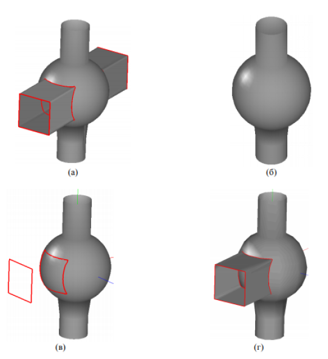

Построение поверхностей движения
================================
-------------------------------------------
### [Поверхности движения](#title_1)

### [MbExtrusionSurface – поверхность выдавливания](#title_2)

### [MbRevolutionSurface – поверхность вращения](#title_3)
* [Построение поверхностной модели из нескольких частей](#title_4)
* [Построение тонкостенной твердотельной модели](#title_5)

### [Кинематические поверхности](#title_6)

### [Заключение](#title_7)
-------------------------------------------

[]Поверхности движения образуют один из наиболее часто используемых в геометрическом моделировании видов поверхностей. В частности, они удобны для построения поверхностных моделей, обладающих свойствами вращательной или зеркальной симметрии. Такие модели используются для представления формы многих машиностроительных деталей, например, изготовленных посредством применения технологий металлообработки на основевоздействия режущих инструментов, движущихся по заданным траекториям.  
[]В данной работе рассматриваются способы построения наиболее распространенных видов поверхностей движения: выдавливания, вращения и кинематических поверхностей. С использованием соответствующих классов C3D демонстрируется построение поверхностных моделей, состоящих из нескольких фрагментов различных поверхностей. Во многих случаях вместо поверхностных моделей оказывается удобным применять твердотельные модели. В данной работе также демонстрируется построение тонкостенных твердотельных моделей.  

### <a name="title_1"> []()Поверхности движения </a>
------------------------
[]В таблице 1 перечислены классы C3D для представления поверхностей движения и наборы свойств, которые указываются при создании объектов этих классов. Все перечисленные классы унаследованы от абстрактного родительского класса [MbSweptSurface](doc::/MbSweptSurface).  

**Таблица 1.** Классы для представления поверхностей движения.

|  № |  Класс |  Заголовочные файлы | Код поверхности (MbSurface::IsA())  |  Наборы значений для разных способов построения |
| :----- | :----------- | :------- | :----------- | :--------- |
| 1 | [MbExtrusionSurface](doc::/MbExtrusionSurface) (поверхность выдавливания) | [surf_extrusion_surface.h](doc::/surf_extrusion_surface.h) |  st_ExtrusionSurface | 1. Образующая и вектор. |
| 2 | [MbRevolutionSurface](doc::/MbRevolutionSurface) (поверхность вращения)  | [surf_revolution_surface.h](doc::/surf_revolution_surface.h)  |  st_RevolutionSurface | 1. Образующая, начало локальной СК, ось Z локальной СК, угол поворота.<br />2. Образующая, ось и угол вращения.<br />3. Образующая, ось вращения, минимальный и максимальный угол. |
| 3 | [MbExpansionSurface](doc::/MbExpansionSurface) (поверхность плоскопараллельного движения)  |  [surf_expansion_surface.h](doc::/surf_expansion_surface.h) | st_ExpansionSurface  | 1. Образующая и направляющая.<br />2. Точка, образующая и направляющая. |
| 4 | [MbSpiralSurface](doc::/MbSpiralSurface) (спиральная поверхность) | [surf_spiral_surface.h](doc::/surf_spiral_surface.h)  | st_SpiralSurface  |  1. Образующая, локальная СК, радиус и шаг спирали.<br />2. Образующая и спиральная кривая – направляющая. |
| 5 | [MbEvolutionSurface](doc::/MbEvolutionSurface) (кинематическая поверхность)  | [surf_evolution_surface.h](doc::/surf_evolution_surface.h) |  st_EvolutionSurface |  1. Образующая и направляющая. |
| 6 | [MbExactionSurface](doc::/MbExactionSurface) (кинематическая поверхность с наклоном торцов)  | [surf_exaction_surface.h](doc::/surf_exaction_surface.h)  | st_ExactionSurface  | 1. Образующая, направляющая и векторы нормалей к торцам в конечных точках направляющей. 

[]В таблице 1 можно заметить, что способы построения у всех поверхностей движения однотипны – либо в явном виде указываются образующая и направляющая кривая, либо указываются геометрические объекты, однозначно задающие образующую и направляющую косвенным образом. Кроме явного  вызова конструкторов классов поверхностей движения, можно использовать функции-утилиты для построения этих поверхностей, описанные в файле [action_surface.h](doc::/action_surface). Эти функции перечислены в таблице 2. Каждая из этих функций возвращает значение [MbResultType](doc::/MbResultType) – в случае успешного построения поверхности это значение равно rt_Success. Построенная поверхность возвращается как динамически созданный объект в виде указателя на базовый класс [MbSurface](doc::/MbSurface). При необходимости с помощью оператора языка Си++ dynamic_cast<>() указатель [MbSurface](doc::/MbSurface)\* можно преобразовать к указателю на соответствующий конкретный класс поверхности. Однако выполнять такую операцию обычно не требуется, поскольку все основные операции с поверхностями обеспечиваются методами интерфейса родительского класса [MbSurface](doc::/MbSurface).  

**Таблица 2.** Функции-утилиты для построения поверхностей движения ([action_surface.h](doc::/action_surface))

| №  |  Класс | Функция-утилита  |  Параметры вызова функции |
| :------------- | :------------- | :------------- | :------------- |
| 1 | [MbExtrusionSurface](doc::/MbExtrusionSurface)(поверхность выдавливания)  | ::ExtrusionSurface() |  Образующая кривая и вектор (длина вектора задает длину направляющего отрезка). |
| 2 | [MbRevolutionSurface](doc::/MbRevolutionSurface) (поверхность вращения) | ::RevolutionSurface() | Образующая кривая, ось и угол вращения. |
| 3 | [MbExpansionSurface](doc::/MbExpansionSurface) (поверхность плоскопараллельного движения) | ::ExpansionSurface() | Образующая и направляющая кривая. |
| 4 | [MbSpiralSurface](doc::/MbSpiralSurface)(спиральная поверхность) | ::SpiralSurface() | Образующая кривая, локальная СК, шаг спирали |
| 5 | [MbEvolutionSurface](doc::/MbEvolutionSurface)(кинематическая поверхность) | ::EvolutionSurface() | Образующая и направляющая кривая. В случае, если направляющая – спиральная кривая [MbCurveSpiral](doc::/MbCurveSpiral), то будет построена спиральная поверхность. |
| 6 | [MbExactionSurface](doc::/MbExactionSurface) (кинематическая поверхность с наклоном торцов) | Требует использования конструкторов класса. |

### <a name="title_2"> [MbExtrusionSurface](doc::/MbExtrusionSurface) – поверхность выдавливания </a>
-----------------------------------------------------------------------------

[]Поверхности выдавливания удобны для построения поверхностных моделей, состоящих из фрагментов с парами параллельных прямолинейных границ. Для описания формы объекта может потребоваться несколько различных фрагментов, имеющих общие границы. При построении отдельных фрагментов с помощью классов поверхностей корректность их сопряжения требуется обеспечивать явным образом. В отличие от такого подхода, при построении моделей твердых тел необходимые поверхностные фрагменты и их сопряжение по общим границам (ребрам) обеспечивается ядром автоматически. Рассмотрим применение поверхностей выдавливания [MbExtrusionSurface](doc::/MbExtrusionSurface) для построения поверхностной модели прямоугольной коробки с поперечиной (рис. 1). Построенная модель показана на рис. 1(а), на рис. 1(б) обозначены вспомогательные элементы, поясняющие построения. Коробка задается тремя параметрами: ширина AB, высота CC1 и глубина BC. Поверхностная модель состоит из трех поверхностей выдавливания:  
1. Боковая поверхность с образующей в виде прямоугольника ABCD и направляющей в виде вектора CC1.
2. Дно коробки – прямоугольник ABCD – с образующей-отрезком AB и направляющей в виде вектора c длиной BC, направленного вдоль оси Z.
3. Поперечина – прямоугольник EFGH – с образующей-отрезком EF и направляющей в виде вектора c длиной EH, направленного вдоль оси Z.
Способы выбора образующих и направляющих для построения перечисленных поверхностей не являются единственно возможными. Например, для построения дна коробки (прямоугольника ABCD) можно было бы взять в качестве образующей сторону AD и вектор длиной AB, параллельный оси X. Использовать для представления прямоугольных фрагментов элементарную поверхность [MbPlane](doc::/MbPlane) нельзя, поскольку [MbPlane](doc::/MbPlane) представляет бесконечно протяженную плоскость. Класс [MbPlane](doc::/MbPlane) удобен для выполнения вычислений и вспомогательных построений, но не подходит для представления прямоугольников.

  
**Рис. 1.** Построение поверхностной модели из трех поверхностей выдавливания [MbExtrusionSurface](doc::/MbExtrusionSurface). (a) Модель коробки с поперечиной. (б) Вспомогательные построения, поясняющие выбор образующих и направляющих.

[]Программный фрагмент для построения модели, показанной на рис. 1(а), приведен в  примере 1. Для построения объектов-поверхностей выдавливания используется функция-утилита ::ExtrusionSurface.  
[]*Примечание:* при построении боковой поверхности модели использовалась образующая в виде прямоугольника. В общем случае нежелательно указывать образующие с угловыми точками, т.е. с разрывами в значении первой производной. Например, такие поверхности не подходят для построения на их базе поверхностей, ограниченных кривыми. Поэтому в случаях, когда поверхность выдавливания используется в качестве промежуточного шага для построения более сложных поверхностей, ее необходимо строить с использованием гладких образующих. Для этого обычно требуется разбивать поверхность на несколько частей. Например, боковую поверхность в примере 1 можно было бы строить в виде набора из четырех прямоугольных фрагментов.

**Пример 1. Построение поверхностей выдавливания (рис. 1).**

```cpp
#include "surf_extrusion_surface.h"
#include "cur_line_segment3d.h"
#include "cur_polyline3d.h"
#include "action_surface.h"

bool run()
{
    // Параметры модели коробки
    // Ширина, высота и глубина - размеры вдоль осей X, Y и Z
    const double BOX_WIDTH = 10, BOX_HEIGHT = 2.5, BOX_DEPTH = 15;
    // Ширина поперечины - 20% от глубины коробки
    const double BAR_SIZE = BOX_DEPTH/5;

    // 1) Построение боковой поверхности
    MbSurface* pSurfBox = nullptr;
    // Вершины прямоугольника ABCD (дно коробки)
    std::vector<MbCartPoint3D> arrPolyPntsBox = {{0, 0, 0}, {BOX_WIDTH, 0, 0}, {BOX_WIDTH, 0, BOX_DEPTH}, {0, 0, BOX_DEPTH}};
    // Образующая для построения боковой поверхности - контур дна коробки в виде ломаной линии
    MbPolyline3D* pGenCurveBox = new MbPolyline3D(arrPolyPntsBox, true);
    // Направляющий вектор - параллелен оси Y, длина равна высоте коробки CC1
    MbVector3D vecDirBox(0, BOX_HEIGHT, 0);
    // Вызов функции-утилиты для построения поверхности выдавливания
    MbResultType resBox = ::ExtrusionSurface(*pGenCurveBox, vecDirBox, true, pSurfBox);

    // 2) Построение дна коробки - прямоугольника ABCD
    MbSurface* pSurfBottom = nullptr;
    // Образующая - отрезок AB
    MbLineSegment3D* pGenCurveBottom =
    new MbLineSegment3D(arrPolyPntsBox[0], arrPolyPntsBox[1]);
    // Направляющий вектор - параллелен оси Z, длина равна глубине коробки BC
    MbVector3D vecDirBottom(0, 0, BOX_DEPTH);
    MbResultType resBottom = ::ExtrusionSurface(*pGenCurveBottom, vecDirBottom, , pSurfBottom);

    // 3) Построение поперечного элемента
    MbSurface* pSurfBar = nullptr;
    // Образующая - отрезок EF - строится посредством параллельного переноса отрезка AB на вектор AE
    MbLineSegment3D* pGenCurveBar = new MbLineSegment3D(arrPolyPntsBox[0], arrPolyPntsBox[1]);
    pGenCurveBar->Move(MbVector3D(0, BOX_HEIGHT, (BOX_DEPTH - BAR_SIZE)/2));
    // Направляющий вектор - параллелен оси Z, длина равна ширине поперечины
    MbVector3D vecDirBar(0, 0, BAR_SIZE);
    MbResultType resBar = ::ExtrusionSurface(*pGenCurveBar, vecDirBar, true, pSurfBar);

    // Отображение поверхностей
    show(Style(1, LIGHTGRAY), pSurfBox);
    show(Style(1, GREEN), pSurfBottom);
    show(Style(1, BLUE), pSurfBar);

    // Уменьшение счетчика ссылок динамически созданных объектов ядра
    ::DeleteItem( pGenCurveBox);
    ::DeleteItem( pSurfBox );
    ::DeleteItem( pGenCurveBottom );
    ::DeleteItem( pSurfBottom );
    ::DeleteItem( pGenCurveBar );
    ::DeleteItem( pSurfBar );

    return true;
}
```
<button id="code_block_1"></button>

[]Построение поверхностей выдавливания часто является одной из промежуточных операций моделирования. Рассмотрим задачу построения модели ограниченной поверхности, показанной на рис. 2. Поверхностный фрагмент с отверстием можно представить в виде поверхности, ограниченной кривыми [MbCurveBoundedSurface](doc::/MbCurveBoundedSurface) (Работа №4, п. 4.6). В качестве базовой будет использоваться поверхность выдавливания. Возможный порядок построения состоит из следующих шагов:  
1. Построение базовой поверхности выдавливания.  
2. Построение внутреннего кругового контура на базовой поверхности.  
3. Получение контура, представляющего внешнюю границу базовой поверхности.  
4. Построение поверхности, ограниченной двумя кривыми: внешним контуром базовой поверхности и контуром отверстия.

[]Выполнение перечисленных действий показано в примере 2.

  
**Рис. 2.** Поверхностная модель на базе поверхности выдавливания.

**Пример 2. Поверхность выдавливания с отверстием (рис. 2).**

```cpp
#include "surf_extrusion_surface.h"
#include "cur_line_segment3d.h"
#include "cur_contour.h"
#include "cur_arc3d.h"
#include "action_surface.h"
#include "action_curve.h"

bool run()
{
    // Размер стороны поверхностного фрагмента в виде квадрата
    const double SIZE_SQUARE = 5;
    // Радиус внутреннего центрального отверстия
    const double HOLE_RADIUS = SIZE_SQUARE/3;

    // 1) ПОСТРОЕНИЕ БАЗОВОЙ ПОВЕРХНОСТИ ВЫДАВЛИВАНИЯ
    MbSurface* pSurfBase = 0;
    {
        // Образующая: отрезок на оси X длиной SIZE_SQUARE
        MbLineSegment3D* pGenCurve = new MbLineSegment3D(MbCartPoint3D(0, 0, 0), MbCartPoint3D(SIZE_SQUARE,0,0));
        // Направляющий вектор - направлен в сторону +Z
        MbVector3D vecDir( 0, 0, SIZE_SQUARE );
        // Вызов функции-утилиты для построения поверхности выдавливания
        ::ExtrusionSurface( *pGenCurve, vecDir, true, pSurfBase );
    }

    // 2) ПОСТРОЕНИЕ КРУГОВОГО КОНТУРА НА ПОВЕРХНОСТИ
    MbContour* pArcContour = 0;
    {
      // Центр отверстия и пара точек на окружности в глобальной СК
        MbCartPoint3D pc(SIZE_SQUARE/2, 0, SIZE_SQUARE/2);
        MbCartPoint3D p1 = pc, p2 = pc;
        p1.x += HOLE_RADIUS;
        p2.z += HOLE_RADIUS;
        // Вспомогательная пространственная кривая - контур отверстия
        MbArc3D* pArcCurve = new MbArc3D(pc, p1, p2, 0, true);
        // Проецирование пространственной кривой на поверхность для получения
        // контура на поверхности
        ::SurfaceBoundContour(*pSurfBase, *pArcCurve, Math::DefaultMathVersion(), pArcContour);
        ::DeleteItem(pArcCurve);
    }

    // 3) ПОЛУЧЕНИЕ КОНТУРА - ВНЕШНЕЙ ГРАНИЦЫ БАЗОВОЙ ПОВЕРХНОСТИ
    MbContour* pExtContour = &pSurfBase->MakeContour(true);

    // 4) ПОСТРОЕНИЕ ПОВЕРХНОСТИ, ОГРАНИЧЕННОЙ ПАРОЙ КОНТУРОВ
    MbSurface* pSurf = 0;
    {
        RPArray<MbCurve> arrBounds;
        arrBounds.Add(pExtContour);
        arrBounds.Add(pArcContour);
        // Построение поверхности pSurf на базе поверхности выдавливания pSurfBase
        ::BoundedSurface(*pSurfBase, arrBounds, pSurf);
    }

    // Отображение поверхности
    show(Style(1, LIGHTGRAY), pSurf);

    // Уменьшение счетчиков ссылок динамически созданных объектов ядра
    ::DeleteItem(pSurfBase);
    ::DeleteItem(pSurf);
    ::DeleteItem(pArcContour);
    ::DeleteItem(pExtContour);

    return true;
}
```
<button id="code_block_2"></button>

### Задания(1)
--------------
1. Разработайте функцию для построения фрагмента цилиндрической поверхности в виде поверхности выдавливания с образующей – дугой окружности. С помощью этой функции
постройте цилиндрическую поверхность, а также поверхности с образующей в форме четверти и трети дуги окружности.
2. Постройте поверхность эллиптического цилиндра как поверхность выдавливания с образующей-эллипсом. Оформите эти действия в виде отдельной функции и постройте с ее помощью несколько рядом расположенных цилиндрических поверхностей с параллельными
осями симметрии.
3. Постройте поверхность выдавливания с образующей в форме косинусоиды с тремя периодами. Для представления образующей используйте кривую Безье или NURBS, построенную по набору точек.
4. Постройте поверхностную модель, состоящую из пяти прямоугольных фрагментов
(рис. 3(а)). Построение прямоугольника реализуйте в виде отдельной функции.
5. Постройте поверхностную модель из прямоугольных фрагментов, образующих треугольную фигуру (рис. 3(б)). Для построения прямоугольников примените функцию, разработанную для задания 4.

  
**Рис. 3.** Образцы поверхностных моделей для задания 4 (модель (а)) и для задания 5 (модель (б)).

### <a name="title_3"> [MbRevolutionSurface](doc::/MbRevolutionSurface) – поверхность вращения </a>
----------------------------------------------
[]Поверхности вращения предназначены для представления поверхностных моделей, обладающих вращательной симметрией. Такие модели широко распространены, в частности, для представления машиностроительных деталей, изготавливаемых посредством токарной обработки. Для представления таких поверхностей используется класс [MbRevolutionSurface](doc::/MbRevolutionSurface). У этого класса есть несколько конструкторов, позволяющих различными способами указать образующую кривую, ось и угол вращения. Однако, как и в других аналогичных случаях, удобнее пользоваться функцией-утилитой, которая осуществляет контроль корректности передаваемых параметров. Описание этой функции для построения поверхности вращения содержится в заголовочном файле [action_surface.h](doc::/action_surface.h):  

```cpp
    MbResultType ::RevolutionSurface( MbCurve3D& curve, const MbCartPoint3D& origin, const MbVector3D& axis, double angle, bool simplify, MbSurface*& result );
```

[]Образующая кривая передается в виде объекта-кривой curve. Ось вращения задается двумя входными параметрами origin и axis. Одного объекта axis недостаточно, поскольку класс [MbVector3D](doc::/MbVector3D) представляет свободный вектор в трехмерном пространстве. Комбинацию параметров origin и axis можно рассматривать как закрепленный вектор (направленный отрезок), однозначно определяющий ось вращения. Т.о., оси вращения задается парой вершин направленного отрезка origin и (origin.x + axis.x, origin.y + axis.y, origin.z + axis.z). Угол вращения образующей angle вокруг оси указывается в радианах. Параметр simplify служит для разрешения автоматического упрощения модели поверхности.  
[]Выходным параметром функции ::RevolutionSurface является объект result, представляющий построенную поверхность вращения. Для единообразия возвращаемый объект представляется в виде указателя на родительский класс MbSurface. Как правило, преобразовывать результат из указателя типа [MbSurface](doc::/MbSurface)* в [MbRevolutionSurface](doc::/MbRevolutionSurface)* не требуется – основные особенности класса «Поверхность вращения» сосредоточены в реализации виртуальных методов базового класса. Специфическими новыми методами [MbRevolutionSurface](doc::/MbRevolutionSurface) является лишь небольшой набор методов для получения атрибутов класса – параметров построения поверхности вращения (образующей и оси вращения).  
[]Для контроля корректности вызова функции ::RevolutionSurface можно произвести проверку возвращаемого объекта – указатель result не должен быть нулевым, а также возвращаемого значения функции типа [MbResultType](doc::/MbResultType) – в случае успешного вызова оно должно быть равно rt_Success.  
[]Рассмотрим применение поверхности вращения для построения модели в виде комбинации пересекающихся сферической и цилиндрической поверхностей (рис. 4(б)). Будем полагать, что ось цилиндра проходит через центр сферы, и что центры тяжести цилиндра и сферы совпадают. В таком случае искомая поверхность будет иметь вид поверхности вращения с образующей, состоящей из дуги окружности и отрезков – т.е., половина сечения поверхности плоскостью, содержащей ось цилиндра. Построенная поверхность и ее образующая кривая показаны на рис. 4. Программные вызовы, реализующие построение, приведены в примере 3.  

  
**Рис. 4.** Поверхность вращения (а), построенная с использованием представленной образующей кривой (б) (пример 4.1).

**Пример 3. Поверхность вращения в виде комбинации сферической и цилиндрической поверхностей (рис. 4).**

```cpp
#include "cur_line_segment3d.h"
#include "cur_arc3d.h"
#include "cur_contour3d.h"
#include "action_surface.h"
#include "surf_revolution_surface.h"

// Построение поверхности вращения в виде комбинации цилиндра и сферы с совпадающими центрами тяжести.
MbSurface* CreateCylSphereSurface()
{
    // Параметры цилиндра и сферы
    const double CYL_RAD = 2.0;
    const double CYL_HEIGHT = 20.0;
    const double SPHERE_RAD = 5.0;

    // Образующая кривая: контур, состоящий из двух отрезков и дуги окружности между ними
    // Точки - вершины сегментов образующей (рис. 4)
    MbCartPoint3D p1(CYL_RAD, CYL_HEIGHT/2, 0);
    MbCartPoint3D p2(CYL_RAD, sqrt(SPHERE_RAD*SPHERE_RAD - CYL_RAD*CYL_RAD), 0);
    MbCartPoint3D p3(SPHERE_RAD, 0, 0);
    MbCartPoint3D p4(p2.x, -p2.y, p2.z);
    MbCartPoint3D p5(p1.x, -p1.y, p1.z);
    // Сегменты образующей кривой
    MbLineSegment3D* pSeg1 = new MbLineSegment3D(p1, p2);
    MbArc3D* pArc = new MbArc3D(p2, p3, p4, 1, false);
    MbLineSegment3D* pSeg2 = new MbLineSegment3D(p4, p5);
    // Построение образующей кривой в виде контура из трех сегментов
    RPArray<MbCurve3D> arrCurves;
    arrCurves.Add(pSeg1);
    arrCurves.Add(pArc);
    arrCurves.Add(pSeg2);
    MbContour3D* pGenContour = new MbContour3D(arrCurves, true);

    // Параметры оси вращения - она совпадает с осью цилиндра и осью Y локальной СК, в которой задавались вершины сегментов образующей кривой p1-p5.
    MbCartPoint3D axOrg(0, 0, 0);
    MbVector3D axDir(0, 1, 0);

    // Построение поверхности вращения
    MbSurface* pSurf = nullptr;
    MbResultType res = ::RevolutionSurface(*pGenContour, axOrg, axDir, 2*M_PI, true, pSurf);
    if ( res != rt_Success)
    {
        // Возврат в случае ошибки при построении поверхности
        ::DeleteItem(pGenContour);
        ::DeleteItem(pSurf);
        return nullptr;
    }

    ::DeleteItem(pGenContour);
    return pSurf;
}

bool run()
{
    // Построение поверхности реализовано в отдельной функции
    MbSurface* pSurf = CreateCylSphereSurface();

    // Отображение поверхности
    show(Style(1, LIGHTGRAY), pSurf);

    // Уменьшение счетчиков ссылок динамически созданных объектов ядра
    ::DeleteItem(pSurf);

    return true;
}
```
<button id="code_block_3"></button>

### <a name="title_4"> []()Построение поверхностной модели из нескольких частей </a>
--------------------------------------------------------
[]На основе примера 3 построим более сложную поверхностную модель. Будем считать, что поверхность вращения, показанная на рис. 4(б) расположена в системе координат, центр которой совпадает с центром сферы, а ось Y – с осью цилиндра (в этой СК в примере 3 выполнялось построение поверхности). Допустим, что эта поверхность дополняется боковой поверхностью прямоугольной призмы с квадратным основанием. Модель, которую требуется построить, по сравнению с моделью на рис. 4(б), дополняется фрагментами поверхности призмы, лежащими снаружи сферы, и парой квадратных отверстий на поверхности сферы. Часть поверхности призмы, попадающая внутрь сферы, из модели исключается.  
[]Для построения требуемой модели (рис. 5(а)) будут выполнены следующие основные действия:  
1. Построение части модели в виде комбинации сферической и цилиндрической поверхностей (рис. 5(б)). Для этого используется функция CreateCylSphereSurface(), которая была реализована в примере 3.
2. Построение двух контуров, ограничивающих часть призмы за пределами сферы. Один контур – квадратное основание призмы, которое лежит в плоскости, параллельной ZY, и смещенной в направлении – X на половину высоты призмы. Второй контур – линия пересечения поверхности призмы и сферической поверхности. Эти контуры показаны на рис. 5(в).
3. Построение линейчатой поверхности [MbRuledSurface](doc::/MbRuledSurface) по двум кривым – контурам, вычисленным на шаге 2. Эта поверхность будет представлять один из двух фрагментов поверхности призмы, лежащих снаружи поверхности сферы. Результирующая поверхность показана на рис. 5(г). Данную поверхность не удается построить как поверхность выдавливания, поскольку у нее нельзя указать образующую кривую постоянной формы, которую можно было бы переместить для построения вдоль какой-либо траектории.
4. Повторение шагов 2 и 3 для построения линейчатой поверхности, представляющей второй фрагмент призмы снаружи сферы.
5. Во фрагменте сферической поверхности необходимо построить отверстия, соответствующие линиям пересечения поверхностей сферы и призмы. Для этого на базе поверхности, построенной на шаге 1, выполняется построение поверхности, ограниченной контурами. В качестве пары ограничивающих контуров задаются контуры, соответствующие линиям пересечения поверхности призмы и сферы (они были вычислены в процессе выполнения шагов 2 и 4). Процедура построения поверхности с отверстием аналогична примеру 2.
Программная реализация перечисленных выше действий приведена в примере 4.

  
**Рис. 5.** Построение поверхностной модели из четырех поверхностей: двух поверхностей вращения (представляют сферическую и цилиндрическую поверхности) и двух линейчатых поверхностей (представляют фрагменты поверхности призмы, лежащие снаружи сферы). (a) Построенная модель. (б) Часть модели – поверхность вращения, построенная аналогично примеру 3. (в) Контуры для построения первой линейчатой поверхности – основание призмы и его проекция на поверхность сферы. (г) Линейчатая поверхность, построенная по контурам, показанным на рис. (в).

**Пример 4. Модель из двух поверхностей вращения и двух линейчатых поверхностей (рис. 5).**

```cpp
#include "cur_line_segment3d.h"
#include "cur_polyline3d.h"
#include "cur_contour3d.h"
#include "cur_arc3d.h"
#include "cur_contour.h"
#include "action_surface.h"
#include "surf_revolution_surface.h"
#include "action_surface_curve.h"
#include "action_curve.h"

bool run()
{
    // Параметры прямоугольной призмы, которая будет дополнять поверхность pCylSphere
    const double PRISM_SIDE = 5;    // Сторона квадратного основания призмы
    const double PRISM_HEIGHT = 20; // Высота призмы

    // 1) ПОСТРОЕНИЕ ЧАСТИ МОДЕЛИ В ВИДЕ КОМБИНАЦИИ СФЕРИЧЕСКОЙ И ЦИЛИНДРИЧЕСКОЙ ПОВЕРХНОСТЕЙ (вызывается функция, реализованная в примере 3)
    MbSurface* pCylSphere = CreateCylSphereSurface();
    MbAxis3D axVert(MbVector3D( 0, 1, 0 ));
    pCylSphere->Rotate(axVert, M_PI/2);

    // 2) ПОСТРОЕНИЕ ПАРЫ КОНТУРОВ, ОГРАНИЧИВАЮЩИХ ОДНУ ИЗ ЧАСТЕЙ ПРИЗМЫ СНАРУЖИ СФЕРЫ
    // Координаты вершин основания призмы (в плоскости, параллельной ZY, и смещенной на половину высоты в сторону -X)
    std::vector<MbCartPoint3D> arrPnts_Base1 = 
    {
        {-PRISM_HEIGHT/2, PRISM_SIDE/2, -PRISM_SIDE/2},
        {-PRISM_HEIGHT/2, PRISM_SIDE/2, PRISM_SIDE/2},
        {-PRISM_HEIGHT/2, -PRISM_SIDE/2, PRISM_SIDE/2}, 
        {-PRISM_HEIGHT/2, -PRISM_SIDE/2, -PRISM_SIDE/2}
    };

    // Контур - замкнутая ломаная для представления основания призмы
    MbPolyline3D* pContour_Base1 = new MbPolyline3D( arrPnts_Base1, true );

    // Проецирование пространственного контура pContour_Base1 на поверхность pCylSphere
    RPArray< MbCurve3D > arrProjCurves_Base1;
    MbVector3D dirProj1(+1, 0, 0);
    ::CurveProjection(*pCylSphere, *pContour_Base1, &dirProj1, false, false, arrProjCurves_Base1);

    // 3) ПОСТРОЕНИЕ ПЕРВОГО ФРАГМЕНТА ПОВЕРХНОСТИ ПРИЗМЫ
    // Поверхность pSurfPrism1 строится как линейчатая поверхность, заданная парой кривых
    MbSurface* pSurfPrism1 = 0;
    ::RuledSurface( *pContour_Base1, *arrProjCurves_Base1[0], true, pSurfPrism1 );

    // 4) ПОСТРОЕНИЕ ВТОРОГО ФРАГМЕНТА ПОВЕРХНОСТИ ПРИЗМЫ
    // Второе основание призмы смещено относительно первого основания на высоту призмы
    MbPolyline3D* pContour_Base2 = new MbPolyline3D(arrPnts_Base1, true);
    pContour_Base2->Move(MbVector3D( PRISM_HEIGHT, 0, 0));

    // Проецирование пространственного контура pContour_Base2 на поверхность pCylSphere
    RPArray< MbCurve3D > arrProjCurves_Base2;
    MbVector3D dirProj2(-1, 0, 0);
    ::CurveProjection(*pCylSphere, *pContour_Base2, &dirProj2, false, false, arrProjCurves_Base2);

    // Построение второго фрагмента поверхности призмы как линейчатой поверхности, заданной парой кривых
    MbSurface* pSurfPrism2 = 0;
    ::RuledSurface(*pContour_Base2, *arrProjCurves_Base1[0], true, pSurfPrism2);

    // 5) ПОСТРОЕНИЕ ОТВЕРСТИЙ НА БАЗОВОЙ ПОВЕРХНОСТИ pCylSphere, СООТВЕТСТВУЮЩИХ ЛИНИЯМ ПЕРЕСЕЧЕНИЯ ПРИЗМЫ СО СФЕРОЙ
    // Построение поверхности, ограниченной тремя контурами
    MbSurface* pSurfWithHoles = 0;
    RPArray<MbCurve> arrBounds;
    {
        // Проецирование пространственных кривых - линий пересечения призмы со сферой - на базовую поверхность для получения двумерных контуров на базовой поверхности
        MbContour* pProjContour1 = nullptr;
        ::SurfaceBoundContour(*pCylSphere, *arrProjCurves_Base1[0], Math::DefaultMathVersion(), pProjContour1);

        MbContour* pProjContour2 = nullptr;
        ::SurfaceBoundContour(*pCylSphere, *arrProjCurves_Base2[0], Math::DefaultMathVersion(), pProjContour2);

        // Получение контура - внешней границы базовой поверхности
        MbContour* pExtContour = &pCylSphere->MakeContour(true);

        // Построение поверхности с отверстиями pSurfWithHoles на базе pCylSphere
        arrBounds.Add(pExtContour);
        arrBounds.Add(pProjContour1);
        arrBounds.Add(pProjContour2);
        ::BoundedSurface(*pCylSphere, arrBounds, pSurfWithHoles);
    }

    // 6) ОТОБРАЖЕНИЕ ГЕОМЕТРИЧЕСКИХ ОБЪЕКТОВ
    show(Style(1, LIGHTGRAY), pSurfWithHoles); 
    show(Style(3, LIGHTRED), pContour_Base1);
    show(Style(3, LIGHTRED), arrProjCurves_Base1[0]);
    show(Style(3, LIGHTRED), pContour_Base2);
    show(Style(3, LIGHTRED), arrProjCurves_Base2[0]);
    show(Style(3, LIGHTGRAY), pSurfPrism1);
    show(Style(3, LIGHTGRAY), pSurfPrism2);
    Уменьшение счетчиков ссылок динамически созданных объектов ядра
    ::DeleteItem(pCylSphere);
    ::DeleteItem(pContour_Base1);
    for (int i=0; i<arrProjCurves_Base1.size(); i++)
        ::DeleteItem(arrProjCurves_Base1[i]);
    ::DeleteItem(pSurfPrism1);
    ::DeleteItem(pContour_Base2);
    for (int i=0; i<arrProjCurves_Base2.size(); i++)
        ::DeleteItem(arrProjCurves_Base2[i]);
    ::DeleteItem(pSurfPrism2);
    for (int i=0; i<arrBounds.size(); i++)
        ::DeleteItem(arrBounds[i]);
    ::DeleteItem(pSurfWithHoles);

    return true;
}
```
<button id="code_block_4"></button>

[]Для комбинирования поверхностей в C3D требуется явно обеспечивать выполнение необходимых промежуточных геометрических операций. Под этим подразумевается явное создание фрагментов поверхностей, образующих требуемую геометрическую модель, с указанием необходимых граничных кривых. В примере 3 геометрические объекты, составляющие модель, показанную на рис. 5(а) не связаны друг с другом в какую-либо структуру данных – они хранятся независимо друг от друга в виде набора отдельных геометрических объектов.  

### <a name="title_5"> []()Построение тонкостенной твердотельной модели </a>
--------------------------------------------------------
[]В отличие от поверхностных моделей, при построении моделей твердых тел в C3D большое количество промежуточных построений выполняется автоматически (в частности, построение ребер у граней твердых тел). Поэтому для построения геометрически согласованных моделей предпочтительнее использовать операции построения моделей твердых тел. Для иллюстрации подобного подхода рассмотрим построение модели, аналогичной модели на рис. 5(а), в виде тонкостенной твердотельной модели. При ее построении будут выполнены следующие действия (они поясняются на рис. 6):  
1. Построение тонкостенного твердого тела вращения, поверхность которого представляет собой комбинацию сферической и цилиндрической поверхности (рис. 6(б)). Для построения этого тела используется такая же образующая, которая применялась для построения модели на рис. 4.
2. Построение тонкостенного твердого тела выдавливания, поверхность которого совпадает с поверхностью призмы с квадратным основанием (рис. 6(в)).
3. Выполнение булевой операции «разность тел» для разбиения тела выдавливания на три части (рис. 6(г)). Две части, расположенные снаружи тела вращения (рис. 6(д)), отбираются для дальнейших построений.
4. Выполнение булевой операции «разность тел» для разбиения тела вращения (рис. 6(б)) на три части (рис. 6(е)). Частей три, поскольку тело вращение тонкостенное, и в области каждого квадратного отверстия (одно на рис. 6(е) не видно) образуется отдельная тонкостенная часть. Часть, показанная на рис. 6(ж), отбирается для построения результирующего тела (рис. 6(а)). Части, соответствующие квадратным отверстиям в теле вращения, в дальнейшей обработке не участвуют.
5. Двукратное выполнение булевой операции «объединение тел» для объединения отобранных фрагментов тела выдавливания и тела вращения. В итоге формируется целевое тонкостенное тело (рис. 6(а)).

  
**Рис. 6.** Построение тонкостенной твердотельной модели из трех фрагментов: одного фрагмента тела вращения и двух фрагментов тела выдавливания. (a) Построенная модель. (б) Вспомогательное твердое тело вращения Т1. (в) Вспомогательное твердое тело выдавливания Т2. 3(г) Разность тел Т2–Т1.(д) Отобранные фрагменты тела выдавливания. (е) Разность тел Т1–Т2. (ж) Отобранный фрагмент тела вращения.

[]Программная реализация операций построения твердотельной модели рис. 6 представлена в примере 5. При сравнении с поверхностной моделью из примера 4 можно заметить, что при твердотельном моделировании сложные и численно неустойчивые операции сопряжения фрагментов модели удается выполнить автоматически с помощью функций ядра C3D, реализующих булевы операции твердотельного моделирования.  

**Пример 5. Тонкостенная твердотельная модель в виде комбинации фрагментов тел вращения и выдавливания (рис. 6).**

```cpp
#include "cur_polyline3d.h"
#include "cur_arc3d.h"
#include "action_solid.h"

// Вспомогательная функция.
// Построение тонкостенного твердого тела вращения в виде комбинации
// цилиндра и сферы с центрами тяжести в начале координат.
MbSolid* CreateCylSphereSolid(double sphereRad, double cylRad, double cylHeight, double thwall /* толщина стенки */)
{
    // Образующая кривая: контур, состоящий из двух отрезков и дуги окружности между ними
    // Точки - вершины сегментов образующей
    MbCartPoint3D p1(cylRad, cylHeight/2, 0);
    MbCartPoint3D p2(cylRad, sqrt(sphereRad*sphereRad - cylRad*cylRad ), 0);
    MbCartPoint3D p3(sphereRad, 0, 0);
    MbCartPoint3D p4( p2.x, -p2.y, p2.z);
    MbCartPoint3D p5(p1.x, -p1.y, p1.z );
    // Сегменты образующей кривой
    MbLineSegment3D* pSeg1 = new MbLineSegment3D(p1, p2);
    MbArc3D* pArc = new MbArc3D(p2, p3, p4, 1, false);
    MbLineSegment3D* pSeg2 = new MbLineSegment3D(p4, p5);
    // Построение образующей кривой в виде контура из трех сегментов
    RPArray<MbCurve3D> arrCurves;
    arrCurves.Add(pSeg1);
    arrCurves.Add(pArc);
    arrCurves.Add(pSeg2);
    MbContour3D* pGenContour = new MbContour3D(arrCurves, true);

    // Формирование объекта-образующей sweptData
    RPArray< MbContour3D > arrContours;
    arrContours.Add(pGenContour);
    MbSweptData sweptData(arrContours);

    // Параметры оси вращения - ось направлена вдоль оси Y
    MbCartPoint3D axOrg(0, 0, 0);
    MbVector3D axDir(0, 1, 0);
    MbAxis3D axRot(axOrg, axDir);

    // Именователь граней твердого тела вращения
    MbSNameMaker operNames(ct_CurveRevolutionSolid, MbSNameMaker::i_SideNone, 0);
    operNames.SetVersion(MbNameVersion());
    PArray<MbSNameMaker> cNames(0, 1, false);

    // Параметры операции вращения для построения тонкостенного тела
    RevolutionValues params;
    // Построение тела типа "сфера"
    params.shape = 0;   
    // Угол поворота образующей
    params.side1.scalarValue = 360*M_PI/180;
    // Толщина стенки
    params.thickness1 = thwall;              

    // Вызов операции построения тела вращения pSolid
    MbSolid* pSolid = nullptr;
    MbResultType res = ::RevolutionSolid(sweptData, axRot, params, operNames, cNames, pSolid);
    if (res != rt_Success)
    {
        // Возврат в случае ошибки при построении твердого тела
        ::DeleteItem(pGenContour);
        ::DeleteItem(pSolid);
        return nullptr;
    }

    // Возврат построенного твердого тела
    return pSolid;
} 

// Вспомогательная функция.
// Построение тонкостенного твердого тела выдавливания, представляющего боковую поверхность призмы с квадратным основанием
MbSolid* CreatePrismSolid(double prismSide, double prismHeight, double thwall)
{
    // Координаты вершин основания призмы (в плоскости ZY - в среднем сечении призмы)
    std::vector<MbCartPoint3D> arrPnts_Base1 = 
    {
        {0, prismSide/2, -prismSide/2},
        {0, prismSide/2, prismSide/2},
        {0, -prismSide/2, prismSide/2},
        {0, -prismSide/2, -prismSide/2}
    };

    // Контур - замкнутая ломаная для представления основания призмы
    MbPolyline3D* pContour_Base1 = new MbPolyline3D(arrPnts_Base1, true);

    // Построение образующей кривой
    RPArray<MbCurve3D> arrCurves;
    arrCurves.Add(pContour_Base1);
    MbContour3D* pGenContour = new MbContour3D(arrCurves, true);

    // Формирование объекта-образующей sweptData
    RPArray<MbContour3D> arrContours;
    arrContours.Add(pGenContour);
    MbSweptData sweptData(arrContours);

    // Направление выдавливания
    MbVector3D vecDir(1, 0, 0);

    // Именователь граней твердого тела
    MbSNameMaker operNames(ct_CurveExtrusionSolid, MbSNameMaker::i_SideNone, 0);
    operNames.SetVersion(MbNameVersion());
    PArray<MbSNameMaker> cNames(0, 1, false);

    // Параметры операции выдавливания.
    // Выдавливание производится симметрично в обе стороны от образующей.
    ExtrusionValues params(prismHeight/2, prismHeight/2);
    params.thickness1 = thwall; // Толщина стенки

    // Вызов операции выдавливания для построения твердого тела pSolid
    MbSolid* pSolid = nullptr;
    MbResultType res = ::ExtrusionSolid(sweptData, vecDir, nullptr, nullptr, false, params, operNames, cNames, pSolid);
    if (res != rt_Success)
    {
        // Возврат в случае ошибки при построении твердого тела
        ::DeleteItem(pGenContour);
        ::DeleteItem(pSolid);
        return nullptr;
    }

    // Возврат построенного твердого тела
    return pSolid;
}

// Основная функция.
// Построение твердотельной тонкостенной модели в виде комбинации
// тел вращения и выдавливания
bool run()
{
    // 1) ПОСТРОЕНИЕ ПЕРВОГО ВСПОМОГАТЕЛЬНОГО ТОНКОСТЕННОГО ТВЕРДОГО ТЕЛА ВРАЩЕНИЯ – КОМБИНАЦИЯ ЦИЛИНДРА И СФЕРЫ
    const double CYL_RAD = 2.0;     // Радиус цилиндрической части
    const double CYL_HEIGHT = 20.0; // Высота цилиндрической части
    const double SPHERE_RAD = 5.0;  // Радиус сферической части
    const double THICKNESS = 0.1;   // Толщина тонкой стенки
    MbSolid* pCylSphereSolid = CreateCylSphereSolid(SPHERE_RAD, CYL_RAD, CYL_HEIGHT, THICKNESS);
    // Возможный отладочный вызов для проверки выполнения шага 1.
    // if (pCylSphereSolid)
    // show(pCylSphereSolid);

    // 2) ПОСТРОЕНИЕ ВТОРОГО ВСПОМОГАТЕЛЬНОГО ТОНКОСТЕННОГО ТВЕРДОГО ТЕЛА ВЫДАВЛИВАНИЯ – БОКОВАЯ ПОВЕРХНОСТЬ ПРИЗМЫ С КВАДРАТНЫМ ОСНОВАНИЕМ
    const double PRISM_SIDE = 5;    // Сторона квадратного основания призмы
    const double PRISM_HEIGHT = 20; // Высота призмы
    MbSolid* pPrismSolid = CreatePrismSolid(PRISM_SIDE, PRISM_HEIGHT, THICKNESS);
    // Возможный отладочный вызов для проверки выполнения шага 2.
    // if (pPrismSolid)
    // show(pPrismSolid);

    // 3) РАЗБИЕНИЕ ПРИЗМАТИЧЕСКОГО ТЕЛА pPrismSolid НА ТРИ ЧАСТИ: ДВЕ ЧАСТИ СНАРУЖИ И ОДНА ВНУТРИ pCylSphereSolid.
    // ВНЕШНИЕ ЧАСТИ ОТБИРАЮТСЯ ДЛЯ ИСПОЛЬЗОВАНИЯ ПРИ ПОСТРОЕНИИ РЕЗУЛЬТИРУЮШЕГО ТЕЛА
    MbSolid* pPrismPart1 = nullptr;
    MbSolid* pPrismPart2 = nullptr;

    // Именователь граней для построения тела с помощью булевой операции
    MbSNameMaker operBoolNames(ct_BooleanSolid, MbSNameMaker::i_SideNone, 0);
    // Флаги операции: построение замкнутого тела с объединением подобных граней и ребер
    MbBooleanFlags flagsBool;
    flagsBool.InitBoolean(true);
    flagsBool.SetMergingFaces(true);
    flagsBool.SetMergingEdges(true);

    {
        // Булева операция - разность тел: pSolidDiff = pPrismSolid - pCylSphereSolid
        // Для выполнения разности генерируется вспомогательное тело pCylSphereSolidSmall, у которого радиус сферической части меньше, чем у pCylSphereSolid, на толщину стенки.
        // Это сделано для гарантированного последующего объединения частей тел в дальнейшем, на шаге 5.
        MbSolid* pCylSphereSolidSmall = CreateCylSphereSolid(SPHERE_RAD - THICKNESS, CYL_RAD, CYL_HEIGHT, THICKNESS);
        MbSolid* pSolidDiff = nullptr;
        MbResultType res = ::BooleanResult(*pPrismSolid, cm_Copy, *pCylSphereSolidSmall, cm_Copy, bo_Difference, flagsBool, operBoolNames, pSolidDiff);
        ::DeleteObject(pCylSphereSolidSmall);

      // Возможный отладочный вызов для проверки выполнения шага 3.
        // if (pSolidDiff)
        // show(pSolidDiff);

        // Разбиение составного тела pSolidDiff на три тела: два снаружи и одно внутри pCylSphereSolid
        if (res == rt_Success)
        {
            RPArray<MbSolid> parts;
            MbSNameMaker detachNames(ct_DetachSolid, MbSNameMaker::i_SideNone, 0);

            // При разделении тела pSolidDiff наибольшая часть остается в pSolidDiff, а меньшие (partsCnt штук) помещаются в массив parts (в порядке убывания габаритного размера)
            size_t partsCnt = ::DetachParts(*pSolidDiff, parts, true, detachNames);
            if (partsCnt == 2)
            {
                // Отбор внешних частей тела pSolidDiff
                pPrismPart1 = parts[0];
                pPrismPart2 = parts[1];
                // Удаление лишней части, которая находится внутри тела выдавливания
                ::DeleteItem(pSolidDiff);
            }
        }
    }

    // 4) ВЫРЕЗАНИЕ КВАДРАТНЫХ ОТВЕРСТИЙ ИЗ pCylSphereSolid
    MbSolid* pCylSphereHolesSolid = nullptr;
    {
        // Булева операция - разность тел: pSolidDiff = pCylSphereSolid - pPrismSolid
        MbSolid* pSolidDiff = nullptr;
        MbResultType res = ::BooleanResult(*pCylSphereSolid, cm_Copy, *pPrismSolid, cm_Copy, bo_Difference, flagsBool, operBoolNames, pSolidDiff);

      // Возможный отладочный вызов для проверки выполнения шага 4.
        // if (pSolidDiff)
        // show(pSolidDiff);

        // Разбиение составного тела pSolidDiff на три тела
        if (res == rt_Success)
        {
            RPArray<MbSolid> parts;
            MbSNameMaker detachNames(ct_DetachSolid, MbSNameMaker::i_SideNone, 0);
            size_t partsCnt = ::DetachParts(*pSolidDiff, parts, true, detachNames);

            if (partsCnt == 2)
            {
                // Сохранение части, которая будет использоваться для результирующей модели
                pCylSphereHolesSolid = pSolidDiff;
                // Удаление частей, соответствующих квадратным отверстиям в теле вращения
                ::DeleteItem(parts[0]);
                ::DeleteItem(parts[1]);
            }
        }
    }

    // 5) ПОСТРОЕНИЕ РЕЗУЛЬТИРУЮЩЕГО ТЕЛА pResSolid: ОБЪЕДИНЕНИЕ ТРЕХ ТЕЛ pCylSphereHolesSolid, pPrismPart1 И pPrismPart2
    MbSolid* pResSolid = nullptr;
    {
        // Построение промежуточного тела: pSolid1 = pCylSphereHolesSolid + pPrismPart1
        MbSolid* pSolid1 = nullptr;
        ::BooleanResult(*pCylSphereHolesSolid, cm_Copy, *pPrismPart1, cm_Copy, bo_Union, flagsBool, operBoolNames, pSolid1);

        // Построение результирующего тела: pResSolid = pSolid1 + pPrismPart2
        ::BooleanResult(*pSolid1, cm_Copy, *pPrismPart2, cm_Copy, bo_Union, flagsBool, operBoolNames, pResSolid);

        // Уменьшение счетчика ссылок промежуточного тела, которое больше не потребуется
        ::DeleteItem(pSolid1);
    }

    // ОТОБРАЖЕНИЕ РЕЗУЛЬТИРУЮЩЕГО ТВЕРДОГО ТЕЛА
    if (pResSolid)
        show(pResSolid);

    // УМЕНЬШЕНИЕ СЧЕТЧИКА ССЫЛОК ДИНАМИЧЕСКИ СОЗДАННЫХ ОБЪЕКТОВ ЯДРА
    ::DeleteItem( pCylSphereSolid );
    ::DeleteItem( pPrismSolid );
    ::DeleteItem( pPrismPart1 );
    ::DeleteItem( pPrismPart2 );
    ::DeleteItem( pCylSphereHolesSolid );
    ::DeleteItem( pResSolid );

    return true;
}
```
<button id="code_block_5"></button>

### Задания(2)
--------------
1. Постройте поверхность кругового конуса посредством вращения образующей-отрезка.
2. Постройте поверхность однополостного гиперболоида. Образующую-гиперболу можно представить в виде NURBS-кривой, проходящей через набор точек.
3. Выполните пример 5.
4. Постройте поверхность вращения в виде боковой поверхности вала (рис. 7(а)).
5. Постройте тонкостенное твердое тело, боковая поверхность которого аналогична поверхности из предыдущего задания (рис. 7(а)).
6. Модифицируйте тонкостенное твердое тело, построенное в задании 5), за счет добавления сквозного кругового отверстия в одной из его секций (рис. 7(б)). 

  
**Рис. 7.** Образцы моделей для задания 4 (поверхность вращения (а)) и для задания 6 (твердотельная тонкостенная модель (б)).

### <a name="title_6"> []()Кинематические поверхности </a>
------------------------------
[]Кинематическая поверхность общего вида задается указанием двух кривых – образующей и направляющей. Частным случаем кинематических поверхностей являются поверхности плоскопараллельного движения – при их построении ориентация образующей в процессе движения не изменяется. Подобные поверхности также называются поверхностями сдвига. Для их представления в C3D используется класс [MbExpansionSurface](doc::/MbExpansionSurface). От поверхности выдавливания [MbExtrusionSurface](doc::/MbExtrusionSurface) поверхность сдвига отличается тем, что позволяет явно указать направляющую произвольного вида (в случае [MbExtrusionSurface](doc::/MbExtrusionSurface) в качестве направляющей используется прямолинейный отрезок).  
[]Пример поверхности сдвига показан на рис. 8. В качестве образующей используется круговой контур, а в качестве направляющей – плоская сплайновая кривая. У этой поверхности форма образующей постоянна. Для построения поверхности сдвига надо выполнить следующие действия:  
1. Построение образующей в виде объекта класса [MbCurve3D](doc::/MbCurve3D).
2. Построение направляющей в виде объекта класса [MbCurve3D](doc::/MbCurve3D).
3. Построение поверхности сдвига в виде объекта [MbSurface](doc::/MbSurface) или [MbExpansionSurface](doc::/MbExpansionSurface) (с помощью функции-утилиты из файла [action_surface.h](action_surface.h) или с помощью явного вызова конструктора класса поверхности).  

[]Часто образующая и направляющая оказываются плоскими кривыми. Но при построении поверхности сдвига обязательно передавать их в виде трехмерных кривых. В таком случае образующую и направляющую можно построить в два этапа: сначала сформировать двумерную кривую, а затем на ее базе – трехмерную кривую того же типа с указанием местоположения в пространстве с помощью объекта [MbPlacement3D](doc::/MbPlacement3D) (локальная трехмерная система координат). Этот прием применяется в следующих примерах 6-8.  
[]Чтобы избежать самопересечений поверхности, образующая и направляющая кривые не должны содержать параллельных друг другу участков. Начальная точка направляющей должна быть совмещена с соответствующей точкой образующей кривой.  
[]В приведенном далее примере 6 для построения поверхности сдвига, напоминающей изогнутую трубку постоянного кругового сечения, используется функция-утилита ExpansionSurface из заголовочного файла [action_surface.h](doc::/action_surface.h):  

```cpp
    MbResultType ::ExpansionSurface(const MbCurve3D& curve, const MbCurve3D& spine, MbCurve3D* curve1, MbSurface*& result);
```

[]При вызове этой функции в обязательном порядке указывается образующая кривая curve, направляющая кривая spine и выходной параметр для получения построенной поверхности движения result. Дополнительно может быть задана вторая образующая кривая curve1. В случае поверхностей постоянного сечения в качестве curve1 передается значение NULL (как в примере 6).  

**Пример 6 Построение поверхности сдвига постоянного сечения (рис. 8).**

```cpp
#include <cur_bezier.h>
#include <cur_bezier3d.h>

bool run()
{
    const double DEG_TO_RAD = M_PI/180.0;
    MbPlacement3D plArc;   // СК для построения образующей (совпадает с мировой)
    MbPlacement3D plSpine; // СК для построения направляющей

    //Построение двумерной образующей кривой - окружности
    const double RAD = 10;
    const MbCartPoint arcCenter(0, 0);
    // Построение окружности на плоскости по центру и радиусу
    MbArc* pArc2D = new MbArc(arcCenter, RAD);
    // Построение окружности в трехмерном пространстве
    MbArc3D* pArc = new MbArc3D(*pArc2D, plArc);

    // Построение двумерной направляющей - кривой Безье
    SArray<MbCartPoint> arrPnts(4);
    arrPnts.Add(MbCartPoint(0, 0));
    arrPnts.Add(MbCartPoint(40, 30));
    arrPnts.Add(MbCartPoint(70, -30));
    arrPnts.Add(MbCartPoint(100, 0));
    // Используется конструктор для построения по четырем контрольным точкам
    MbBezier* pSpine = MbBezier::Create(arrPnts);

    // Поворот локальной системы координат вокруг оси Y мировой системы координат до совмещения плоскости XY локальной СК с плоскостью XZ мировой СК
    plSpine.Rotate(MbAxis3D(MbVector3D(MbCartPoint3D(0, 0, 0), MbCartPoint3D(0, 1, 0))), -90*DEG_TO_RAD);

    // Построение трехмерной кривой Безье на основе двумерной с использованием конструктора, принимающего на вход двумерную кривую и локальную систему координат строящейся трехмерной кривой
    MbBezier3D* pBezier = MbBezier3D::Create(*pSpine, plSpine);

    // Вызов функции построения поверхности сдвига
    MbSurface* pSurface = nullptr;
    ::ExpansionSurface(*pArc, *pBezier, nullptr, pSurface);

    // Отображение полученной поверхности
    show(Style(1, RGB(0, 0, 255)), pSurface);

    ::DeleteItem(pSurface);
    ::DeleteItem(pBezier);
    ::DeleteItem(pSpine);
    ::DeleteItem(pArc);
    ::DeleteItem(pArc2D);

    return true;
} 
```
<button id="code_block_6"></button>

  
**Рис. 8.** Поверхность сдвига с постоянным поперечным сечением (пример 6).

[]Функция-утилита ExpansionSurface позволяет строить не только поверхности сдвига постоянного сечения, но и поверхности, форма поперечного сечения которых изменяется при движении по направляющей кривой. Изменение сечения достигается посредством явного указания формы образующей кривой в начальной и конечной точках направляющей кривой. В таком случае создается не одна, как рассматривалось выше в примере 6, а две отдельные образующие кривые. При этом оба контура направляющих кривых должны быть совмещены с концевыми точками направляющей – curve с начальной точкой направляющей, а curve1 – с конечной точкой. Такой способ вызова ExpansionSurface показан в примере 7 В этом примере обе образующие являются окружностями. Радиус второй образующей в 3 раза больше первой. Для совмещения второй образующей с конечной точкой направляющей центр локальной СК этой образующей переносится в конечную точку направляющей кривой Безье.  

**Пример 5.2 Построение поверхности сдвига переменного сечения (рис. 9).**

```cpp
bool run()
{
    const double DEG_TO_RAD = M_PI / 180.0;
    // СК для построения первой образующей (совпадает с мировой)
    MbPlacement3D plArc1;
    // СК для построения направляющей (вычисляется далее)
    MbPlacement3D plSpine;
    // СК для построения второй образующей (вычисляется далее)
    MbPlacement3D plArc2;  

    // Построение двумерной образующей кривой - окружности
    const double RAD = 10;
    const MbCartPoint arcCenter(0, 0);
    // Построение окружности на плоскости по центру и радиусу
    MbArc* pArc2D_1 = new MbArc(arcCenter, RAD);
    // Построение окружности в трехмерном пространстве
    MbArc3D* pArc1 = new MbArc3D(*pArc2D_1, plArc1);

    // Построение двумерной направляющей - кривой Безье
    SArray<MbCartPoint> arrPnts(4);
    arrPnts.Add(MbCartPoint(0, 0));
    arrPnts.Add(MbCartPoint(40, 30));
    arrPnts.Add(MbCartPoint(70, -30));
    arrPnts.Add(MbCartPoint(100, 0));
    // Используется конструктор для построения по четырем контрольным точкам
    MbBezier* pSpine =  MbBezier::Create(arrPnts);

    // Поворот локальной системы координат вокруг оси Y мировой системы координат до совмещения плоскости XY локальной СК с плоскостью XZ мировой СК
    plSpine.Rotate(MbAxis3D(MbVector3D(MbCartPoint3D(0, 0, 0), MbCartPoint3D(0, 1, 0))), -90 * DEG_TO_RAD);

    // Построение трехмерной кривой Безье на основе двумерной двухмерной с использованием конструктора, принимающего на вход двумерную кривую и локальную систему координат строящейся трехмерной кривой
    MbBezier3D* pBezier = MbBezier3D::Create(*pSpine, plSpine);

    // Перенос локальной системы координат второй окружности в конечную точку направляющей кривой
    plArc2.Move(MbVector3D(MbCartPoint3D(0, 0, 0), MbCartPoint3D(0, 0, 100)));

    // Построение второй образующей - окружности в конце получаемой поверхности
    MbArc* pArc2D_2 = new MbArc(arcCenter, RAD*3);
    MbArc3D* pArc2 = new MbArc3D(*pArc2D_2, plArc2);

    // Вызов функции построения поверхности сдвига
    MbSurface* pSurface = nullptr;
    ::ExpansionSurface(*pArc1, *pBezier, pArc2, pSurface);
 
    // Отображение полученной поверхности
    show(Style(1, RGB(0, 0, 255)), pSurface);

    ::DeleteItem(pSurface);
    ::DeleteItem(pBezier);
    ::DeleteItem(pSpine);
    ::DeleteItem(pArc2D_1);
    ::DeleteItem(pArc1);
    ::DeleteItem(pArc2D_2);
    ::DeleteItem(pArc2);

    return true;
}
```
<button id="code_block_7"></button>

  
**Рис. 9.** Поверхность сдвига переменного сечения (пример 7).

Для построения кинематических поверхностей общего вида применяется функция-утилита EvolutionSurface:

```cpp
    MbResultType EvolutionSurface(const MbCurve3D& curve, const MbCurve3D& spine, MbSurface*& result);
```

[]Эта функция формирует поверхность в виде объекта класса [MbEvolutionSurface](doc::/MbEvolutionSurface) (или [MbSpiralSurface](doc::/MbSpiralSurface) в частном случае, если в качестве направляющей передана коническая спиральная кривая). Поверхность строится посредством движения образующей кривой curve по направляющей spine с сохранением ориентации относительно нее. Форма образующей в процессе движения не изменяется. Вызов этой функции показан в примере 8, в котором выполняется построение кинематической поверхности с использованием окружности в качестве образующей кривой и дуги окружности в качестве направляющей кривой.  

**Пример 8 Построение кинематической поверхности (рис. 10).**

```cpp
bool run()
{
    const double DEG_TO_RAD = M_PI/180.0;
    // СК для построения первой образующей (совпадает с мировой)
    MbPlacement3D plArc;
    // СК для построения направляющей (вычисляется далее)
    MbPlacement3D plCurve; 

    // Поворот локальной СК направляющей кривой из плоскости XY в плоскость XZ мировой системы координат
    plCurve.Rotate(MbAxis3D(MbVector3D(MbCartPoint3D(0, 0, 0), MbCartPoint3D(1, 0, 0))), 90*DEG_TO_RAD);

    // Построение двумерной образующей кривой - окружности
    const double RAD = 10;
    const MbCartPoint arcCenter(0, 0);
    // Построение окружности на плоскости по центру и радиусу
    MbArc* pArc2D = new MbArc(arcCenter, RAD);
    // Построение окружности в трехмерном пространстве
    MbArc3D* pArc = new MbArc3D(*pArc2D, plArc);

    // Построение направляющей кривой - дуги окружности
    // Сначала строится дуга двумерной окружности по центру окружности, радиусу, начальной и конечной точкам
    MbArc* pCurve2D = new MbArc(MbCartPoint(-50,0), 50, MbCartPoint(0, 0), MbCartPoint(-50, 50), 1);
    // Построение дуги трехмерной окружности
    MbArc3D* pCurve = new MbArc3D(*pCurve2D, plCurve);

    // Вызов функции построения кинематической поверхности
    MbSurface* pSurface = nullptr;
    ::EvolutionSurface(*pArc, *pCurve, pSurface);

    // Отображение построенной поверхности
    show(Style(1, RGB(0, 0, 255)), pSurface);
    ::DeleteItem(pSurface);
    ::DeleteItem(pCurve2D);
    ::DeleteItem(pCurve);
    ::DeleteItem(pArc2D);
    ::DeleteItem(pArc);     

    return true;
}
```
<button id="code_block_8"></button>

  
**Рис. 10.** Кинематическая поверхность круглого сечения с направляющей –
дугой окружности (пример 8).

### Задания(3)
--------------
1. Постройте поверхность в примере 8 с помощью функции ExpansionSurface, а не EvolutionSurface. Сравните полученную поверхность сдвига с кинематической поверхностью на рис. 10.
2. Постройте поверхность сдвига переменного сечения с использованием функции ExpansionSurface. Сечение в начальной точке направляющей кривой – квадрат со стороной 20, в конечной – прямоугольник со сторонами 60 и 30. Образующий контур-квадрат лежит в плоскости XY мировой СК, а его центр совпадает с началом координат. Направляющая в своей локальной СК проходит через точки (0,0), (60,90), (100,-80), (150,0), а мировой СК направлена противоположно оси Z. Результирующая поверхность должна иметь следующий вид:


3. С помощью функции EvolutionSurface постройте кинематическую поверхность, показанную на следующем рисунке. Направляющая задается в виде трехмерной кривой MbNurbs3D четвертого порядка. Эта кривая, не лежащая в одной плоскости, проходит через точки (0, 0, 0), (10, 155, -80), (300, 250, 0), (450, 350, 80), (500, 500, 0). В качестве поперечного сечения используйте окружность с радиусом 10. Для построения трехмерной NURBS-кривой используйте функцию ::SplineCurve.


### <a name="title_7"> []()Заключение </a>
--------------

[]В данной работе были рассмотрены способы построения поверхностей движения наиболее распространенных видов: выдавливания, вращения и кинематических поверхностей. Для представления этих поверхностей в C3D используются классы [MbExtrusionSurface](doc::/MbExtrusionSurface), [MbRevolutionSurface](doc::/MbRevolutionSurface), [MbExpansionSurface](doc::/MbExpansionSurface) и [MbEvolutionSurface](doc::/MbEvolutionSurface). Для построения поверхностей каждого из перечисленных типов в C3D есть функции-утилиты, описанные в заголовочном классе [action_surface.h](action_surface.h). Использование этих функций предпочтительнее по сравнению с непосредственным вызовом конструкторов, поскольку в них предусмотрена обработка ошибок построения.  
[]Часто поверхностные модели требуют комбинирования фрагментов нескольких разнотипных поверхностей. В работе приведены примеры построения подобных моделей. Можно заметить, что в таком случае приходится обращать особое внимание для обеспечения стыковки фрагментов разных поверхностей. Эти операции могут быть достаточно трудоемкими. Поэтому для построения геометрических моделей сложной формы обычно более удобными оказываются твердотельные модели. При их построении в ядре C3D сопряжение фрагментов поверхностей (стыковка граней твердых тел по ребрам) выполняется автоматически. Способы построения твердотельных моделей будут рассматриваться в следующих работах.  