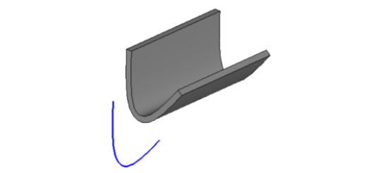

Базовые операции построения твердых тел
=======================================
-------------------------------------------
### [MbSolid – твердое тело](#title_1)

### [Элементарные твердые тела](#title_2)

### [Построение тел выдавливания](#title_3)

### [Построение тел вращения](#title_4)

### [Заключение](#title_5)
-------------------------------------------

[]Основным назначением геометрического ядра C3D является построение математических моделей твердых тел и выполнение операций с этими моделями. В предыдущих работах рассматривались способы построения кривых и поверхностей в двумерном и трехмерном пространстве. Кривые и поверхности в C3D представляются с использованием параметрических уравнений. Такие уравнения удобны для вычисления точек, принадлежащих геометрическим объектам, а также характеристик кривых и поверхностей в этих точках (например, векторов нормали). В отличие от рассмотренных в предыдущих работах кривых и поверхностей, большинство твердых тел не удается представить с помощью одного математического уравнения. Поэтому в C3D твердые тела, по сравнению с кривыми и поверхностями, представляются в виде более сложных объектов – эти объекты являются составными.  
[]В C3D для построения твердых тел применяется подход на основе граничного представления (B-Rep), наиболее распространенный в области систем САПР и компьютерной графики. В рамках этого подхода форма моделируемого трехмерного объекта представляется в виде набора фрагментов поверхностей, которые стыкуются друг с другом вдоль прямолинейных и криволинейных фрагментов кривых. Такие фрагменты поверхностей называются гранями, а фрагменты кривых – ребрами. Состыкованные друг с другом грани совместно представляют составную граничную поверхность. Она отделяет внутренний объем моделируемого объекта от остальной части пространства. Ядро C3D содержит набор операций, позволяющих построить граничную поверхность моделируемого объекта без явного указания фрагментов поверхностей и формы ребер.  
[]В данной работе рассматриваются основные операции твердотельного моделирования: построение элементарных твердых тел (эти операции уже упоминались в Главе 1), построение тел выдавливания и вращения. Названия этих операций напоминают соответствующие операции построения поверхностей (см. работу №5), но результат выполнения оказывается другим – в данном случае ядро C3D формирует модель твердого тела в виде объекта класса [MbSolid](doc::/MbSolid). Этот класс является основным для представления твердотельных моделей. Класс [MbSolid](doc::/MbSolid) унаследован от класса [MbItem](doc::/MbItem) «Объект геометрической модели» и содержит в себе журнал построения – перечень операций ядра, которые приводят к построению твердого тела. В этом состоит важное отличие от объектов кривых и поверхностей. В классах кривых и поверхностей ядро C3D хранит параметры математических уравнений, а в журнале построения – перечень операций ядра и их параметры. Для получения модели твердого тела ядро выполняет операции согласно этому журналу. Перечень и типы параметров у различных операций могут отличаться. В частности, в качестве параметров могут использоваться и кривые, и поверхности. Более сложные операции построения твердых тел, а также действия с ними, будут рассматриваться в следующих работах.  

### <a name="title_1"> [MbSolid](doc::/MbSolid) – твердое тело </a>
-------------------------------------------
[]Применительно к операциям твердотельного моделирования в C3D (и в области граничного моделирования B-Rep в целом) используется ряд специфических терминов. Далее эти термины перечислены с указанием соответствующих классов C3D. Подробное рассмотрение и поясняющие иллюстрации читатель может найти в книге: *Голованов Н.Н. Геометрическое моделирование. М.: ИНФРА-М, 2016.*  
[]***Грань*** (класс [MbFace](doc::/MbFace)) – фрагмент некоторой поверхности, которой приписано направление нормали. Указание направления нормали очень важно, поскольку это направление используется для различения двух сторон грани – внешней и внутренней. Внешней стороной грани считается та, на которую наблюдатель смотрит навстречу нормали грани. Обратная сторона грани называется внутренней.  
[]***Ребро*** (класс [MbEdge](doc::/MbEdge)) – фрагмент некоторой кривой, которой приписано направление. Часто встречается случай, когда ребра являются прямолинейными (отрезками). Но, в общем случае, ребра могут быть фрагментами любых кривых без самопересечений. У ребра есть признак направления, который принимает положительное значение, если ребро считается направленным вдоль кривой, или отрицательное направление, если ребро направлено против кривой.  
[]Фрагменты поверхностей, представляющих грани, ограничены граничными кривыми граней. По этим граничным кривым грани стыкуются друг с другом, и именно эти кривые используются для построения ребер. Грани могут быть замкнутыми (например, как боковая поверхность цилиндрического тела). В таком случае у грани есть граничная кривая, по которой грань стыкуется сама с собой. Такой фрагмент граничной кривой и построенное на нем ребро, по которому грань стыкуется сама с собой, называется ___швом___.<br>
[]***Вершина*** (класс [MbVertex](doc::/MbVertex)) – точка, в которой стыкуются два или более ребер.  
[]***Цикл грани*** (класс [MbLoop](doc::/MbLoop)) – последовательность ребер, описывающая некоторую границу грани. Цикл грани всегда замкнут и направлен так, чтобы грань всегда находилась бы слева от наблюдателя при его движении вдоль цикла с внешней стороны грани. У грани может быть несколько циклов. Например, у прямоугольной грани с одним круговым отверстием циклов будет два – один соответствует внешней границе, другой – границе внутреннего отверстия. При построении и обработке моделей тел с помощью функций ядра C3D направление циклов и ребер вычисляется автоматически.  
[]***Оболочка*** (класс [MbFaceShell](doc::/MbFaceShell)) – поверхность в виде набора граней, стыкующихся друг с другом по общим ребрам.  

  
**Рис. 1.** Фрагмент диаграммы классов, на которой показаны отношения наследования для класса [MbSolid](doc::/MbSolid) «Твердое тело».

[]Для представления твердых тел в C3D предназначен класс [MbSolid](doc::/MbSolid) (заголовочный файл [solid.h](doc::/solid.h)). Диаграмма наследования для этого класса показана на рис. 1.  Операции построения твердых тел аналогичны методам создания поверхностей: создание элементарных тел по заданным вершинам, создание тел выдавливания, вращения,  заметания (кинематическая операция), построение по плоским сечениям.  На диаграмме классов на рис. 1 обратите внимание на то, что класс [MbSolid](doc::/MbSolid) унаследован от абстрактного класса [MbItem](doc::/MbItem). [MbItem](doc::/MbItem) является базовым классом для объектов геометрической модели C3D. Эти объекты представляют понятия, расширенные по сравнению с математическими понятиями, за счет хранения параметров (свойств), необходимых для выполнения вычислительных геометрических операций, а также операций отображения и расчетной обработки. Эти возможности обеспечиваются как реализацией класса [MbItem](doc::/MbItem), так и за счет наследования от служебных классов C3D – [MbTransactions](doc::/MbTransactions), [MbAttributeContainer](doc::/MbAttributeContainer) и [MbSyncItem](doc::/MbSyncItem). Особенно важным является наследование от класса [MbTransactions](doc::/MbTransactions). Журнал построения геометрического объекта в C3D является внутренним представлением перечня операций построения.  Этот журнал напоминает дерево построения, которое отображается в явном виде в большинстве систем САПР при работе пользователя с трехмерными твердотельными моделями. В C3D в журнале построения операции хранятся в виде объектов классов, унаследованных от [MbCreator](doc::/MbCreator). Эти классы, представляющие операции построения, называются «строителями объектов геометрической модели», или, кратко – «строителями».  
[]Еще раз отметим, что в ядре C3D геометрические объекты (например, рассматривавшиеся в предыдущих работах кривые и поверхности) и объекты геометрической модели – различные понятия. У геометрических моделей журнала построения нет. На рис. 1 обратите внимание на то, что класс [MbItem](doc::/MbItem) унаследован от класса геометрического объекта  в трехмерном пространстве [MbSpaceItem](doc::/MbSpaceItem). Это обеспечивает выполнение с твердыми телами операций,  предусмотренных в ядре для трехмерных геометрических объектов.  
[]В объектно-ориентированном программировании понятия предметной области представляются в виде классов. Кроме отношения наследования, между классами (и, соответственно, между соответствующими понятиями предметной области), могут быть определены и другие отношения. Кроме наследования (а, пожалуй, и чаще, чем наследование), между классами используется отношение агрегации (по-другому также называется композицией). Наследование позволяет выразить на языке программирования отношение между общим понятием и его  частными случаями, а агрегация – отношение между целым (составным) понятием и его составными частями. Разнотипные отношения между классами можно отображать как на одной диаграмме, так и на нескольких – в зависимости от удобства представления. Для упрощения диаграмм классов отношения наследования и агрегации для класса [MbSolid](doc::/MbSolid) в данном разделе приведены на отдельных диаграммах на рис. 1 и рис. 2.  
[]На рис. 2 соединительные линии с ромбом обозначают, что объект одного класса является частью другого.  Ромбом отмечается составной объект. Если объект некоторого класса входит в состав другого в единственном экземпляре, то на другом конце соединительной линии отметок  не делается. Если количество однотипных составных частей может быть произвольным, на диаграмме делается отметка «n», если количество частей заранее известно – оно указывается явно, например, «2». На диаграмме на рис. 2 около соединительных линий указаны имена атрибутов классов, в виде которых в C3D представлены соответствующие объекты. Например,  можно увидеть, что класс [MbSolid](doc::/MbSolid) содержит одну оболочку [MbFaceShell](doc::/MbFaceShell) в виде объекта с именем outer. Оболочка содержит множество граней [MbFace](doc::/MbFace) в виде массива faceSet (то, что faceSet – массив, на диаграмме явно не указано). Массивы объектов, которые являются частями составных объектов, в C3D обычно хранятся массивов класса [RPArray](doc::/RPArray). Детали, касающиеся способов хранения частей составных объектов, а также внутренние имена соответствующих атрибутов, относятся к реализации ядра и для работы с ним явно не используются. На диаграмме на рис. 2 (а также в документации по C3D) эта информация приводится для того, чтобы помочь пользователю сориентироваться в интерфейсе программирования ядра (например, чтобы определить, посредством какой цепочки вызовов можно получить доступ к тем или иным элементам твердого тела [MbSolid](doc::/MbSolid) или какого-либо другого составного объекта).  
[]На рис. 2 можно заметить, что на диаграмме агрегации отсутствует класс [MbEdge](doc::/MbEdge) «Ребро». Этот класс является абстрактным. От него унаследован класс [MbCurveEdge](doc::/MbCurveEdge) «Ребро грани». От него, в свою очередь, для добавления признака ориентации унаследован класс [MbOrientedEdge](doc::/MbOrientedEdge) «Ориентированное ребро». Циклы грани [MbLoop](doc::/MbLoop) (множества ребер [MbOrientedEdge](doc::/MbOrientedEdge)) хранятся внутри класса [MbFace](doc::/MbFace) «Грань» совместно с поверхностью грани в виде объекта класса [MbSurface](doc::/MbSurface).  

  
**Рис. 2.** Диаграмма классов, на которой показаны отношения агрегации для класса [MbSolid](doc::/MbSolid) «Твердое тело».

[]Ниже, в примере 1, приведен фрагмент интерфейса класса [MbSolid](doc::/MbSolid). Существенная часть возможностей класса [MbSolid](doc::/MbSolid) обеспечивается за счет наследования от [MbItem](doc::/MbItem), [MbSpaceItem](doc::/MbSpaceItem) и [MbTransactions](doc::/MbTransactions) (рис. 1). Также в интерфейсе класса [MbSolid](doc::/MbSolid) имеется новый раздел, реализующий функции, специфические для твердого тела. Например, в этом разделе предусмотрены методы для получения составных частей геометрической модели твердого тела – граней и ребер (они показаны на рис. 2).  

**Пример 1. Фрагмент интерфейса класса [MbSolid](doc::/MbSolid) «Твердое тело» (рис. 1, 2).**

```cpp
class MATH_CLASS MbSolid : public MbItem {
// ...
public :
//КОНСТРУКТОРЫ
explicit MbSolid(MbFaceShell* shell, MbCreator* creator);
explicit MbSolid(MbFaceShell& shell, MbCreator& creator);
MbSolid(MbFaceShell& shell, RPArray<MbCreator>& creators, bool sameCreators, MbRegDuplicate* iReg);
MbSolid(MbFaceShell& shell, std::vector<SPtr<MbCreator>>& creators, bool sameCreators, MbRegDuplicate* iReg);
MbSolid(MbFaceShell& shell, const MbSolid& solid, MbCreator& creator);
MbSolid(MbFaceShel & shell, const MbSolid& solid, MbCreator* creator);
virtual ~MbSolid();
 
public :
// ОБЩИЕ ФУНКЦИИ ГЕОМЕТРИЧЕСКОГО ОБЪЕКТА В ТРЕХМЕРНОМ ПРОСТРАНСТВЕ
// (Эти методы унаследованы от MbSpaceItem через MbItem.)
virtual MbeSpaceType IsA() const; // Получение типа геометрического объекта
// Создание копии геометрического объекта
virtual MbSpaceItem & Duplicate(MbRegDuplicate* iReg = NULL) const;
// Выполнение геометрического преобразования, заданного в виде матрицы
virtual void Transform(const MbMatrix3D&, MbRegTransform* iReg = NULL);
// Сдвиг на заданный вектор
virtual void Move(const MbVector3D&, MbRegTransform* iReg = NULL);
// Вращение вокруг заданной оси на заданный угол
virtual void Rotate(const MbAxis3D&, double angle, MbRegTransform* iReg = NULL);
// Проверка объектов на равенство
virtual bool IsSame(const MbSpaceItem& init) const;
// Проверка подобия объектов (можно ли один приравнять другому?)
virtual bool IsSimilar(const MbSpaceItem& init) const;
// Сделать объекты равными
virtual bool SetEqual (const MbSpaceItem & init);
// Вычислить расстояние до точки
virtual double DistanceToPoint(const MbCartPoint3D &) const;
// Добавить габарит данного твердого тела в габаритный куб
virtual void AddYourGabaritTo(MbCube&) const;
// Построить полигональную копию твердого тела
virtual void CalculateWire(double sag, MbMesh& mesh) const;
// Создание нового свойства
virtual MbProperty& CreateProperty(MbePrompt n) const;
// Получение свойств твердого тела
virtual void GetProperties(MbProperties& properties);
// Задание значений свойств твердого тела
virtual void SetProperties(const MbProperties& properties);
// Получить базовые объекты
virtual void GetBasisItems(RPArray<MbSpaceItem>& s);
// Получить контрольные точки
virtual void GetBasisPoints(MbControlData3D&) const;
// Изменить объект по контрольным точкам
virtual void SetBasisPoints(const MbControlData3D&);
// Перестроить твердое тело по журналу построения
virtual bool RebuildItem(MbeCopyMode copyMode, RPArray<MbSpaceItem>* items, IProgressIndicator* progInd);
// Достроить тело для последней невыполненной операции в журнале построения
virtual bool FinishItem();
// Построить полигональный объект – упрощенный вариант данного твердого тела
virtual MbItem* CreateMesh(const MbStepData& stepData, const MbFormNote& note, MbRegDuplicate* iReg) const;

// ФУНКЦИИ ТВЕРДОГО ТЕЛА
// Рассчитать габаритный куб твердого тела
virtual bool CalculateGabarit(MbCube& cube) const;
// Добавить строители твердого тела в присланный массив creators
virtual bool GetCreators(RPArray<MbCreator>& creators) const;
// Заменить оболочку тела на присланную
void SetShell(MbFaceShell* shell);
// Отсоединить оболочку
MbFaceShell* DetachShell();
// Получить оболочку
MbFaceShell* GetShell() const;
// Проверить, была ли построена оболочка?
bool IsShellBuild() const;
// Переустановить в ребрах указатели на соединяемые ими грани
void MakeRight();
// Проверить, корректно ли установлены в ребра указатели на соединяемые ими грани?
bool IsRight() const;
// Получить количество граней
size_t GetFacesCount() const;
// Получить вершины тела
void GetVertices(RPArray<MbVertex>&) const;
// Получить ориентированные ребра тела
void GetEdges(RPArray<MbCurveEdge>&) const;
// Получить вершины и ребра тела
void GetItems(RPArray<MbVertex>&, RPArray<MbCurveEdge>&) const;
// Получить грани тела
void GetFaces(RPArray<MbFace>&) const;
// Получить составные части тела - вершины, ребра и грани
void GetItems(RPArray<MbTopologyItem>&) const;
// Получить вершину по её номеру
MbVertex* GetVertex(size_t index) const;
// Получить ребро по его номеру
MbCurveEdge* GetEdge(size_t index) const;
// Получить грань по её номеру
MbFace* GetFace(size_t index) const;
// Получить номер вершины
size_t GetVertexIndex(const MbVertex&) const;
// Получить номер ребра
size_t GetEdgeIndex(const MbCurveEdge&) const;
// Получить номер грани
size_t GetFaceIndex(const MbFace&) const;
// Получить количество связных оболочек тела
size_t GetShellCount() const;
// ...
```

[]В интерфейсе класса [MbSolid](doc::/MbSolid) есть набор конструкторов, позволяющих выполнять явное построение твердых тел на основе оболочек, других твердых тел и строителей. Как и в случае поверхностей, для построения твердых тел обычно удобнее использовать не конструкторы, а функции-утилиты, выполняющие все необходимые действия, а также проверку ошибок построения. Подробнее эти функции будут рассматривать далее. Одна из них используется в примере 2, который демонстрирует доступ к составным частям твердого тела. Результат выполнения примера 2 показан на рис. 3. Граням четырехгранной пирамиды с квадратным основанием назначены различные цвета. Для выполняется изменение цветового атрибута каждой грани.  

  
**Рис. 3.** Твердотельная модель пирамиды с гранями, которым назначены различные цветовые атрибуты (пример 2).

**Пример 2.  Построение твердого тела и изменение цветовых атрибутов граней (рис. 3).**

```cpp
#include "action_solid.h"
#include <vector>

using namespace c3d;
using namespace std;

// Вспомогательная функция для построения элементарного тела – симметричной пирамиды с квадратным основанием.
// Основание пирамиды лежит в плоскости XZ мировой СК.
// Входные параметры: baseSize - размер стороны основания, height - высота пирамиды.
// Выходные параметры: Указатель на динамически созданный объект геометрической модели - твердое тело
MbSolid* CreatePyramid( const double baseSize, const double height )
{
    // Именователь граней «по умолчанию»
    MbSNameMaker names(1, MbSNameMaker::i_SideNone, 0);
    // Указатель на строящееся твердое тело
    MbSolid* pSolid = nullptr;
    // Массив точек для построения пирамиды - 4 точки основания и вершина
    vector<MbCartPoint3D> vecVerts = {{ 0, 0, 0}, {baseSize, 0, 0},
    {baseSize, 0, baseSize}, {0, 0, baseSize}, {baseSize/2, height, baseSize/2}};
    SArray<MbCartPoint3D> arrVerts(vecVerts);
    // Вызов функции-утилиты для построения элементарного тела – пирамиды
    ::ElementarySolid(arrVerts, et_Pyramid, names, pSolid);
    return pSolid;
}

bool run()
{
    // Построение пирамиды с помощью вспомогательной функции
    // Длина стороны основания
    const double PYR_BASE = 50.0;
    // Высота пирамиды
    const double PYR_HEIGHT = 100.0;
    MbSolid* pPyr = CreatePyramid(PYR_BASE, PYR_HEIGHT);

    // Изменение цветовых атрибутов граней
    if(pPyr)
    {
        // Массив цветов для назначения граням пирамиды
        vector<COLORREF> arrColors = {RGB(0xFF, 0, 0), RGB(0, 0xFF, 0), RGB(0, 0, 0xFF), RGB(0xFF, 0xFF, 0), RGB(0xFF, 0, 0xFF)};
        // Перебор всех граней твердого тела
        const size_t faceCnt = pPyr->GetFacesCount();
        for (size_t faceIdx = 0; faceIdx < faceCnt; faceIdx++)
        {
      // Получение указателя на очередную грань с индексом faceIdx
            MbFace* pFace = pPyr->GetFace(faceIdx);

            // Назначение цветового атрибута очередной грани
            if(pFace)
                if(faceIdx < arrColors.size())
                    pFace->SetColor(arrColors[faceIdx]);
        }
    }
    // Отображение построенного тела
    if(pPyr)
        show(pPyr);
    // Уменьшение счетчика ссылок динамически созданного объекта ядра
    ::DeleteItem(pPyr);

    return true;
}
```
<button id="code_block_1"></button>

[]В примере 3 демонстрируется выполнение вычислительной операции с помощью класса оболочки [MbShell](doc::/MbShell). На рис. 4 показана пирамида, построенная аналогично примеру 2. Вокруг пирамиды размещены 4 точки – они получены перемещением середин сторон основания вертикально вверх на половину высоты пирамиды. Эти исходные точки спроецированы на грани пирамиды.  Полученные проекции на рис. 4 также отображаются в виде точек. Исходные точки и их проекции соединены отрезками. Для вычисления проекции трехмерной точки на грань твердого тела используется метод класса «Оболочка»  [MbFaceShell::DistanceToBound](doc::/DistanceToBound). Этот метод возвращает объект класса [MbPntLoc](doc::/MbPntLoc), в котором хранятся данные о вычисленной проекции исходной точки на ближайшую грань оболочки, а также числовой код типа [MbeItemLocation](doc::/MbeItemLocation), характеризующий расположение исходной точки относительно оболочки (возможные варианты – снаружи, на оболочке или внутри).  

  
**Рис. 4.** Пример выполнения вычислительной операции с использованием
класса «Оболочка твердого тела»: проецирование трехмерных точек на грани
пирамиды (пример 3).

**Пример 3. Доступ к элементам твердого тела и использование методов класса «Оболочка» [MbFaceShell](doc::/MbFaceShell) (рис. 4).**

```cpp
bool run()
{
    // Построение пирамиды с помощью вспомогательной функции CreatePyramid, использовавшейся в примере 2.
    const double PYR_BASE = 50.0; // Длина стороны основания
    const double PYR_HEIGHT = 100.0; // Высота пирамиды
    MbSolid* pPyr = CreatePyramid(PYR_BASE, PYR_HEIGHT);
    if(!pPyr)
        return false;

    // Отображение твердого тела - пирамиды
    show(pPyr);

    // Доступ к оболочке твердого тела
    MbFaceShell* pShell = pPyr->GetShell();
    if(!pShell)
        return false;

    // Координаты четырех исходных точек снаружи пирамиды (выбраны произвольно, в данном примере эти точки построены как середины сторон основания, поднятые на половину высоты пирамиды.)
    vector<MbCartPoint3D> vecPntsSrc =
    {
        {PYR_BASE/2, PYR_HEIGHT/2, 0}, 
        {PYR_BASE, PYR_HEIGHT/2, PYR_BASE/2},
        {0, PYR_HEIGHT/2, PYR_BASE/2}, 
        {PYR_BASE/2, PYR_HEIGHT/2, PYR_BASE} 
    };
    // Вычисление трехмерных точек - проекций исходных точек на грани пирамиды.
    vector<MbCartPoint3D> vecPntsProj;
    const size_t pntSrcCnt = vecPntsSrc.size();

    for (size_t i = 0; i < pntSrcCnt; i++)
    {
        // Вызов метода класса "Оболочка" для проецирования трехмерной точки на оболочку твердого тела.
        // Метод MbFaceShell::DistanceToBound возвращает данные о проекции точки на ближайщую грань оболочки и информацию о расположении точки относительно оболочки.
        MbPntLoc finFaceData;
        MbeItemLocation rShell;

        bool bProjOK = pShell->DistanceToBound(vecPntsSrc[i], EPSILON, finFaceData, rShell);

        // В случае, если проекция точки vecPntsSrc[i] успешно вычислена, в массив vecPntsProj помещаются трехмерные координаты этой проекции в мировой СК.
        if(bProjOK)
            vecPntsProj.push_back(finFaceData.GetPoint());
    }

    // Отображение исходных точек, их проекций и проецирующих отрезков.
    if (vecPntsSrc.size() == vecPntsProj.size())
    {
        // Исходные точки и их проекции будут отображаться в виде объекта "Точечный каркас"
        MbPointFrame* pPntFrame = new MbPointFrame;
        for (int i = 0; i<pntSrcCnt; i++)
        {
            // Исходные точки отображаются красным цветом.
            // Поскольку исходные точки и их проекции добавляются в точечный каркас по очереди, то очередная пара точек будет храниться в каркасе с индексами (2*i, 2*i+1).
            pPntFrame->AddVertex(vecPntsSrc[i]);
            pPntFrame->GetVertex(2*i)->SetColor(RGB(0xFF, 0, 0));
            pPntFrame->GetVertex(2*i)->SetWidth(10);

            // Проекции исходных точек отображаются зеленым цветом.
            pPntFrame->AddVertex(vecPntsProj[i]);
            pPntFrame->GetVertex(2*i+1)->SetColor(RGB(0, 0xFF, 0));
            pPntFrame->GetVertex(2*i+1)->SetWidth(10);

            // Отображение проецирующего отрезка для i-й пары точек.
            // Отрезки отображаются фиолетовым цветом, линией толщиной 3.
            MbLineSegment3D* pSeg = new MbLineSegment3D(vecPntsSrc[i], vecPntsProj[i]);
            Style segStyle(3, RGB(0xFF, 0, 0xFF));
            show(segStyle, pSeg);
        }
 
        // Отображение точечного каркаса
        show(pPntFrame);
    }

    // Уменьшение счетчика ссылок динамически созданного объекта ядра
    ::DeleteItem(pPyr); 

    return true;
} 
```
<button id="code_block_2"></button>

### Задания(1)
-------------
1. Выполните пример 3. Попробуйте изменить параметры размеров пирамиды и убедитесь в корректном построении модели. Увеличьте количество исходных точек для проецирования на оболочку пирамиды – в массив исходных точек поместите координаты 20 точек, равномерно распределенных по окружности вокруг пирамиды на половине ее высоты и еще одну точку, расположенную над ее вершиной.
2. Удалите у пирамиды из примера 2 три грани и отобразите получившееся твердое тело. Для построения получите оболочку твердого тела и произведите удаление граней с помощью метода [MbFaceShell](doc::/MbFaceShell)::DeleteFace(size_t index), где index – индекс удаляемой грани. После удаления грани с некоторым индексом этот индекс будет соответствовать грани, следующей за удаленной. Поэтому в данной задаче можно произвести трехкратное удаление грани с нулевым индексом. Для того, чтобы избежать неоднозначности при вызове нескольких вариантов метода [MbFaceShell](doc::/MbFaceShell)::DeleteFace, явно выберите вызываемый метод посредством указания типа его параметра:

```cpp
    pShell->DeleteFace((size_t)0);
```	

3. Отобразите в тестовом приложении ребра пирамиды, построенной с помощью функции CreatePyramid из примера 2. Все ребра этого твердого тела постройте в виде криволинейных отрезков толщиной 5. Для получения ребер можно использовать метод [MbSolid](doc::/MbSolid)::GetEdge. Этот метод для корректных ребер возвращает указатели на объекты класса p. Перебирайте все ребра тела, увеличивая индекс ребра до тех пор, пока этот метод не вернет нулевой указатель. Чтобы получить трехмерную кривую, на которой построено ребро, используйте метод [MbCurveEdge](doc::/MbCurveEdge)::GetCurve. Вызовы для отображения очередного ребра pEdge (предполагается, что это указатель [MbCurveEdge](doc::/MbCurveEdge)* pEdge) могут выглядеть следующим образом:

```cpp
    MbCurve3D* pCurve = (MbCurve3D*)(&pEdge->GetCurve()); 
    show(Style(5, LIGHTRED), pCurve);
```

### <a name="title_2"> []()Элементарные твердые тела </a>
-----------------------------
[]При построении твердотельных моделей класс [MbSolid](doc::/MbSolid) обычно используется в сочетании с дополнительными средствами – классами-строителями, функциями-утилитами и функциями геометрических операций. Во фрагменте интерфейса [MbSolid](doc::/MbSolid), показанном в примере 1, можно заметить, что у конструкторов класса [MbSolid](doc::/MbSolid) есть параметры класса [MbCreator](doc::/MbCreator). Это абстрактный базовый класс-строитель, от которого наследуются классы для реализации различных операций построения объектов геометрической модели. Для построения оболочек элементарных твердых тел в C3D предназначен класс-строитель [MbElementarySolid](doc::/MbElementarySolid) (рис. 5).  
[]Строитель [MbElementarySolid](doc::/MbElementarySolid) выполняет построение порядка 10 различных оболочек тел, которые в C3D относятся к элементарным. Тип оболочки для построения указывается в конструкторе [MbElementarySolid](doc::/MbElementarySolid) в виде кода типа элементарного тела. От типа тела для построения зависит количество передаваемых опорных точек и их геометрический смысл. Допустимые значения типов элементарных тел и количество опорных точек приведены в таблице 1. Конструктор [MbElementarySolid](doc::/MbElementarySolid) имеет следующий прототип:  

```cpp
MbElementarySolid::MbElementarySolid(
           const Points& points,          // Опорные точки
           ElementaryShellType solidType, // Тип элементарного тела
           const MbSNameMaker& names );   // Именователь операции
```

  
**Рис. 5.** Диаграмма классов для класса-строителя оболочек элементарных твердых тел [MbElementarySolid](doc::/MbElementarySolid). На этой диаграмме показаны два вида отношений между классами – наследование и агрегация.

**Таблица 1.** Разновидности элементарных твердых тел

| № | Тип тела | код типа оболочки [solidType](doc::/solidType) |Количество опорныз точек для построения|
| :------------- | :------------- | :------------- | :------------- |
| 1. | Шар | [et_Sphere](doc::/et_Sphere) | 3 точки |
| 2. | Тор | [et_Torus](doc::/et_Torus) | 3 точки |
| 3. | Цилиндр | [et_Cylinder](doc::/et_Cylinder) | 3 точки |
| 4. | Конус | [et_Cone](doc::/et_Cone) | 3 точки |
| 5. | Блок | [et_Block](doc::/et_Block) | 4 точки |
| 6. | Клин | [et_Wedge](doc::/et_Wedge) | 4 точки |
| 7. | Призма | [et_Prism](doc::/et_Prism) | Количество вершин основания + 1 точка |
| 8. | Пирамида | [et_Pyramid](doc::/et_Pyramid) | Количество вершин основания + 1 точка |
| 9. | Плита с закругленными концами | [et_Plate](doc::/et_Pyramid) | 4 точки |

[]Координаты опорных точек при построении элементарных твердых тел передаются классу-строителю в виде массива трехмерных точек points. Точки в этом массиве имеют следующий смысл:  
1. points[0] задает начало локальной системы координат.
2. Для шара, тора, цилиндра и конуса:  
Положение points[1] задает направление оси Z локальной СК.  
Положение points[2] задает направление оси X локальной СК.
3. Для блока, клина и плиты:  
points[1] задает направление оси X локальной СК.  
points[2] задает направление оси Y локальной СК. 

[]Таким образом, точки points[0], points[1] и points[2] определяют местоположение и ориентацию элементарного твердого тела. Но также они задают и размеры тела для построения.  Для этого используются следующие правила:  
1. points[1] определяет высоту цилиндра, высоту конуса, большой радиус тора, длину блока, длину клина, толщину плиты (для указания радиуса шара points[1] не используется).
2. points[2] определяет радиус цилиндра, радиус конуса, радиус шара, малый радиус тора, ширину блока, ширину клина, ширину плиты.
3. Последняя точка определяет высоту блока, клина, плиты, призмы, вершину пирамиды. 

[]Назначение параметров для построения элементарных тел напоминает параметры, используемые для построения элементарных поверхностей (Работа №4, «Основные типы поверхностей»).  
[]Использование класса-строителя для построения твердотельной модели цилиндра (рис. 6) показано в примере 4. Заголовочный файл для этого класса – [cr_elementary_solid.h](doc::/cr_elementary_solid.h).  

  
**Рис. 6.** Элементарное тело-цилиндр (примеры 4 и 5).

**Пример 4. Построение элементарного тела – цилиндра – с помощью явного использования класса-строителя оболочки (рис. 6).**

```cpp
#include "action_solid.h"
#include "cr_elementary_solid.h"
#include <vector>

using namespace c3d;
using namespace std;

bool run()
{
    // Именователь граней «по умолчанию»
    MbSNameMaker names(1, MbSNameMaker::i_SideNone, 0);

    // Массив опорных точек для построения цилиндра
    SArray<MbCartPoint3D> points(3);
    // Локальная СК цилиндра смещена на 50 единиц по оси Y мировой СК.
    points.Add(MbCartPoint3D(0, 50, 0));
    // Направление оси Z локальной СК совпадает с направлением
    // оси Z мировой СК, высота цилиндра равна 10 единицам.
    points.Add(MbCartPoint3D(0, 50, 10));
    // Направление оси X локальной СК совпадает с направлением оси X
    // мировой СК, радиус цилиндра равен 10 единицам.
    points.Add(MbCartPoint3D(10, 50, 0));

    // Создание объекта-строителя для построения оболочки элементарного тела – цилиндра
    MbElementarySolid* pCylCreator = new MbElementarySolid(points, et_Cylinder, names);
    // Построение оболочки цилиндра с помощью объекта-строителя
    MbFaceShell* pShell = nullptr;
    if(pCylCreator)
        pCylCreator->CreateShell(pShell, cm_Same);
    // Построение твердого тела
    MbSolid* pCyl = nullptr;
    if(pShell)
        pCyl = new MbSolid(pShell, pCylCreator);

    // Отображение построенного тела
    if(pCyl)
        show(pCyl);

    // Уменьшение счетчика ссылок динамически созданных объектов ядра
    ::DeleteItem(pCylCreator);
    ::DeleteItem(pShell);
    ::DeleteItem(pCyl); 

    return true;
}
```
<button id="code_block_3"></button>

[]При непосредственном вызове конструкторов классов в примере 4 потребовалось выполнить три действия:  
1. Создать объект-строитель класса [MbElementarySolid](doc::/MbElementarySolid).
2. Вызвать метод строителя [MbElementarySolid](doc::/MbElementarySolid)::CreateShell для построения оболочки.
3. Вызвать конструктор класса [MbSolid](doc::/MbSolid) и передать ему объект-строитель и оболочку, которую этот объект построил.  

[]При динамическом создании перечисленных выше объектов в примере 4 предусмотрена минимальная обработка ошибок – проверка значений указателей, возвращаемых при динамическом создании объектов с помощью оператора new.  
[]Для сокращения типичных последовательностей вызовов по созданию необходимых объектов-строителей и оболочек, в C3D есть набор функций-утилит, упрощающих построение твердых тел. В частности, элементарные тела можно строить с помощью функции-утилиты ::ElementarySolid (заголовочный файл [action_solid.h](doc::/action_solid.h)). Эта функция уже использовалась ранее в примерах 2 и 3 для построения пирамиды.  
[]Прототип этой функции приведен ниже:  

```cpp
    MbResultType ElementarySolid(const SArray<MbCartPoint3D>& points, ElementaryShellType solidType, const MbSNameMaker & names, MbSolid *& result);
```

[]Первые три входных параметра аналогичны параметрам конструктора классастроителя [MbElementarySolid](doc::/MbElementarySolid). Последний выходной параметр result служит для получения построенного твердого тела. В случае успешного построения функция возвращает значение rt_Success, в случае ошибки – одно из значений типа [MbResultType](doc::/MbResultType) (анализ этого значения позволяет уточнить причину ошибки). Использование функции-утилиты для построения цилиндра показано в примере 5.  

**Пример 5. Построение элементарного твердого тела с использованием функции-утилиты ::ElementarySolid (рис. 6).**

```cpp
bool run()
{
    // Именователь граней «по умолчанию»
    MbSNameMaker names(1, MbSNameMaker::i_SideNone, 0);

    // Массив опорных точек для построения цилиндра
    SArray<MbCartPoint3D> points(3);
    // Локальная СК цилиндра смещена на 50 единиц по оси Y мировой СК
    points.Add(MbCartPoint3D(0, 50, 0));
    // Направление оси Z локальной СК совпадает с направлением
    // оси Z мировой СК, высота цилиндра равна 10 единицам
    points.Add(MbCartPoint3D(0, 50, 10));
    // Направление оси X локальной СК совпадает с направлением оси X
    // мировой СК, радиус цилиндра равен 10 единицам
    points.Add(MbCartPoint3D(10, 50, 0));

    // Построение элементарного тела – цилиндра - по трем точкам
    MbSolid* pCyl = nullptr;
    ::ElementarySolid(points, et_Cylinder, names, pCyl);

    // Отображение построенного тела
    if(pCyl)
        show(pCyl);

    // Уменьшение счетчика ссылок динамически созданного объекта ядра
    ::DeleteItem(pCyl);

    return true;
}
```
<button id="code_block_4"></button>

### Задания(2)
-------------
1. В руководстве разработчика ядра C3D (находится в файле C3D_Manual_Russian.pdf,  который входит в комплект поставки ядра) ознакомьтесь с разделом М.1.1. «Построение элементарного тела». В нем представлены иллюстрации, поясняющие геометрический смысл опорных точек, используемых для построения различных элементарных тел.
2. В документации по ядру C3D найдите раздел «Модуль геометрического моделирования\Методы геометрических построений\Построение тел». Просмотрите перечень функций-утилит, перечисленных в этом разделе. Они реализуют различные способы построения твердых тел посредством неявного использования соответствующих классов-строителей. Наборы параметров этих функций зависят от реализуемой операции.
3. Реализуйте функцию (например, можете назвать ее DrawVertsAndEdges) для отображения всех ребер и вершин произвольного твердого тела, которое должно передаваться в эту функцию в виде ссылки на объект класса [MbSolid](doc::/MbSolid). Примените эту функцию для отображения ребер и вершин цилиндра из примера 5. При решении этой задачи можно воспользоваться результатами из задания 1.3, в котором требовалось отобразить в тестовом приложении ребра пирамиды. Для отображения вершин используйте класс [MbPointFrame](doc/MbPointFrame) «Точечный каркас», а для перебора вершин твердого тела – метод [MbSolid](doc::/MbSolid)::GetVertex.
4. С помощью функции-утилиты ::ElementarySolid постройте элементарное тело-шар и отобразите ребра и вершины этого тела с помощью функции из предыдущего задания. Аналогичным образом постройте элементарные твердые тела других типов: клин, призму, плиту с закругленными концами.

### <a name="title_3"> []()Построение тел выдавливания </a>
-------------------------------
[]Для построения тел выдавливания применяется функция-утилита ::ExtrusionSolid из заголовочного файла [action_solid.h](doc::/action_solid.h). Эта функция пользуется классом-строителем [MbCurveExtrusionSolid](doc::/MbCurveExtrusionSolid).<br>
[]Функция ::ExtrusionSolid имеет довольно большое количество параметров. Прототип этой функции и параметры, разделенные по назначению на три группы, приведены ниже.  

```cpp
MbResultType ExtrusionSolid(
    const MbSweptData& sweptData,
    const MbVector3D& direction,
    const MbSolid* pSolid1, const MbSolid* pSolid2,
    bool checkIntersection,
    const ExtrusionValues& params,
    const MbSNameMaker& operNames,
    const PArray<MbSNameMaker>& contoursNames,
    MbSolid*& result );
```
[]Обязательные входные параметры функции:  
1. sweptData – данные об образующей кривой.
2. direction – вектор, определяющий направление выдавливания.
3. params – параметры операции выдавливания (в частности, значения глубины выдавливания в прямом и в обратном направлении).
4. operNames – именователь операции.
5. contoursNames – именователи сегментов образующего контура.

[]Необязательные входные параметры для ограничения глубины выдавливания до внешних тел:  
1. pSolid1 – ограничивающее тело в прямом направлении. Если оно задано, то выдавливание будет производиться в прямом направлении до ближайших граней этоготела.
2. pSolid2 – ограничивающее тело в обратном направлении. Если оно задано, то выдавливание будет производиться в обратном направлении до ближайших граней этого тела.
3. checkIntersection – если заданы тела pSolid1 и pSolid2, то данный флаг задает объединение тел pSolid1 и pSolid2 с проверкой пересечения.

[]Выходные данные:  
1. Возвращаемое значение – rt_Success в случае успешного построения или код результата операции типа MbResultType, поясняющий возникшую ошибку.
2. result – построенное твердое тело.
3. params – модифицированные параметры выдавливания, которые используются для построения элементов массива операций до поверхности.

[]Вызов функции-утилиты для построения тела выдавливания показан в примере 6. Построенное тело показано на рис. 7. Для построения образующей тела в виде массива контуров используется отдельная функция CreateSketch (такой подход уже применялся в работе №3 «Составные кривые и сплайны в двумерном пространстве»).  

  
**Рис. 7.** Тело выдавливания (6). Образующая (показана слева) задана в виде квадрата со скругленными углами. Выдавливание в прямом направлении производится на глубину вдвое большую, чем в обратном направлении. В прямом направлении задан угол уклона.

**Пример 6. Построение твердого тела выдавливания (рис. 7).**

</div>

```cpp
#include <vector>
#include "alg_curve_fillet.h"

using namespace std;
using namespace c3d;

// Вспомогательная функция для построения образующей в виде квадрата со скруглениями.
void CreateSketch(RPArray<MbContour>& _arrContours)
{
    // Создание массива точек квадрата, к которому в дальнейшем добавятся скругления.
    // Размер массива - 8 точек для учета точек четырех сегментов скруглений.
    SArray<MbCartPoint> arrPnts(8);
    arrPnts.Add(MbCartPoint(0,  0));
    arrPnts.Add(MbCartPoint(50, 0));
    arrPnts.Add(MbCartPoint(50, 50));
    arrPnts.Add(MbCartPoint(0,  50));

    // Построение единой ломаной внешнего контура по точкам
    MbPolyline* pPolyline = new MbPolyline(arrPnts, true);
    MbContour* pContourPolyline = nullptr;

    // Задание скругления с использованием функции FilletPolyContour
    ::FilletPolyContour(pPolyline, 5, false, arrPnts[4], pContourPolyline);

    // Задание индексов точек, в которых будет задаваться скругление с учетом
    // добавления новой точки при скруглении с использованием функции FilletTwoSegments
    ptrdiff_t idxSideRight1 = 0;
    ptrdiff_t idxSideRight2 = 2;
    ptrdiff_t idxSideRight3 = 4;

    // Добавление скруглений
    pContourPolyline->FilletTwoSegments(idxSideRight1, 5);
    pContourPolyline->FilletTwoSegments(idxSideRight2, 5);
    pContourPolyline->FilletTwoSegments(idxSideRight3, 5);

    _arrContours.push_back(pContourPolyline);
}

bool run()
{
    // Локальная СК (по умолчанию совпадает с мировой СК)
    MbPlacement3D pl;

    // Создание образующей для тела выдавливания
    RPArray<MbContour> arrContours;
    CreateSketch(arrContours);

    // Отображение образующей (в плоскости XY глобальной СК)
    for (int i = 0; i<arrContours.size(); i++)
        show( Style(1, LIGHTRED), arrContours[i], &pl);

    // ПОСТРОЕНИЕ ТЕЛА ВЫДАВЛИВАНИЯ
    // Образующая размещается на плоскости XY глобальной СК.
    // Важное замечание: объект-плоскость должен создаваться динамически,
    // поскольку он продолжает использоваться в объекте-твердом теле после
    // выхода из данной функции.
    MbPlane* pPlaneXY = new MbPlane(MbCartPoint3D(0, 0, 0), MbCartPoint3D(1, 0, 0), MbCartPoint3D(0, 1, 0));
    // Объект, хранящий параметры образующей
    MbSweptData sweptData(*pPlaneXY, arrContours);
    // Направляющий вектор для операции выдавливания
    MbVector3D dir(0, 0, -1);

    // Параметры операции выдавливания, задающие свойства тела для построения в прямом и в обратном направлении вдоль (глубина выдавливания и уклон).
    const double HEIGHT_FORWARD = 60.0, HEIGHT_BACKWARD = 30.0;
    const double ANGLE_FORWARD_DEGREE = 15.0;
    ExtrusionValues extrusionParams(HEIGHT_FORWARD, HEIGHT_BACKWARD);
    // Указание уклона для выдавливания в прямом направлении
    extrusionParams.side1.rake = ANGLE_FORWARD_DEGREE * M_PI/180.0;

    // Именователи элементов модели твердого тела и контуров образующей
    MbSNameMaker operNames( 1, MbSNameMaker::i_SideNone, 0);
    PArray<MbSNameMaker> cNames(0, 1, false);

    // Вызов функции-утилиты для построения твердого тела выдавливания
    MbSolid* pSolid = nullptr;
    MbResultType res = ::ExtrusionSolid(sweptData, dir, nullptr, nullptr, false, extrusionParams, operNames, cNames, pSolid);

    // Отображение построенного тела
    if (res == rt_Success)
    {
        // Смещение тела по оси Z, чтобы при отображении оно не накладывалось на образующую
        pSolid->Move(MbVector3D(0, 0, -100));
        show(Style(1, LIGHTGRAY), pSolid);
    }

    // Уменьшение счетчиков ссылок динамически созданных объектов ядра
    ::DeleteItem( pSolid );

    return true;
}
```
<button id="code_block_5"></button>

[]В примере 6 в структуре параметров операции выдавливания extrusionParams были заданы значения глубины выдавливания и уклон в прямом направлении. Класс [ExtrusionValues](doc::/ExtrusionValues) унаследован от класса [SweptValuesAndSides](doc::/SweptValuesAndSides) «Параметры выдавливания или вращения». Среди этих параметров есть поверхности, ограничивающие выполнение операции построения в прямом и в обратном направлении. Эти поверхности можно задавать неявно, передавая ограничивающие твердые тела в виде необязательных входных параметров pSolid1 и pSolid2 функции ::ExtrusionSolid. Также можно указать такие поверхности явно в объекте [ExtrusionValues](doc::/ExtrusionValues). Этот способ демонстрируется в примере 7 для построения тела выдавливания, ограниченного в прямом направлении цилиндрической поверхностью (рис. 8). Образующая этого тела совпадает с образующей из примера 6.  

  
**Рис. 8.** Тело выдавливания (пример 7), ограниченное цилиндрической поверхностью. Результат построения показан при выключенном (слева) и включенном (справа) отображении ограничивающей поверхности.

**Пример 7. Построение тела выдавливания до пересечения с поверхностью (рис. 8).**

```cpp
bool run()
{
    // Локальная СК (по умолчанию совпадает с мировой СК)
    MbPlacement3D pl;

    // Вызов вспомогательной функции для построения образующей (из примера 6)
    RPArray<MbContour> arrContours;
    CreateSketch(arrContours);

    // Построение ограничивающей цилиндрической поверхности
    MbSurface* pCylSurf = nullptr;
    SArray<MbCartPoint3D> arrPnts(3);
    arrPnts.Add(MbCartPoint3D(-20, 25, -50));
    arrPnts.Add(MbCartPoint3D( 70, 25, -50));
    arrPnts.Add(MbCartPoint3D( 0,  55, -50));
    ::ElementarySurface(arrPnts[0], arrPnts[1], arrPnts[2], st_CylinderSurface, pCylSurf);

    // Отображение цилиндрической поверхности
    if (pCylSurf)
        show(Style(1, LIGHTBLUE), pCylSurf);

    // Формирование параметров образующей для операции построения тела выдавливания
    MbPlane* pPlaneXY = new MbPlane(MbCartPoint3D(0, 0, 0), MbCartPoint3D(1, 0, 0), MbCartPoint3D(0, 1, 0));
    MbSweptData sweptData(*pPlaneXY, arrContours);

    // Направляющий вектор для операции выдавливания
    MbVector3D dir(0, 0, -1);

    // Параметры операции выдавливания
    ExtrusionValues extrusionParam;
    // Задание поверхности, до которой будет выполняться выдавливание в прямом направлении
    extrusionParam.SetSurface1(pCylSurf);
    // Указание способа выдавливания в прямом направлении - до пересечения с поверхностью
    extrusionParam.side1.way = sw_surface;

    // Объекты для именования элементов модели твердого тела и контуров образующей
    MbSNameMaker operNames(1, MbSNameMaker::i_SideNone, 0);
    PArray<MbSNameMaker> cNames(0, 1, false);

    // Вызов функции-утилиты для построения тела выдавливания
    MbSolid* pSolid = nullptr;
    MbResultType res = ::ExtrusionSolid(sweptData, dir, nullptr, nullptr, false, extrusionParam, operNames, cNames, pSolid);
    // Отображение построенного тела
    if(res == rt_Success)
        show(Style(1, LIGHTGRAY), pSolid);

    // Уменьшение счетчиков ссылок динамических объектов ядра
    ::DeleteItem(pSolid);
    ::DeleteItem(pCylSurf);

    return true;
} 
```
<button id="code_block_6"></button>

[]За счет подбора вида образующей и параметров [ExtrusionValues](doc::/ExtrusionValues) можно строить большое количество разнообразных твердых тел. Образующая не обязательно должна быть одиночным плоским контуром и не обязательно должна быть замкнутой. Двумерный контур для построения тела выдавливания может располагаться как на плоской, так и на криволинейной поверхности. Если на одной поверхности расположено множество не пересекающихся двумерных контуров, то при построении тела выдавливания рассматриваемый метод определяет внешние контуры и вложенные в них внутренние контуры. Вложение контуров может быть многократным.  

### Задания(3)
-------------
1. Выполните примеры 6 и 7. С помощью функции из задания 2.3 отобразите ребра и вершины построенных тел.
2. Параметр [ExtrusionValues](doc::/ExtrusionValues)::thickness1 определяет толщину стенки наружу от образующей кривой, а [ExtrusionValues](doc::/ExtrusionValues)::thickness2 – внутрь. В примере 6 в параметрах выдавливания уберите угол уклона в прямом направлении и попробуйте построить тело из этого примера, задавая для него толщину стенки, равной 10 (сначала наружу, затем внутрь, а затем одновременно наружу и внутрь образующей).
3. Логический параметр [ExtrusionValues](doc::/ExtrusionValues)::shellClosed позволяет строить замкнутую (по умолчанию, значение true) или незамкнутую (значение false) оболочку. В исходном примере 6 (в исходном виде, без задания толщины стенки) попробуйте построить твердое
тело с незамкнутой оболочкой, указывая значение параметра:  extrusionParams.shellClosed = false;
4. Постройте тело выдавливания в виде прямоугольного параллелепипеда, ограниченного с двух сторон (в прямом и в обратном направлении выдавливания) сферическими поверхностями различных радиусов.
5. Согласно рис. 9 постройте образующие, состоящие из трех (рис. 9, слева) и четырех (рис. 9, справа) не пересекающихся контуров и выполните для них операцию выдавливания.

  
**Рис. 9.** Примеры образующих и построенных тел выдавливания для задания 3.4.

6. Постройте незамкнутый криволинейный контур, используя NURBS-объект, построенный по набору точек (см. работу №3, «Составные кривые и сплайны в двумерном пространстве») и примените к нему операцию выдавливания, указав некоторую толщину стенок. Для построения тела выдавливания по незамкнутому контуру значение параметра shellClosed должно быть ложным. Пример построенного тела выдавливания по незамкнутому контуру показан на рис. 10. Если функция ::ExtrusionSolid при попытке построения тела возвращает ошибку, то попробуйте уменьшить значение толщины стенок (чтобы в окрестности точек перегиба сплайна не происходило самопересечений твердого тела).

  
**Рис. 10.** Пример построенного тела для задания 3.6.


### <a name="title_4"> []()Построение тел вращения </a>
---------------------------
[]Наряду с телами выдавливания, тела вращения являются одними из наиболее часто встречающихся тел в геометрическом моделировании. Для построения тел вращения в C3D предназначена функция-утилита ::RevolutionSolid (заголовочный файл [action_solid.h](doc::/action_solid.h)), имеющая следующий прототип:  

```cpp
MbResultType RevolutionSolid(
    const MbSweptData& sweptData,
    const MbAxis3D& axis,
    RevolutionValues& params,
    const MbSNameMaker& names,
    PArray<MbSNameMaker>& contoursNames,
    MbSolid*& result);
```

[]Входные параметры функции (все являются обязательными):  
1. sweptData – данные об образующей кривой.
2. axis – ось вращения.
3. params – параметры операции вращения.
4. names – именователь операции.
5. contoursNames – именователи сегментов образующего контура.

[]Выходные данные:  
1. Возвращаемое значение – rt_Success в случае успешного построения или код результата операции типа [MbResultType](doc::/MbResultType), поясняющий возникшую ошибку.
2. result – построенное твердое тело.

[]Функции-утилиты для построения тел вращения и выдавливания имеют похожие прототипы. В них для описания образующей кривой используется один и тот же класс [MbSweptData](doc::/MbSweptData). Ось вращения задается параметром axis. Угол вращения для построения тела задается в конструкторе [RevolutionValues](doc::/RevolutionValues) и указывается в радианах.  
[]Класс [RevolutionValues](doc::/RevolutionValues) предназначен для хранения параметров операции вращения. Этот класс (как и класс [ExtrusionValues](doc::/ExtrusionValues)), унаследован от класса [SweptValuesAndSides](doc::/SweptValuesAndSides). Параметры замкнутости оболочки, толщины стенок тонкостенного тела вращения и ограничивающие поверхности можно задавать таким же образом, как это делалось выше для тел выдавливания.  
[]В примере 8 демонстрируется построение тела вращения (рис. 11) с использованием образующей из примера 6. Ось вращения параллельна оси Y мировой СК и получена переносом оси Y вдоль оси X на заданный вектор. В тексте примера 8 после создания объекта revParams содержатся несколько закомментированных строк, которые демонстрируют задание различных параметров операции вращения, влияющих на форму результирующего тела.  

**Пример 8. Построение тела вращения (рис. 9).**

```cpp
bool run()
{
    // Множитель для преобразования угловых значений из градусов в радианы
    const double DEG_TO_RAD = M_PI / 180.0;

    // Локальная СК (по умолчанию совпадает с мировой СК)
    MbPlacement3D pl;

    // Вызов функции для построения образующей (из примера 6)
    RPArray<MbContour> arrContours;
    CreateSketch(arrContours);

    // Отображение образующей (в плоскости XY глобальной СК)
    for (int i = 0; i<arrContours.size(); i++)
        show(Style(1, RGB(0, 0, 255)), arrContours[i], &pl);

    // Подготовка параметров для вызова функции построения тела вращения.
    // sweptData - объект, в котором хранятся сведения об образующей.
    MbPlane* pPlaneXY = new MbPlane(MbCartPoint3D(0, 0, 0), MbCartPoint3D(1, 0, 0), MbCartPoint3D(0, 1, 0));
    MbSweptData sweptData(*pPlaneXY, arrContours);

    // Объект параметров для операции построения тела вращения.
    // Первые два параметра конструктора задают углы вращения в прямом и обратном направлении (по нормали к образующей или противоположно этой нормали).
    // В данном примере вращение осуществляется на 120 градусов в прямом направлении.
    // Третий параметр задает форму топологии твердого тела.
    // При s = 0 строится тело с топологией сферы, при s = 1 - с топологией тора.
    // Если образующая - незамкнутая кривая, и ось вращения лежит в плоскости кривой, то при s = 0 при построении образующая будет автоматически продлена до оси вращения. 
    // В данном примере различий между значениями s нет, т.к. образующая имеет вид замкнутого контура.
    RevolutionValues revParms( 120*DEG_TO_RAD, 0, 0);

    // Следующая строка задает построение тела с незамкнутой оболочкой ("пустого").
    // revParms.shellClosed = false;
    // Задание толщины стенки тела
    // revParms.thickness1 = 8;

    // Именователи для операции построения тела вращения и для контуров образующей
    MbSNameMaker operNames( 1, MbSNameMaker::i_SideNone, 0);
    PArray<MbSNameMaker> cNames(0, 1, false);

    // Ось вращения для построения тела:
    // ось Y мировой СК смещается на -50 единиц вдоль оси X.
    MbAxis3D axis(pl.GetAxisY());
    axis.Move(MbVector3D(MbCartPoint3D(0, 0, 0), MbCartPoint3D(-50, 0, 0)));

    // Вызов функции-утилиты для построения твердого тела вращения
    MbSolid* pSolid = nullptr;
    MbResultType res = ::RevolutionSolid(sweptData, axis, revParms, operNames, cNames, pSolid);

    // Отображение построенного тела
    if(res == rt_Success)
        show(Style(1, LIGHTGRAY), pSolid);

    // Уменьшение счетчиков ссылок динамических объектов ядра
    ::DeleteItem(pSolid);

    return true;
}
```
<button id="code_block_7"></button>

  
**Рис. 11.** Тела вращения, полученные с помощью примера 8 (Слева – параметры операции задаются только в конструкторе RevolutionValues; в центре – revParms.shellClosed = false; справа – shellClosed = true, thickness1 = 8).

[]Тело вращения можно получить, выполняя вращение до заданной ограничивающей поверхности. Ограничивающая поверхность может быть задана для одного или для двух направлений вращения. В примере 9 показано построение тела вращения (рис. 12) с использованием цилиндрической ограничивающей поверхности для вращения в прямом направлении. Ограничивающая поверхность и способ ее использования задается с помощью класса [RevolutionValues](doc::/RevolutionValues).  

**Пример 9. Построение тела вращения до ограничивающей поверхности (рис. 12).**

```cpp
bool run()
{
    // Множитель для преобразования угловых значений из градусов в радианы
    const double DEG_TO_RAD = M_PI / 180.0;

    // Локальная СК (по умолчанию совпадает с мировой СК)
    MbPlacement3D pl;

    // Вызов функции для построения образующей (из примера 6)
    RPArray<MbContour> arrContours;
    CreateSketch(arrContours);

    // Построение ограничивающей цилиндрической поверхности
    MbSurface* pCylSurf = nullptr;
    SArray<MbCartPoint3D> arrPnts(3);
    arrPnts.Add(MbCartPoint3D(-50, -25, -75));
    arrPnts.Add(MbCartPoint3D(-50,  75, -75));
    arrPnts.Add(MbCartPoint3D(-20, -25, -75));
    ::ElementarySurface(arrPnts[0], arrPnts[1], arrPnts[2], st_CylinderSurface, pCylSurf);

    // Отображение ограничивающей поверхности
    if(pCylSurf)
        show(Style(1, LIGHTBLUE), pCylSurf);

    // Подготовка параметров для вызова функции построения тела вращения.
    // sweptData - объект, в котором хранятся сведения об образующей.
    MbPlane* pPlaneXY = new MbPlane(MbCartPoint3D(0, 0, 0), MbCartPoint3D(1, 0, 0), MbCartPoint3D(0, 1, 0));
    MbSweptData sweptData(*pPlaneXY, arrContours);

    // Объект параметров для операции построения тела вращения.
    RevolutionValues revParms;
    // Указание поверхности, то которой будет выполняться вращение в прямом направлении.
    revParms.SetSurface1(pCylSurf);
    // Указание способа выполнения операции вращения в прямом направлении – до пересечения с поверхностью.
    revParms.side1.way = sw_surface;

    // Именователи для операции построения тела вращения и для контуров образующей
    MbSNameMaker operNames( 1, MbSNameMaker::i_SideNone, 0);
    PArray<MbSNameMaker> cNames(0, 1, false);

    // Ось вращения для построения тела:
    // ось Y мировой СК смещается на -50 единиц вдоль оси X.
    MbAxis3D axis(pl.GetAxisY());
    axis.Move(MbVector3D(MbCartPoint3D(0, 0, 0), MbCartPoint3D(-50, 0, 0)));

    // Вызов функции-утилиты для построения твердого тела вращения
    MbSolid* pSolid = nullptr;
    MbResultType res = ::RevolutionSolid(sweptData, axis, revParms, operNames, cNames, pSolid);

    // Отображение построенного тела
    if(res == rt_Success)
        show(Style(1, LIGHTGRAY), pSolid);

    // Уменьшение счетчиков ссылок динамических объектов ядра
    ::DeleteItem(pCylSurf);
    ::DeleteItem(pSolid);

    return true;
}
```
<button id="code_block_8"></button>

  
**Рис. 12.** Тело вращения (пример 9), ограниченное цилиндрической поверхностью. Результат построения показан при включенном (слева) и выключенном (справа) отображении ограничивающей поверхности.          

### Задания(4)
-------------
1. С использованием образующей из задания 3.5 постройте тела вращения, показанные на рис. 13. Операция построения тел вращения, как и операция построения тел выдавливания, автоматически классифицирует непересекающиеся контуры на внутренние и внешние. Подберите значения параметров [RevolutionValues](doc::/RevolutionValues) так, чтобы построенные тела были похожи на тела на рис. 13.

  
**Рис. 13.** Образцы тел вращения для задания 4.1.

2. Постройте тонкостенное тело вращения с использованием незамкнутой криволинейной образующей из задания 3.6. Для построения тела вращения с образующей в виде незамкнутого контура значение параметра shellClosed должно быть истинным.  


**Рис. 14.** Образец тела вращения для задания 4.2.

3. При построении тела вращения, полученного в задании 4.2, для одного из направлений вращения укажите ограничивающую сферическую поверхность.

### <a name="title_5"> []()Заключение </a>
--------------
[]В работе был рассмотрен ряд вопросов, связанных с построением моделей твердых тел с помощью геометрического ядра C3D. Основным классом для представления твердых тел является класс [MbSolid](doc::/MbSolid) «Твердое тело». Этот класс унаследован от абстрактного класса [MbItem](doc::/MbItem) «Объект геометрической модели».  
[]Характерная особенность объектов геометрической модели состоит в том, что в этих объектах хранится журнал построения. Этот журнал реализуется с помощью класса [MbTransactions](doc::/MbTransactions) (это один из родительских классов [MbItem](doc::/MbItem)). В журнале хранятся сведения об операциях ядра, которые необходимо выполнить для построения твердого тела. Эти операции представляются в виде объектов классов-строителей, унаследованных от абстрактного класса [MbCreator](doc::/MbCreator). Можно заметить существенное усложнение программного представления твердых тел по сравнению с геометрическими объектами наподобие кривых и поверхностей, рассматривавшихся в предыдущих работах.  
[]Для построения твердых тел обычно используются функции-утилиты, реализующие различные операции построения и выполняющие проверку ошибок построения. В работе рассматриваются три функции такого типа: *::ElementarySolid* для построения элементарных тел, *::ExtrusionSolid* для тел выдавливания и *::RevolutionSolid* для тел вращения. Параметры операций построения задаются с помощью параметров этих функций, а также с помощью объектов классов, специфических для конкретной операции. В работе демонстрируется влияние некоторых из параметров построения на вид результирующего тела (например, построение сплошных и «пустых» тел, построение тонкостенных тел, построение тел, ограниченных заданными поверхностями).  