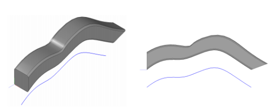
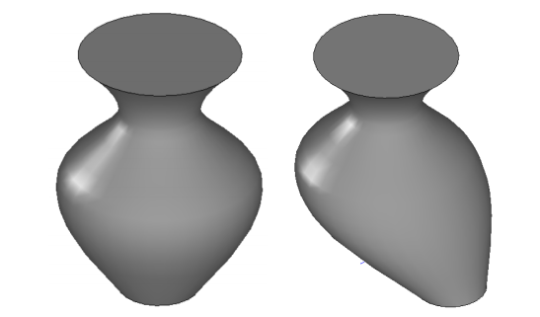

Операции построения твердых тел произвольной формы
==================================================
-------------------------------------------
### [Тело заметания](#title_1)
### [Построение тела по сечениям](#title_2)
### [Заключение](#title_3)
-------------------------------------------

[]В предыдущей работе рассматривались простейшие способы построения твердотельных моделей: построение элементарных тел, тел выдавливания и вращения. Кроме этих операций, часто применяются операции построения кинематических тел и построение тел по поперечным сечениям. Похожие операции для построения поверхностей рассматривались в работе №5 «Построение поверхностей движения».  
[]Кинематические тела образуются в результате движения некоторого контура (образующей кривой) по заданной траектории, которая описывается с помощью направляющей кривой. Результирующее тело представляет собой объем, заполняемый («заметаемый») образующей кривой в процессе движения направляющей. Поэтому кинематические тела также называются телами заметания. Рассмотренные в предыдущей работе тела выдавливания и вращения являются частными случаями тел заметания. В случае тела выдавливания направляющая кривая представляет собой прямолинейный отрезок, а в случае тела вращения – дугу окружности или окружность.  
[]Хотя тела заметания и позволяют получить твердотельные модели более сложной формы по сравнению с телами выдавливания и вращения, но они также не универсальны. Тела заметания удобны для моделирования тел с постоянным сечением – как сплошных, так и тонкостенных. В случае, если сечение тела непостоянно, может использоваться операция построения тела по поперечным сечениям. Подбирая количество сечений, их местоположение и форму, можно добиться требуемой точности представления моделируемого тела. Критерий удовлетворительности представления, как правило, зависит от особенностей решаемой задачи. Например, для иллюстративных целей качество моделирования может оцениваться визуально, а при построении промышленных моделей – на основе численных значений геометрических свойств.  
[]По мере повышения универсальности методов построения тел – тела выдавливания, тела вращения, тела заметания и тела, построенные по сечениям – интерфейс соответствующих функций C3D становится более сложным, чтобы учесть возрастающее количество возможных параметров. Но общая структура прототипов функций и назначение параметров остаются похожими для всех операций построения твердых тел.  
[]На практике даже наиболее общие операции построения твердых тел обычно не позволяют получить требуемую геометрическую модель посредством одной операции. Для этого могут потребоваться не только базовые операции твердотельного моделирования, но и булевы операции комбинирования твердых тел (рассматриваются в работе №8, а также специализированные операции (например, построение фасок и скруглений, работа №10).  

### <a name="title_1"> []()Тело заметания </a>
------------------
[]**Тело заметания** – тело, построенное путем движения образующей кривой по направляющей кривой. В качестве направляющей кривой может быть задана произвольная кривая. Образующая кривая задается в виде набора контуров, которые не должны пересекаться друг с другом. В простейшем случае контур может быть всего один, но допустимо указание и некоторого набора контуров, каждый из которых является некоторой замкнутой кривой. Такая возможность может потребоваться, например, для построения модели тела с профилированными отверстиями или тела, состоящего из нескольких частей.  
[]В C3D для построения тел заметания используется функция-утилита ::EvolutionSolid (заголовочный файл [action_solid.h](doc::/action_solid.h)). Эта функция сохраняет в журнале построения тела объект-строитель [MbCurveEvolutionSolid](doc::/MbCurveEvolutionSolid). Прототип функции построения тела заметания имеет вид:  

```cpp
MbResultType EvolutionSolid(
    const MbSweptData& sweptData,
    const MbCurve3D& spine,
    const EvolutionValues& params,
    const MbSNameMaker& operNames,
    const PArray<MbSNameMaker>& contoursNames,
    const MbSNameMaker& spineNames,
    MbSolid*& result); 
```

[]Входные параметры функции:  
1. sweptData – данные об образующей кривой.
2. spine – данные о направляющей кривой.
3. params – параметры операции.
4. operNames – именователь операции.
5. contoursNames – именователи сегментов образующего контура.
6. spineNames – именователь направляюще.

[]Выходные данные:  
1. Возвращаемое значение – rt_Success в случае успешного построения или код результата 
операции типа [MbResultType](doc::/MbResultType), поясняющий возникшую ошибку.
2. result – построенное твердое тело.

[]Образующая кривая sweptData описывается с помощью класса [MbSweptData](doc::/MbSweptData). У этого класса есть несколько конструкторов, позволяющих задавать контуры в составе образующей различными способами – на плоскости, в трехмерном пространстве, на заданной поверхности.  
[]Параметры операции params представлены в виде объекта класса [EvolutionValues](doc::/EvolutionValues). Этот класс унаследован от SweptValues и за счет такого наследования получает атрибуты [thickness1](doc::/thickness1), [thickness2](doc::/thickness2) и [shellClosed](doc::/shellClosed). Атрибуты [thickness1](doc::/thickness1) и [thickness2](doc::/thickness2) позволяют задать толщину стенки при построении тонкостенного тела заметания в двух направлениях – внутрь и наружу от образующей кривой. Атрибут [shellClosed](doc::/shellClosed) является признаком замкнутости получаемого тела. Класс [EvolutionValues](doc::/EvolutionValues) также содержит собственные атрибуты. Атрибут [EvolutionValues::parallel](doc::/parallel) задает свойства движения образующей кривой вдоль направляющей. Возможны три варианта:  
- [parallel](doc::/parallel) = 0 – образующая кривая движется посредством параллельного переноса;
- [parallel](doc::/parallel) = 1 – образующая кривая движется с сохранением исходного угла относительно направляющей;
- [parallel](doc::/parallel) = 2 – образующая кривая движется с сохранением перпендикулярности направляющей.  

[]В примере 1 демонстрируется построение тела заметания с использованием различных вариантов движения образующей вдоль направляющей. Направляющая задается в виде трехмерного NURBS-сплайна 4-го порядка, а образующая – в виде квадрата со скругленными углами, как в примере 6 из работы №6.  

**Пример 1. Построение тела заметания посредством движения одного замкнутого контура вдоль NURBS-кривой (рис. 1-3).**

```cpp
#include <vector>
#include "alg_curve_fillet.h"
#include "cur_nurbs3d.h"
#include "action_solid.h"

using namespace std;
using namespace c3d;

// Вспомогательная функция для построения образующей кривой
void CreateSketch(RPArray<MbContour>& _arrContours)
{
    // Содержимое этой функции из примера 6 "Построение твердого тела выдавливания" из работы №6.  
}

bool run()
{
    // Локальная СК (по умолчанию совпадает с мировой СК)
    MbPlacement3D pl;

    // Массив контрольных точек для построения NURBS-сплайна
    vector<MbCartPoint3D> vecPnts = 
    {
    {25, 0,   0}, 
    {25, 40, -50}, 
    {25, 10, -100},
    {25, 80, -200}, 
    {25, 30, -250}, 
    {25, 0,  -300}
    };
    SArray<MbCartPoint3D> arrPnts(vecPnts);
    // Построение направляющей кривой в виде незамкнутого NURBS-сплайна 4-го порядка по контрольным точкам
    MbNurbs3D* pSpline = MbNurbs3D::Create(4, arrPnts, false);

    // Описание образующей кривой в виде плоского контура на плоскости XY мировой СК
    MbPlane* pPlaneXY = new MbPlane(MbCartPoint3D(0, 0, 0), MbCartPoint3D(1, 0, 0), MbCartPoint3D(0, 1, 0));

    // Построение образующей кривой с помощью вспомогательной функции CreateSketch
    RPArray<MbContour> arrContours;
    CreateSketch(arrContours);
    MbSweptData sweptData(*pPlaneXY, arrContours);

    // Объект с параметрами операции построения тела заметания
    EvolutionValues params;
    // Вариант плоскопараллельного движения образующей вдоль направляющей
    params.parallel = 0;

    // Служебные объекты-именователи для вызова геометрической операции
    MbSNameMaker operNames(ct_CurveEvolutionSolid, MbSNameMaker::i_SideNone, 0);
    MbSNameMaker cNames(ct_CurveSweptSolid, MbSNameMaker::i_SideNone, 0);
    PArray<MbSNameMaker> contourNames(1, 0, false);
    contourNames.Add(&cNames);
    MbSNameMaker splineNames(ct_CurveSweptSolid, MbSNameMaker::i_SideNone, 0);

    // Вызов операции построения тела заметания
    MbSolid* pSolid = nullptr;
    MbResultType res = ::EvolutionSolid(sweptData, *pSpline, params, operNames, contourNames, splineNames, pSolid);

    // Отображение построенного тела
    if(res == rt_Success)
        show(Style(1, LIGHTGRAY), pSolid);

    // Отображение направляющей кривой со смещением вдоль оси Y (в целях отображения,
    // чтобы отображаемая кривая была смещена от поверхности тела).
    pSpline->Move(MbVector3D(MbCartPoint3D(0, 0, 0), MbCartPoint3D(0, -50, 0)));
    show(Style(3, RGB(0, 0, 255)), pSpline);

    // Уменьшение счетчиков ссылок объектов ядра
    ::DeleteItem(pSolid);
    ::DeleteItem(pPlaneXY);
    ::DeleteItem(pSpline);

    return true;
}
```

<button id="code_block_1"></button>

  
**Рис. 1.** Пример построения тела заметания с помощью примера 1 при указании варианта плоскопараллельного движения образующей [parallel](doc::/parallel) = 0. Слева модель отображена в ориентации «Изометрия», справа – в ориентации «Вид справа».

  
**Рис. 2.** Пример построения тела заметания с помощью примера 1 при указании варианта движения образующей с сохранением исходного угла [parallel](doc::/parallel) = 1.

  
**Рис. 3.** Пример построения тела заметания с помощью примера 1 при указании варианта ортогонального движения образующей [parallel](doc::/parallel) = 2.

[]На рис. 1-3 можно заметить влияние параметра [EvolutionValues::parallel](doc::/parallel) на форму получаемого тела заметания. Хорошо заметно, как значение этого параметра связано с начальным и конечным положением образующей. Однако заранее представить форму результирующего тела заметания может оказаться непросто. Например, на рис. 2 при [parallel](doc::/parallel) = 1 образующая сохраняет постоянный угол относительно направляющей и на расстоянии примерно трети габаритного размера наблюдается особенность построения – сужение сечения тела заметания. Это связано с изменением пространственного положения образующей кривой – вданном случае она не только параллельно смещается, но и вращается вокруг оси Х своей локальной системы координат. Из этого примера можно заключить, что форма получаемого тела может весьма существенно зависеть от формы направляющей кривой и способа движения образующей. В целом, чем сильнее меняется наклон направляющей кривой, тем в большей степени может меняться сечение результирующего тела заметания в тех областях, в которых образующая в процессе движения вращается с сильно изменяющейся скоростью.  
[]Все тела, показанные на рис. 1-3, являются замкнутыми. Для построения тела с незамкнутой оболочкой можно указать параметр [shellClosed](doc::/shellClosed) = false. Результат показан на рис. 4. Незамкнутое тело напоминает тонкостенное со стенкой нулевой толщины – в некотором смысле, это «боковая поверхность» тела заметания.  

  
**Рис. 4.** Тело заметания при плоскопараллельном движении образующей [parallel](doc::/parallel) = 0. Слева показано замкнутое тело заметания. Это тело совпадает с рис. 1 и строится по умолчанию (значение params.shellClosed = true). Cправа показано незамкнутое тело, полученное при явном указании shellClosed = false.

[]На рис. 5 демонстрируются варианты построения тел заметания с использованием образующей кривой в виде двух концентрических окружностей. Соответствующая функция для построения образующей показана в примере 2. Функцию CreateSketch из этого примера можно использовать совместно с примером 1. На рис. 5 можно заметить, что при построении сплошного тела функция [EvolutionSolid](doc::/EvolutionSolid) классифицировала один контур как внешний, а другой – как внутренний. При построении тонкостенного тела было получено результирующее тело, состоящее из двух замкнутых частей.  

**Пример 2. Функция для построения образующей в виде двух концентрических окружностей (рис. 5).**

```cpp
// Вспомогательная функция для построения образующей кривой (для примера 1)
void CreateSketch(RPArray<MbContour>& _arrContours)
{
    // Построение образующей в виде двух концентрических окружностей
    const double RAD_EXT = 35.0; // Радиус внешней окружности
    const double RAD_INT = 15.0; // Радиус внутренней окружности

    MbArc* pCircleExt = new MbArc(MbCartPoint(0,0), RAD_EXT);
    MbArc* pCircleInt = new MbArc(MbCartPoint(0,0), RAD_INT);

    _arrContours.push_back(new MbContour(*pCircleExt, true));
    _arrContours.push_back(new MbContour(*pCircleInt, true));
}
```

<button id="code_block_2"></button>

  
**Рис. 5.** Тело заметания с плоскопараллельным движением ([parallel](doc::/parallel) = 0) образующей в виде двух концентрических окружностей (пример 2). (Слева) Сплошное тело (построение по умолчанию). (Справа) Тонкостенное тело ([thickness1](doc::/thickness1) = 5, [thickness2](doc::/thickness2) = 0) состоит из двух частей.

[]Тело заметания из нескольких частей можно получить не только в результате построения тонкостенных тел по образующим из вложенных контуров, но и посредством явного указания образующей в виде нескольких непересекающихся контуров. В примере 3 показана функция построения образующей в виде четырех непересекающихся окружностей с центрами, расположенными в вершинах квадрата. Соответствующее тело заметания показано на рис. 6.  

**Пример 3. Функция для построения образующей в виде четырех непересекающихся окружностей (рис. 6).**

```cpp
// Вспомогательная функция для построения образующей кривой (для примера 1)
void CreateSketch(RPArray<MbContour>& _arrContours)
{
    // Построение образующей в виде четырех непересекающихся окружностей, радиусом RAD, центры которых лежат в вершинах квадрата со стороной SIDE.
    const double RAD = 30.0;
    const double SIDE = 100.0;

    MbArc* pCircle1 = new MbArc(MbCartPoint(0,    0),    RAD);
    MbArc* pCircle2 = new MbArc(MbCartPoint(SIDE, 0),    RAD);
    MbArc* pCircle3 = new MbArc(MbCartPoint(SIDE, SIDE), RAD);
    MbArc* pCircle4 = new MbArc(MbCartPoint(0,    SIDE), RAD);

    _arrContours.push_back(new MbContour(*pCircle1, true));
    _arrContours.push_back(new MbContour(*pCircle2, true));
    _arrContours.push_back(new MbContour(*pCircle3, true));
    _arrContours.push_back(new MbContour(*pCircle4, true));
}
```

<button id="code_block_3"></button>

  
**Рис. 6.** Тело заметания из четырех частей с образующей из примера 3 (образующая движется плоскопараллельно, [parallel](doc::/parallel) = 0).

### Задания(1)
-------------
[]1. Постройте тело заметания с направляющей кривой в виде NURBS-сплайна пятого порядка, проходящего через следующие контрольные пять контрольных точек:  
[](0, 0, 0); (0, -2, -16); (0, -15, -20); (0, -22.5, -30); (0, -15, -40).  
[]В качестве образующей используйте окружность радиусом 3. Постройте несколько вариантов тела заметания с различными вариантами движения образующей при различных значениях параметра [parallel](doc::/parallel)) и с различными значениями параметров [thickness1](doc::/thickness1) и [thickness2](doc::/thickness2). На рис. 7 приведены примеры полученных тел заметания при значениях параметра [parallel](doc::/parallel) = 0, 1, 2.  

  
**Рис. 7.** Тела заметания для задания 1.1.

2. При рассмотрении примера 2 (рис. 5) было показано, что функция EvolutionSolid, как и функции построения тел выдавливания и тел вращения, самостоятельно разделяет составной контур на внутренние и внешние сегменты в том случае, когда контур образующей содержит набор непересекающихся кривых. Постройте тела заметания, показанные на рис. 8. Образующие этих тел представляют собой комбинацию образующей из примера 1 и нескольких окружностей.

  
**Рис. 8.** Тела заметания для задания 1.2.

[]В качестве направляющей кривой используйте NURBS-сплайн четвертого порядка, проходящий через следующие контрольные точки:  
[](25, 0, 0); (25, 30, 40); (25, -30, 70); (25, 0, 100).  
[]Для плоскопараллельного движения образующей примите значение параметра [parallel](doc::/parallel) = 0.  
3. Постройте тело заметания, напоминающее пружину круглого сечения, со спиральной направляющей при parallel = 1 (рис. 9). Для представления направляющей используйте класс [MbConeSpiral](doc::/MbConeSpiral). Ось спирали направлена (по умолчанию) вдоль оси Z глобальной СК. Образующая в виде окружности лежит в плоскости XZ мировой СК, а ее центр совпадает с начальной точкой спиральной кривой. Вычислить начальную точку спиральной кривой можно с помощью метода [MbConeSpiral](doc::/MbConeSpiral)::PointOn при значении параметра t = 0. Расположение образующей показано в увеличенном виде в правой части рис. 9.

  
**Рис. 9.** Тела заметания для задания 1.3.

### <a name="title_2"> []()Построение тела по сечениям </a>
-------------------------------
[]Операция построения твердых тел по набору сечений позволяет строить тела произвольной формы. Посредством увеличения количества сечений можно повышать точность приближенного представления требуемой геометрической модели. При выполнении этой операции вычисляется поверхность, проходящая через все заданные поперечные сечения тела. В ядре C3D операция построения тела по сечениям выполняется с помощью функции-утилиты LoftedSolid (как и все ранее рассмотренные операции построения твердых тел, она описана в заголовочном файле [action_solid.h](doc::/action_solid.h)). Прототип функции LoftedSolid имеет структуру, напоминающую рассмотренные ранее операции построения твердых тел. В эту функцию в качестве параметров надо передать описание образующей, параметры операции и объекты-именователи. Образующей для данной операции служит массив поперченых сечений тела. В качестве результата возвращается числовой код и построенное твердое тело.  

```cpp
MbResultType LoftedSolid(
    RPArray<MbSurface>& surfs,
    RPArray<MbContour>& contours,
    const MbCurve3D* spine,
    const LoftedValues& params,
    RPArray<MbCurve3D>* guideCurves,
    SArray<MbCartPoint3D>* points,
    const MbSNameMaker& names,
    RPArray<MbSNameMaker>& namesContours,
    MbSolid*& result);
```

[]Обязательные входные параметры функции:  
1. surfs – массив поверхностей, задающих расположение поперечных сечений contours.
2. contours – массив поперечных сечений – контуров образующей кривой (каждому контуру в этом массиве должна соответствовать поверхность в массиве surfs).
3. params – параметры операции.
4. names – именователь граней.
5. namesContours – именователь контуров образующей кривой.

[]Необязательные входные параметры, обеспечивающие дополнительные способы управления формой получаемого тела:  
1. spine – направляющая кривая.
2. guideCurves – множество направляющих кривых, задающих траектории точек points контуров contours.
3. points – массив контрольных точек, позволяющих управлять стыковкой кривых, проходящих через множество контуров. Каждая точка в этом массиве соответствует контуру с таким же индексом в массиве contours и поверхности в массиве surfs.

[]Выходные данные:  
1. Возвращаемое значение – rt_Success в случае успешного построения или код результата операции типа [MbResultType](doc::/MbResultType), поясняющий возникшую ошибку.
2. result – построенное твердое тело.

[]В примере 4 демонстрируется использование функции LoftedSolid для построения тела по четырем плоским сечениям (рис. 10). В качестве сечений используются окружности, а результирующее тело имеет вид тела вращения. При изменении положения центра одной или нескольких окружностей-сечений (т.е. элементов массива arrCenters во вспомогательной функции CreateSketch) форма тела будет изменяться.  

**Пример 4. Построение тела по сечениям (рис. 10).**

```cpp 
#include "action_solid.h"

using namespace c3d;

// Вспомогательная функция для построения образующей в виде четырех окружностей.
// В качестве результата возвращается массив поверхностей – плоскостей (на которых лежат окружности) и массив окружностей.
void CreateSketch( RPArray<MbSurface>& _arrPlanes, RPArray<MbContour>& _arrCircles )
{
    // Радиусы четырех окружностей
    const int CIRCLES_CNT = 4;
    const double RAD[] = {20, 50, 20, 40};

    // Центры окружностей в локальных СК соответствующих плоскостей.
    // Хотя координаты всех центров совпадают, они представлены в виде массива для того, чтобы их можно было легко изменить.
    const MbCartPoint arrCenters[CIRCLES_CNT] = {
    MbCartPoint(0, 0), MbCartPoint(0, 0), MbCartPoint(0, 0), MbCartPoint(0, 0)
    };

    // Двумерные кривые - окружности с центром в точке centerArc
    MbArc* pArc2D[CIRCLES_CNT] = { nullptr };
    for(int i = 0; i < CIRCLES_CNT; i++ )
        pArc2D[i] = new MbArc(arrCenters[i], RAD[i]);

    // Системы координат, задающие положение плоскостей окружностей в пространстве.
    // 0-я окружность располагается в плоскости XZ мировой СК, плоскости для остальных окружностей располагаются выше плоскости XZ.
    MbPlacement3D plArc[CIRCLES_CNT] = 
    {
    MbPlacement3D(MbCartPoint3D(0,0,0), MbCartPoint3D(1,0,0),  MbCartPoint3D(0,0,1)),
    MbPlacement3D(MbCartPoint3D(0,60,0), MbCartPoint3D(1,60,0),  MbCartPoint3D(0,60, 1)),
    MbPlacement3D(MbCartPoint3D(0,100,0), MbCartPoint3D(1,100,0),  MbCartPoint3D(0,100,1)),
    MbPlacement3D(MbCartPoint3D(0,130,0), MbCartPoint3D(1,130,0),  MbCartPoint3D(0,130,1))
    };

    // Поверхности - плоскости, содержащие окружности.
    // Положение плоскостей задается локальными системами координат plArc.
    MbSurface* pPlanes[CIRCLES_CNT] = {nullptr};
    for(int i = 0; i < CIRCLES_CNT; i++)
        pPlanes[i] = new MbPlane(plArc[i]);

    // Сохранение плоскостей и окружностей (в виде контуров) в возвращаемых массивах.
    for (int i = 0; i < CIRCLES_CNT; i++ )
    {
        _arrCircles.push_back(new MbContour(*pArc2D[i], true));
        _arrPlanes.push_back(pPlanes[i]);
    }

    // Уменьшение счетчиков ссылок объектов ядра
    for (int i = 0; i < CIRCLES_CNT; i++ )
    ::DeleteItem(pArc2D[i]);
}

bool run()
{
    // Получение образующей в виде массивов поверхностей и контуров на них с помощью вспомогательной функции.
    RPArray<MbSurface> arrSurfaces;
    RPArray<MbContour> arrContours;
    CreateSketch(arrSurfaces, arrContours);

    // Объект с параметрами операции заметания.
    LoftedValues params;

    // Объекты для именования элементов модели твердого тела.
    MbSNameMaker names(ct_CurveLoftedSolid, MbSNameMaker::i_SideNone, 0);
    PArray<MbSNameMaker> contourNames(0, 1, false);

    // Построение твердого тела заметания
    MbSolid* pSolid = nullptr;
    MbResultType res = ::LoftedSolid(arrSurfaces, arrContours, nullptr, params, nullptr, nullptr, names, contourNames, pSolid);
    
    // Отображение построенного тела
    if(res == rt_Success)
        show(Style(1, LIGHTGRAY), pSolid);

    // Уменьшение счетчика ссылок тела
    ::DeleteItem(pSolid);

    return true;
}
```

<button id="code_block_4"></button>

  
**Рис. 10.** Тела, построенные по сечениям с помощью примера 4 (Слева) Тело вращения, полученное для случая, когда центры всех сечений лежат на одной оси (имеют одинаковые координаты (0, 0) в своих локальных СК). (Справа) Тело, полученное при смещении центра 0-й окружности-сечения в точку (50, 0) на соответствующей плоскости сечения.

[]В случае, если контуры сечений содержат неодинаковое количество сегментов, то функция LoftedSolid производит автоматическое разбиение контуров для получения равного количества сегментов в них. В примере 5 показана функция построения образующей CreateSketch, которую можно использовать совместно с примером 4 (в качестве замены соответствующей функции). В примере 5 в качестве сечений для построения тела задаются окружность, квадрат и треугольник. Результирующее тело показано на рис. 10. Управлять положением ребер, соединяющих вершины разных контуров-сечений, можно с помощью с помощью массива контрольных точек points.  

**Пример 5. Построение тела при различном числе сегментов в плоских контурах.**

```cpp
// Вспомогательная функция для построения образующей в виде набора из трех сечений - окружности, квадрата и треугольника.
void CreateSketch(RPArray<MbSurface>& _arrSurfaces, RPArray<MbContour>& _arrContours)
{
 // Первое сечение - окружность - лежит в плоскости XZ мировой СК.
    const MbCartPoint circleCenter(0, 0);
    const double CIRCLE_RAD = 50;
    MbArc* pArc2D = new MbArc(circleCenter, CIRCLE_RAD);
    MbPlacement3D plCircle(MbCartPoint3D(0, 0, 0), MbCartPoint3D(1, 0, 0), MbCartPoint3D(0, 0, 1));
    MbSurface* pSurfCircle = new MbPlane(plCircle);
    MbContour* pContourArc = new MbContour(*pArc2D, true);

    // Второе сечение - квадрат - лежит в плоскости, параллельной XZ, смещенной на 50 единиц по оси Y мировой СК.
    const double SQUARE_SIDE = 50;
    const double SQUARE_OFS_Y = 50;
    SArray<MbCartPoint> arrSqVerts(4);
    arrSqVerts.Add(MbCartPoint(-SQUARE_SIDE/2, -SQUARE_SIDE/2));
    arrSqVerts.Add(MbCartPoint(-SQUARE_SIDE/2,  SQUARE_SIDE/2));
    arrSqVerts.Add(MbCartPoint( SQUARE_SIDE/2,  SQUARE_SIDE/2));
    arrSqVerts.Add(MbCartPoint( SQUARE_SIDE/2, -SQUARE_SIDE/2));
    MbPolyline* pSquarePoly = new MbPolyline(arrSqVerts, true);
    MbPlacement3D plSquare(MbCartPoint3D(0, SQUARE_OFS_Y, 0), MbCartPoint3D(1, SQUARE_OFS_Y, 0), MbCartPoint3D(0, SQUARE_OFS_Y, 1));
    MbSurface* pSurfSquare = new MbPlane(plSquare);
    MbContour* pContourSquare = new MbContour(*pSquarePoly, true);

    // Третье сечение - треугольник - лежит в плоскости, параллельной XZ, смещенной на 100 единиц по оси Y мировой СК.
    const double TRIANGLE_SIDE = 70;
    const double TRIANGLE_OFS_Y = 100;
    SArray<MbCartPoint> arrTrVerts(3);
    arrTrVerts.Add(MbCartPoint(-TRIANGLE_SIDE/2, -20));
    arrTrVerts.Add(MbCartPoint(0, 60));
    arrTrVerts.Add(MbCartPoint(TRIANGLE_SIDE/2, -20));
    MbPolyline* pTrianglePoly = new MbPolyline(arrTrVerts, true);
    MbPlacement3D plTriangle(MbCartPoint3D(0, TRIANGLE_OFS_Y, 0), MbCartPoint3D(1, TRIANGLE_OFS_Y, 0), MbCartPoint3D(0, TRIANGLE_OFS_Y, 1));
    MbSurface* pSurfTriangle = new MbPlane(plTriangle);
    MbContour* pContourTriangle = new MbContour(*pTrianglePoly, true);

    // Сохранение возвращаемых объектов ядра - контуров-сечений и содержащих их поверхностей-плоскостей.
    _arrSurfaces.push_back(pSurfCircle);
    _arrSurfaces.push_back(pSurfSquare);
    _arrSurfaces.push_back(pSurfTriangle);
    _arrContours.push_back(pContourArc);
    _arrContours.push_back(pContourSquare);
    _arrContours.push_back(pContourTriangle);

    // Уменьшение счетчиков двумерных кривых, использовавшихся для построения контуров.
    ::DeleteItem(pArc2D);
    ::DeleteItem(pSquarePoly);
    ::DeleteItem(pTrianglePoly);
}
```

<button id="code_block_5"></button>

  
**Рис. 11.** Тело, построенное по трем сечениям различной формы (пример 5).

[]Среди необязательных параметров функции LoftedSolid есть параметры spine и guideCurves. Параметр spine позволяет явно указать направляющую кривую для построения всех ребер, проходящих через соответствующие точки контуров-сечений. Параметр guideCurves позволяет задать в виде массива отдельные направляющие кривые, определяющие форму каждого ребра. В качестве направляющих могут использовать кривые произвольной формы. В примере 6 показано построение тела по двум сечениям. В качестве начального сечения используется окружность, а в качестве конечного – квадрат. Других промежуточных сечения не задается. На рис. 12 показано результирующее тело для двух способов построения – по умолчанию (с автоматическим формированием ребер) и при использовании в качестве направляющей явно переданной NURBS-кривой. При построении «по умолчанию» без указания направляющей в ее качестве используется прямая, т.к. начала локальных систем координат контуров в данном примере совпадают с серединой окружности и точкой пересечения диагоналей квадрата. Положение ребер в данном примере можно менять, изменяя порядок задания вершин второго сечения – квадрата.  

**Пример 6. Построение тела при наличии направляющей кривой.**

```cpp
#include <vector>
#include "cur_nurbs3d.h"
#include "action_solid.h"

using namespace std;
using namespace c3d;

// Вспомогательная функция для построения образующей в виде набора из двух сечений - окружности и квадрата
void CreateSketch(RPArray<MbSurface>& _arrSurfaces, RPArray<MbContour>& _arrContours)
{
    // Первое сечение - окружность.
    const MbCartPoint circleCenter(0, 0);
    const double RAD = 50;
    MbArc* pArc2D = new MbArc(circleCenter, RAD);
    MbContour* pContourCircle = new MbContour(*pArc2D, true);

    // Второе сечение - квадрат
    const double SQUARE_SIDE = 50;
    SArray<MbCartPoint> arrVertsSq(4);
    arrVertsSq.Add(MbCartPoint(-SQUARE_SIDE/2, -SQUARE_SIDE/2));
    arrVertsSq.Add(MbCartPoint(-SQUARE_SIDE/2, SQUARE_SIDE/2));
    arrVertsSq.Add(MbCartPoint( SQUARE_SIDE/2, SQUARE_SIDE/2));
    arrVertsSq.Add(MbCartPoint( SQUARE_SIDE/2, -SQUARE_SIDE/2));
    MbPolyline* pSquarePoly   = new MbPolyline(arrVertsSq, true);
    MbContour* pContourSquare = new MbContour(*pSquarePoly, true);

    // Построение поверхностей-плоскостей, содержащих сечения.
    MbPlacement3D plCircle(MbCartPoint3D(0, 0, 0), MbCartPoint3D(1, 0, 0), MbCartPoint3D(0, 0, 1));
    MbPlacement3D plSquare(MbCartPoint3D(500, 500, 0), MbCartPoint3D(501, 500, 0), MbCartPoint3D(500, 500, 1));
    MbSurface* pSurfCircle = new MbPlane(plCircle);
    MbSurface* pSurfSquare = new MbPlane(plSquare);

    // Сохранение возвращаемых объектов в выходных массивах.
    _arrSurfaces.push_back(pSurfCircle);
    _arrSurfaces.push_back(pSurfSquare);
    _arrContours.push_back(pContourCircle);
    _arrContours.push_back(pContourSquare);

    // Уменьшение счетчиков ссылок объектов-плоских кривых, использовавшихся
    // для построения контуров.
    ::DeleteItem(pArc2D);
    ::DeleteItem(pSquarePoly);
}

bool run()
{
    // СК для отображения направляющей, совпадает с мировой СК.
    MbPlacement3D pl;

    // Получение образующей в виде массивов поверхностей и контуров на них с помощью вспомогательной функции.
    RPArray<MbSurface> arrSurfaces;
    RPArray<MbContour> arrContours;
    CreateSketch(arrSurfaces, arrContours);

    // Объект с параметрами операции заметания.
    LoftedValues params;

    // Объекты для именования элементов модели твердого тела.
    MbSNameMaker names(ct_CurveLoftedSolid, MbSNameMaker::i_SideNone, 0);
    PArray<MbSNameMaker> contourNames(0, 1, false);

    // Массив контрольных точек для построения сплайновой направляющей кривой
    vector<MbCartPoint3D> vecPnts = {
    {0,   0,   0}, 
    {10,  155, 0}, 
    {300, 250, 0},
    {450, 350, 0}, 
    {500, 500, 0}
    };

    SArray<MbCartPoint3D> arrPnts(vecPnts);
    // Построение направляющей в виде незамкнутого NURBS-сплайна 4-го порядка
    ptrdiff_t degree = 4;
    MbNurbs3D* pSpine = MbNurbs3D::Create(degree, arrPnts, false);
    // Отображение направляющей (со сдвигом для удобства восприятия).
    if(pSpine)
    {
        pSpine->Move(MbVector3D(MbCartPoint3D(0, 0, 0),MbCartPoint3D(0, 0, 250)));
        show(Style(1, RGB(255, 0, 0)), pSpine);
    }

    // Построение твердого тела по сечениям
    MbSolid* pSolid = nullptr;
    MbResultType res = ::LoftedSolid(arrSurfaces, arrContours, pSpine, params, nullptr, nullptr, names, contourNames, pSolid);

    // Отображение построенного тела
    if(res == rt_Success)
        show(Style(1, LIGHTGRAY), pSolid);

    // Уменьшение счетчиков ссылок объектов ядра
    ::DeleteItem(pSolid);
    ::DeleteItem(pSpine);

    return true;
}
```

<button id="code_block_6"></button>

  
**Рис. 12.** Построение тела по двум сечениям в виде окружности и квадрата (пример 6). (Слева) Тело, полученное при явном указании направляющей в виде NURBS-кривой. (Справа) Тело, построенное «по умолчанию» с автоматической генерацией ребер.

### Задания(2)
-------------
1. Постройте тело, представляющее собой переход из сечения – треугольника в сечение –
прямоугольник (рис. 13).

  
**Рис. 13.** Возможный вариант тела для задания 2.1.

2. Контуры сечений для построения тела необязательно должны быть замкнутыми. Постройте тело по двум сечениям, имеющее произвольную направляющую кривую (используйте NURBS–кривую, построенную по набору контрольных точек). В качестве начального сечения тела используйте окружность, в качестве конечного – незамкнутый квадрат (в примере 6 при построении ломаной [MbPolyline](doc::/MbPolyline) можно указать входной параметр closed = false, чтобы получить незамкнутую кривую).
3. Тела, построенные по сечениям, можно изменять подобно телам, построенным с использованием других методов, при помощи изменения параметров построения. Параметр params является объектом класса [LoftedValues](doc::/LoftedValues) и содержит информацию о наличии и толщине стенок тела и о замкнутости построенного тела. Постройте тело по четырем сечениям, направляющей кривой которого является дуга окружности с угловым размером 270°. Начальное сечение – окружность, конечное – квадрат со скругленными углами (как в примере 1), промежуточные сечения – квадрат и треугольник. Расположите двумерные контуры-сечения на направляющей кривой с угловым шагом 90° (рис. 14). Задайте различные значения параметров params.[thickness1](doc::/thickness1) (отступ наружу от образующей кривой) и params.[thickness2](doc::/thickness2) (отступ внутрь от образующей кривой). Чтобы избежать самопересечения граней тела, задайте определяющие размеры сечений намного больше толщин стенок. Постройте незамкнутое тело, указывая значение параметра params.[shellClosed](doc::/shellClosed) = false.

  
**Рис. 14.** Возможный вариант тела для задания 2.3.

### <a name="title_3"> []()Заключение </a>
--------------
[]В данной работе были рассмотрены функции ядра C3D для построения тел заметания (кинематических тел) и для построения тел по сечениям. Вместе с операциями построения тел выдавливания и вращения (работа №6) они образуют набор из четырёх базовых операций твердотельного моделирования – в C3D это функции **EvolutionSolid**, **LoftedSolid**, **ExtrusionSolid** и **RevolutionSolid**.<br>
[]Интерфейсы функций **EvolutionSolid** и **LoftedSolid** имеют похожую структуру и требуют указания образующей, направляющей, параметров операции и объектов-именователей.  Среди перечисленных четырех базовых операций моделирования функция **LoftedSolid** имеет наибольшее количество возможностей управления формой получаемого твердого тела за счет указания произвольного количества поперечных сечений, а также явного задания множества направляющих кривых, определяющих форму ребер тела. Однако на практике для ускорения вычислительной обработки и упрощения программного текста следует по возможности выбирать более простые операции моделирования **ExtrusionSolid** и **RevolutionSolid**, а универсальные **EvolutionSolid** и **LoftedSolid** использовать при необходимости.  