Булевы операции над твердыми телам
====
-------------------------------------------
### [Булева операция над парой тел](#title_1)
### [Комбинация булевых операций с построением тел](#title_2)
### [Разделение несвязного тела на части](#title_3)
### [Объединение набора тел в сложное несвязное тело](#title_4)
### [Построение копий тела](#title_5)
### [Заключение](#title_6)
-------------------------------------------
### <a name="title_1"> []()Булева операция над парой тел</a>

[]Основной функцией для выполнения булевых операций над двумя исходными телами является функция [BooleanResult](doc::/BooleanResult). Тип выполняемой операции – объединение, пересечение или вычитание – задается с помощью одного из параметров функции. Как и все рассматриваемые далее функции построения тел, функция BooleanResult описана в заголовочном файле [action_solid.h](doc::/action_solid.h). В ядре C3D есть ещё две похожие функции: [BooleanSolid](doc::/BooleanSolid) предназначена для случаев, когда оба исходных тела замкнуты, а [BooleanShell](doc::/BooleanShell) – когда одно из исходных тел незамкнуто. При их выполнении в журнале операций построенного тела сохраняется объект-строитель булевой операции [MbBooleanSolid](doc::/MbBooleanSolid). Прототипы всех этих функций похожи, поэтому приведём прототип только для [BooleanResult](doc::/BooleanResult):
```cpp
MbResultType BooleanResult(
	MbSolid&	            solid1,
	MbeCopyMode              sameShell1,
	MbSolid&                 solid2,  
	MbeCopyMode              sameShell2, 
	OperationType            operType,    
	const MbBooleanFlags&    flags,
	const MbSNameMaker&      operNames,
	MbSolid*&                result );
```
**Входные параметры функции:**
1. solid1 – первое исходное
 тело для булевой операции (первый операнд);
2. sameShell1 – способ копирования граней 
 первого тела в результирующее тело;  
3. solid2 – второе исходное тело для булевой операции
 (второй операнд); 
4. sameShell2  – способ копирования граней
 второго тела в результирующее тело;
5. operType – тип булевой
 операции;  
6. flags – объект для хранения флагов-параметров
 булевой операции;  
7. operNames – объект-именователь операции;  
 
**Выходные данные:**
1. Возвращаемое значение – rt_Success в случае успешного
 построения или код результата операции типа [MbResultType](doc::/MbResultType),
 поясняющий возникшую ошибку. 
2. result – построенное твердое тело. 
 
Параметр operType принимает значения перечисления
 OperationType. Трем основным булевым операциям
 соответствуют значения: 
 
1. bo_Union – объединение
 исходных твердых тел solid1 и solid2; 
2. bo_Intersect – 
 пересечение тел solid1 и solid2; 
3. bo_Difference – вычитание 
 второго тела solid2 из тела solid1 (т.е., результат этой операции зависит
 от порядка перечисления исходных тел).
 
[]Оболочки тел могут содержать большое
 количество граней. При построении сложных тел с помощью булевых операций в журнале
 построения требуется хранить информацию об исходных телах, чтобы при необходимости можно
 было выполнить перестроение тела. Параметры sameShell1 и sameShell2 позволяют управлять способом 
 взаимосвязи оболочки результирующего тела с оболочками исходных тел. Обычно используются
 два значения из перечисления [MbeCopyMode](doc::/MbeCopyMode): cm_Copy и cm_Same. Наиболее часто используется
 значение cm_Copy, задающее копирование оболочки исходного тела в результирующее.
 При указании значения cm_Same исходная оболочка в результирующее тело не копируется.
 В таком случае необходимо, чтобы исходные тела существовали одновременно
 с результирующим телом, поскольку при их удалении перестроить результирующее тело не удастся. 

[]Параметр flags в виде объекта класса [MbBooleanFlags](doc::/MbBooleanFlags) хранит управляющие флаги (признаки) для выполнения булевой операции. Часто используются три метода этого класса:
```cpp
// Подготовить параметры для булевой операции
void MbBooleanFlags::InitBoolean(bool_closed,
								bool_allowNonInteresting = false);
// Включить/выключить режим слияния однотипных смежных граней
void MbBooleanFlags::SetMergingFaces(bool mf);  
// Включить/выключить режим слияния однотипных смежных ребер
void MbBooleanFlags::SetMergingEdges(bool mf);  
```
[]В примере 2.1 показан вызов функции BooleanResult для выполнения трех различных булевых операций над двумя пересекающимися цилиндрами (рис. 1-3). Эти цилиндры построены по трем точкам как элементарные тела (работа №6) Перед вызовом булевой операции BooleanResult в процессе инициализации объекта flags задаются режимы слияния подобных граней и ребер. (Результаты при различном задании этих режимов будут рассмотрены в примере 2.2.) Оболочки исходных тел копируются в результирующее тело. Обратите внимание на журнал операций, показанный на рис. 1 для операции объединения цилиндров. В этом журнале видно, что тело было построено в результате выполнения двух операций. Первой операцией является построение цилиндра, указанного при вызове функции BooleanResult в качестве первого операнда, а второй операцией – булево объединение тел. Цилиндр, переданный в функцию BooleanResult в качестве второго операнда, хранится в журнале построения в качестве параметра булевой операции. В этом можно убедиться, если двойным щелчком открыть параметры булевой операции объединения в окне, показанном на рис. 1. 

**Пример 2.1. Булева операция над цилиндрами (рис. 1-3).**

```cpp
#include "action_solid.h" 
using namespace c3d;

bool run()
{   
	// Исходные тела - цилиндры
	MbSolid *pCyl1 = NULL, *pCyl2 = NULL;  
 
	// Объект-именователь для построения цилиндров - элементарных тел
	MbSNameMaker cylNames(ct_ElementarySolid, MbSNameMaker::i_SideNone); 

	// Массив точек для построения первого цилиндра   
	SArray<MbCartPoint3D> pntsCyl1(3);
	pntsCyl1.Add(MbCartPoint3D(0, 50, 0));
	pntsCyl1.Add(MbCartPoint3D(0, 50, 100));
	pntsCyl1.Add(MbCartPoint3D(25, 50, 0));  

	// Построение элементарного тела - цилиндра - по трем точкам
	ElementarySolid( pntsCyl1, et_Cylinder, cylNames, pCyl1 );  

	// Массив точек для построения второго цилиндра
	SArray<MbCartPoint3D> pntsCyl2(3);
	pntsCyl2.Add(MbCartPoint3D(25, 0, 50));
	pntsCyl2.Add(MbCartPoint3D(25, 100, 50));
	pntsCyl2.Add(MbCartPoint3D(50, 0, 50));  

	// Построение второго цилиндра
	ElementarySolid(pntsCyl2, et_Cylinder, cylNames, pCyl2);  

	// Именователь граней для построения тела с помощью булевой операции 
	MbSNameMaker operBoolNames( ct_BooleanSolid, MbSNameMaker::i_SideNone ); 

	// Флаги булевой операции: построение замкнутого тела с объединением
	// подобных граней и ребер.
	MbBooleanFlags flagsBool;
	flagsBool.InitBoolean(true);
	flagsBool.SetMergingFaces(true);
	flagsBool.SetMergingEdges(true); 

	// Результирующее тело
    MbSolid* pSolid = NULL;
	// Вызов булевой операции для выполнения объединения.
	// Для выполнения вычитания надо вместо типа операции bo_Union указать
    // значение bo_Difference, для пересечения - значение bo_Intersect.
	MbResultType res = ::BooleanResult( *pCyl1, cm_Copy, *pCyl2, cm_Copy, bo_Union,
										flagsBool, operBoolNames, pSolid );  

	// Отображение результирующего тела
	if ( res == rt_Success )
		show(RED, pSolid); 

	// Уменьшение счетчиков ссылок исходных тел
	::DeleteItem( pCyl1 );
	::DeleteItem( pCyl2 );
	
	return true;
}
 ```
<button id="code_block_1"></button>
 
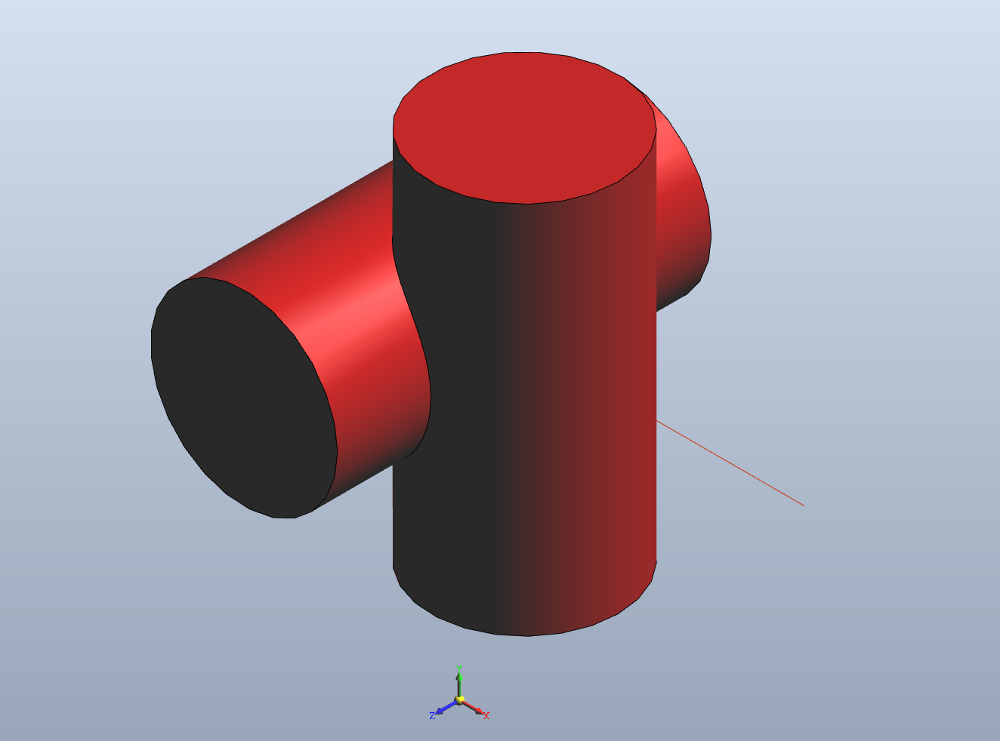


**Рис. 1.** Сложное тело, полученное с помощью примера 2.1 при выполнении операции объединения двух цилиндров. Слева показан журнал построения сложного тела. 


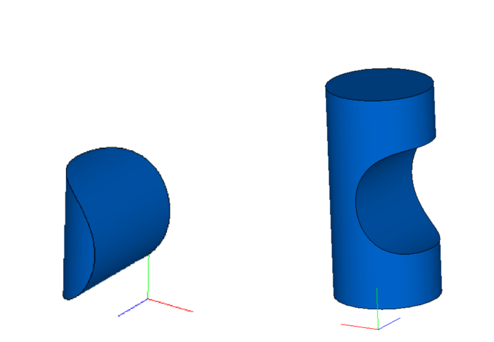


**Рис. 2.** Результат выполнения операций пересечения (слева) и вычитания (справа) двух цилиндров с помощью примера 2.1.


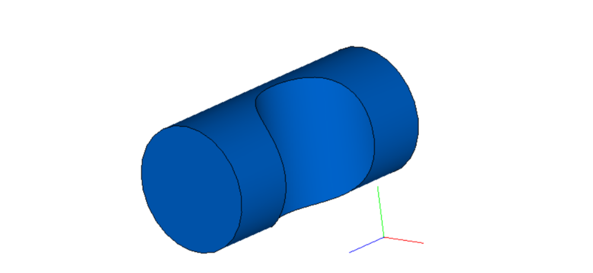


**Рис. 3.** Сложное тело, полученное с помощью примера 2.1 при выполнении операции объединения двух цилиндров. Слева показан журнал построения сложного тела. 


[]Рассмотрим влияние значений параметров слияния подобных граней и ребер, которые задаются в объекте параметров булевой операции методами [MbBooleanFlags::SetMergingFaces()](doc::/MbBooleanFlags::SetMergingFaces) и [MbBooleanFlags::SetMergingEdges()](doc::/MbBooleanFlags::SetMergingEdges). Будем выполнять булеву операцию объединения двух параллелепипедов (рис. 4, 5), построенных как элементарные тела-блоки типа et_Block (работа №6). Построение параллелепипедов производится на основе массива из четырех опорных точек. Первая и вторая точка блоков определяет ребро и две вершины блока, третья точка, вместе с предыдущими, определяет плоскость нижнего блока. Четвертая точка определяет плоскость верхнего основания блока. В приведенном ниже примере 2.2 все опорные точки блока лежат в соответствующих вершинах построенных параллелепипедов. 
 
**Пример 2.2. Булева операция над параллелепипедами (рис. 4, 5).**
```cpp
bool run()
{
	// Исходные тела - прямоугольные параллелепипеды
	MbSolid *pBlock1 = NULL, *pBlock2 = NULL;
	
	// Объект-именователь для построения элементарных тел
	MbSNameMaker blockNames(ct_ElementarySolid, MbSNameMaker::i_SideNone);
	// Массив из 4-х опорных точек для построения прямоугольного
	// параллелепипеда как элементарного тела - блока.
	SArray<MbCartPoint3D> pntsBlock1(4);
	pntsBlock1.Add(MbCartPoint3D(0, 0, 0));
	pntsBlock1.Add(MbCartPoint3D(0, 0, 200));
	pntsBlock1.Add(MbCartPoint3D(50, 0, 0));
	pntsBlock1.Add(MbCartPoint3D(0, 50, 0));
	// Построение элементарного тела-блока по опорным точкам
	ElementarySolid(pntsBlock1, et_Block, blockNames, pBlock1);
	
	// Массив опорных точек для второго параллелепипеда
	SArray<MbCartPoint3D> pntsBlock2(4);
	pntsBlock2.Add(MbCartPoint3D(0, 0, 200));
	pntsBlock2.Add(MbCartPoint3D(100, 0, 200));
	pntsBlock2.Add(MbCartPoint3D(0, 0, 150));
	pntsBlock2.Add(MbCartPoint3D(0, 50, 200));
	// Построение второго блока по опорным точкам
	ElementarySolid(pntsBlock2, et_Block, blockNames, pBlock2);
	
	// Именователь граней для построения тела с помощью булевой операции
	MbSNameMaker operBoolNames( ct_BooleanSolid, MbSNameMaker::i_SideNone );

	// Флаги булевой операции: построение замкнутого тела с объединением
	// подобных граней и ребер.
	MbBooleanFlags flagsBool;
	flagsBool.InitBoolean(true);
	flagsBool.SetMergingFaces(true);
	flagsBool.SetMergingEdges(true);

	// Результирующее тело
	MbSolid* pSolid = NULL;
	// Вызов булевой операции для выполнения объединения.
	MbResultType res = ::BooleanResult( *pBlock1, cm_Copy, *pBlock2, cm_Copy, bo_Union,
			flagsBool, operBoolNames, pSolid );

	// Отображение результирующего тела
	if ( res == rt_Success )
		show(BLUE, pSolid);
	
	// Уменьшение счетчиков ссылок исходных тел
	/*
	::DeleteItem(pBlock1);
	::DeleteItem(pBlock2);
	*/
	return true;
}
 ```
<button id="code_block_2"></button>

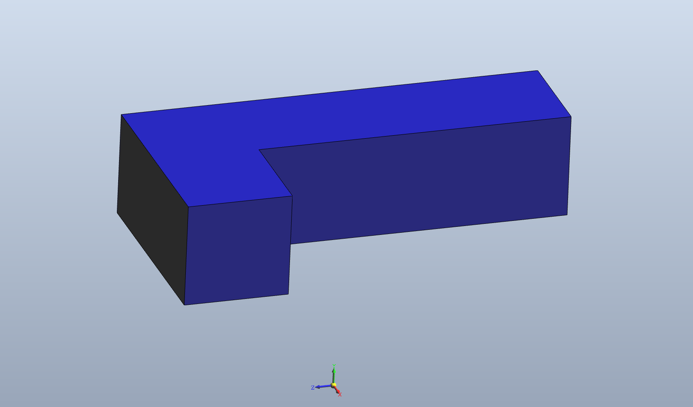


**Рис. 4.** Объединение двух прямоугольных параллелепипедов при включенном режиме слияния граней (пример 2.2, вызов flagsBool.SetMergingFaces(true)). Оболочка результирующего сложного тела содержит 8 граней.


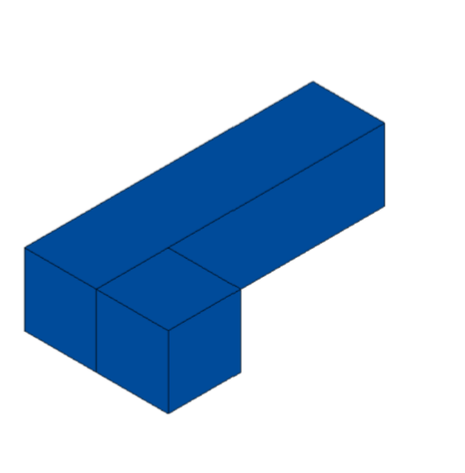


**Рис. 5.** Объединение двух прямоугольных параллелепипедов при выключенном режиме слияния граней (пример 2.2, вызов flagsBool.SetMergingFaces(false)). Оболочка результирующего сложного тела содержит 11 граней. 


### Задания(1)
----
1. Выполните булевы операции над цилиндром и конусом, чтобы получить сложные тела, показанные на рис. 6. Цилиндр и конус стройте с помощью функции построения элементарного тела ElementarySolid.

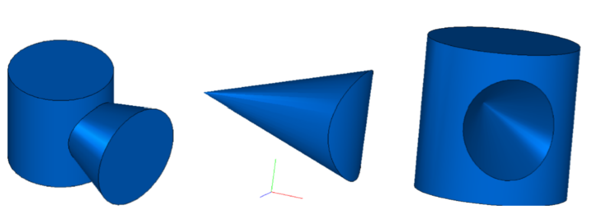


**Рис. 6.** Тела, полученные объединением, пересечением и вычитанием элементарных тел – цилиндра и конуса (для задания 2.1.1).


2. Постройте прямоугольный параллелепипед (как элементарное тело – блок), диагонали которого пересекаются в начале мировой системы координат, длина и ширина равны 200, а высота 30. Вычтите из этого параллелепипеда цилиндр, использовавшийся в предыдущем задании, для построения тела в виде пластины с центральным отверстием (рис. 7). Постройте такое же тело (рис. 7) с помощью операции выдавливания (работа №6). В качестве образующей используйте контур в виде квадрата с окружностью в центре, вектор выдавливания направлен вдоль оси Y мировой СК. Сравните объем программного текста для получения одного и того же тела двумя способами.

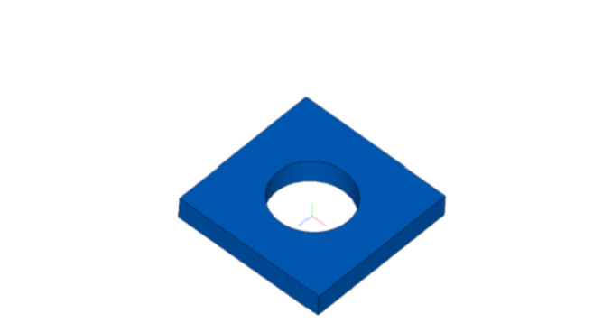


**Рис. 7.** Результирующее тело для задания 2.1.2. 


3. С помощью булевых операций постройте тело, показанное на рис. 8. Решите эту задачу двумя способами:  1. создайте крупный параллелепипед и дважды примените к нему операцию вычитания для вычитания параллелепипеда меньшего размера и цилиндра; 2. при помощи операции объединения к параллелепипеду-основанию добавьте параллелепипед-стенку, а затем постройте отверстие вычитанием цилиндра. 

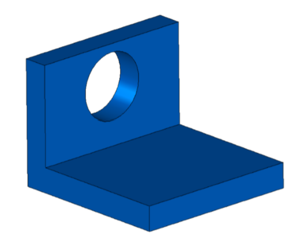


**Рис. 8.** Результирующее тело для задания 2.1.3.


4. С помощью булевых операций и элементарных тел постройте модель, напоминающую висячий замок с замочной скважиной (рис. 9). Основная часть модели состоит из объединенных параллелепипеда и тора, замочная скважина получена с использованием цилиндра и параллелепипеда.


**Рис. 9.** Результирующее тело для задания 2.1.4. 

### <a name="title_2"> []()Комбинация булевых операций с построением тел</a>

[]При построении сложных тел основные операции твердотельного моделирования (создание тел выдавливания, вращения, заметания и тел по набору сечений) часто применяются в комбинации с булевыми операциями. Для сокращения объема исходного текста и для повышения скорости вычислений в ядре реализован набор функций, которые позволяют за один вызов выполнить две операции – построение тела и выполнение над ним булевой операции.
[]В качестве входных параметров таким функциям передается тело – первый операнд булевой операции и набор параметров, необходимых для построения тела – второго операнда булевой операции. Подобные функции определены для всех основных операций твердотельного моделирования (они рассматривались в работах №6 и №7). В приведенных ниже прототипах полужирным шрифтом выделены параметры для построения тела – второго операнда.


1. Булева операция над переданным телом и телом, построенным с помощью операции выдавливания:
```cpp
	MbResultType ExtrusionResult(
		MbSolid& solid1, MbeCopyMode sameShell1,
		const MbSweptData& sweptData,
		const MbVector3D& direction,
		const ExtrusionValues& params,
		OperationType operType, const MbsNameMaker& operNames,
		const PArray<MbsNameMaker>& contoursNames,
		MbSolid*& result );
```
2. Булева операция над переданным телом и телом, построенным с помощью операции вращения:
```cpp
	MbResultType RevolutionResult(
		MbSolid& solid1, MbeCopyMode sameShell1,
		const MbSweptData& sweptData,
		const MbAxis3D& axis,
		const RevolutionValues& params,
		OperationType operType, const MbsNameMaker& operNames,
		const PArray<MbsNameMaker>& contoursNames,
		MbSolid*& result );
```
3. Булева операция над переданным телом и телом, построенным как тело заметания:
```cpp
	MbResultType EvolutionResult(
		MbSolid& solid1, MbeCopyMode sameShell1,
		const MbSweptData& sweptData, const MbCurve3D& spine,
		const EvolutionValues& params,
		OperationType operType, const MbsNameMaker& operNames,
		const PArray<MbsNameMaker>& contoursNames,
		const MbsNameMaker& spineNames,
		MbSolid*& result );
```
4. Булева операция над переданным телом и телом, построенным по набору сечений:
```cpp
	MbResultType LoftedResult(
		MbSolid& solid1, MbeCopyMode sameShell1,
		RPArray<MbSurface>& surfs, RPArray<MbContour>& contours,
		const MbCurve3D* spine, const LoftedValues& params,
		OperationType operType,
		RPArray<MbCurve3D>* guideCurves,
		SArray<MbCartPoint3D>* ps,
		const MbSNameMaker& names,
		PArray<MbSNameMaker>* contoursNames,
		MbSolid *& result );
```
[]У перечисленных функций часть параметров одинакова. Различаются они за счет параметров, которые связаны с выбранным способом построения второго тела. Совпадают следующие параметры:
1. pSolid1 – тело-первый операнд булевой операции;
2. sameShell1 – способ копирования оболочки первого тела в результирующее тело булевой операции;
3. operType – тип булевой операции;
4. operNames – объект-именователь булевой операции;
5. result – результирующее тело (выходной параметр).
[]Различными параметрами перечисленных комбинированных функций являются:
1. params – параметры построения (разные объекты для разных операций);
2. sweptData – данные об образующей кривой (все, кроме тела по сечениям);
3. direction – направление выдавливания (тело выдавливания);
4 axis – ось вращения (тело вращения);
5. spine – направляющая кривая (тело заметания);
6. surfs – массив поверхностей контуров сечений (тело по сечениям);
7. contours – массив контуров образующей кривой (тело по сечениям);
8. spine – направляющая кривая (для тела по сечениям необязательна);
9. ps – множество точек на контурах образующей для управления формой ребер тела по сечениям;
10. contoursNames – объекты-именователи контуров образующей тела по сечениям;
11. spineNames – объект-именователь направляющей (тело заметания). 
[]Правила подготовки параметров для вызова функций булевых операций, комбинированных с построением тел, полностью аналогичны последовательным вызовам двух отдельных функций для построения тела и булевой операции.

### Задания(2)
----
1. С помощью функции ExtrusionResult постройте тело в виде пластины с вырезом в форме буквы Z (рис. 10, справа). Прямоугольную пластину с цилиндрическими торцами постройте как элементарное тело-плиту (см. руководство разработчика C3D_Manual_Russian.pdf, раздел М.1.1). Такое элементарное тело строится с помощью вызова [ElementarySolid](doc::/ElementarySolid) с кодом et_Plate по 4 опорным точкам (рис. 10, слева): первая и вторая точки определяют прямое ребро и две вершины пластины, третья точка вместе с предыдущими определяет плоскость нижнего основания пластины. Четвертая точка определяет плоскость верхнего основания пластины.

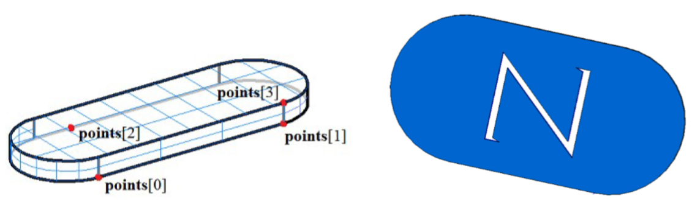


**Рис. 10.** (Слева) Расположение четырех опорных точек для построения элементарного тела-плиты (копия рис. М.1.1.7 из руководства разработчика ядра C3D). (Справа) Результирующее тело для задания 3.1.1.


2. Постройте цилиндр как элементарное тело и выполните возможные булевы операции над этим цилиндром и телом заметания (направляющая – спираль, поперечное сечение – окружность). Возможные результирующие тела, построенные с помощью функции [EvolutionResult](doc::/EvolutionResult), показаны на рис. 11.

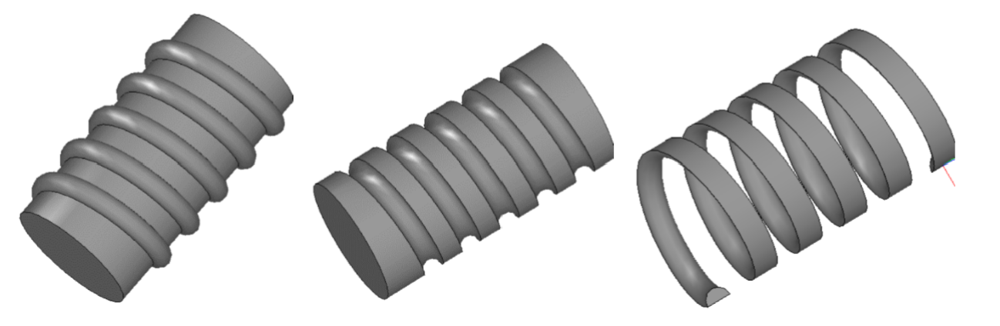


**Рис. 11.** Результирующие тела для задания 3.1.2. 


3. Получите сложные тела, показанные на рис. 12, с помощью функции [LoftedResult](doc::/LoftedResult). Первым телом для булевой операции является сфера, вторым – пересекающееся с этой сферой тело, заданное тремя сечениями (окружность, квадрат, треугольник).

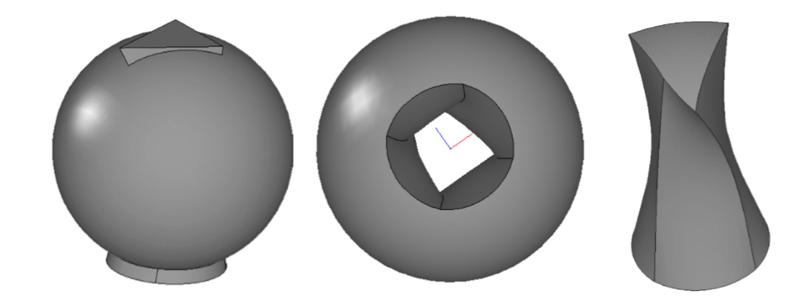


**Рис. 12.** Результирующие тела для задания 3.1.2 (объединение, вычитание и пересечение сферы и тела, строящегося по сечениям). 

### <a name="title_3"> []()Разделение несвязного тела на части</a>

[]При выполнении булевых операций в ряде случаев формируются тела, состоящие из нескольких несвязанных частей – несвязные тела. Подобные тела могут получаться при выполнении вычитания тел, а также при пересечении невыпуклых тел. Несвязные тела в C3D рассматриваются как единый геометрический объект, что не всегда удобно для последующих операций моделирования. Например, может потребоваться обработать все части тела по отдельности или отобрать для дальнейших действий какую-то одну часть несвязного тела. Критерий отбора зависит от решаемой задачи – наибольшая по размеру, расположенная определенным образом относительно других тел и т.п.
[]Для доступа к отдельным частям несвязного тела в C3D есть функции-утилиты [DetachParts](doc::/DetachParts) и [CreateParts](doc::/CreateParts). Обе эти функции выполняют разделение заданного несвязного тела на части и возвращают эти части как независимые твердые тела. В отличие от всех рассмотренных выше операций моделирования, эти функции не меняют геометрическую форму исходного тела, а упрощают программный доступ к его частям. Прототипы этих функций похожи:
```cpp
size_t DetachParts( MbSolid& solid, RPArray<MbSolid>& parts,
		bool sort, const MbSNameMaker& names);
size_t CreateParts( MbSolid & solid, RPArray<MbSolid>& parts,
		const MbSNameMaker & names);
```
[]Обе функции возвращают количество отдельных частей несвязного исходного тела solid. Различаются они тем, что [DetachParts](doc::/DetachParts) изменяет исходное тело solid, а [CreateParts](doc::/CreateParts) – не изменяет его. Функция [DetachParts](doc::/DetachParts) выбирает тело с наибольшим габаритом и записывает его вместо исходного тела solid, а остальные части сортируются по убыванию габарита (или при значении параметра sort = false – по номеру начальной грани). Функция [CreateParts](doc::/CreateParts) не меняет исходное тело solid, а все его отдельные части сохраняет в массиве parts как отдельные тела.  
 
**Входные параметры функций:**
1. solid – исходное несвязное тело;
2. sort – способ сортировки частей в выходном массиве (true – по габариту, false – по номеру грани);
3. names – объект-именователь операции;  
 
**Выходные данные:**
1. Количество отдельных частей исходного тела;
2. solid – первая часть в порядке сортировки (только для [DetachParts](doc::/DetachParts));
3. parts – массив частей исходного тела. 
 
[]В примере 4.1 из прямоугольного параллелепипеда вычитается тело вращения в виде половины тора с круглым сечением (рис. 13). Результирующее тело состоит из трех несвязных частей (рис. 14). С помощью функции [DetachParts](doc::/DetachParts) для работы с этими частями создаются новые объекты-твердые тела (рис. 15-16). В качестве примера операций с отдельными частями выполняется перемещение двух частей вдоль оси Y. На рис. 15 и 16 цветом обозначается порядок помещения тел-частей в выходную переменную pSolid (поскольку [DetachParts](doc::/DetachParts) изменяет исходное тело) и массив тел [parts](doc::/MbSolid).  
 
**Пример 4.1. Разделение несвязного тела на части (рис. 13-16).**
```cpp
bool run()
{
	// Множитель для преобразования углов из градусной в радианную меру.
	const double DEG_TO_RAD = M_PI / 180.0;

	// ШАГ 1: ПЕРВОЕ ТЕЛО ДЛЯ БУЛЕВОЙ ОПЕРАЦИИ: ПРЯМОУГОЛЬНЫЙ ПАРАЛЛЕЛЕПИПЕД
	MbSolid* pBlockSolid = NULL;

	// Опорные точки для построения элементарного-тела блока
	SArray<MbCartPoint3D> pntsBlock(4);
	pntsBlock.Add(MbCartPoint3D(200, -10, 0));
	pntsBlock.Add(MbCartPoint3D(-200, -10, 0));
	pntsBlock.Add(MbCartPoint3D(200, -10, 20));
	pntsBlock.Add(MbCartPoint3D(200, 10, 0));
	// Объект-именователь для построения элементарных тел
	MbSNameMaker blockNames(ct_ElementarySolid, MbSNameMaker::i_SideNone);
	// Создание элементарного тела - блока по четырем точкам
	::ElementarySolid(pntsBlock, et_Block, blockNames, pBlockSolid);

	// ШАГ 2: ВТОРОЕ ТЕЛО ДЛЯ БУЛЕВОЙ ОПЕРАЦИИ: ПОЛОВИНА ТОРА С КРУГОВЫМ СЕЧЕНИЕМ
	MbSolid* pHalfTorSolid = NULL;

	// Контур-образующая для тела вращения
	MbArc* pArc2D = new MbArc(15);
	pArc2D->Move(MbVector(MbCartPoint(0,0), MbCartPoint(-40,0)));
	MbContour* pCircleContour = new MbContour();
	pCircleContour->AddSegment(pArc2D);
	// Объект, хранящий параметры образующей тела вращения
	MbPlacement3D pl;
	MbSweptData sweptData(pl, *pCircleContour);
	// Объект с параметрами операции вращения (углы вращения по и против направления
	// нормали поверхности контура)
	RevolutionValues revParams(180*DEG_TO_RAD, 0, 0);
	// Объект-именователь для построения тела вращения
	MbSNameMaker revNames(ct_CurveRevolutionSolid, MbSNameMaker::i_SideNone, 0);
	PArray<MbSNameMaker> revContoursNames(0, 1, false);
	// Ось вращения для построения тела - ось Y мировой СК
	MbAxis3D axis(pl.GetAxisY());
	axis.Move(MbVector3D(MbCartPoint3D(0, 0, 0), MbCartPoint3D(40, 0, 0)));
	// Построение твердого тела вращения
	::RevolutionSolid( sweptData, axis, revParams, revNames,
		revContoursNames, pHalfTorSolid );

	// ШАГ 3: БУЛЕВА ОПЕРАЦИЯ ВЫЧИТАНИЯ ТОРА ИЗ ПАРАЛЛЕЛЕПИПЕДА
	// Именователь граней для построения тела с помощью булевой операции
	MbSNameMaker operBoolNames(ct_BooleanSolid, MbSNameMaker::i_SideNone, 0);

	// Флаги операции: построение замкнутого тела с объединением подобных граней и ребер
	MbBooleanFlags flagsBool;
	flagsBool.InitBoolean(true);
	// Булева операция над оболочками
	flagsBool.SetMergingFaces(true);
	// Сливать подобные грани
	flagsBool.SetMergingEdges(true);
	// Сливать подобные ребра

	// Выполнение булевой операции вычитания: pSolid = pBlockSolid - pHalfTorSolid
	MbSolid* pSolid = NULL;
	MbResultType resBoolOp = ::BooleanResult(
		*pBlockSolid, cm_Copy, *pHalfTorSolid, cm_Copy,
		bo_Difference, flagsBool, operBoolNames, pSolid );
	// Следующие закомментированные строки позволяют отобразить результирующее
	// тело до разделения (как на рис. 14).
	// if ( resBoolOp == rt_Success )
	//   show(BLUE, pSolid);

	// ШАГ 4: РАЗДЕЛЕНИЕ СЛОЖНОГО НЕСВЯЗНОГО ТЕЛА НА ЧАСТИ
	// Массив, для хранения тел, представляющих отдельные части тела pSolid.
	// Исходное тело pSolid состоит из трех частей, но при использовании DetachParts
	// наибольшая будет сохранена вместо исходного тела, а не в массиве частей.
	PArray<MbSolid> parts(2		/* Начальный размер массива */,
		2	/* Приращение при увеличении массива - здесь неважно */,
		false /* При удалении массива его элементы удалять не надо */);
	// Именователь операции разделения тела на части
	MbSNameMaker detachNames(ct_DetachSolid, MbSNameMaker::i_SideNone, 0);
	// Операция разделения тела: sort = true задает сортировку частей по габаритному
	// размеру, наибольшая часть помещается в pSolid, две остальные - в массив parts.
	size_t partsCnt = ::DetachParts(*pSolid, parts, true, detachNames );

	// Отображение тел – частей (рис. 15) с проверкой, что были успешно получены
	// две части (DetachParts возвращает количество частей в массиве parts и в этом 
	// значении не учитывает наибольшую часть pSolid).
	if ( partsCnt == 2 )
	{     
	// Часть с наибольшим габаритом, заместившая исходное тело pSolid,
	// отображается красным цветом.
	show( Style( 1, RGB(255, 0, 0) ), pSolid); 

	// Части с меньшими размерами, помещенные в массив тел parts, для отображения
	// смещаются на 50 и 100 по оси Y и отображаются зеленым и синим цветом.
	parts[0]->Move( MbVector3D(MbCartPoint3D(0, 0, 0), MbCartPoint3D(0, 50, 0)) );
	show( Style( 1, RGB(0, 255, 0) ), parts[0]);
	parts[1]->Move( MbVector3D(MbCartPoint3D(0, 0, 0), MbCartPoint3D(0, 100, 0)) );
	show( Style( 1, RGB(0, 0, 255) ), parts[1]);
	}

	// Уменьшение счетчиков ссылок динамически созданных объектов ядра
	/*
	::DeleteItem( pBlockSolid );
	::DeleteItem( pArc2D );
	::DeleteItem( pCircleContour );
	::DeleteItem( pHalfTorSolid );
	*/
	return true;
}
```
<button id="code_block_3"></button>

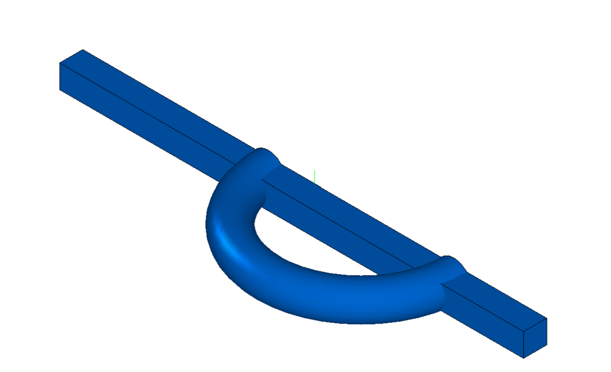


**Рис. 13.** Исходные тела до выполнения булевой операции вычитания (пример 4.1). 


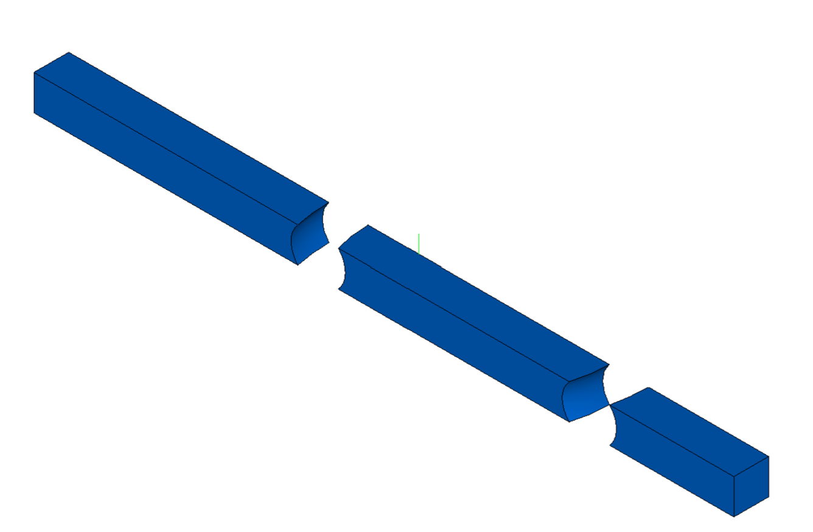


**Рис. 14.** Результирующее тело булевой операции вычитания для исходных тел, показанных на рис. 13 (тело вращения вычитается из параллелепипеда, пример 4.1). На изображении явно видны три несвязных части, но булева операция в C3D все эти части возвращает в виде одного сложного тела.  


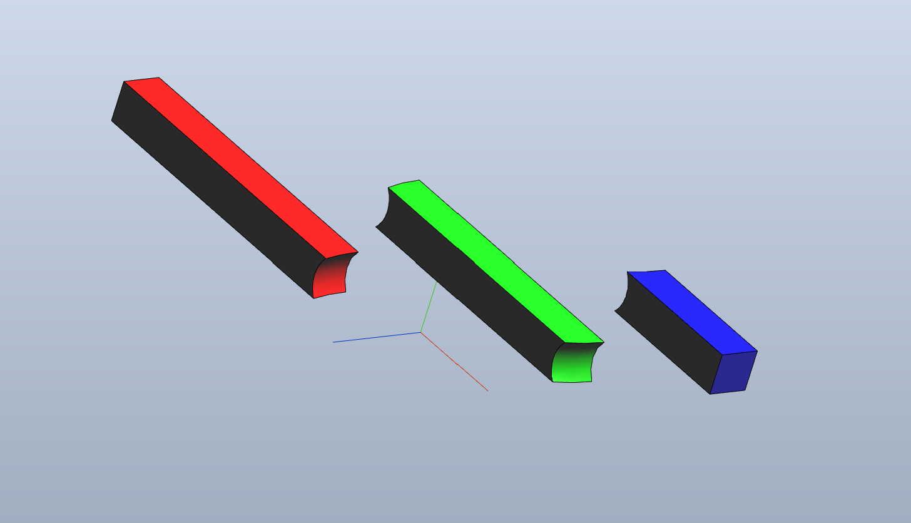


**Рис. 15.** Функция DetachParts упрощает программный доступ к частям несвязного тела. В примере 4.1 выполняется разделение тела, показанного на рис. 14, на части в режиме сортировки по габариту. Красным цветом отображается часть с наибольшим габаритом (возвращается вместо исходного тела pSolid), зеленым и синим отображаются части, возвращенные в массиве новых тел-частей.  


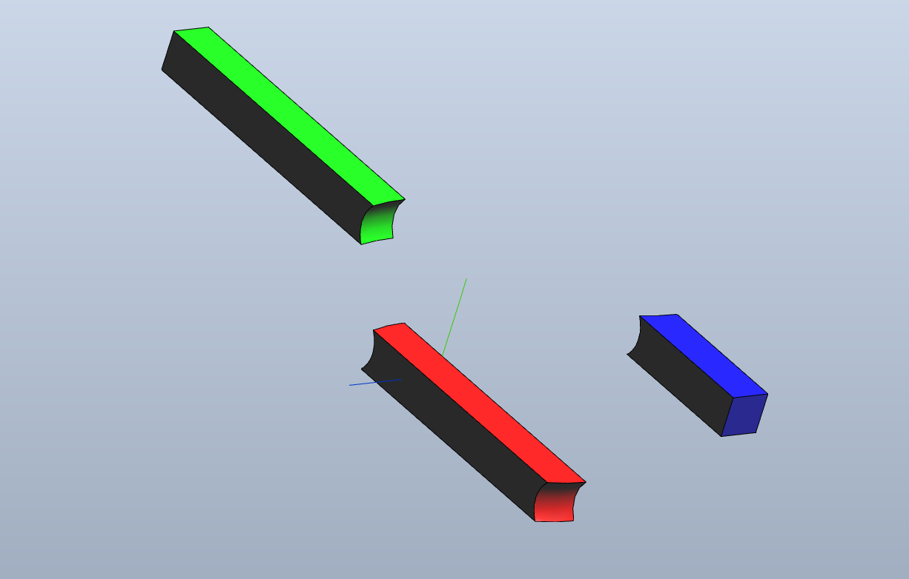


**Рис. 16.** Если в примере 4.1 при вызове функции DetachParts указать режим сортировки частей sort=false, то порядок возврата частей изменится. Теперь в виде pSolid (показана красным цветом) возвращается «средняя» часть сложного тела (рис. 14), а две «крайние» части возвращаются в виде массива новых тел-частей (показаны зеленым и синим цветом). 


### Задания(3)
----
1. Постройте элементарные тела – тор и цилиндр – таким образом, чтобы после вычитания из тора цилиндра получилось несвязное сложное тело. Разбейте полученное тело на два независимых тела и выполните сдвиг одного относительно другого. Полученный результат должен быть похож на рис. 17.

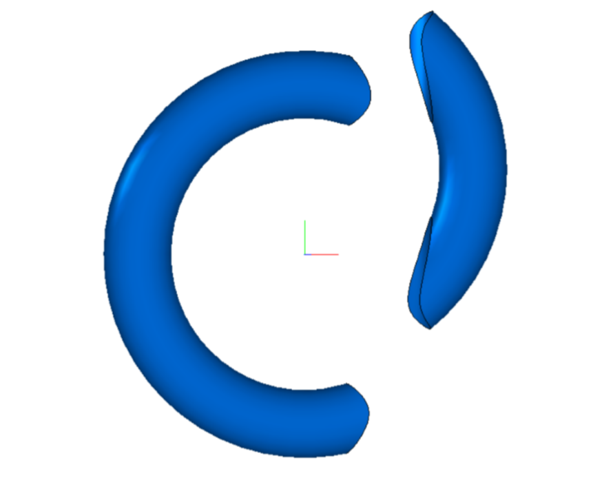


**Рис. 17.** Возможный результат выполнения задания 4.1.1.


2. Постройте тело заметания со спиральной направляющей и круговым поперечным сечением. Также постройте пластину (элементарное тело типа et_Plate), несимметрично пересекающую полученную ранее спираль. Вычтите из тела-спирали тело-пластину и выполните разбиение полученного сложного тела на части с использованием двух способов сортировки (сортировка по размеру и сортировка по номеру грани). Сдвиньте полученные тела по оси Y со смещением, пропорциональным их индексу в массиве частей. 

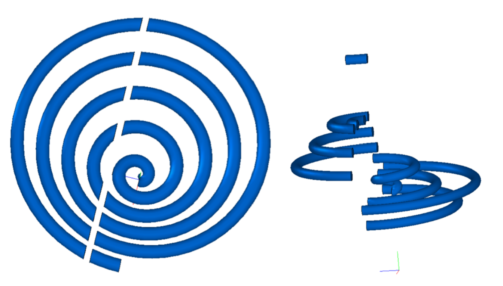


**Рис. 18.** Возможный результат выполнения задания 4.1.2.

### <a name="title_4"> []()Объединение набора тел в сложное несвязное тело</a>

[]В некоторых случаях оказывается удобным объединить несколько отдельных тел в сложное несвязное тело. Эта операция является обратной по отношению к операциям разделения несвязного тела на части, которые рассматривались в предыдущем разделе 4. Например, после объединения нескольких тел в одно тело к ним можно одновременно применить операцию перемещения вместо отдельного вызова метода Move у каждого тела.
[]Объединить два тела в одно можно с помощью функции булевой операции BooleanResult с кодом операции объединения bo_Union (см. раздел 2). Для объединения нескольких тел можно вызывать эту функцию последовательно, но в таком случае удобнее применять функцию UnionSolid для объединения набора твердых тел:
```cpp
MbResultType UnionSolid(
		RPArray<MbSolid>&        solids,
		MbeCopyMode              sameShells,
		bool                     checkIntersect,
		const MbSNameMaker&      operNames,
		bool                     isArray,
		MbSolid*&                result,
		RPArray<MbSolid>*        notGluedSolids = NULL );
```

**Входные параметры функции:**
1. solids  – массив исходных тел для объединения;
2. sameShells – способ копирования граней исходных тел в результирующее тело;
3. checkIntersect – режим проверки пересечения исходных тел. В режиме true пересекающиеся исходные тела будут объединены в одно тело – одну часть результирующего тела. В режиме false все исходные тела будут отдельными частями результирующего тела.
4. operNames – объект-именователь операции;
5. isArray  – параметр для указания особого режима обработки регулярных массивов исходных тел. Если isArray = true, то считается, что исходные тела расположены в равномерно распределенных узлах прямоугольной или круговой сетки, а позиции тел заданы в именах граней.

**Выходные данные:**
1. Возвращаемое значение – rt_Success в случае успешного построения или код результата операции типа MbResultType, поясняющий возникшую ошибку.
2. result  – построенное твердое тело.
3. notGluedSolids  – множество тел, которые не удалось объединить. Это необязательный выходной параметр, если эти данные не нужны, то вместо массива можно передать NULL.
[]Использование функции UnionSolid показано в примере 5.1. Сначала выполняется построение четырех независимых элементарных тел – это два цилиндра, параллелепипед и конус. (Для построения конуса необходимо три опорных точки: вершина, центр основания и точка, определяющая положение осей X и Z локальной системы координат.) Затем выполняется объединение цилиндров и конуса в одно тело «2 цилиндра + конус». Полученное тело «2 цилиндра + конус» перемещается вдоль оси Y до пересечения с параллелепипедом и затем производится вычитание из параллелепипеда полученного тела. Исходные тела, совмещение составного тела с параллелепипедом и результирующее тело после булевой операции вычитания показаны на рисунках 19 и 20. 
 
**Пример 5.1. Объединение набора тел и операции над ними (рис. 19, 20).**
```cpp
bool run()
{
	// Именователь операции построения элементарного тела
	MbSNameMaker namesElSolid(ct_ElementarySolid, MbSNameMaker::i_SideNone, 0); 

	// ИСХОДНОЕ ТЕЛО №1 - ПАРАЛЛЕЛЕПИПЕД
	MbSolid* pBlockSolid = NULL;
	// Опорные точки для построения элементарного тела - блока
	SArray<MbCartPoint3D> blockPnts(4);
	blockPnts.Add(MbCartPoint3D(150, 150, 0));
	blockPnts.Add(MbCartPoint3D(0, 150, 0));
	blockPnts.Add(MbCartPoint3D(150, 150, 40));
	blockPnts.Add(MbCartPoint3D(150, 250, 0));
	// Построение элементарного тела - блока
	MbResultType resBlock = ::ElementarySolid( blockPnts, et_Block,
		namesElSolid, pBlockSolid );

	// ИСХОДНОЕ ТЕЛО №2 - ЦИЛИНДР
	MbSolid* pCyl1_Solid = NULL;
	// Опорные точки для элементарного тела - цилиндра
	SArray<MbCartPoint3D> cylPnts(3);
	cylPnts.Add(MbCartPoint3D(30, 50, 0));
	cylPnts.Add(MbCartPoint3D(30, 50, 50));
	cylPnts.Add(MbCartPoint3D(40, 50, 0));
	// Построение элементарного тела - цилиндра
	MbResultType resCyl1 = ::ElementarySolid( cylPnts, et_Cylinder,
		namesElSolid, pCyl1_Solid);

	// ИСХОДНОЕ ТЕЛО №3 - ЦИЛИНДР
	// Построим второй цилиндр как копию pCyl1_Solid, смещенную вдоль оси Y.
	MbSolid* pCyl2_Solid = (MbSolid*)(&pCyl1_Solid->Duplicate());
	pCyl2_Solid->Move( MbVector3D(0, 30, 0 ) );

	// ИСХОДНОЕ ТЕЛО №4 - КОНУС
	MbSolid* pConeSolid = NULL;
	SArray<MbCartPoint3D> conePnts(3);
	// Массив точек
	conePnts.Add(MbCartPoint3D(100, 50, 0));
	conePnts.Add(MbCartPoint3D(100, 50, 50));
	conePnts.Add(MbCartPoint3D(130, 50, 50));
	MbResultType resCone = ::ElementarySolid( conePnts, et_Cone,
	namesElSolid, pConeSolid );

	// При необходимости - отображение исходных тел (для получения рис.19)
	/*
		if ( pBlockSolid )
		show( BLUE, pBlockSolid );
		if ( pCyl1_Solid )
		show( BLUE, pCyl1_Solid );
		if ( pCyl2_Solid )
		show( BLUE, pCyl2_Solid );
		if ( pConeSolid )
		show( BLUE, pConeSolid );
	*/

	// ОБЪЕДИНЕНИЕ ДВУХ ЦИЛИНДРОВ И КОНУСА В СЛОЖНОЕ СОСТАВНОЕ ТЕЛО
	MbSolid* pUnionSolid = NULL;
	// Именователь операции объединения
	MbSNameMaker operUnionNames(ct_UnionSolid, MbSNameMaker::i_SideNone, 0);
	// Режим проверки на пересечение
	bool checkIntersection = true;
	// Признак регулярности расположения исходных тел
	bool isArray = false;
	// Массив тел для объединения
	RPArray<MbSolid> solids;
	solids.Add(pCyl1_Solid);
	solids.Add(pCyl2_Solid);
	solids.Add(pConeSolid);
	// Объединение массива тел
	MbResultType resUnion = ::UnionSolid( solids, cm_Same, checkIntersection,
	operUnionNames, isArray, pUnionSolid );
	// Перемещение тела "Два цилиндра + конус" по оси Y
	pUnionSolid->Move( MbVector3D(0, 150, 0) );

	// Отображение составного тела после перемещения вместе с
	// параллелепипедом (для получения рис. 20).
	// show( BLUE, pUnionSolid );
	// show( BLUE, pBlockSolid );

	// ВЫЧИТАНИЕ СОСТАВНОГО ТЕЛА "ДВА ЦИЛИНДРОВ + КОНУС" ИЗ ПАРАЛЛЕЛЕПИПЕДА
	MbSolid* pBoolSolid = NULL;
	// Именователь граней булевой операции
	MbSNameMaker operBoolNames(ct_BooleanSolid, MbSNameMaker::i_SideNone, 0);
	// Флаги булевой операции: построение замкнутого тела с объединением
	// подобных граней и ребер.
	MbBooleanFlags flagsBool;
	flagsBool.InitBoolean(true);
	// Булева операция над оболочками
	flagsBool.SetMergingFaces(true);
	// Объединять подобные грани
	flagsBool.SetMergingEdges(true);
	// Объединять подобные ребра
	// Операция вычитания из параллелепипеда составного тела "Два цилиндра + конус"
	MbResultType res = ::BooleanResult( *pBlockSolid, cm_Copy, *pUnionSolid, cm_Copy,
		bo_Difference, flagsBool, operBoolNames, pBoolSolid );

	// Отображение тела - результата вычитания
	show( BLUE, pBoolSolid );

	// Уменьшение счетчиков ссылок динамически созданных объектов ядра
	/*
		::DeleteItem(pBlockSolid);
		::DeleteItem(pCyl1_Solid);
		::DeleteItem(pCyl1_Solid);
		::DeleteItem(pConeSolid);
		::DeleteItem(pUnionSolid);
		::DeleteItem(pBoolSolid);
	*/
	return true;
}
```
<button id="code_block_4"></button>

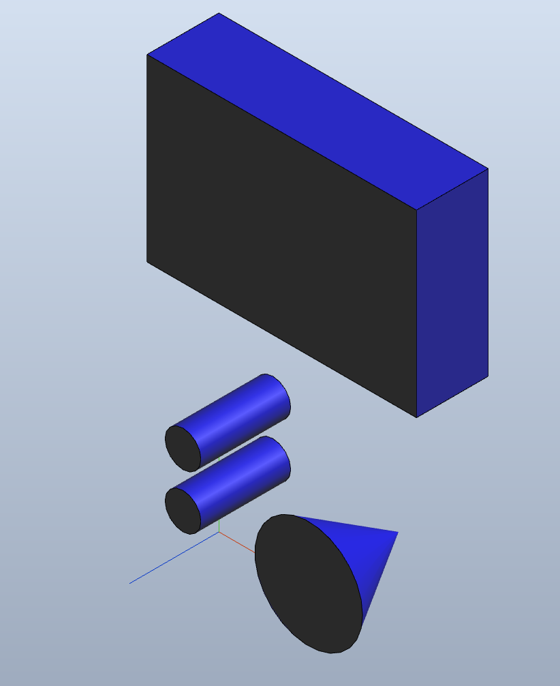


**Рис. 19.** 4 исходных элементарных тела, используемые в примере 5.1.


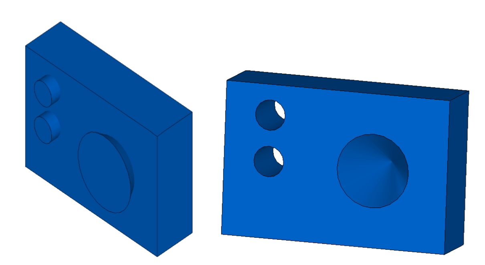


**Рис. 20.** (Слева) Совмещение параллелепипеда с составным телом «2 цилиндра + конус» после смещения составного тела вдоль оси Y. (Справа) Результат вычитания составного тела из параллелепипеда (пример 5.1.).


### Задания(4)
----
1. Постройте четыре непересекающихся элементарных тела: сферу, цилиндр, пирамиду и прямую призму (рис. 21). Объедините эти элементарные тела в одно составное тело. Полученное тело переместите по оси Y. Откройте журнал построения полученного тела и убедитесь, что в качестве операции для его получения указан строитель «Набор тел» с параметрами – отдельными элементарными телами.


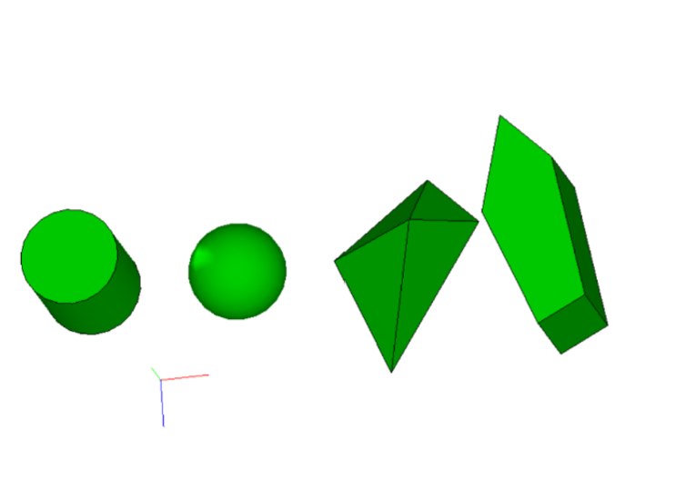


**Рис. 21.** Результирующее составное тело для задания 5.1.1. 


2. Добавьте к составному телу из задания 5.1.1 тор и пластину, которые будут пересекать некоторые из построенных ранее тел. Сравните журнал построения нового составного тела с журналом построения из задания 5.1.1.

### <a name="title_5"> []()Построение копий тела</a>

[]При использовании нескольких тел одинаковой формы обычно удобнее оказывается построить несколько копий одного тела, а не повторять их построение независимо. Выше в примере 5.1 (рис. 19) выполнялось копирование цилиндра с помощью метода [MbSolid::Duplicate](doc::/MbSolid::Duplicate). Этот метод позволяет получить только одну копию тела, поэтому он не слишком удобен для построения большого количества копий, особенно, если эти копии располагаются регулярным образом в углах некоторой координатной сетки. Для этой цели в C3D предназначена специальная функция построения копий тела [DuplicationSolid](doc::/DuplicationSolid): 
```cpp
MbResultType DuplicationSolid(
	const MbSolid&            solid,
	const DuplicationValues&  params,
	const MbSNameMaker&       operNames,
	MbSolid*&                 result ); 
```
**Входные параметры функции:**
1. solid  – исходное тело для копирования;
2. params  – параметры копирования;
3. operNames – объект-именователь операции. 
 
[]В результате выполнения эта функция, как и многие их рассмотренных ранее, возвращает код результата типа [MbResultType](doc::/MbResultType) и результирующее тело result. Это тело является сложным составным телом, которое представляет собой объединение всех построенных копий исходного тела solid.
[]Параметры операции копирования передаются в виде параметра params, который может быть объектом класса [DuplicationMeshValues](doc::/DuplicationMeshValues) или [DuplicationMatrixValues](doc::/DuplicationMatrixValues). Оба эти класса унаследованы от класса DuplicationValues – базового класса параметров операции копирования. Класс [DuplicationMeshValues](doc::/DuplicationMeshValues) предназначен для хранения параметров копирования по координатной сетке, а [DuplicationMatrixValues](doc::/DuplicationMatrixValues) – по набору местоположений, заданных с помощью матриц геометрических преобразований.
[]При использовании класса [DuplicationMeshValues](doc::/DuplicationMeshValues) для создания копий по сетке все параметры операции копирования можно указать в конструкторе этого класса: 
```cpp
DuplicationMeshValues::DuplicationMeshValues(
	bool                 isPolar,
	const MbVector3D&    dir1,
	const double         step1,
	const unsigned int   num1,
	const MbVector3D&    dir2,
	const double         step2,
	const unsigned int   num2,
	MbCartPoint3D*       center,
	bool                 isAlongAxis = false );
```
[]Параметры конструктора позволяют выбрать тип СК – сетку можно задавать в декартовой или полярной системе координат. В обоих случаях задается двумерная сетка, поэтому есть два набора параметров (dir, step, num) для каждого координатного направления сетки. В декартовой СК векторы dir1 и dir2 задают направление осей двумерной сетки. В полярной СК dir1 задает направление радиальной оси, а векторное произведение векторов dir1 и dir2 определяет направление увеличения полярного угла. В обеих СК начало координат задается положением исходного копируемого тела.
[]Ниже перечислено назначение параметров конструктора:
1. isPolar – флаг выбора полярной (true) или декартовой (false) СК для описания сетки.
2. dir1 – вектор, определяющий направление первой оси СК;
3. step1 – шаг вдоль оси dir1, с которым будут создаваться копии тела;
4. num1 – количество копий тела вдоль оси dir1;
5. dir2 – вектор, определяющий направление второй оси декартовой СК (или, совместно с dir1, направление увеличения полярного угла);
6. step2 – шаг вдоль оси dir2 (или по полярному углу в полярной СК), с которым будут создаваться копии тела;
7. num12 – количество копий тела по направлению оси dir2;
8. center – необязательный параметр, позволяющий явно указать начало СК исходного тела.
 
[]Применение функции [DuplicationSolid](doc::/DuplicationSolid) для построения копий тела по декартовой и полярной сетке показано в примере 6.1 (рис. 22) и 6.2 (рис. 23). В примере 6.1 выполняется копирование элементарного тела – цилиндра по двумерной сетке, а в примере 6.2 – копирование сферы в полярной системе координат. В качестве точки отсчета берется центральная точка одного из оснований цилиндра (пример 6.1) и центр сферы (пример 6.2). Исходные элементарные тела строятся по наборам опорных точек, направляющие векторы задаются парой точек.
[]Все копии, которые строит функция [DuplicationSolid](doc::/DuplicationSolid), возвращаются в виде одного составного тела. Для работы с каждой отдельной копией можно использовать функцию DetachParts (см. раздел 4 данной работы). Если при вызове функции копирования тела [DuplicationSolid](doc::/DuplicationSolid) некоторые копии будут пересекаться друг с другом или с исходным телом, то будет выполнено их автоматическое булево объединение в новую оболочку. В таком случае с помощью DetachParts получить доступ к отдельным копиям не удастся.  
 
**Пример 6.1. Копирование цилиндра по сетке в двумерной системе координат (рис. 22).**
```cpp
bool run()
{
	// Именователь операции построения элементарного тела
	MbSNameMaker namesElSolid(ct_ElementarySolid, MbSNameMaker::i_SideNone, 0);
	// ИСХОДНОЕ ТЕЛО ДЛЯ КОПИРОВАНИЯ - ЦИЛИНДР
	MbSolid* pCylSolid = NULL;
	// Опорные точки для элементарного тела - цилиндра
	SArray<MbCartPoint3D> cylPnts(3);
	cylPnts.Add( MbCartPoint3D( 0, 0,  0) );
	cylPnts.Add( MbCartPoint3D( 0, 0, 50) );
	cylPnts.Add( MbCartPoint3D(10, 0,  0) );
	// Построение элементарного тела - цилиндра
	MbResultType resCyl1 = ::ElementarySolid( cylPnts, et_Cylinder,
	namesElSolid, pCylSolid );  

	// ФОРМИРОВАНИЕ ОБЪЕКТА params С ПАРАМЕТРАМИ ОПЕРАЦИИ КОПИРОВАНИЯ ПО СЕТКЕ
	// Векторы, определяющие два направления копирования
	MbVector3D vecDir1( MbCartPoint3D(0, 0, 0), MbCartPoint3D(0, 100, 0) );
	MbVector3D vecDir2( MbCartPoint3D(0, 0, 0), MbCartPoint3D(100, 0, 0) );
	// Шаг копирования по двум осям
	const double step1 = 50;
	const double step2 = 50;
	// Количество копий по двум направлениям
	const unsigned int num1 = 5;
	const unsigned int num2 = 7;
	// В качестве центра СК сетки передается точка, соответствующая центру одного из
	// оснований исходного цилиндра.
	DuplicationMeshValues params( false /* декартова СК */ , vecDir1, step1, num1,
	vecDir2, step2, num2, &cylPnts[0] ); 

	// ПОСТРОЕНИЕ ТЕЛА, СОСТОЯЩЕГО ИЗ КОПИЙ ПО СЕТКЕ
	MbSolid* pDuplSolid = NULL;
	// Именователь операции копирования по сетке
	MbSNameMaker namesDupl(ct_DuplicationSolid, MbSNameMaker::i_SideNone, 0);
	// Вызов операции копирования по сетке
	MbResultType res = ::DuplicationSolid( *pCylSolid, params, namesDupl, pDuplSolid );

	// Отображение результирующего составного тела
	if ( res == rt_Success )
	show(BLUE, pDuplSolid);

	// Уменьшение счетчиков ссылок динамически созданных объектов ядра
	/*
	::DeleteItem( pCylSolid );
	::DeleteItem( pDuplSolid );
	*/
	return true;
}
```
<button id="code_block_5"></button>

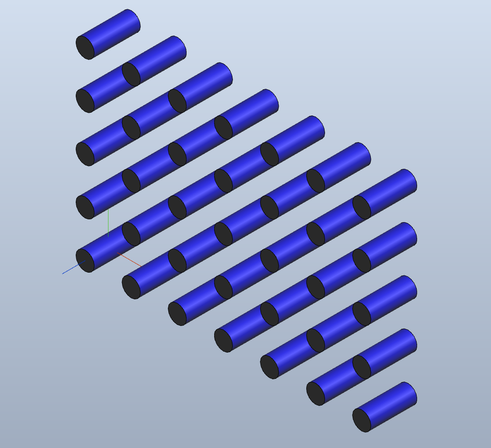

**Рис. 22.** Результирующее составное тело, полученное посредством копирования цилиндра по двумерной сетке в декартовой СК (пример 6.1).


**Пример 6.2. Копирование сферы по сетке в полярной системе координат (рис. 23).**
```cpp
bool run()
{
	// Множитель для преобразования углов из градусной в радианную меру.
	const double DEG_TO_RAD = M_PI / 180.0; 

	// Именователь операции построения элементарного тела
	MbSNameMaker namesElSolid(ct_ElementarySolid, MbSNameMaker::i_SideNone, 0);

	// ИСХОДНОЕ ТЕЛО ДЛЯ КОПИРОВАНИЯ - СФЕРА
	MbSolid* pSphereSolid = NULL;
	// Опорные точки для элементарного тела - сферы
	SArray<MbCartPoint3D> sphPnts(3);
	sphPnts.Add( MbCartPoint3D( 0, 0,  0) );
	sphPnts.Add( MbCartPoint3D( 0, 0, 10) );
	sphPnts.Add( MbCartPoint3D(10, 0,  0) );
	// Построение элементарного тела - сферы
	::ElementarySolid( sphPnts, et_Sphere, namesElSolid, pSphereSolid );  

	// ФОРМИРОВАНИЕ ОБЪЕКТА params С ПАРАМЕТРАМИ ОПЕРАЦИИ КОПИРОВАНИЯ ПО СЕТКЕ
	// Векторы, определяющие полярную СК - направление радиальной оси и
	// направление увеличения полярного угла.
	MbVector3D vecDir1( MbCartPoint3D(0, 0, 0), MbCartPoint3D(100, 0, 0) );
	MbVector3D vecDir2( MbCartPoint3D(0, 0, 0), MbCartPoint3D(0, -100, 0) );
	// Шаг копирования
    const double step1 = 50;
	const double step2 = 30.0*DEG_TO_RAD;
	// Угловой шаг 30 градусов
	// Задание количества копий
	unsigned int num1 = 5;
	unsigned int num2 = 12;
	// В качестве центра СК сетки передается точка, соответствующая центру сферы.
	DuplicationMeshValues params( true /* полярная СК */, vecDir1, step1, num1,
	vecDir2, step2, num2, &sphPnts[0] ); 

	// ПОСТРОЕНИЕ ТЕЛА, СОСТОЯЩЕГО ИЗ КОПИЙ ПО СЕТКЕ
	MbSolid* pDuplSolid = NULL;
	// Именователь операции копирования по сетке
	MbSNameMaker namesDupl(ct_DuplicationSolid, MbSNameMaker::i_SideNone, 0);
	// Вызов операции копирования по сетке
	MbResultType res = ::DuplicationSolid(*pSphereSolid, params, namesDupl, pDuplSolid);

	// Отображение результирующего составного тела
	if ( res == rt_Success )
	show(BLUE, pDuplSolid); 

	// Уменьшение счетчиков ссылок динамически созданных объектов ядра
	/*
	::DeleteItem( pSphereSolid );
	::DeleteItem( pDuplSolid );
	*/
	return true;
}
```
<button id="code_block_6"></button>

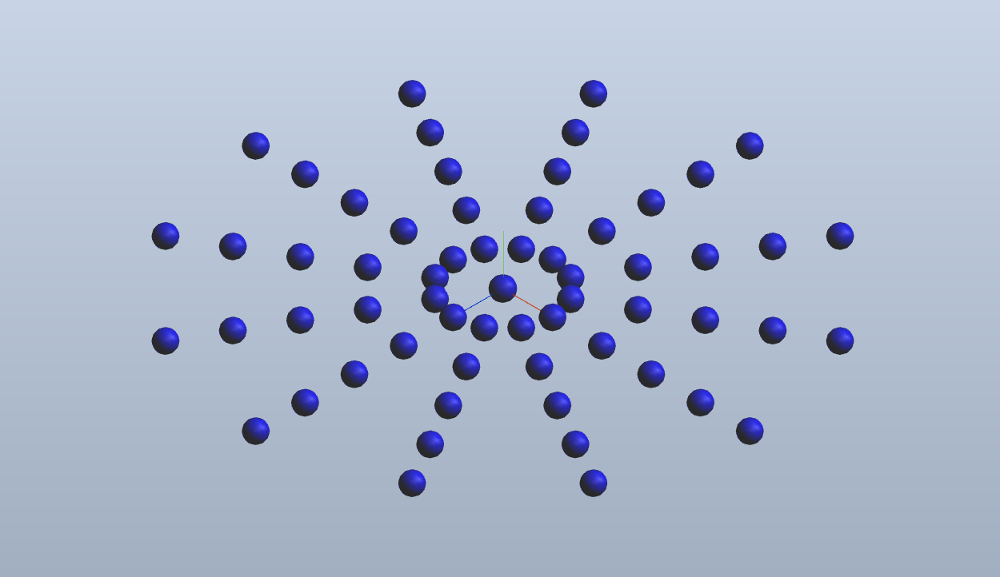


**Рис. 23.** Результирующее составное тело, полученное посредством копирования сферы по двумерной сетке в полярной СК (пример 6.2). 


### Задания(5)
----
1. Постройте два тора одинаковых размеров в перпендикулярных плоскостях XY и XZ. Постройте наборы копий каждого тора. Объедините два набора копий в одно составное тело (рис. 24).

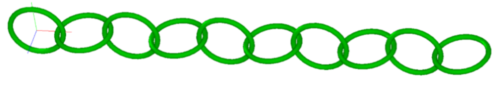


**Рис. 24.** Возможное результирующее тело для задания 6.1.1.


2. Выполните объединение параллелепипеда и набор сфер для получения тела, показанного на рис. 25. Построение этого тела можно разделить на несколько этапов:
 * Построение параллелепипеда (изменяемого тела) по набору опорных точек.
 * Создание одной сферы – исходного тела для последующей операции копирования.
 * Применение в сфере операции копирования по сетке DuplicationSolid. Копии строятся в декартовой системе координат, оси которой параллельны осям X и Z мировой системы координат.
 * Применение булевой операции объединения для параллелепипеда и составного тела, представляющего копии сферы. Параметры, отвечающие за объединение граней и проверку пересечения тел, следует установить равными true.
 * Для проверки правильности построения можно выполнить сдвиг полученного тела и его отображение. В тестовом приложении можно выделить построенное тело щелчком мыши, чтобы убедиться в том, что получено действительно одно сложное тело.

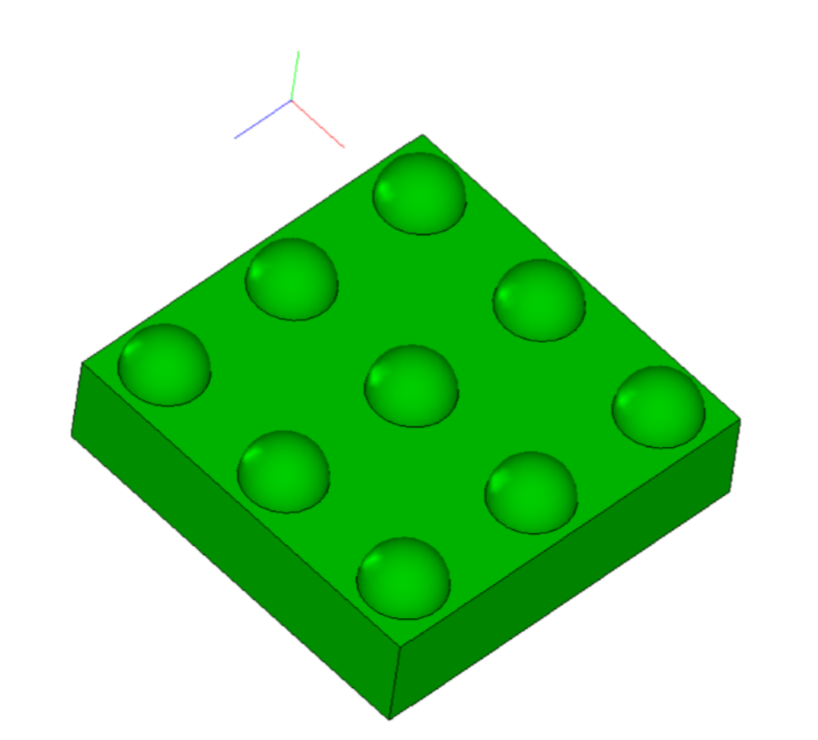


**Рис. 25.** Возможное результирующее тело для задания 6.1.2.

[]Булевы операции с наборами тел Ранее в данной работе в п. 3 рассматривались функции, выполняющие комбинацию булевой операции с операцией построения тел выдавливания, вращения, заметания и по сечениям. Подобные функции, комбинирующие несколько операций моделирования, повышают удобочитаемость исходного текста и обычно выполняются быстрее, чем функции операций, вызываемые по отдельности. В C3D есть подобная функция [UnionResult](doc::/UnionResult) для комбинации булевой операции с операцией объединения набора тел. Прототип этой функции содержит параметры, аналогичные параметрам функции [BooleanResult](doc::/BooleanResult) (п. 2) и функции [UnionSolid](doc::/UnionSolid) (п. 5): 
 ```
MbResultType UnionResult(
	MbSolid*            pSolid,
	MbeCopyMode         sameShell,
	RPArray<MbSolid>&   solids,
	MbeCopyMode         sameShells,
	OperationType       operType,
	bool                checkIntersect,
	bool                mergeFaces,
	const MbSNameMaker& operNames,
	bool                isArray,
	MbSolid*&           result,
	RPArray<MbSolid>*   notGluedSolids = NULL );
```
[]Параметры pSolid и sameShell задают первый операнд булевой операции operType (bo_Union, bo_Intersect или bo_Difference). Остальные параметры аналогичны параметрам функции [UnionSolid](doc::/UnionSolid) для объединения массива тел solids в сложное составное тело. Затем оно используется в качестве второго операнда булевой операции. Результирующее тело возвращается в виде объекта result.
[]В примере 7.1 показано применение функции [UnionResult](doc::/UnionResult) для вычитания из параллелепипеда составного тела, образованного объединением цилиндра, конуса и параллелепипеда меньшего размера (рис. 26). Все элементарные тела создаются по наборам опорных точек и затем три тела добавляются в массив объединяемых тел комбинированной булевой операции. Флаг bMergeFaces позволяет выбрать два варианта построения результирующего тела – с объединением общих граней и без объединения. Результат построения при выключенном объединении общих граней зависит от порядка добавления вычитаемых тел в массив.

**Пример 7.1. Вычитание из параллелепипеда множества тел (рис. 26).**
```cpp
bool run()
{
	// Именователь операции построения элементарного тела
	MbSNameMaker namesElSolid(ct_ElementarySolid, MbSNameMaker::i_SideNone, 0);

	// Исходное тело - параллелепипед (из которого вычитаются остальные три тела)
	MbSolid* pBlockSolid = NULL;
	SArray<MbCartPoint3D> blockPnts(4);
	blockPnts.Add(MbCartPoint3D(  0,  0,   0));
	blockPnts.Add(MbCartPoint3D(  0,  0, 200));
	blockPnts.Add(MbCartPoint3D(200,  0,   0));
	blockPnts.Add(MbCartPoint3D(  0, 50,   0));
	ElementarySolid(blockPnts, et_Block, namesElSolid, pBlockSolid);

	// Исходное тело - цилиндр
	MbSolid* pCylSolid = NULL;
	SArray<MbCartPoint3D> cylPnts(3);
	cylPnts.Add(MbCartPoint3D(175, 30, 175));
	cylPnts.Add(MbCartPoint3D(175, 90, 175));
	cylPnts.Add(MbCartPoint3D(195, 30, 175));
	ElementarySolid(cylPnts, et_Cylinder, namesElSolid, pCylSolid);

	// Исходное тело - конус
	MbSolid* pConeSolid = NULL;
	SArray<MbCartPoint3D> conePnts(3);
	conePnts.Add(MbCartPoint3D(100, 75, 130));
	conePnts.Add(MbCartPoint3D(100, 30, 130));
	conePnts.Add(MbCartPoint3D(100, 30, 190));
	ElementarySolid(conePnts, et_Cone, namesElSolid, pConeSolid);

	// Исходное тело - параллелепипед меньшего размера
	MbSolid * pBlockSmallSolid = NULL;
	SArray<MbCartPoint3D> blockSmPnts(4);
	blockSmPnts.Add(MbCartPoint3D(100, 30, 130));
	blockSmPnts.Add(MbCartPoint3D(100, 30, 200));
	blockSmPnts.Add(MbCartPoint3D(200, 30, 130));
	blockSmPnts.Add(MbCartPoint3D(100, 50, 130));
	ElementarySolid(blockSmPnts, et_Block, namesElSolid, pBlockSmallSolid);

	// Массив объединяемых тел, которые будут вычитаться из pBlockSolid
	RPArray<MbSolid> arrSolids(3);
	arrSolids.Add(pCylSolid);
	arrSolids.Add(pConeSolid);
	arrSolids.Add(pBlockSmallSolid); 

	// Выполнение булевой операции вычитания над pBlock и набором тел arrSolids
	bool bMergeFaces = true;
	// Режим объединения граней
	MbSolid* pResultSolid = NULL;
	MbResultType res = ::UnionResult( pBlockSolid, cm_Same, arrSolids, cm_Same,
		bo_Difference, true, bMergeFaces,
		MbSNameMaker(ct_UnionSolid, MbSNameMaker::i_SideNone, 0),
		false, pResultSolid );
	// Смещение и отображение тела (смещение выполняется для того,
	// чтобы убедиться в корректности результирующего тела).
	if ( res == rt_Success )
	{
	pResultSolid->Move(MbVector3D(MbCartPoint3D(0, 0, 0), MbCartPoint3D(10, 0, 0)));
	show(BLUE, pResultSolid);
	}

	// Уменьшение счетчиков ссылок исходных тел
	/*
	::DeleteItem(pBlockSolid);
	::DeleteItem(pCylSolid);
	::DeleteItem(pConeSolid);
	::DeleteItem(pBlockSmallSolid);
	::DeleteItem(pResultSolid);
	*/
	return true;
}
```
<button id="code_block_7"></button>

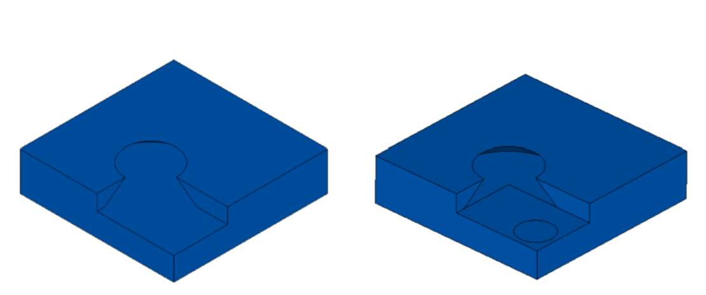


**Рис. 26.** Результирующие тела, полученные с помощью примера 7.1 с объединением подобных граней (слева) и без объединения (справа). 


### Задания(6)
----
1. Постройте модель снеговика из элементарных тел (10 сфер, 2 конуса) согласно рис. 27. Выполните булево объединение этих тел в одно сложное тело с помощью функции UnionResult. Расположите элементарные тела так, чтобы соседние тела незначительно пересекались друг с другом, а не касались и между ними не было пустых промежутков. Для получения усеченного конуса можно сначала построить обычный конус, а затем вычесть из него либо параллелепипед (чтобы отсечь область в окрестности вершины конуса), либо конус, совпадающий по вершине, но отличающийся в основании. Также можно построить усеченный конус как тело по двум круговым сечениям. Просмотрите журнал построения полученного сложного тела. Обратите внимание на то, что у тела имеется только одно имя, но при этом тело содержит большое количество оболочек.

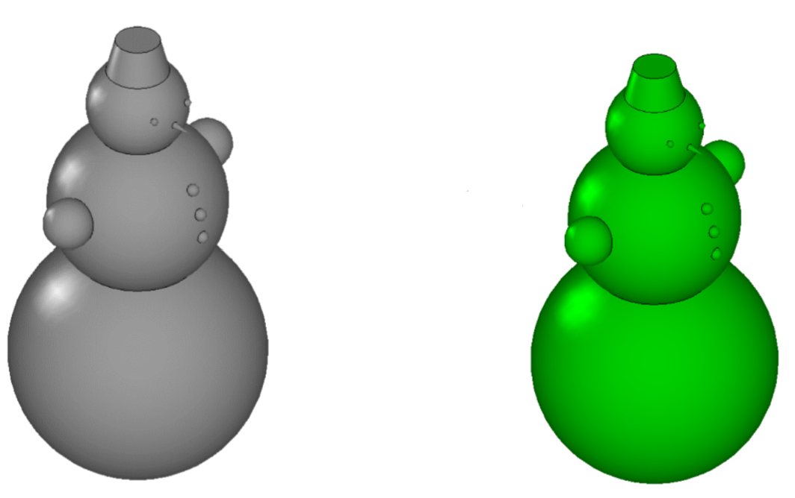


**Рис. 27.** Возможное результирующее тело для задания 7.1.1.


2. С помощью функции UnionResult постройте упрощенную модель стола (рис. 28). Крышку стола можно построить как результат вычитания двух элементарных тел – плит с закругленными концами (тип элементарного тела et_Plate). Ножку стола постройте как тело по трем сечениям (все три сечения – окружности, первая и последняя одинакового диаметра, промежуточное сечение – окружность большего радиуса). Выполните копирование тела – ножки стола. Объедините все полученные тела в одно сложное тело с помощью булевой операции. В журнале построения убедитесь, что получено одно единое тело.

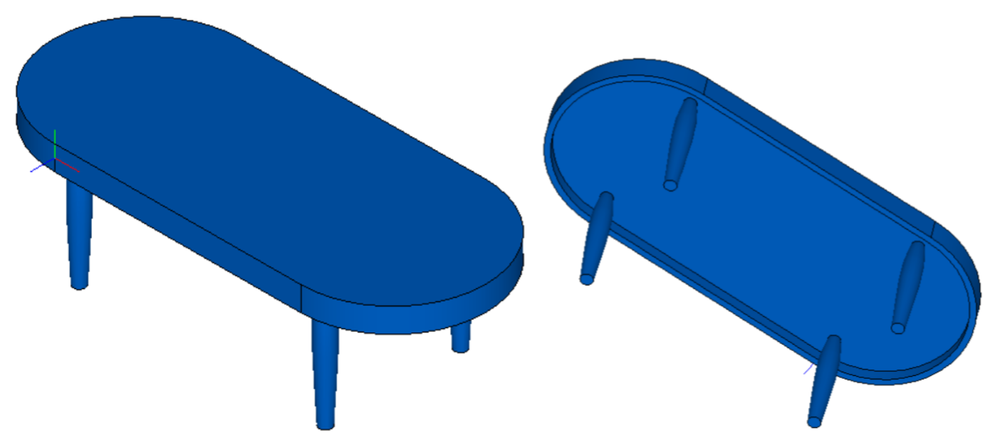


**Рис. 28.** Возможное результирующее тело для задания 7.1.2.

### <a name="title_6"> []()Заключение</a>

[]В данной работе были рассмотрены некоторые функции построения твердых тел, существенно расширяющие возможности геометрического моделирования по сравнению с набором основных операций построения твердых тел из работ №6 и №7.
[]К этим функциям относятся: функция для выполнения булевых операции с парой тел BooleanResult и с множеством тел UnionResult, функция для построения копий тела по координатной сетке DuplicationSolid.
[]Для выполнения булевых операций твердотельного моделирования в C3D есть разные варианты реализации, среди которых можно выбрать наиболее удобный применительно к решаемой задаче. В частности, к ним относятся функции для комбинированного выполнения булевой операции с операциями построения тел выдавливания, вращения, заметания и по сечениям: ExtrusionResult, RevolutionResult, EvolutionResult, LoftedResult, а также комбинация булевой операции с объединением набора тел UnionResult.
[]При выполнении булевых операций часто приходится работать с наборами из нескольких тел и с несвязными телами, состоящими из нескольких частей. В C3D для этого применяются функции разделения несвязного тела на отдельные части – DetachParts и CreateParts и обратная для них функция объединения нескольких тел в одно составное тело – UnionSolid.
[]Материал данной работы имеет важное значение применительно к твердотельному моделированию, поскольку булевы операции являются универсальным инструментом для построения моделей сложных тел посредством комбинирования тел относительно простой формы. В следующих работах будут рассмотрены способы выполнения более специализированных операций над твердыми телами. 