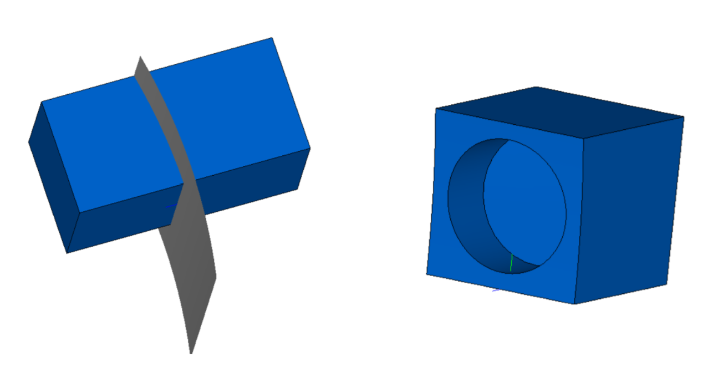

Операции обработки твердых тел
====
-------------------------------------------
### [Построение сечений тел](#title_1)
### [Простой разрез](#title_2)
### [Сложный разрез поверхностью выдавливания](#title_3)
### [Операция симметрии относительно плоскости](#title_4)
### [Разрезы тонкостенных тел на основе сплошных](#title_5)
### [Разрезы тонкостенных тел с постоянной толщиной стенок](#title_6)
### [Разрезы тонкостенных тел с переменной толщиной стенки](#title_7)
### [Заключение](#title_8)
-------------------------------------------
### <a name="title_1"> []()Построение сечений тел</a>

[]С помощью сечений твердых тел можно контролировать их конфигурацию, а также просматривать строение тела внутри его внешней оболочки. Сечения тел в C3D выполняются с помощью операций разрезов тела. Они реализованы в виде нескольких вариантов функции SolidCutting, которые предназначены для построения простых и сложных разрезов. Простые разрезы выполняются посредством сечения тела одной поверхностью, например, плоскостью. Для сложных разрезов используются две и более секущих поверхности, которые задаются с помощью плоского контура.

### <a name="title_2"> []()Простой разрез</a>
[]Вариант функции SolidCutting для построения простого разреза выполняет «отрезание» части тела поверхностью. Эта режущая (также называется секущей) поверхность должна пересекать исходное тело. Часто в качестве режущей поверхности используется плоскость. Функция SolidCutting строит незамкнутую оболочку на базе режущей поверхности и выполняет операцию пересечения исходного тела с незамкнутой оболочкой. В качестве результата функция возвращает тело, представляющее одну из двух частей исходного тела (одна часть расположены выше режущей поверхности, втора часть – ниже). Прототип функции SolidCutting (заголовочный файл [action_solid.h](doc::/action_solid.h)) для построения простого разреза имеет вид:
```cpp
MbResultType SolidCutting(
	MbSolid&                 solid,
	MbeCopyMode              sameShell,
	const MbSurface&         surface,
	int                      part,
	const MbSNameMaker&      operNames,
	bool                     cl osed,
	const MbMergingFlags&    flags,
	MbSolid*&                result ); 
```
**Входные параметры функции:**
1. solid  – исходное тело, разрез которого требуется построить;
2. sameShell  – способ копирования граней тела solid в результирующее тело;
3. surface  – режущая поверхность;
4. part  – направление сечения (+1 или –1). Это значение определяет, какая из частей исходного тела после выполнения разреза будет возвращена в качестве результирующего тела. При part = +1 возвращается часть исходного тела, расположенная выше режущей поверхности, при part = –1 – ниже. Направления «выше» и «ниже» определяются по направлению нормали режущей поверхности.
5. operNames – объект-именователь операции;
6. closed  – в зависимости от значения этого флага при построении сечения тело считается замкнутым (closed = true) или незамкнутым (closed = false);
7. flags  – флаги, задающие способ слияния элементов оболочки (подобных граней и подобных ребер) результирующего тела.

**Выходные данные:**
1. Возвращаемое значение – rt_Success в случае успешного построения или код результата операции типа [MbResultType](doc::/MbResultType), поясняющий возникшую ошибку.
2. result – построенное твердое тело.
 
[]В примере 2.1.1 показано построение сечения тела в виде цилиндра с внутренними полостями (рис. 1). Исходное тело сформировано с помощью булевой операции вычитания: из цилиндра вычитаются два тела, определяющие форму внутренних полостей. Без выполнения разреза визуально определить внутреннее строение такого тела затруднительно. Режущая плоскость в примере 2.1.1 проходит по оси симметрии цилиндра, поэтому при построении сечения образуются две равные части исходного тела. В качестве результирующего тела выбирается часть исходного тела, расположенная снизу от секущей плоскости. После вызова операции простого разреза можно проконтролировать форму внутренних полостей тела (сфера и цилиндр). На рис. 1 представлено исходное тело и результаты выполнения примера 2.1.1 при значении флага closed = true и closed = false. В обоих случаях производится слияние подобных граней и ребер полученного тела.  

**Пример 2.1.1. Построение простого разреза плоскостью (рис. 1).**
```cpp
#include "action_solid.h" 
#include <surf_plane.h>
using namespace c3d;

bool run()
{
    // Объект-именователь для построения элементарных тел
    MbSNameMaker elNames(ct_ElementarySolid, MbSNameMaker::i_SideNone);

    // Построение цилиндра, в котором затем будет построено
    // глухое отверстие и сферическая полость.
    SArray<MbCartPoint3D> pntsCyl(3);
    pntsCyl.Add( MbCartPoint3D(0, 0, 0) );
    pntsCyl.Add( MbCartPoint3D(0, 100, 0) );
    pntsCyl.Add( MbCartPoint3D(25, 0, 0) );
    MbSolid* pCylMain = NULL;
    ::ElementarySolid( pntsCyl, et_Cylinder, elNames, pCylMain ); 

    // Построение цилиндра - образа глухого отверстия
    SArray<MbCartPoint3D> pntsCylHole(3);
    pntsCylHole.Add( MbCartPoint3D(0, 50, 0) );
    pntsCylHole.Add( MbCartPoint3D(0, 100, 0) );
    pntsCylHole.Add( MbCartPoint3D(3, 50, 0) );
    MbSolid* pCylHole = NULL;
    ::ElementarySolid( pntsCylHole, et_Cylinder, elNames, pCylHole ); 

    // Построение сферы - образа полости
    SArray<MbCartPoint3D> pntsSphere(3);
    pntsSphere.Add( MbCartPoint3D(0, 45, 0) );
    pntsSphere.Add( MbCartPoint3D(0, 60, 0) );
    pntsSphere.Add( MbCartPoint3D(15, 45, 0) );
    MbSolid* pSphereCavity = NULL;
    ::ElementarySolid( pntsSphere, et_Sphere, elNames, pSphereCavity ); 

    // Построение глухого отверстия и полости в цилиндре pCylMain с помощью
    // булевой операции разности тел:
    // pSolid = pCylMain - pCylHole - pSphereCavity
    RPArray<MbSolid> holeSolids(2);
    MbSolid* pSolid = NULL;
    holeSolids.Add( pCylHole );
    holeSolids.Add( pSphereCavity );
    ::UnionResult( pCylMain, cm_Same, holeSolids, cm_Same, bo_Difference,
    true, true, MbSNameMaker(ct_UnionSolid, MbSNameMaker::i_SideNone),
    false, pSolid ); 

    // Выполнение операции разрезания тела поверхностью:
    //	1) Инициализация переменных-параметров операции
    //	2) Вызов функции SolidCutting
    // Секущая поверхность: плоскость, построенная по трем точкам
    MbPlane* pCutPlane = new MbPlane( MbCartPoint3D(0, 0, 0),
    MbCartPoint3D(1, 0, 0), MbCartPoint3D(0, 1, 0) );   // Направление отсечения: будет сохранена часть тела, расположенная снизу поверхности
    int part = -1;
    // Объект-именователь для операции построения разреза
    MbSNameMaker operNames( ct_CuttingSolid, MbSNameMaker::i_SideNone );
    // Тело при сечении считается замкнутым (результат показан на рис. 1(б)).
    // В случае closed = false результат будет таким, как на рис. 1(в).
    bool closed = true;
    // Флаги объединения общих граней и ребер
    MbMergingFlags mergeFlags(true, true);
    // pCuttedSolid - часть тела pSolid после выполнения разреза
    MbSolid* pCuttedSolid = NULL;
    // Выполнение операции сечения тела поверхностью
    MbResultType res = ::SolidCutting( *pSolid, cm_Copy, *pCutPlane, part, operNames,
    closed, mergeFlags, pCuttedSolid );
    if (res == rt_Success)
	show( BLUE, pCuttedSolid );
    // Уменьшение счетчиков ссылок динамически созданных объектов ядра
    /*
    ::DeleteItem( pCylMain );
    ::DeleteItem( pCylHole );
    ::DeleteItem( pSphereCavity ); 
    ::DeleteItem( pCutPlane );
    ::DeleteItem( pSolid );
    ::DeleteItem( pCuttedSolid );
    */
    return true;
}
```
<button id="code_block_1"></button>


**Рис. 1.** Результат выполнения простого разреза (пример 2.1.1). (а) Исходное тело. (б) Разрез, полученный в режиме замкнутого результирующего тела при closed = true. (б) Разрез тела, полученный в режиме незамкнутого результирующего тела при closed = false. 


[]При построении простого разреза сечение может выполняться с помощью поверхностей различной формы. В примере 2.1.2 показано построение разреза параллелепипеда с внутренней цилиндрической полостью с помощью билинейной поверхности [MbCoverSurface](doc::/MbCoverSurface). Эта поверхность задается четырьмя граничными кривыми (см. Работу №4, п. 4.6 и п. 7.6.2). В примере 2.1.2 в качестве граничных кривых режущей поверхности используются четыре NURBS-сплайна, проходящие через заданные точки.

**Пример 2.1.2. Построение простого разреза криволинейной поверхностью (рис. 2).**
```cpp
#include <cur_nurbs3d.h>
#include <surf_cover_surface.h>
#include <action_solid.h> 

using namespace c3d;

bool run()
{
	// Объект-именователь для построения элементарных тел
	MbSNameMaker elNames(ct_ElementarySolid, MbSNameMaker::i_SideNone);

	// Построение параллелепипеда pBlock по массиву точек
	SArray<MbCartPoint3D> pntsBlock(4);
	pntsBlock.Add(MbCartPoint3D(-50, 0, -100));
	pntsBlock.Add(MbCartPoint3D(-50, 0, 100));
	pntsBlock.Add(MbCartPoint3D(50, 0, -100));
	pntsBlock.Add(MbCartPoint3D(-50, 100, -100));
	MbSolid* pBlock = NULL; 

	::ElementarySolid(pntsBlock, et_Block, elNames, pBlock); 

	// Построение цилиндра pCyl
	SArray<MbCartPoint3D> pntsCyl(3);
	pntsCyl.Add(MbCartPoint3D(0, 50, -30));
	pntsCyl.Add(MbCartPoint3D(0, 50, 30));
	pntsCyl.Add(MbCartPoint3D(0, 10, -30));
	MbSolid* pCyl = NULL;
	::ElementarySolid(pntsCyl, et_Cylinder, elNames, pCyl); 

	// Построение параллелепипеда с цилиндрической полостью посредством
	// вычитания твердых тел: pSolidWithHole = pBlock - pCyl
	RPArray<MbSolid> holeSolids(2);
	MbSolid* pSolidWithHole = NULL;
	holeSolids.Add(pCyl);
	::UnionResult( pBlock, cm_Same, holeSolids, cm_Same, bo_Difference, true, true,


	MbSNameMaker(ct_UnionSolid, MbSNameMaker::i_SideNone, 0),
	false, pSolidWithHole ); 

	// Массивы точек для построения четырех граничных кривых режущей поверхности
	SArray<MbCartPoint3D> pntsCurv1(3);
	pntsCurv1.Add(MbCartPoint3D(-100, 100, 20));
	pntsCurv1.Add(MbCartPoint3D(0,100, 20));
	pntsCurv1.Add(MbCartPoint3D(100, 100, 20)); 

	SArray<MbCartPoint3D> pntsCurv2(3);
	pntsCurv2.Add(MbCartPoint3D(100, 100, 20));
	pntsCurv2.Add(MbCartPoint3D(100, 0, 0));
	pntsCurv2.Add(MbCartPoint3D(100, -100, 20)); 

	SArray<MbCartPoint3D> pntsCurv3(3);
	pntsCurv3.Add(MbCartPoint3D(100, -100, 20));
	pntsCurv3.Add(MbCartPoint3D(0, -100, 20));
	pntsCurv3.Add(MbCartPoint3D(-100, -100, 20)); 

	SArray<MbCartPoint3D> pntsCurv4(3);
	pntsCurv4.Add(MbCartPoint3D(-100, -100, 20));
	pntsCurv4.Add(MbCartPoint3D(-100, 0, 0));
	pntsCurv4.Add(MbCartPoint3D(-100, 100, 20)); 

	// Построение граничных кривых режущей поверхности в виде NURBS-сплайнов,
	// проходящих через заданные точки
	ptrdiff_t degree = 3;
	MbNurbs3D* pCurve1 = MbNurbs3D::Create(degree, pntsCurv1, false);
	MbNurbs3D* pCurve2 = MbNurbs3D::Create(degree, pntsCurv2, false);
	MbNurbs3D* pCurve3 = MbNurbs3D::Create(degree, pntsCurv3, false);
	MbNurbs3D* pCurve4 = MbNurbs3D::Create(degree, pntsCurv4, false); 

	// Построение режущей поверхности pCutSurface (билинейная поверхность)
	MbCoverSurface* pCutSurface = new MbCoverSurface( *pCurve1, *pCurve2,
	*pCurve3, *pCurve4 );
	// Направление отсечения: будет сохранена часть тела, расположенная сверху
	// режущей поверхности
	int cutDir = 1;
	// Объект-именователь для операции построения разреза
	MbSNameMaker operNames( ct_CuttingSolid, MbSNameMaker::i_SideNone, 0 );
	// Тело при сечении считается замкнутым
	bool closed = true;
	// Флаги объединения общих граней и ребер
	MbMergingFlags mergeFlags(true, true);
	// pCuttedSolid - часть тела pSolid после выполнения разреза
	MbSolid* pCuttedSolid = NULL; 


	// Выполнение операции сечения тела поверхностью
	MbResultType res = ::SolidCutting( *pSolidWithHole, cm_Copy, *pCutSurface,
	cutDir, operNames, closed,
	mergeFlags, pCuttedSolid );
	if (res == rt_Success)
	show( BLUE, pCuttedSolid ); 

	// Уменьшение счетчиков ссылок динамически созданных объектов ядра
	/*
	::DeleteItem(pBlock);
	::DeleteItem(pCurve1);
	::DeleteItem(pCurve2);
	::DeleteItem(pCurve3);
	::DeleteItem(pCurve4);
	::DeleteItem(pCutSurface);
	::DeleteItem(pSolidWithHole);
	::DeleteItem(pCuttedSolid);
	*/
	return true;
} 
```

<button id="code_block_2"></button>




**Рис. 2.** Результат выполнения простого разреза билинейной поверхностью (пример 2.1.2). Слева показано исходное тело (параллелепипеда c цилиндрической полостью) и режущая поверхность, справа – результирующее тело после выполнения разреза.

### <a name="title_3"> []()Сложный разрез поверхностью выдавливания</a>

[]Сложный разрез твердого тела можно построить с помощью варианта функции SolidCutting в котором в качестве режущей поверхности используется поверхность выдавливания. Данный вариант функции SolidCutting позволяет использовать режущие поверхности более сложного вида по сравнению с построением простого разреза. В отличие от простого разреза (п. 2.1), для которого требовалось явно указать режущую поверхность в виде объекта класса [MbSurface](doc::/MbSurface), в данном случае применяется неявное описание режущей поверхности на основе образующей кривой и направления выдавливания. Такой способ аналогичен построению поверхностей выдавливания и твердых тел выдавливания. Образующая кривая для режущей поверхности задается в виде плоского контура. Ниже приведен прототип этой функции SolidCutting. Полужирным курсивом выделены входные параметры, отличающиеся от варианта функции для простого разреза.
**<i>const MbPlacement3D&	place,</i>**
**<i>const MbContour&		contour,</i>**
**<i>const MbVector3D&		direction,</i>**
```cpp
MbResultType SolidCutting(
                    MbSolid&                 solid,
					MbeCopyMode              sameShell,
					const MbPlacement3D&     place,
					const MbContour&         contour,
					const MbVector3D&        direction,
					int                      part,
                    const MbSNameMaker&      operNames,
                    bool                     closed,
                    MbSolid*&                result );
```
**Входные параметры функции:**
1. solid  – исходное тело, разрез которого требуется построить;
2. sameShell  – способ копирования граней тела solid в результирующее тело;
3. place   – система координат, задающая положение образующей кривой режущей поверхности;
4. contour  – плоский контур, используемый в качестве образующей кривой режущей поверхности выдавливания;
5. direction  – направление выдавливания для построения режущей поверхности;
6. part  – направление сечения (+1 или –1, задается аналогично простому разрезу, см. п. 2.1);
7. operNames – объект-именователь операции;
8. closed  – в зависимости от значения этого флага при построении сечения тело считается замкнутым (closed = true) или незамкнутым (closed = false);
9. flags  – флаги, задающие способ слияния элементов оболочки (подобных граней и подобных ребер) результирующего тела. 
 
**Выходные данные:**
1. Возвращаемое значение – rt_Success в случае успешного построения или код результата операции типа [MbResultType](doc::/MbResultType), поясняющий возникшую ошибку.
2. result – построенное твердое тело.
 
[]Для построения режущей поверхности функция [SolidCutting](doc::/SolidCutting) выполняет выдавливание плоского контура contour в заданном направлении direction. Плоский контур лежит в плоскости XY локальной системы координат place. В качестве направления выдавливания direction может быть указан нулевой вектор, в таком случае выдавливание будет производиться в направлении оси Z локальной системы координат контура place. Длина направляющего отрезка автоматически вычисляется таким образом, чтобы режущая поверхность пересекала исходное тело solid целиком. В качестве результата result возвращается часть исходного тела в виде незамкнутой оболочки.
 


**Рис. 3.** Построение сложного разреза (пример 2.2.1) поверхностью выдавливания. Слева показано исходное тело, справа – результирующее.


[]На рис. 3 показан сложный разрез, полученный с помощью примера 2.2.1. Образующая кривая режущей поверхности показана справа на рис. 3 в виде двух отрезков синего цвета, пересекающихся под прямым углом. Контур, состоящий из двух этих отрезков, лежит в плоскости XZ глобальной системы координат.  Построение исходного тела (рис. 3, слева) в примере 2.2.1 выполняется с помощью вспомогательной функции CreateSourceSolid. Эта довольно громоздкая функция разделена на 8 этапов. В исходном тексте часть действий оформлена в виде безымянных блоков операторов {…}, которые позволяют скрыть использование локальных переменных в пределах этих блоков и несколько повышают удобочитаемость исходного текста. На этапах 1-5 функция CreateSourceSolid выполняет построение твердых тел, которые затем на этапах 6-8 позволяют получить требуемое исходное тело с помощью булевых операций объединения и вычитания. Булева операция вычитания используется для построения трех отверстий (центрального и бокового в основном цилиндре, а также в отверстия в боковой части).  Построение сечения (рис. 3, справа) в примере 2.2.1 выполняется внутри функции run. Сначала производится построение исходного тела с помощью вызова CreateSourceSolid, затем построение образующего контура режущей поверхности и вызов функции ядра [::SolidCutting](doc::/SolidCutting). Результат построения разреза сохраняется в виде твердого тела pCuttedSolid. 
 
**Пример 2.2.1. Построение сложного разреза поверхностью выдавливания (рис. 3).**
```cpp
#include <action_solid.h>
#include <alg_curve_fillet.h> 
#include <cur_polyline.h>
#include <surf_plane.h>

using namespace c3d;

// Построение исходного твердого тела для последующего сечения
void CreateSourceSolid(MbSolid*& _pSolid)
{
    // Объект-именователь для построения элементарных тел
    MbSNameMaker elNames(ct_ElementarySolid, MbSNameMaker::i_SideNone);

    // 1) Цилиндр - основная часть исходного тела
    MbSolid* pCyl = NULL;
    {
    SArray<MbCartPoint3D> pntsCyl(3);
    pntsCyl.Add(MbCartPoint3D(0, 0, -80));
    pntsCyl.Add(MbCartPoint3D(0, 150, -80));
    pntsCyl.Add(MbCartPoint3D(50, 0, -80));
    ::ElementarySolid(pntsCyl, et_Cylinder, elNames, pCyl);
    } 

    // 2) Построение цилиндра - образа центрального отверстия внутри pCyl
    MbSolid* pCylDif = NULL;
    {
    SArray<MbCartPoint3D> pntsCylDif(3);
    pntsCylDif.Add(MbCartPoint3D(0, 0, -80));
    pntsCylDif.Add(MbCartPoint3D(0, 150, -80));
    pntsCylDif.Add(MbCartPoint3D(40, 0, -80));
    ::ElementarySolid(pntsCylDif, et_Cylinder, elNames, pCylDif);
    } 

    // 3) Построение цилиндра - образа поперечного отверстия в боковой поверхности pCyl
    MbSolid* pCylDifSide = NULL;
    {
    SArray<MbCartPoint3D> pntsCylDifSide(3); 
    pntsCylDifSide.Add(MbCartPoint3D(51, 100, -80));
    pntsCylDifSide.Add(MbCartPoint3D(-51, 100, -80));
    pntsCylDifSide.Add(MbCartPoint3D(51, 110, -80));
    ::ElementarySolid(pntsCylDifSide, et_Cylinder, elNames, pCylDifSide);
    } 

    // 4) Построение тела выдавливания, соединенного с основным цилиндром pCyl
    MbSolid* pSolidSide = NULL;
    {
    // Замкнутый контур - образующая для построения тела pSolidSide
    RPArray<MbContour> arrContours;
    SArray<MbCartPoint> arrPnts(8);
    arrPnts.Add(MbCartPoint(-20, 0));
    arrPnts.Add(MbCartPoint(-20, 10));
    arrPnts.Add(MbCartPoint(20, 10));
    arrPnts.Add(MbCartPoint(20, 0));
    MbPolyline* pPolyline = new MbPolyline(arrPnts, true);
    MbContour* pContourPolyline = NULL;
    ::FilletPolyContour( pPolyline, 5 /* Радиус скругления */, false,
    arrPnts[1], pContourPolyline);
    ptrdiff_t idxSideRight = 2;
    pContourPolyline->FilletTwoSegments(idxSideRight, 5 /* Радиус скругления */);
    arrContours.push_back(pContourPolyline); 


    MbPlane* pPlaneXY = new MbPlane(MbCartPoint3D(0, 0, 0),
    MbCartPoint3D(1, 0, 0), MbCartPoint3D(0, 1, 0));
    MbSweptData sweptData(*pPlaneXY, arrContours);
    MbVector3D dir(0, 0, -1);
    const double HEIGHT_FORWARD = 40.0, HEIGHT_BACKWARD = 0;
    ExtrusionValues extrusionParam(HEIGHT_FORWARD, HEIGHT_BACKWARD);
    extrusionParam.side1.way = sw_shell;
    MbSNameMaker operNames(ct_CurveExtrusionSolid, MbSNameMaker::i_SideNone, 0);
    PArray<MbSNameMaker> cNames(0, 1, false);
    ::ExtrusionSolid( sweptData, dir, pCyl, NULL, false, extrusionParam,
    operNames, cNames, pSolidSide );

    ::DeleteItem(pPlaneXY);
    }

    // 5) Построение цилиндра - образа отверстия в теле выдавливания pSolidSide
    MbSolid* pCylHoleSide = NULL;
    {
    SArray<MbCartPoint3D> pnts(3);
    pnts.Add(MbCartPoint3D(0, 0, -15));
    pnts.Add(MbCartPoint3D(0, 10, -15));
    pnts.Add(MbCartPoint3D(0, 0, -10));
    ::ElementarySolid(pnts, et_Cylinder, elNames, pCylHoleSide);
    } 

    // 6) Формирование центрального и боковых отверстий pCyl:
    // pMainSolid = pCyl - pCylDif - pCylDifSide;
    MbSolid* pMainSolid = NULL;
    {
    RPArray<MbSolid> holeSolids(2);
    holeSolids.Add(pCylDif);
    holeSolids.Add(pCylDifSide);
    ::UnionResult( pCyl, cm_Same, holeSolids, cm_Same, bo_Difference, true, true,
    MbSNameMaker(ct_UnionSolid, MbSNameMaker::i_SideNone, 0),
    false, pMainSolid );
    } 

    // 7) Построение отверстия в теле выдавливания pSolidSide: 

    // pSolidSide = pSolidSide - pCylHoleSide
    MbSNameMaker operBoolNames(ct_BooleanSolid, MbSNameMaker::i_SideNone, 0);
    MbBooleanFlags flagsBool;
    flagsBool.InitBoolean(true);
    flagsBool.SetMergingFaces(true);
    flagsBool.SetMergingEdges(true);
    ::BooleanResult( *pSolidSide, cm_Copy, *pCylHoleSide, cm_Copy, bo_Difference,
    flagsBool, operBoolNames, pSolidSide ); 

    // 8) Объединение основного тела и тела выдавливания
    ::BooleanResult( *pMainSolid, cm_Copy, *pSolidSide, cm_Copy, bo_Union,
    flagsBool, operBoolNames, _pSolid ); 

    // Уменьшение счетчиков ссылок динамически созданных объектов ядра
    /*
    ::DeleteItem(pCyl);
    ::DeleteItem(pCylDif);
    ::DeleteItem(pCylDifSide);
    ::DeleteItem(pSolidSide);
    ::DeleteItem(pCylHoleSide);
    ::DeleteItem(pMainSolid);
    */
} 


bool run()
{
    // 1) Построение исходного тела с помощью вспомогательной функции
    MbSolid* pSourceSolid = NULL;
    CreateSourceSolid(pSourceSolid); 

    // 2) Построение контура - образующей кривой режущей поверхности выдавливания
    MbContour* pContour = NULL;
    {
    SArray<MbCartPoint> arrPnts(3);
    arrPnts.Add(MbCartPoint(50, -80));
    arrPnts.Add(MbCartPoint(0, -80));
    arrPnts.Add(MbCartPoint(0, 0));
    MbPolyline* pPolyline = new MbPolyline(arrPnts, false);
    pContour = new MbContour(*pPolyline, true);
    //::DeleteItem( pPolyline );
    } 

    // 3) Локальная СК контура: повернута на 90 градусов вокруг оси X глобальной СК,
    // чтобы контур располагался в плоскости XZ глобальной СК.
    MbPlacement3D plContour;
    const double DEG_TO_RAD = M_PI / 180.0;
    plContour.Rotate(MbAxis3D(MbVector3D(MbCartPoint3D(0, 0, 0),
    MbCartPoint3D(1, 0, 0))), 90 * DEG_TO_RAD); 

    // 4) Вызов функции SolidCutting для сечения тела поверхностью выдавливания 

    MbSolid* pCuttedSolid = NULL;
    MbSNameMaker operNames((SimpleName)ct_CuttingSolid, MbSNameMaker::i_SideNone, 0);
    int  partNum = 1;
    // Получение части тела, расположенной выше режущей поверхности
    bool closed = true;
    // Полученное замкнутого тела
    // Направление выдавливания.
    // Вектор dir задает направление проецирования исходного тела на плоскость
    // образующего контура. СК plContour направлена так, что контур лежит в плоскости XZ
    // глобальной СК. Чтобы получить проекцию исходного тела на эту плоскость, надо
    // выполнить проецирование в отрицательном направлении оси OY глобальной СК.
    // Именно это направление и задает вектор направления выдавливания dir.
    // Это направление противоположно тому направлению, в котором бы двигался режущий
    // контур относительно исходного тела.
    MbVector3D dir( MbCartPoint3D(0, 0, 0), MbCartPoint3D(0, -1, 0) ); 

    MbMergingFlags mergeFlags(true, true);  // Флаги, задающие слияние граней и ребер
    MbResultType res = ::SolidCutting( *pSourceSolid, cm_Copy, plContour, *pContour, dir,
    partNum, operNames, closed, mergeFlags, pCuttedSolid );  

    // 5) Отображение тела после сечения и образующего контура режущей поверхности
    if (res == rt_Success)
    {
		show( BLUE, pCuttedSolid );

		show( Style(1, RGB(0, 0, 255)), pContour, &plContour );
    } 

    // 6) Уменьшение счетчиков ссылок динамически созданных объектов ядра
    /*
    ::DeleteItem(pSourceSolid);
    ::DeleteItem(pCuttedSolid);
    ::DeleteItem(pContour);
    */
    return true;
}
```

<button id="code_block_3"></button>

### Задания(1)
----
1. С помощью булевых операций постройте тело, аналогичное показанному на рис. 4(а, б). Подобное тело можно получить посредством операции объединения двух цилиндров и последующего вычитания трех цилиндров, представляющих глухие отверстия. Постройте простой разрез полученного тела с помощью режущей плоскости, проходящей через центральную ось симметрии исходного тела (рис. 4в).  


**Рис. 4.** Возможное исходное тело (а, б) и результат построения простого разреза (в) для задания 2.3.1. 


2. Постройте исходное в виде конуса со сквозным круговым отверстием. Ось отверстия параллельна основанию конуса и пересекает вертикальную ось конуса. Основание конуса лежит в плоскости XZ мировой СК, ось конуса ориентирована в направлении +Y. Постройте простые разрезы исходного тела плоскостью XY (рис. 5а) и плоскостью, параллельной XZ (рис. 5(б, в)). При построении разрезов плоскостью, параллельной XZ, получите две части – одну выше секущей плоскости (рис. 5б), вторую – ниже (рис. 5в). Выясните, чем отличается результат при построении сечения в режиме замкнутого (closed = true)и незамкнутого тела (closed = false).


**Рис. 5.** Результирующие тела для задания 2.3.2. 


3. Постройте простой разрез цилиндра криволинейной поверхностью, пересекающей ось цилиндра (рис. 6). Построение можно выполнить аналогично примеру 2.1.2. Получите результат разреза в виде замкнутого и незамкнутого тела (в виде оболочки). Выполните поочередно отображение обеих частей исходного тела (расположенных выше и ниже режущей поверхности).


**Рис. 6.** Возможное исходное и результирующее тело для задания 2.3.3.  


4. Постройте цилиндр с глухим коническим отверстием выполните сложный разрез этого тела с помощью поверхности выдавливания (рис. 7).  


**Рис. 7.** Возможный результат выполнения задания 2.3.4.   


5. Постройте цилиндрическое тело с пятью сквозными круглыми отверстиями (рис. 8а). Для построения отверстий используйте функцию DuplicationMeshValues (см. Работу №8, п. 6). С помощью этой функции постройте копии цилиндра, представляющего центральное отверстие, и затем примените булеву операцию вычитания множества тел (пяти цилиндров) для получения исходного тела, показанного на рис. 8а. Постройте сложный разрез исходного тела поверхностью выдавливания аналогично рис. 8б. 
 


**Рис. 8.** Исходное и результирующее тело для задания 2.3.5. 


6. Выполните сложный разрез тела с помощью режущей поверхности выдавливания согласно рис. 9. Исходное тело можно построить как тело выдавливания, а в качестве образующей кривой для режущей поверхности можно использовать контур-ломаную, состоящую из пяти отрезков.


**Рис. 9.** Исходное и результирующее тело для задания 2.3.6.  

### <a name="title_4"> []()Операция симметрии относительно плоскости</a>

[]Форма некоторых твердых тел характеризуется свойствами плоской симметрии. В подобных случаях моделирование тел иногда удается упростить за счет построения одной или нескольких составных частей тела относительно простой формы, над которыми затем выполняется операция симметрии относительно плоскости. Эта операция также называется зеркальной симметрией. Для ее выполнения в ядре C3D предназначена функция SymmetrySolid. Прототип функции зеркальной симметрии приведен ниже:
```cpp
MbResultType SymmetrySolid(
                    MbSolid&              solid,
					MbeCopyMode           sameShell,
					const MbPlacement3D&  place,
					const MbSNameMaker&   operNames,
					MbSolid*&             result );
```
**Входные параметры функции:**
1. solid  – исходное тело для зеркального отражения;
2. sameShell  – способ копирования граней тела solid в результирующее тело;
3. place   – локальная система координат. В качестве плоскости симметрии используется плоскость XY этой СК.
4. operNames – объект-именователь операции.
 
**Выходные данные:**
1. Возвращаемое значение – rt_Success в случае успешного построения или код результата операции типа [MbResultType](doc::/MbResultType), поясняющий возникшую ошибку.
2. result – результирующее твердое тело. Представляет собой объединение исходного тела и его копии, полученной отражением относительно плоскости симметрии.
 
[]Применение функции SymmetrySolid часто позволяет сократить количество программных вызовов функций ядра, необходимых для построения требуемого тела. Например, эта функция может применяться при построении симметричных тел выдавливания, образующие кривые которых содержат большое количество сегментов, особенно, фасок и скруглений (см. Работу №3, п. 2.3). Функция SymmetrySolid позволяет сократить размер массива точек для построения образующего контура, уменьшить количество вызовов методов построения скруглений и фасок. Этот прием демонстрируется в примере 3.1 (рис. 10). В нем выполняется построение четверти тела выдавливания и последующее двукратное отражение этой части относительно плоскостей симметрии с помощью функции SymmetrySolid. Конечно, приведенный способ построения результирующего тела (рис. 10г) не является единственным. Но его программная реализация проще, чем, например, построение тела выдавливания посредством описания полного образующего контура или построение массива из четырех составных частей, показанных на рис. 10б, с последующим явным поворотом и вызовом булевой операции объединения этих частей. 
 
**Пример 3.1. Построение тела с помощью операции зеркальной симметрии (рис. 10).**
```cpp
#include <action_solid.h>
#include <alg_curve_fillet.h> 
#include <cur_polyline.h>
#include <surf_plane.h>
using namespace c3d;
 
// Построение образующего контура тела выдавливания (рис. 10а)
void CreateSketch( RPArray<MbContour>& _arrContours )
{
	SArray<MbCartPoint> arrPnts(6);
	arrPnts.Add(MbCartPoint(20, 0));
	arrPnts.Add(MbCartPoint(20, 30));
	arrPnts.Add(MbCartPoint(30, 30));
	arrPnts.Add(MbCartPoint(30, 50));
	arrPnts.Add(MbCartPoint(0, 50));
	arrPnts.Add(MbCartPoint(0, 0));
	MbPolyline* pPolyline = new MbPolyline(arrPnts, true);
	MbContour* pContourPolyline = NULL;
	::FilletPolyContour(pPolyline, 5, false, arrPnts[1], pContourPolyline);
	ptrdiff_t idxSideRight = 2;
	ptrdiff_t idxSideRight2 = 3;
	pContourPolyline->FilletTwoSegments(idxSideRight, 5);
	pContourPolyline->FilletTwoSegments(idxSideRight2, 5); 

	_arrContours.push_back(pContourPolyline);
} 

bool run()
{
	// 1) Получение образующей кривой для исходной части требуемого тела
	// (эта часть выглядит как четверть результирующего тела, рис. 10б)
	RPArray<MbContour> arrContours;
	CreateSketch(arrContours);  
	
	// 2) Построение исходной составной части pPart1 (рис. 10б) как тела выдавливания
	// с образующей кривой arrContours (рис. 10а)
	MbSolid* pPart1 = NULL;
	{
		MbPlane* pPlaneXY = new MbPlane(MbCartPoint3D(0, 0, 0),
		MbCartPoint3D(1, 0, 0), MbCartPoint3D(0, 1, 0));
		MbSweptData sweptData(*pPlaneXY, arrContours);
		// Направление выдавливания
		MbVector3D dir(MbCartPoint3D(0, 0, 0), MbCartPoint3D(0, 0, 1));

		const double HEIGHT_FORWARD = 10.0, HEIGHT_BACKWARD = 0;
		ExtrusionValues extrusionParams(HEIGHT_FORWARD, HEIGHT_BACKWARD);
		MbSNameMaker operNames(ct_CurveExtrusionSolid, MbSNameMaker::i_SideNone, 0);
		PArray<MbSNameMaker> cNames(0, 1, false);
		::ExtrusionSolid( sweptData, dir, NULL, NULL, false, extrusionParams,
		operNames, cNames, pPart1 );
		::DeleteItem(pPlaneXY);
	} 

	// 3) Вызов операции зеркальной симметрии для тела pPart1, чтобы построить
	// тело pPart2, представляющее собой половину требуемого тела (рис. 10в).
	MbSolid* pPart2 = NULL;
	const double DEG_TO_RAD = M_PI / 180.0;
	// Именователь для функции SymmetrySolid
	MbSNameMaker operNames(ct_SymmetrySolid, MbSNameMaker::i_SideNone);
	// Локальная СК, относительно плоскости XY которой будет выполняться симметрия
	MbPlacement3D plSym;
	// Поворот СК плоскости симметрии чтобы ее плоскость XY совпала с
	// плоскостью YZ глобальной СК
	plSym.Rotate(MbAxis3D(MbVector3D(MbCartPoint3D(0, 0, 0),
	MbCartPoint3D(0, 1, 0))), -90 * DEG_TO_RAD);
	MbResultType resPart2 = ::SymmetrySolid(*pPart1, cm_Copy, plSym, operNames, pPart2); 

	// 4) Вызов операции зеркальной симметрии для тела pPart2 для построения
	// результирующего тела pSolid (рис. 10г).
	MbSolid* pSolid = NULL;
	if ( resPart2 == rt_Success )
	{
		// Поворот локальной СК, чтобы ее XY совпала с плоскостью XZ мировой СК

		plSym.Rotate(MbAxis3D(MbVector3D(MbCartPoint3D(0, 0, 0),
		MbCartPoint3D(0, 0, 1))), 90 * DEG_TO_RAD);

		MbResultType res = ::SymmetrySolid(*pPart2, cm_Copy, plSym, operNames, pSolid );
		if (res == rt_Success)

		show(Style(1, LIGHTGRAY), pSolid);
	} 

	// 5) Уменьшение счетчиков ссылок динамически созданных объектов ядра
	/*
	::DeleteItem(pPart1);
	::DeleteItem(pPart2);
	::DeleteItem(pSolid);
	*/
	return true;
}
```
<button id="code_block_4"></button>


**Рис. 10.** Последовательность действий для построения тела, характеризующегося плоской симметрией (пример 3.1). (а) Контур для построения исходной составной части требуемого тела. (б) Составная часть, построенная на основе контура (а). (в) Тело, полученное в результате зеркального отражения тела (б). (г) Результирующее тело, полученное зеркальным отражением тела (в).


[]Функция SymmetrySolid возвращает результирующее тело, представляющее собой объединение исходного тела с его зеркальной копией. Эта функция удобна для построения сложных симметричных тел из отдельных частей. В ядре также есть похожая функция MirrorSolid симметрии относительно плоскости, упрощающая копирование тел. В отличие от SymmetrySolid, функция MirrorSolid не выполняет объединение тел, а возвращает зеркально отраженную копию исходного тела. Прототип этой функции аналогичен функции SymmetrySolid (за исключением одного параметра sameShell): 
```cpp
MbResultType MirrorSolid(
                   MbSolid&              solid,
                   const MbPlacement3D&  place,
                   const MbSNameMaker&   operNames,
				   MbSolid*&             result );
```
[]В качестве результирующего тела result функция MirrorSolid возвращает зеркальную копию исходного тела solid, полученную отражением относительно плоскости XY локальной системы координат place. В примере 3.2 выполняется построение зеркальной копии тела, построенного по сечениям. Исходное тело отражается относительно плоскости ZY мировой системы координат. После вызова функции MirrorSolid в примере 3.2 формируется два одинаковых независимых тела, расположенных на равных расстояниях относительно плоскости симметрии.

**Пример 3.2. Построение копии тела с помощью операции зеркальной симметрии (рис. 11).**
```cpp
#include <action_solid.h> 
#include <cur_arc.h>
#include <surf_plane.h>

using namespace c3d;

// Построение контуров для тела по сечениям и поверхностей,
// задающих расположение этих контуров
void CreateSketch(RPArray<MbContour>& _arrContours, RPArray<MbSurface>& _surfaces)
{
    // Количество поперечных круговых сечений
    const int CONTOUR_COUNT = 4;
    // Радиусы круговых сечений
    const double RAD[CONTOUR_COUNT] = { 20, 50, 20, 40 }; 

    // Плоские круговые контуры, представляющие сечения тела
    MbArc* pArc[CONTOUR_COUNT] = { 0 };
    for (int i = 0; i < CONTOUR_COUNT; i++)
	    pArc[i] = new MbArc(MbCartPoint(0, 0), RAD[i]); 

    // Локальные СК, задающие расположение сечений тела
    MbPlacement3D plArc[CONTOUR_COUNT] = {
	    MbPlacement3D(MbCartPoint3D(100,0, 0),
		    MbCartPoint3D(101, 0, 0), MbCartPoint3D(100, 0, 1)),
	    MbPlacement3D(MbCartPoint3D(100,  60, 0),
		    MbCartPoint3D(101,  60, 0), MbCartPoint3D(100,  60, 1)),
	    MbPlacement3D(MbCartPoint3D(100, 100, 0),
		    MbCartPoint3D(101, 100, 0), MbCartPoint3D(100, 100, 1)),
	    MbPlacement3D(MbCartPoint3D(100, 130, 0),
		    MbCartPoint3D(101, 130, 0), MbCartPoint3D(100, 130, 1))
    }; 

    // Поверхности, содержащие сечения тела (плоскости, расположение которых
    // задается системами координат plArc)
    MbSurface* pSurfArc[CONTOUR_COUNT] = { 0 };
    for (int i = 0; i < CONTOUR_COUNT; i++)
	    pSurfArc[i] = new MbPlane(plArc[i]); 

    // Представление сечений тела в виде контуров
    MbContour* pContourArc[CONTOUR_COUNT] = { 0 };
    for (int i = 0; i < CONTOUR_COUNT; i++)
	    pContourArc[i] = new MbContour(*pArc[i], true); 

    // Сохранение выходных данных
    for (int i = 0; i < CONTOUR_COUNT; i++)
    {
	    _arrContours.push_back(pContourArc[i]);
	    _surfaces.push_back(pSurfArc[i]);
    } 

    // Уменьшение счетчиков ссылок динамически созданных объектов ядра
    /*	for (int i = 0; i < CONTOUR_COUNT; i++)
	    ::DeleteItem(pArc[i]);
    */
}

bool run()
{
    // 1) Построение исходного тела pSolid по сечениям
    RPArray<MbSurface> surfaces;
    RPArray<MbContour> arrContours;
    CreateSketch(arrContours, surfaces);
    MbSolid* pSolid = NULL;
    LoftedValues loftedParams;
    MbSNameMaker loftNames(ct_CurveLoftedSolid);
    PArray<MbSNameMaker> contourNames(0, 1, false);
    MbResultType resSolid = ::LoftedSolid(surfaces, arrContours, NULL, loftedParams,
	    NULL, NULL, loftNames, contourNames, pSolid); 

    // 2) Построение для тела pSolid его зеркальной копии pSolidCopy
    MbSolid* pSolidCopy = NULL;
    // Локальная СК, у которой плоскость XY совпадает с плоскостью YZ глобальной СК
    MbPlacement3D plSym;
    const double DEG_TO_RAD = M_PI / 180.0;
    plSym.Rotate( MbAxis3D(MbVector3D(MbCartPoint3D(0, 0, 0), MbCartPoint3D(0, 1, 0))),
	    -90 * DEG_TO_RAD );
    MbSNameMaker symNames(ct_SymmetrySolid);
    MbResultType resSolidCopy = ::MirrorSolid(*pSolid, plSym, symNames, pSolidCopy);  

    // 3) Отображение исходного тела и его копии
    if ( resSolid == rt_Success )
	    show(Style(1, LIGHTGRAY), pSolid);
    if ( resSolidCopy == rt_Success )
	    show(Style(1, LIGHTGRAY), pSolidCopy);  

    // 4) Уменьшение счетчиков ссылок динамически созданных объектов ядра
    /*
    ::DeleteItem(pSolid);
    ::DeleteItem(pSolidCopy);
    */
    return true;
}
```

<button id="code_block_5"></button>


**Рис. 11.** Построение копии тела посредством симметрии относительно плоскости (пример 3.2). 


### Задания(2)
----
1. Постройте половину тела выдавливания и достройте его с помощью функции SymmetrySolid согласно рис. 12.


**Рис. 12.** Исходное и результирующее тело для задания 3.1.1.


2. Постройте тело вращения (ось вращения – ось Y глобальной системы координат) и его копию относительно плоскости XZ глобальной системы координат, используя функцию MirrorSolid (рис. 13). 


**Рис. 13.** Возможный результат выполнения задания 3.1.2. 


3. Постройте зеркальную копию тела согласно рис. 14. Для получения исходного тела можно использовать пример 3.1 с модифицированным образующим контуром. Зеркальную копию исходного тела постройте с помощью функции MirrorSolid (аналогично примеру 3.2). 


**Рис. 14.** Возможный результат выполнения задания 3.1.3. 


### <a name="title_5"> []()Разрезы тонкостенных тел на основе сплошных</a>

[]Выше в п. 2 были рассмотрены способы построения разрезов тел для контроля их внутреннего строения. Функция SolidCutting позволяет проконтролировать внутреннее строение произвольного твердого тела. Среди твердых тел встречаются полые тела с тонкостенной оболочкой. Однако воспроизведение внутренней структуры таких тел может быть избыточным (например, в целях презентационного моделирования, когда требуется воспроизвести лишь внешний вид тела). Часто модели сплошных тел содержат меньше граней, чем модели тонкостенных, поэтому многие операции над сплошными телами выполняются быстрее. В ядре C3D предусмотрена функция ThinSolid, позволяющая получить разрез тонкостенного тела на основе модели сплошного тела с такой же внешней формой. Применение этой функции позволяет упростить и ускорить обработку сложных моделей, состоящей из большого количества тел (а также тел с большим количеством граней). В случаях, когда необходимо проконтролировать внутреннее строение тел, которые должны быть тонкостенными, можно воспользоваться функцией ThinSolid, а не перестраивать соответствующие тела полностью, указывая при их построении параметры тонкой стенки. Ниже рассмотрены способы применения функции ThinSolid для построения разрезов тел с постоянной и переменной толщиной стенок.  

### <a name="title_6"> []()Разрезы тонкостенных тел с постоянной толщиной стенок</a>

[]Построение разреза тонкостенного тела на базе соответствующего сплошного тела требует выполнения двух действий: сначала производится исключение заданных граней сплошного тела, а затем оставшиеся грани преобразуются в грани тонкостенного тела с указанной толщиной. Эти действия выполняются функцией ThinSolid: 
```cpp
MbResultType ThinSolid(
	MbSolid&              solid,
	MbeCopyMode           sameShell,
	RPArray<MbFace>&      outFaces,
	SweptValues&          params,
	const MbSNameMaker&   operNames,
	bool                  copyFaceAttrs,
	MbSolid*&             result ); 
```
**Входные параметры функции:**
1. solid  – исходное тело для построения разреза;
2. sameShell  – способ копирования граней тела solid в результирующее тело;
3. outFaces  – удаляемые грани исходного тела;
4. params  – параметры операции, задающие толщину формируемых стенок;
5. operNames – объект-именователь операции;
6. copyFaceAttrs – флаг копирования атрибутов исходных граней в новые грани, образующие тонкие стенки. 
 
**Выходные данные:**
1. Возвращаемое значение – rt_Success в случае успешного построения или код результата операции типа [MbResultType](doc::/MbResultType), поясняющий возникшую ошибку.
2. result – результирующее твердое тело.  
 
[]Для вызова функции ThinSolid необходимо сначала построить исходное твердое тело (например, одним из способов, рассматривавшихся в работах №6 и №7), затем получить у объекта-тела массив его граней и выбрать из них те, которые следует удалить. Эти действия демонстрируются в примере 4.1.1 (рис. 15). В нем выполняется построение тела выдавливания, имеющего два сквозных квадратных отверстия со скругленными углами (их оси параллельны направлению выдавливания) и одно сквозное круглое отверстие (его ось перпендикулярна направлению выдавливания). Это исходное тело показано на рис. 15а. При вызове ThinSolid для удаления указывается одна из двух наибольших граней. Результирующее тонкостенное тело показано на рис. 15б.
[]Для формирования входного массива граней для функции ThinSolid используется метод [MbSolid::GetFaces](doc::/MbSolid::GetFaces), позволяющий получить грани исходного сплошного тела. Из массива граней исходного тела одну или несколько граней надо поместить во входной массив граней outFaces для вызова функции ThinSolid. На рис. 15в показано результирующее тело, которое можно получить при удалении двух граней исходного тела. Для этого в примере 4.1.1 перед вызовом функции ThinSolid требуется добавить вторую грань во входной массив outFaces. 
 
**Пример 4.1.1. Разрез тонкостенного тела с постоянной толщиной стенок (рис. 15).**
```cpp
#include <action_solid.h>
#include <alg_curve_fillet.h> 

using namespace c3d;

	// Построение образующей тела выдавливания (рис. 15а) в виде массива трех контуров
void CreateSketch(RPArray<MbContour>& _arrContours)
{
	// Внешний прямоугольный контур
	MbContour* pContourExt = NULL;
	{
		SArray<MbCartPoint> arrPnts(5);
		arrPnts.Add(MbCartPoint(0, 0));
		arrPnts.Add(MbCartPoint(0, 500));
		arrPnts.Add(MbCartPoint(150, 500));
		arrPnts.Add(MbCartPoint(150, 0));
		MbPolyline* pPolyline = new MbPolyline(arrPnts, true);
		pContourExt = new MbContour(*pPolyline, true);
		//::DeleteItem(pPolyline);
	} 

	// Внутренний контур - первое квадратное отверстие со скругленными углами
	MbContour* pContourSqHole1 = NULL;
	{
		SArray<MbCartPoint> arrPnts(5);
		arrPnts.Add(MbCartPoint(50, 50));

		arrPnts.Add(MbCartPoint(50, 100));
		arrPnts.Add(MbCartPoint(100, 100));
		arrPnts.Add(MbCartPoint(100, 50));
		MbPolyline* pPolyline = new MbPolyline(arrPnts, true); 


		::FilletPolyContour(pPolyline, 5, false, arrPnts[4], pContourSqHole1); 


		ptrdiff_t idxSideRight1 = 0;
		ptrdiff_t idxSideRight2 = 2;
		ptrdiff_t idxSideRight3 = 4;
		pContourSqHole1->FilletTwoSegments(idxSideRight1, 5);
		pContourSqHole1->FilletTwoSegments(idxSideRight2, 5);
		pContourSqHole1->FilletTwoSegments(idxSideRight3, 5); 


		//::DeleteItem(pPolyline);
	} 

	// Внутренний контур - второе квадратное отверстие со скругленными углами
	MbContour* pContourSqHole2 = NULL;
	{
		SArray<MbCartPoint> arrPnts(5);
		arrPnts.Add(MbCartPoint(50, 400));
		arrPnts.Add(MbCartPoint(50, 450));
		arrPnts.Add(MbCartPoint(100, 450));
		arrPnts.Add(MbCartPoint(100, 400));
		MbPolyline* pPolyline = new MbPolyline(arrPnts, true); 


		::FilletPolyContour(pPolyline, 5, false, arrPnts[4], pContourSqHole2); 


		ptrdiff_t idxSideRight1 = 0;
		ptrdiff_t idxSideRight2 = 2;
		ptrdiff_t idxSideRight3 = 4; 


		pContourSqHole2->FilletTwoSegments(idxSideRight1, 5);
		pContourSqHole2->FilletTwoSegments(idxSideRight2, 5);
		pContourSqHole2->FilletTwoSegments(idxSideRight3, 5); 


		//::DeleteItem(pPolyline);
	} 

	// Сохранение выходных данных
	_arrContours.push_back(pContourExt);
	_arrContours.push_back(pContourSqHole1);
	_arrContours.push_back(pContourSqHole2); } 


bool run()
{
	// 1) Построение исходного тела pSolid
	MbSolid* pSolid = NULL;
	MbResultType resSolid = rt_Success;
	{
		// 1.1) Построение части исходного тела pExtrSolid с двумя квадратными отверстиями
		// как тела выдавливания

		RPArray<MbContour> arrContours;
		CreateSketch(arrContours); 
		
		MbPlane* pPlaneXY = new MbPlane(MbCartPoint3D(0, 0, 0),
		MbCartPoint3D(1, 0, 0), MbCartPoint3D(0, 1, 0));
		MbSweptData sweptData(*pPlaneXY, arrContours);
		MbVector3D  dir(MbCartPoint3D(0, 0, 0), MbCartPoint3D(0, 0, 1));
		const double HEIGHT_FORWARD = 40.0, HEIGHT_BACKWARD = 0;
		ExtrusionValues extrusionParams(HEIGHT_FORWARD, HEIGHT_BACKWARD);
		MbSNameMaker operNames(ct_CurveExtrusionSolid);
		PArray<MbSNameMaker> contourNames(0, 1, false);
		MbSolid* pExtrSolid = NULL;
		::ExtrusionSolid( sweptData, dir, NULL, NULL, false, extrusionParams,
		operNames, contourNames, pExtrSolid ); 

		// 1.2) Построение образа бокового круглого отверстия (цилиндра)
		SArray<MbCartPoint3D> pntsСyl(3);
		MbSNameMaker elNames(ct_ElementarySolid);
		MbSolid* pCylDiff = NULL;
		pntsСyl.Add(MbCartPoint3D(0, 250, 20));
		pntsСyl.Add(MbCartPoint3D(150, 250, 20));
		pntsСyl.Add(MbCartPoint3D(0, 250, 30));
		::ElementarySolid( pntsСyl, et_Cylinder, elNames, pCylDiff ); 
		
		// 1.3) Построение бокового отверстия в исходном теле с помощью
		// булевой операции вычитания:
		// pSolid = pExtrSolid - pCylDiff
		MbSNameMaker operBoolNames(ct_BooleanSolid);
		MbBooleanFlags flagsBool;
		flagsBool.InitBoolean(true);
		flagsBool.SetMergingFaces(true);
		flagsBool.SetMergingEdges(true);
		resSolid = ::BooleanResult( *pExtrSolid, cm_Copy, *pCylDiff, cm_Copy,
		bo_Difference, flagsBool, operBoolNames, pSolid ); 


		// 1.4) Уменьшение счетчиков ссылок динамически созданных объектов ядра
		/*
		::DeleteItem(pCylDiff);
		::DeleteItem(pExtrSolid);
		::DeleteItem(pPlaneXY);
		*/
	} 

	// 2) Вызов функции ThinSolid для построения разреза тонкостенного тела
	MbSolid* pThinSolid = NULL;
	{
	// Получение массива граней исходного тела
	RPArray<MbFace> faces(25, 25);
	pSolid->GetFaces(faces); 

	// Удаляемая грань исходного тела ("передняя")
	RPArray<MbFace> outFaces(1, 1);
	outFaces.Add(faces[5]); 

	// Толщина стенок формируемого тонкостенного тела
	SweptValues params;
	params.thickness1 = 5; 
	MbSNameMaker operNames(ct_ShellSolid);
	MbResultType resThin = ::ThinSolid( *pSolid, cm_Same, outFaces, params,
	operNames, true, pThinSolid ); 

	if (resThin == rt_Success)

	show(BLUE, pThinSolid);
	} 

	// 3) Уменьшение счетчиков ссылок динамически созданных объектов ядра
	/*
	::DeleteItem( pSolid );
	::DeleteItem( pThinSolid );
	*/
	return true;
}
```

<button id="code_block_6"></button>


**Рис. 15.** Пример разреза тонкостенного тела со стенками постоянной толщины, построенного на основе сплошного тела (пример 4.1.1). (а) Исходное твердое тело выдавливания. (б) Тонкостенное тело при удалении одной грани («передней»). (в) Тонкостенное тело при удалении двух граней («передней» и «боковой»). 


### <a name="title_7"> []()Разрезы тонкостенных тел с переменной толщиной стенки</a>

[]Для построения тонкостенного тела с различной толщиной стенок в ядре C3D есть вариант функции ThinSolid, позволяющий явно указать толщину стенок, формируемых на базе заданных граней исходного тела. По сравнению с вариантом, рассмотренным выше в п.4.1, у этой функция ThinSolid есть два дополнительных входных параметра (ниже они выделены полужирным курсивом):
**<i>RPArray<MbFace>&      offFaces</i>**
**<i>SArray<double>&       offDists</i>**
```cpp
MbResultType ThinSolid(
                    MbSolid&              solid,
					MbeCopyMode           sameShell,
					RPArray<MbFace>&      outFaces,
					RPArray<MbFace>&      offFaces,
					SArray<double>&       offDists,
					SweptValues&          params,
					const MbSNameMaker&   operNames,
					bool                  copyFaceAttrs,
					MbSolid*&             result ); 
```
[]Новый входной параметр offFaces – это массив граней, толщина которых должна отличаться от основной толщины стенок. Значения толщины стенок для граней offFaces передаются в явном виде во входном массиве вещественных чисел offDists. Для всех граней, не удаленных при построении и не имеющих индивидуальных значений толщин стенок, толщина определяется, как и ранее (п. 4.1), входным параметром params.
[]В примере 4.2.1 (рис. 16) выполняется построение такого же исходного тела, как и в примере 4.1.1. Но при построении разреза тонкостенного тела толщина двух стенок отличается от основного значения. Основная толщина всех стенок задается параметром params и равна 5. Для левой стенки (согласно рис. 16) задано особое значение толщины, равное 1, а для правой – значение 10. Для построения тела, показанного на рис. 16, надо в примере 4.1.1 в пользовательской функции run заменить 2-й шаг построения на программный фрагмент, приведенных в примере 4.2.1. 
 
**Пример 4.2.1. Разрез тонкостенного тела с переменной толщиной стенок (рис. 16).**
// Исходный текст примера совпадает с примером 4.1.1, за исключением 2-го шага
// построения в пользовательской функции run
```cpp
bool run()
{
	// ... 

	// 2) Вызов функции ThinSolid для построения разреза тонкостенного тела
	MbSolid* pThinSolid = NULL;
	{
		// Получение массива граней исходного тела
		RPArray<MbFace> faces(25, 25);
		pSolid->GetFaces(faces); 


		// Удаляемая грань исходного тела ("передняя")
		RPArray<MbFace> outFaces(1, 1);
		outFaces.Add(faces[5]); 


		// Массив граней, для которых задаются индивидуальные значения толщины стенок
		RPArray<MbFace> offFaces(2, 1);

		offFaces.Add(faces[1]);
		offFaces.Add(faces[0]); 


		// Массив значений толщины стенок для граней offFaces
		SArray<double> offDists;

		offDists.Add(1);
		offDists.Add(10); 


		// Основное значение толщины стенок формируемого тонкостенного тела
		SweptValues params;
		params.thickness1 = 5; 


		MbSNameMaker operNames(ct_ShellSolid);
		MbResultType resThin = ::ThinSolid( *pSolid, cm_Same, outFaces, offFaces, offDists,
			params, operNames, true, pThinSolid ); 
		if (resThin == rt_Success)
			show(BLUE, pThinSolid);
	} 

	// ...
}
```
<button id="code_block_7"></button>


**Рис. 16.** Исходное и результирующее тело для примера 4.2.1. При построении разреза тонкостенного тела на базе сплошного формируются стенки с различной толщиной. 


### Задания(3)
----
1. С помощью функции ThinSolid постройте тело, показанное на рис. 17 (толщина стенок одинакова). Для получения исходного тела постройте параллелепипед и цилиндр, а затем выполните булево вычитание цилиндра из параллелепипеда. При построении тонкостенного тела укажите две удаляемых грани («верхнюю» и «нижнюю»).


**Рис. 17.** Возможный результат выполнения задания 4.3.1. 


2. Постройте разрезы тонкостенных тел со стенками постоянной толщины, приведенные на рис. 18. Исходные тела для рис. 18а и 18б можно получить в виде объединения трех элементарных тел: параллелепипеда-основания, параллелепипеда меньшего размера и цилиндра. Результирующие тела затем можно получить, указывая функции ThinSolid различные удаляемые грани объединенного тела (рис. 18а – удаляется нижняя грань параллелепипеда-основания, рис. 18б – удаляется верхняя грань меньшего параллелепипеда и верхняя грань цилиндра). Для получения тела, показанного на рис. 18в, в качестве исходного тела используйте результат из задания 2.3.2. 


**Рис. 18.** Результирующие тела для задания 4.3.2.  


3. Постройте твердое тело в виде цилиндра, переходящего в конус. Удалите цилиндрическое основание и получите тонкостенное тело, показанное на рис. 19. Получите тонкостенные тела посредством удаления других граней исходного тела. 


**Рис. 19.** Результирующее тело для задания 4.3.3. 


4. Выполните построение тела аналогично заданию 4.3.1, задавая индивидуальные значения для всех стенок формируемого тонкостенного тела. 

### <a name="title_8"> []()Заключение</a>

[]В данной работе рассматривались несколько операций обработки твердых тел, позволяющих упростить построение тел с учетом их геометрических свойств. В частности, это операции для построения сечений (разрезов) твердых тел.
[]В ядре C3D имеются варианты функции SolidCutting для построения простых и сложных разрезов. Простые разрезы строятся с использованием режущих поверхностей, представляемых с помощью классов, которые унаследованы от базового класса «Поверхность» [MbSurface](doc::/MbSurface) (например, с помощью плоскости). Сложные разрезы строятся с использованием составных режущих поверхностей, которые представляются совокупностью из нескольких фрагментов различных аналитических поверхностей. Часто применяется вариант функции SolidCutting для выполнения разреза с помощью поверхностей выдавливания. Рассмотренные варианты функции SolidCutting позволяют строить большое количество различных разрезов, подбирая форму и расположение режущих поверхностей с учетом требований конкретной задачи.
[]Также были рассмотрены функции SymmetrySolid и MirrorSolid, упрощающие построение и копирование тел с помощью операции симметрии относительно плоскости. Функция SymmetrySolid позволяет сократить объем исходного текста, необходимого для построения тел, содержащих плоскосимметричные части. В отличие от функции SymmetrySolid, функция MirrorSolid рассчитана на применение зеркальной симметрии для ускорения построения независимых копий исходного тела.
[]В заключительной части работы описывается функция ThinSolid для построения разрезов тонкостенных тел на базе сплошных. Эта функция упрощает переход от сплошных тел к тонкостенным, поскольку не требует построения тонкостенных тел в явном виде. Возможности этой функции позволяют строить разрезы более широкого класса тел, по сравнению с функцией SolidCutting.
[]Способы построения тел с помощью функций, рассмотренных в данной работе, не являются уникальными. Тела, получаемые с их помощью, можно построить и другими способами, в частности, с помощью базовых операций моделирования (которые рассматривались в работах №6 и №7). Но в случаях, когда SolidCutting, SymmetrySolid, MirrorSolid и ThinSolid применимы, они часто позволяют сделать исходный программный текст более удобным для понимания и повысить скорость обработки твердотельных моделей. 