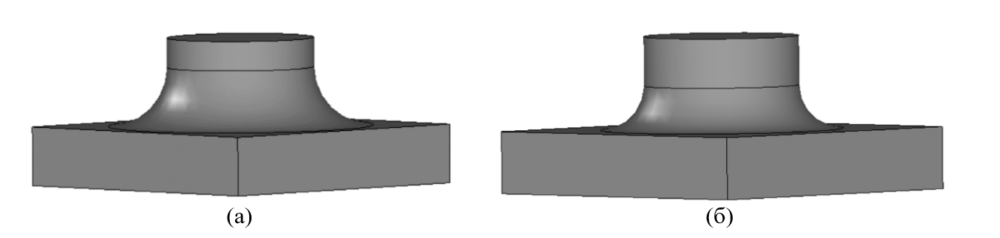
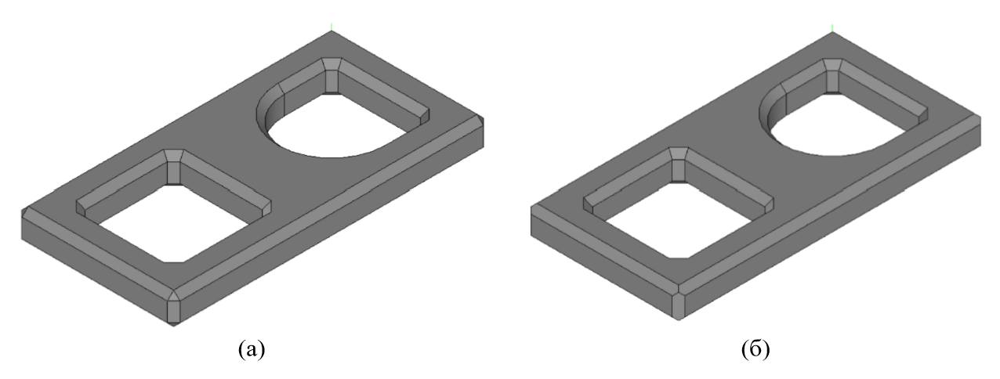

Модификация ребер и граней твердых тел
====
-------------------------------------------
### [Скругление ребер твердого тела](#title_1)
### [Построение тела с фасками ребер](#title_2)
### [Уклонение граней тела](#title_3)
### [Построение отверстий, карманов и пазов](#title_4)
### [Тела с ребрами жесткости](#title_5)
### [Заключение](#title_6)
-------------------------------------------
### <a name="title_1"> []()Скругление ребер твердого тела </a>
[]Построение скруглений часто можно выполнить на этапе построения твердого тела, например, с помощью скруглений на образующем контуре тела выдавливания. В некоторых случаях этот прием применить не удается. Тогда можно использовать функцию ядра FilletSolid, позволяющую построить скругление ребер уже имеющегося твердого тела.  Данная функция позволяет скруглить ребра, обработка которых была невозможна на этапе построения тела, путем сопряжения смежных граней указанных ребер. При этом в поперечном сечении сопрягающие грани могут иметь форму дуги окружности, эллипса, гиперболы или параболы.  Прототип функции FilletSolid (заголовочный файл [action_solid.h](doc::/action_solid.h)) для построения скруглений ребер твердого тела имеет вид: 
```cpp
MbResultType FilletSolid(
	MbSolid&                 solid,
	MbeCopyMode              sameShell,
	RPArray<MbCurveEdge>&    initCurves,
	RPArray<MbFace>&         initBounds,
	const SmoothValues&      params,
	const MbSNameMaker&      operNames,
	MbSolid*&                result ); 
```
**Входные параметры функции:**
1. solid  – исходное тело, ребра которого требуется скруглить;
2. sameShell  – режим копирования исходного тела;
3. initCurves  – массив скругляемых ребер тела;
4. initBounds  – массив граней, которые необходимо обрезать в случае возникновения неоднозначной ситуации при построении скруглений (например, когда опорные края грани сопряжения выходят за границу смежной грани);
5. params  – параметры скругления ребер;
6. operNames – объект-именователь операции.
 
**Выходные данные:**
1. Возвращаемое значение – rt_Success в случае успешного построения или код результата операции типа [MbResultType](doc::/MbResultType), поясняющий возникшую ошибку.
2. result – построенное твердое тело. 

[]Результат выполнения операции скругления ребер сильно зависит от значений параметров, передаваемых в виде входного объекта params класса [SmoothValues](doc::/SmoothValues). Атрибуты этого класса позволяют управлять формой поверхности сопряжения, задавать тип строящегося сопряжения, радиусы скругления и расстояния от вершин до точек завершения сопряжения.
[]Атрибуты [SmoothValues](doc::/SmoothValues)::distance1 и [SmoothValues](doc::/SmoothValues)::distance2 задают радиусы кривизны на двух поверхностях, между которыми строится скругление.
[]Атрибут conic называется коэффициентом формы скругляющей поверхности. Этот коэффициент определяет форму профиля (поперечного сечения) поверхности скругления как разновидность конической кривой. Атрибут conic может принимать значение 0 или значение из интервала от 0.05 до 0.95. В зависимости от значения conic, в качестве профиля скругляющей поверхности могут использоваться следующие конические кривые:
* conic = 0 –  дуга окружности или эллипса с заданными радиусами distance1 и distance2;
* conic = 0.5 – парабола;
* conic < 0.5 –дуга эллипса;
* conic > 0.5 –гипербола. Атрибут form принимает значение перечисляемого типа [MbeSmoothForm](doc::/MbeSmoothForm) и определяет тип сопряжения:
* st_Fillet – скругление с радиусами distance1 и distance2;
* st_Span – скругление с заданной хордой. В данном случае значения distance1 и distance2 равны и указывают расстояние между опорными краями грани сопряжения. Кривизна скругления определяется значением атрибута conic.
[]Атрибуты begLength и endLength задают расстояние от начальной вершины и конечной вершины скругляемых ребер до точек завершения сопряжения (константа UNDEFINED_DBL позволяет отключить принудительное завершение сопряжения).
[]Атрибут smoothCorner – задает способ скругления в углах, в которых стыкуются тройки ребер. Возможные способы представляются значениями перечисляемого типа CornerForm: ec_pointed, ec_uniform, ec_sharp, ec_either. Зависимость результатов операции скругления от значения данного атрибута подробнее будет рассматриваться в примерах ниже.
[]Атрибут prolong типа bool определяет способ продолжения скругления по касательным ребрам:
* prolong = false – обработке подлежат только ребра, переданные в массиве initCurves
* prolong = true – скругление выполняется для ребер из массива initCurves, а также ребер, гладко стыкующихся с ними.
[]Атрибут keepCant представляет собой флаг, управляющий режимом автоматического определения сохранения кромки или поверхности при сопряжении. Этот имеет тип ThreeStates, а не bool, как большинство других флагов. Тип ThreeStates может принимать 3 значения: ts_negative, ts_neutral и ts_positive.
[]Атрибут strict типа bool – флаг строгости построения. В случае strict = false будет выполнено скругление всех ребер, которые могут подлежать данной операции.
[]Атрибут equable типа bool – флаг вставки дополнительной тороидальной поверхности в ребрах соединения скругляющих поверхностей. 
[]Влияние значений параметров params на результат функции FilletSolid демонстрируется в примерах 2.1-2.3. В примере 2.1 исходное тело строится в виде комбинации цилиндрического тела и параллелепипеда. Цилиндрическое тело располагается по центру прямоугольного параллелепипеда, имеющего вид квадратной пластины. Два этих элементарных тела объединяются с помощью булевой операции. При объединении цилиндра и параллелепипеда у результирующего тела формируется ребро, имеющее вид окружности. Для этого ребра с помощью FilletSolid выполняется скругление. Возможные варианты результирующего тела для различных значений радиусов скруглений, типа сопряжения и коэффициента формы сопряжения показаны на рис. 1-3. 
 
**Пример 2.1. Построение скругления между цилиндром и параллелепипедом (рис. 1-3).**
```
#include <action_solid.h> 

using namespace c3d;

// Построение исходного твердого тела в виде цилиндра, расположенного по центру
// прямоугольного параллелепипеда (квадратной пластины)
void CreateSourceSolid(MbSolid*& _pSolid)
{
	// Объект-именователь для построения элементарных тел
	MbSNameMaker elNames(ct_ElementarySolid, MbSNameMaker::i_SideNone); 

	// 1) Построение цилиндра
	MbSolid* pCyl = NULL;
	{
		SArray<MbCartPoint3D> pntsCyl(3);
		pntsCyl.Add(MbCartPoint3D(50, 0, 50));
		pntsCyl.Add(MbCartPoint3D(50, 50, 50));
		pntsCyl.Add(MbCartPoint3D(75, 0, 50));
		::ElementarySolid(pntsCyl, et_Cylinder, elNames, pCyl);
	} 

	// 2) Построение квадратной пластины
	MbSolid* pBlock = NULL;
	{
		SArray<MbCartPoint3D> pntsBlock(4);
		pntsBlock.Add(MbCartPoint3D(0, 0, 0));
		pntsBlock.Add(MbCartPoint3D(0, 0, 100));
		pntsBlock.Add(MbCartPoint3D(100, 0, 0));
		pntsBlock.Add(MbCartPoint3D(0, 20, 0));
		::ElementarySolid(pntsBlock, et_Block, elNames, pBlock);
	} 

	// 3) Объединение двух тел
	MbSNameMaker operBoolNames(ct_BooleanSolid, MbSNameMaker::i_SideNone, 0);
	MbBooleanFlags flagsBool;
	flagsBool.InitBoolean(true);
	flagsBool.SetMergingFaces(true);
	flagsBool.SetMergingEdges(true);
	::BooleanResult(*pCyl, cm_Copy, *pBlock, cm_Copy, bo_Union,
	flagsBool, operBoolNames, _pSolid);
	// 4) Уменьшение счетчиков ссылок динамически созданных объектов ядра
	/*
	::DeleteItem(pBlock);
	::DeleteItem(pCyl);
	*/
} 


bool run()
{
	// 1) Построение исходного тела с помощью вспомогательной функции
	MbSolid* pSourceSolid = NULL;
	CreateSourceSolid(pSourceSolid); 

	// 2) Объект-именователь для операции скругления ребер
	MbSNameMaker filletNames(ct_FilletSolid, MbSNameMaker::i_SideNone, 0); 

	// 3) Указание значений параметров операции скругления ребер
	SmoothValues params;
	// Радиусы кривизны на двух скругляемых поверхностях
	params.distance1 = 10;
	params.distance2 = 20;
	// Тип сопряжения – скругление по двум радиусам
	params.form = st_Fillet;
	// Форма профиля сопряжения - окружность
	params.conic = 0;
	// Требуется скруглять только ребра, переданные во входном массиве
	params.prolong = false;
	// Способ скругления троек ребер
	params.smoothCorner = SmoothValues::ec_uniform;
	// Флаг сохранения кромки – режим сохранения поверхности
	params.keepCant = ts_negative;
	// Строгое скругление
	params.strict = true; 

	// 4) Формирование массива с ребрами для скругления.
	// Запрос всех ребер исходного тела
	RPArray<MbCurveEdge> allEdges(4, 1);
	pSourceSolid->GetEdges(allEdges);
	// В массив ребер для скругления помещается только одно ребро
	RPArray<MbCurveEdge> initCurves(4, 1);
	initCurves.Add(allEdges[4]); 

	// 5) Массив граней для обрезки – в данном примере пустой
	RPArray<MbFace> initBounds(0, 1); 

	// 6) Вызов функции скругления ребер.
	// В результате выполняется скругление одного ребра – окружности,
	// по которой в исходном теле соединены цилиндр и пластина.
	MbSolid* pResult = NULL;
	MbResultType res = ::FilletSolid(*pSourceSolid, cm_Copy, initCurves, initBounds,
	params, filletNames, pResult);
	
	// 7) Отображение тела после скругления ребра
	if (res == rt_Success)
		show(Style(1, LIGHTGRAY), pResult); 

	// 8) Уменьшение счетчиков ссылок динамически созданных объектов ядра
	/*
	::DeleteItem(pSourceSolid);
	::DeleteItem(pResult);
	*/
	return true;
}
```
<button id="code_block_1"></button>


**Рис. 1.** Результирующие тела для примера 2.1 при различных значениях радиусов скругления (а) distance1 = 10; distance2 = 20. (б) distance1 = distance2 = 20. (в) distance1 = 20; distance2 = 10. 


**Рис. 2.** Результирующие тела для примера 2.1 при различных значениях коэффициента формы скругляющей поверхности conic. (а) conic = 0, профиль скругляющей поверхности – дуга окружности. (б) conic = 0.2, парабола. (в) conic = 0.8, гипербола. 



**Рис. 3.** Результирующие тела для примера 2.1 при различных значениях типа сопряжения form (а) form = st_Fillet; distance1 = distance2 = 20. (б) form = st_Span, distance1 = distance2 = 20. 

[]В примере 2.2 в качестве исходного тела используется деталь с прямоугольным отверстием. У этого тела производится скругление одного криволинейного ребра (рис. 4).

**Пример 2.2. Построения скругления на детали с прямоугольным отверстием (рис. 4).**
```cpp
#include <cur_nurbs.h>
#include <action_solid.h> 
#include <cur_polyline.h>
#include <surf_plane.h>
using namespace c3d;

// Построение образующей для исходного тела выдавливания
void CreateSketch(RPArray<MbContour>& _arrContours)
{
	// Образующая состоит из двух контуров - внешнего и внутреннего.
	// У внешнего контура три стороны как у прямоугольника,
	// а четвертая представляет собой сплайн.
	// Внутренний контур - прямоугольник для формирования
	// в дальнейшем отверстия у тела выдавливания. 

	// 1) Построение внешнего контура
	MbContour* pContourExt = NULL;
	{
		// Незамкнутая ломаная кривая содержит 3 стороны для внешнего контура
		SArray<MbCartPoint> arrPnts(4);
		arrPnts.Add(MbCartPoint(0, 50));
		arrPnts.Add(MbCartPoint(0, 0));
		arrPnts.Add(MbCartPoint(100, 0));
		arrPnts.Add(MbCartPoint(100, 50));
		MbPolyline* pPolyline = new MbPolyline(arrPnts, false); 

		// Незамкнутый сплайн представляет четвертую сторону для внешнего контура
		SArray<MbCartPoint> arrSplPnts(4);
		arrSplPnts.Add(MbCartPoint(100, 50));
		arrSplPnts.Add(MbCartPoint(60, 40));
		arrSplPnts.Add(MbCartPoint(30, 60));
		arrSplPnts.Add(MbCartPoint(0, 50));
		ptrdiff_t degree = 3;
		MbNurbs* pSpline = new MbNurbs();
		pSpline->Init(degree, arrSplPnts, false); 


		// Построение внешнего контура по двум кривым - ломаной и сплайну
		RPArray<MbCurve> arrCurve(2);
		arrCurve.Add(pPolyline);
		arrCurve.Add(pSpline);
		pContourExt = new MbContour(arrCurve, true); 

		/*
		::DeleteItem(pPolyline);
		::DeleteItem(pSpline);
		*/
	} 

	// 2) Построение внутреннего контура
	MbContour* pContourIn = NULL;
	{
		// Замкнутая ломаная кривая в виде прямоугольника
		SArray<MbCartPoint> arrPnts(4);
		arrPnts.Add(MbCartPoint(10, 10));
		arrPnts.Add(MbCartPoint(90, 10));
		arrPnts.Add(MbCartPoint(90, 30));
		arrPnts.Add(MbCartPoint(10, 30)); 


		MbPolyline* pPolyline = new MbPolyline(arrPnts, true);
		pContourIn = new MbContour(*pPolyline, true); 


		//::DeleteItem(pPolyline);
	} 

	// Возврат образующей в виде пары контуров
	_arrContours.push_back(pContourExt);
	_arrContours.push_back(pContourIn);
} 

// Построение исходного твердого тела выдавливания
void CreateSourceSolid(MbSolid*& _pSolid)
{
	const double DEG_TO_RAD = M_PI/180.0; 

	// Получение образующей тела выдавливания
	RPArray<MbContour> arrContours;
	CreateSketch(arrContours); 

	// Вызов операции построения тела выдавливания
	MbSNameMaker operNames(ct_CurveExtrusionSolid, MbSNameMaker::i_SideNone, 0);
	MbPlane* pPlaneXY = new MbPlane(MbCartPoint3D(0, 0, 0),
		MbCartPoint3D(1, 0, 0), MbCartPoint3D(0, 1, 0));
	MbSweptData sweptData( *pPlaneXY, arrContours );
	MbVector3D dir(0, 0, -1);
	const double HEIGHT_FORWARD = 20.0, HEIGHT_BACKWARD = 0;
	ExtrusionValues extrusionParams(HEIGHT_FORWARD, HEIGHT_BACKWARD);
	PArray<MbSNameMaker> contourNames(0, 1, false);
	::ExtrusionSolid(sweptData, dir, NULL, NULL, false, extrusionParams,
		operNames, contourNames, _pSolid); 

	// Поворот тела выдавливания, чтобы одна из его наибольших сторон совпала
	// с плоскостью XZ глобальной СК
	_pSolid->Rotate( MbAxis3D(MbVector3D(MbCartPoint3D(0, 0, 0),
		MbCartPoint3D(1, 0, 0))), 90*DEG_TO_RAD ); 

	//::DeleteItem(pPlaneXY);
}

bool run()
{
	// 1) Построение исходного тела с помощью вспомогательной функции
	MbSolid* pSourceSolid = NULL;
	CreateSourceSolid(pSourceSolid); 

	// 2) Объект-именователь для операции скругления ребер
	MbSNameMaker filletNames(ct_FilletSolid, MbSNameMaker::i_SideNone, 0); 

	// 3) Указание значений параметров операции скругления ребер
	SmoothValues params;
	// Радиусы кривизны на двух скругляемых поверхностях
	params.distance1 = params.distance2 = 4;
	// Тип сопряжения – скругление по двум радиусам
	params.form = st_Fillet;
	// Форма профиля сопряжения - окружность
	params.conic = 0;
	// Требуется скруглять только ребра, переданные во входном массиве
	params.prolong = false;
	// Способ скругления троек ребер
	params.smoothCorner = SmoothValues::ec_uniform;
	// Флаг сохранения кромки – режим сохранения поверхности
	params.keepCant = ts_negative;
	// Строгое скругление  params.strict = true;
	// Задание границ скругления
	params.begLength = 15;
	params.endLength = 15; 

	// 4) Формирование массива с ребрами для скругления.
	// Запрос всех ребер исходного тела
	RPArray<MbCurveEdge> allEdges(4, 1);
	pSourceSolid->GetEdges(allEdges);
	// В массив ребер для скругления помещается только одно ребро
	RPArray<MbCurveEdge> initCurves(4, 1);
	initCurves.Add(allEdges[0]); 

	// 5) Массив граней для обрезки – в данном примере пустой
	RPArray<MbFace> initBounds(0, 1);  

	// 6) Вызов функции скругления ребер.
	MbSolid * pResult = NULL;
	MbResultType res = ::FilletSolid(*pSourceSolid, cm_Copy, initCurves, initBounds,
		params, filletNames, pResult); 

	// 7) Отображение тела после скругления
	if (res == rt_Success)
		show(Style(1, LIGHTGRAY), pResult); 

	// 8) Уменьшение счетчиков ссылок динамически созданных объектов ядра
	/*
	::DeleteItem(pSourceSolid);
	::DeleteItem(pResult);
	*/
	return true;
}
```

<button id="code_block_2"></button>


**Рис. 4.** Исходное (а) и результирующие тела (б, в) для примера 2.2. Тело (б) получено при скруглении криволинейного ребра со значениями параметров begLength = endLength = 0, а тело (в) – при значениях begLength = endLength = 15. Эти параметры позволяют указать часть ребра (относительно его вершин), на которой производится скругление. 

[]В вершинах твердого тела из примера 2.2 соединяются тройки ребер. С помощью значений атрибута smoothCorner можно выбрать способ построения скруглений в таких вершинах (рис. 5). Чтобы воспроизвести тела, показанные на рис. 5, в примере 2.2 необходимо произвести следующие изменения в функции run():
1. Отключить задание границ скругления: params.begLength = params.endLength = 0;
2. При вызове функции FilletSolid вместо массива initCurves с единственным ребром для скругления следует передать массив allEdges, содержащий все ребра исходного тела.


**Рис. 5.** Результирующие тела для примера 2.2 при различных значениях параметра smoothCorner, который определяет способ построения скругления в вершинах с тройками ребер. (а) ec_uniform – при стыке в одной точке двух выпуклых (вогнутых) и одного вогнутого (выпуклого) ребра первым обрабатывается вогнутое (выпуклое) ребро. (б) ec_pointed – обработка углов отсутствует. (в) ec_sharp – при стыке в одной точке двух выпуклых (вогнутых) и одного вогнутого (выпуклого) ребра первым обрабатывается выпуклое (вогнутое) ребро.

[]В примерах 2.1 и 2.2 выполнялось скругление одного ребра или всех ребер тела. В функцию FilletSolid во входном массиве initCurves можно явно передать произвольное количество скругляемых ребер. С учетом геометрической формы тела описание скругляемых ребер можно упростить. Часто у тел имеются гладко стыкующиеся ребра, которые соединяются в вершинах без изломов – касательные этих ребер параллельны. Для скругления таких ребер можно использовать параметр prolong. Этот флаг позволяет автоматически скруглять ребра, гладко стыкующиеся с ребрами из массива initCurves. Использование этого параметра показано в примере 2.3 (рис. 6).  
 
**Пример 2.3. Влияние параметра prolong на скругление гладко стыкующихся ребер (рис. 6).**
```cpp
#include <action_solid.h> 

using namespace c3d;

// Построение исходного твердого тела в виде объединения трех элементарных тел -
// двух параллелепипедов и цилиндра.
void CreateSourceSolid(MbSolid*& _pSolid)
{
	// Объект-именователь для построения элементарных тел
	MbSNameMaker elNames(ct_ElementarySolid, MbSNameMaker::i_SideNone);
	// 1) Квадратная пластина - основание детали
	MbSolid* pBlockBase = NULL;
	{
		SArray<MbCartPoint3D> pnts(4);
		pnts.Add(MbCartPoint3D(0, 0, 0));
		pnts.Add(MbCartPoint3D(0, 0, 100));
		pnts.Add(MbCartPoint3D(100, 0, 0));
		pnts.Add(MbCartPoint3D(0, 20, 0));
		::ElementarySolid(pnts, et_Block, elNames, pBlockBase);
	} 

	// 2) Цилиндр сверху пластины-основания
	MbSolid* pCylTop = NULL;
	{
		SArray<MbCartPoint3D> pnts(3);
		pnts.Add(MbCartPoint3D(50, 0, 50));
		pnts.Add(MbCartPoint3D(50, 60, 50));
		pnts.Add(MbCartPoint3D(50, 0, 80));
		::ElementarySolid(pnts, et_Cylinder, elNames, pCylTop);
	} 

	// 3) Прямоугольный параллелепипед сверху пластины-основания
	MbSolid* pBlockTop = NULL;
	{
		SArray<MbCartPoint3D> pnts(4);
		pnts.Add(MbCartPoint3D(20, 0, 20));
		pnts.Add(MbCartPoint3D(20, 0, 50));
		pnts.Add(MbCartPoint3D(80, 0, 20));
		pnts.Add(MbCartPoint3D(20, 60, 20));
		::ElementarySolid(pnts, et_Block, elNames, pBlockTop);
	}
	// 4) Объединение трех элементарных тел в возвращаемое исходное тело
	MbSNameMaker operBoolNames(ct_BooleanSolid, MbSNameMaker::i_SideNone, 0);
	MbBooleanFlags flagsBool;
	flagsBool.InitBoolean(true);
	flagsBool.SetMergingFaces(true);
	flagsBool.SetMergingEdges(true);
	MbSolid * resSolid1 = NULL;
	::BooleanResult(*pCylTop, cm_Copy, *pBlockBase, cm_Copy, bo_Union,flagsBool, operBoolNames, resSolid1);
	::BooleanResult(*resSolid1, cm_Copy, *pBlockTop, cm_Copy, bo_Union,flagsBool, operBoolNames, _pSolid); 

	// 5) Уменьшение счетчиков ссылок динамически созданных объектов ядра
	/*
	::DeleteItem(pBlockBase);
	::DeleteItem(pCylTop);
	::DeleteItem(pBlockTop);
	::DeleteItem(resSolid1);
	*/
} 


bool run()
{
	// 1) Построение исходного тела с помощью вспомогательной функции
	MbSolid* pSourceSolid = NULL;
	CreateSourceSolid(pSourceSolid); 

	// 2) Объект-именователь для операции скругления ребер
	MbSNameMaker filletNames(ct_FilletSolid, MbSNameMaker::i_SideNone, 0);
	// 3) Указание значений параметров операции скругления ребер
	SmoothValues params;
	// Радиусы кривизны на двух скругляемых поверхностях
	params.distance1 = 10;
	params.distance2 = 20;
	// Тип сопряжения – скругление по двум радиусам
	params.form = st_Fillet;
	// Форма профиля сопряжения - окружность
	params.conic = 0;
	// Требуется скруглять ребра, гладко стыкующиеся с ребрами из входного массива
	params.prolong = true;
	// Способ скругления троек ребер
	params.smoothCorner = SmoothValues::ec_uniform;
	// Флаг сохранения кромки – режим сохранения поверхности
	params.keepCant = ts_neutral;
	// Строгое скругление
	params.strict = false; 

	// 4) Формирование массива с ребрами для скругления.
	// Запрос всех ребер исходного тела
	RPArray<MbCurveEdge> allEdges(4, 1);
	pSourceSolid->GetEdges(allEdges);
	// В массив ребер для скругления помещается только одно ребро
	RPArray<MbCurveEdge> initCurves(4, 1);
	initCurves.Add(allEdges[12]); 

	// 5) Массив граней для обрезки
	RPArray<MbFace> initBounds(0, 1);  

	// 6) Вызов функции скругления ребер.
	MbSolid* pResult = NULL;
	MbResultType res = ::FilletSolid(*pSourceSolid, cm_Copy, initCurves, initBounds,
		params, filletNames, pResult);
	if (res == rt_Success)
		show(Style(1, LIGHTGRAY), pResult); 

	// 7) Уменьшение счетчиков ссылок динамически созданных объектов ядра
	/*
	::DeleteItem(pSourceSolid);
	::DeleteItem(pResult);
	*/
	return true;
}
```

<button id="code_block_3"></button>


**Рис. 6.** Результирующие тела для примера 4.4 при выключенном (а) и включенном (б) флаге prolong. В обоих случаях для скругления явно передавалось только одно ребро. При значении prolong = true (б) скругление автоматически выполняется для трех ребер (одно из этих ребер на рисунке скрыто).

### Задания(1)
----
1. Постройте тело в виде параллелепипеда, у которого наибольшие стороны имеют форму ромба. Выполните скругление всех ребер этого тела (рис. 7). 
 


**Рис. 7.** Возможное результирующее тело для задания 2.1.1.


2. Постройте тело выдавливания согласно рис. 8. Передайте функции FilletSolid массив из четырех скругляемых ребер и обеспечьте скругление всех ребер за счет режима автоматического скругления гладко стыкующихся ребер (параметр prolong).


**Рис. 8.** Результирующее тело для задания 2.1.2. 


3. Постройте тело вращения, показанное на рис. 9. Выполните скругление ребер тела с указанием различных значений радиусов и формы сопряжений (внешнее скругление наибольшего радиуса – гипербола, внешнее скругление на верхней поверхности – окружность, скругление на границе отверстия – парабола).


**Рис. 9.** Результирующее тело для задания 2.1.3. 

### <a name="title_2"> []()Построение тела с фасками ребер </a>

[]Функция скругления FilletSolid, которая рассматривалась в предыдущем п. 2, позволяет выполнять скругление ребер с помощью сопрягающих поверхностей с профилем в виде конического сечения (окружность, эллипс, гипербола, парабола). При построении твердых тел также часто требуется выполнять построение фасок. Эта операция похожа на операцию скругления, но сопряжение граней в виде фаски производится с использованием плоских сопрягающих поверхностей.
[]Для построения фасок применяется функция ChamferSolid (заголовочный файл [action_solid.h](doc::/action_solid.h)) со следующим прототипом: 
```cpp
MbResultType ChamferSolid(
	MbSolid&                 solid,
	MbeCopy                  sameShell,
	RPArray<MbCurveEdge>&    initCurves,
	const SmoothValues&      params,
	const MbSNameMaker&      operNames,
	MbSolid*&                result ); 
```
**Входные параметры функции:**
1. solid   – исходное тело;
2. sameShell  – режим копирования входного тела;
3. initCurves  – массив ребер тела для построения фасок;
4. params   – параметры операции;
5. operNames – объект-именователь операции. 
 
**Выходные данные:**
1. Возвращаемое значение – rt_Success в случае успешного построения или код результата операции типа MbResultType, поясняющий возникшую ошибку.
2. result – построенное твердое тело. 
 
[]Основная часть параметров функции ChamferSolid задается с помощью входного объекта params. Как и в случае функции скругления ребер FilletSolid (п. 2), объект params принадлежит классу [SmoothValues](doc::/SmoothValues). Функция [SmoothValues](doc::/SmoothValues) использует атрибуты класса [SmoothValues](doc::/SmoothValues) для получения данных о форме и способе сопряжения смежных граней обрабатываемых ребер из массива initCurves. Назначение некоторых атрибутов [SmoothValues](doc::/SmoothValues) отличается от случая скругления ребер (п. 2).
[]Ниже приведены основные атрибуты класса [SmoothValues](doc::/SmoothValues) для построения фасок.
[]Атрибуты distance1 и distance2 определяют длину катетов фаски относительно обрабатываемого ребра.
[]Атрибуты begLength и endLength позволяют строить фаски на частях ребер посредством указания расстояний от вершин ребра до точек прекращения сопряжения. Значение UNDEFINED_DBL отключает принудительное завершение сопряжения.  
[]Атрибут form перечисляемого [MbeSmoothForm](doc::/MbeSmoothForm) указывает тип сопряжения:
* st_Chamfer – построение фаски с заданными катетами длиной distance1 и distance2.
* st_Slant1 – поверхность фаски строится с заданным катетом и прилегающим к нему углом. В данном случае атрибут istance1 определяет первый катет, а distance2 – второй катет, обеспечивающий заданный прилежащий угол.
* st_Slant2 – построение фаски с заданным углом и катетом. Назначение атрибутов distance1 и distance2 меняется по сравнению с фаской типа st_Slant1. Теперь атрибут distance1 отвечает за обеспечение заданного угла, а distance2 – за длину прилегающего катета.
[]Атрибут smoothCorner перечисляемого типа CornerForm указывает способ сопряжения троек ребер. Смысл возможных значений (ec_pointd, ec_uniform, ec_sharp, ec_either) аналогичен функции скругления ребер (рис. 5).
[]Атрибут prolong типа bool позволяет включить режим автоматического продолжения фасок по касательным ребрам. Назначение этого параметра аналогично скруглению ребер (рис. 6).
[]Применение функции построения фасок ChamferSolid  показано в примере 3.1. В качестве исходного тела используется деталь в виде прямоугольной пластины с двумя профильными отверстиями (рис. 10, 11). С помощью этого примера можно увидеть влияние атрибута smoothCorner на построение фасок в вершинах с тройками соединяющихся ребер, а также возможность автоматического построения фасок гладко стыкующихся ребер с помощью атрибута prolong. Размеры фасок и тип сопряжения можно задавать так же, как это делалось для аналогичных параметров скруглений (см. пример 2.1). 
 
**Пример 3.1. Построение фасок на ребрах тела (рис. 10, 11).**
```cpp
#include <action_solid.h> 

using namespace c3d;

// Построение исходного твердого тела
void CreateSourceSolid(MbSolid*& _pSolid)
{
	// Объект-именователь для построения элементарных тел
	MbSNameMaker elNames(ct_ElementarySolid, MbSNameMaker::i_SideNone); 

	// 1) Основание в виде прямоугольной пластины
	MbSolid* pBlockBase = NULL;
	{
		SArray<MbCartPoint3D> pnts(4);
		pnts.Add(MbCartPoint3D(0, 0, 0));
		pnts.Add(MbCartPoint3D(0, 0, 200));
		pnts.Add(MbCartPoint3D(100, 0, 0));
		pnts.Add(MbCartPoint3D(0, 20, 0));
		::ElementarySolid(pnts, et_Block, elNames, pBlockBase);
	} 

	// 2) Цилиндр для части первого профильного отверстия
	MbSolid* pCylPartHole1 = NULL;
	{
		SArray<MbCartPoint3D> pnts(3);
		pnts.Add(MbCartPoint3D(50, 0, 50));
		pnts.Add(MbCartPoint3D(50, 20, 50));
		pnts.Add(MbCartPoint3D(50, 0, 80));
		::ElementarySolid(pnts, et_Cylinder, elNames, pCylPartHole1);
	} 

	// 3) Параллелепипед - вторая часть первого профильного отверстия
	// (в комбинации с цилиндром)
	MbSolid* pBlockPartHole1 = NULL;
	{
		SArray<MbCartPoint3D> pnts(4);
		pnts.Add(MbCartPoint3D(20, 0, 20));
		pnts.Add(MbCartPoint3D(20, 0, 50));
		pnts.Add(MbCartPoint3D(80, 0, 20));
		pnts.Add(MbCartPoint3D(20, 20, 20));
		::ElementarySolid(pnts, et_Block, elNames, pBlockPartHole1);
	} 

	// 4) Параллелепипед - для построения второго профильного отверстия
	MbSolid* pBlockHole2 = NULL;
	{
		SArray<MbCartPoint3D> pnts(4);
		pnts.Add(MbCartPoint3D(20, 0, 120));
		pnts.Add(MbCartPoint3D(20, 0, 180));
		pnts.Add(MbCartPoint3D(80, 0, 120));
		pnts.Add(MbCartPoint3D(20, 20, 120));
		::ElementarySolid(pnts, et_Block, elNames, pBlockHole2);
	} 

	// 5) Параметры для выполнения булевых операций
	MbSNameMaker operBoolNames(ct_BooleanSolid, MbSNameMaker::i_SideNone, 0);
	MbBooleanFlags flagsBool;
	flagsBool.InitBoolean(true);
	flagsBool.SetMergingFaces(true);
	flagsBool.SetMergingEdges(true); 

	// 6) Выполнение булевых операций
	// Объединение цилиндра и параллелепипеда для построения вспомогательного тела,
	// которое будет применяться для построения первого профильного отверстия:
	// pSolid1 = pBlockPartHole1 + pCylPartHole1
	MbSolid * pSolid1 = NULL;
	::BooleanResult(*pBlockPartHole1, cm_Copy, *pCylPartHole1, cm_Copy, bo_Union,
		flagsBool, operBoolNames, pSolid1);
	// Вычитание вспомогательного тела для формирования первого профильного отверстия
	// pSolid2 = pBlockBase - pSolid1
	MbSolid * pSolid2 = NULL;
	::BooleanResult(*pBlockBase, cm_Copy, *pSolid1, cm_Copy, bo_Difference,
		flagsBool, operBoolNames, pSolid2);
	// Вычитание для формирования второго профильного отверстия:
	// _pSolid = pSolid2 - pBlockHole2
	::BooleanResult(*pSolid2, cm_Copy, *pBlockHole2, cm_Copy, bo_Difference,
		flagsBool, operBoolNames, _pSolid); 

	// 5) Уменьшение счетчиков ссылок динамически созданных объектов ядра
	/*
	::DeleteItem(pBlockBase);
	::DeleteItem(pBlockPartHole1);
	::DeleteItem(pCylPartHole1);
	::DeleteItem(pBlockHole2);
	::DeleteItem(pSolid1);
	::DeleteItem(pSolid2);
	*/
}

bool run()
{
	// 1) Построение исходного тела с помощью вспомогательной функции
	MbSolid* pSourceSolid = NULL;
	CreateSourceSolid(pSourceSolid); 

	// 2) Объект-именователь для операции построения фасок
	MbSNameMaker chamferNames(ct_FilletSolid, MbSNameMaker::i_SideNone, 0); 

	// 3) Указание значений параметров операции построения фасок
	SmoothValues params;
	// Длины катетов фаски
	params.distance1 = 4;
	params.distance2 = 4;
	// Тип фаски - построение фаски с заданными катетами
	params.form = st_Chamfer;
	// Режим автоматического скругления ребер, гладко стыкующиеся с ребрами
	// из входного массива
	params.prolong = true;
	// Способ скругления троек ребер
	params.smoothCorner = SmoothValues::ec_uniform; 

	// 4) Формирование массива с ребрами для скругления.
	// Запрос всех ребер исходного тела
	RPArray<MbCurveEdge> allEdges(4, 1);
	pSourceSolid->GetEdges(allEdges);
	// Массив ребер для скругления
	RPArray<MbCurveEdge> initCurves(4, 1);
	// Заполнение массива для построения фасок по всем ребрам (рис. 10).
	for (int i = 0; i < 35; i++)
	initCurves.Add(allEdges[i]);
	// Ребро для построения фаски на полукруглом отверстии (рис. 11).
	// Для получения тела, как на рис. 11, надо закомментировать предыдущий цикл
	// и снять комментарий со следующей строки.
	// initCurves.Add(allEdges[20]); 

	// 5) Массив граней для обрезки при неоднозначном выполнении метода - пустой
	RPArray<MbFace> initBounds(0, 1);  

	// 6) Вызов функции построения фасок
	MbSolid* pResult = NULL;
	MbResultType res = ::ChamferSolid(*pSourceSolid, cm_Copy, initCurves,
	params, chamferNames, pResult);
	if (res == rt_Success)
		show(Style(1, LIGHTGRAY), pResult); 

	// 7) Уменьшение счетчиков ссылок динамически созданных объектов ядра
	/*
	::DeleteItem(pSourceSolid);
	::DeleteItem(pResult);
	*/
	return true;
} 
```
<button id="code_block_4"></button>



**Рис. 10.** Результирующие тела для примера 3.1 при различных значениях параметра smoothCorner, который определяет способ построения фасок в вершинах с тройками ребер. (а) ec_uniform (б) ec_pointed. 


**Рис. 11.** Результирующие тела для примера 3.1 при различных значениях флага prolong. (а) prolong = false – фаска строится только на ребрах из массива initCurves, в данном случае – только на одном ребре. (б) prolong = true –автоматическое построение фасок всех ребер, гладко стыкующихся с ребрами из входного массива initCurves. 

### Задания(2)
----
1. Постройте тело в виде пирамиды с фасками граней, исходящих из вершины (рис. 12). С помощью функции ElementarySolid постройте пирамиду как элементарное тело. В случае пирамиды этой функции передается n точек: n - 1 точек задают основание пирамиды, а последняя точка – вершину пирамиды.


**Рис. 12.** Результирующее тело для задания 3.1.1. 

2. Постройте тело, показанное на рис. 3.1.2. Исходное тело можно построить посредством объединения двух параллелепипедов и последующего вычитания из полученного промежуточного тела третьего параллелепипеда (для формирования квадратного отверстия). Постройте фаски всех ребер исходного тела. С помощью атрибута smoothCorner выясните различия формы получаемых фасок в вершинах с тройками ребер. Постройте фаски различных типов, изменяя значения атрибута form и размеров катетов distance1 и distance2. 


**Рис. 13.** Результирующее тело для задания 3.1.2. Внешний вид фасок зависит от значений атрибутов smoothCorner, form, distance1 и distance2. 

3. При построении фасок не всегда производится удаление частей исходного тела. При построении фасок на ребрах, соответствующих внутренним углам пар граней, тело может быть дополнено новыми фрагментами. Постройте тела, показанные на рис. 14, при выключенном и включенном параметре-флаге prolong. 


**Рис. 14.** Результирующие тела для задания 3.1.3. 
### <a name="title_3"> []()Уклонение граней тела </a>

[]Рассмотрим тела, показанные на рис. 15. Два этих тела отличаются наклоном четырех граней, которые у тела на рис. 15а расположены параллельно оси, перпендикулярной круглым граням нижней части тела. Тело на рис. 15б можно построить различными способами, которые рассматривались в предыдущих работах. Например, основание можно построить как тело вращения, а часть сверху основания – как усеченную пирамиду или тело по сечениям. В данном разделе это тело приведено для демонстрации, как специализированная операция геометрического моделирования ядра C3D позволяет в частных случаях значительно упростить построение. В этом примере можно использовать операцию уклонения граней твердого тела – функцию DraftSolid. Эта функция заменяет грани исходного тела на новые грани, наклоненные на указанный угол относительно заданной плоскости. С помощью функции DraftSolid тело на рис. 15б можно построить на основе тела на рис. 15а, которое легко получить в виде объединения двух элементарных тел.


**Рис. 15.** Применение операции уклонения граней тела DraftSolid. (а) Исходное тело. (б) Результирующее тело, полученное с помощью примера 4.1. Четыре наклоненные грани выделены зеленым цветом. 

[]Функция DraftSolid преобразует исходное тело посредством наклона указанных граней на заданный угол относительно заданного положения. Прототип этой функции (заголовочный файл [action_solid.h](doc::/action_solid.h)) имеет вид: 
```cpp
MbResultType DraftSolid(
	MbSolid&              solid,
	MbeCopyMode           sameShell,
	const MbPlacement3D&  place,
	double                angle,
	RPArray<MbFace>&      faces,
	MbeFacePropagation    propagation,
	bool                  reverse,
	const MbSNameMaker&   operNames,
	MbSolid*&             result ); 
```

**Входные параметры функции:**
1. solid   – исходное тело;
2. sameShell   – режим копирования входного тела;
3. place   – угол наклона задается относительно плоскости XY этой СК;
4. angle   – угол наклона граней;
5. faces   – уклоняемые грани исходного тела;
6. propagation – режим автоматического наклона граней, гладко стыкующихся       с уклоняемыми гранями;
7. reverse   – флаг обратного направления уклона (true – обратное        направление; false – прямое);
8. operNames – объект-именователь операции.  
 
**Выходные данные:**
1. Возвращаемое значение – rt_Success в случае успешного построения или код результата операции типа [MbResultType](doc::/MbResultType), поясняющий возникшую ошибку.
2. result – построенное твердое тело. 
 
[]За счет большей специализации, функция DraftSolid имеет меньше параметров, влияющих на результат операции, по сравнению с функциями построения скруглений и фасок (см. п. 2 и п. 3). Вместо объекта с параметрами операции у функции DraftSolid предусмотрен набор явно передаваемых значений – place, angle, faces, propagation и reverse. Режим автоматического наклона граней propagation может принимать значения перечисляемого типа [MbeFacePropagation](doc::/MbeFacePropagation):
* fp_None – автоматический наклон гладко стыкующихся граней отключен;
* fp_All – уклонение всех граней;
* fp_SmoothlyJointedAlong – обработка граней, гладко стыкующихся через сонаправленные ребра (прямолинейные);
* fp_SmoothlyJointedOrtho – обработка граней, гладко стыкующихся через перпендикулярные ребра (прямолинейные);
* fp_SmoothlyJointed – обработка граней, гладко стыкующихся через прямолинейные ребра.
[]В примере 4.1 производится уклонение граней тела для получения модели, показанной на рис. 15. Построение полученного тела другим способом было бы намного более трудоемким и длительным делом. Функция DraftSolid позволяет строить модели твердых тел сложной конфигурации, используя в качестве исходных более простые тела, возможно, даже элементарные.  
 
**Пример 4.1. Выполнение уклона граней тела (рис. 15).**
```cpp
#include <action_solid.h> 

using namespace c3d;
// Построение исходного твердого тела в виде прямоугольного
// параллелепипеда на цилиндрическом основании.
void CreateSourceSolid(MbSolid*& _pSolid)
{
	// Объект-именователь для построения элементарных тел
	MbSNameMaker elNames(ct_ElementarySolid, MbSNameMaker::i_SideNone); 

	// 1) Цилиндрическое основание
	MbSolid* pCylBase = NULL;
	{
	SArray<MbCartPoint3D> pnts(3);
	pnts.Add(MbCartPoint3D(50, 0, 50));
	pnts.Add(MbCartPoint3D(50, 20, 50));
	pnts.Add(MbCartPoint3D(100, 0, 50));
	::ElementarySolid(pnts, et_Cylinder, elNames, pCylBase);
	} 

	// 2) Прямоугольный параллелепипед
	MbSolid* pBlock = NULL;
	{
	SArray<MbCartPoint3D> pnts(4);
	pnts.Add(MbCartPoint3D(20, 0, 20));
	pnts.Add(MbCartPoint3D(20, 0, 50));
	pnts.Add(MbCartPoint3D(80, 0, 20));
	pnts.Add(MbCartPoint3D(20, 60, 20));
	::ElementarySolid(pnts, et_Block, elNames, pBlock);
	} 

	// 3) Булева операция объединения _pSolid = pCylBase + pBlock
	MbSNameMaker operBoolNames(ct_BooleanSolid, MbSNameMaker::i_SideNone, 0);
	MbBooleanFlags flagsBool;
	flagsBool.InitBoolean(true);
	flagsBool.SetMergingFaces(true);
	flagsBool.SetMergingEdges(true);
	::BooleanResult( *pBlock, cm_Copy, *pCylBase, cm_Copy, bo_Union,
		flagsBool, operBoolNames, _pSolid ); 

	// 4) Уменьшение счетчиков ссылок динамически созданных объектов ядра
	/*
	::DeleteItem(pCylBase);
	::DeleteItem(pBlock);
	*/
} 


bool run()
{
	// 1) Построение исходного тела с помощью вспомогательной функции
	MbSolid* pSourceSolid = NULL;
	CreateSourceSolid(pSourceSolid); 

	// 2) Параметры для вызова функции уклонения граней
	MbSNameMaker operNames(ct_DraftSolid, MbSNameMaker::i_SideNone, 0); 

	// Локальная СК, относительно плоскости XY которой задается наклон граней.
	// Плоскость XY этой СК перпендикулярна цилиндрическому основанию и проходит
	// через его центральную ось.
	MbPlacement3D plLocal;
	const double DEG_TO_RAD = M_PI / 180.0;
	plLocal.Rotate(MbAxis3D(MbVector3D(MbCartPoint3D(0, 0, 0), MbCartPoint3D(1, 0, 0))),
		-90 * DEG_TO_RAD);
	plLocal.Move(MbVector3D(MbCartPoint3D(0, 0, 0), MbCartPoint3D(50, 0, 0))); 

	// Режим обработки всех указанных граней
	MbeFacePropagation fp = fp_All;
	// Угол наклона граней
	double angle = 20 * DEG_TO_RAD;
	// Направление наклона - прямое
	bool reverse = false; 

	// Запрос всех граней исходного тела
	RPArray<MbFace> allFaces;
	pSourceSolid->GetFaces(allFaces);
	// Массив обрабатываемых граней
	RPArray<MbFace> faces;
	faces.Add(allFaces[1]);
	faces.Add(allFaces[2]);
	faces.Add(allFaces[4]);
	faces.Add(allFaces[6]); 

	// 3) Вызов функции уклонения граней
	MbSolid* pResult = NULL;
	MbResultType res = ::DraftSolid(*pSourceSolid, cm_Copy, plLocal, angle, faces,
		fp, reverse, operNames, pResult);
	if (res == rt_Success)
		show(Style(1, LIGHTGRAY), pResult); 

	// 4) Уменьшение счетчиков ссылок динамически созданных объектов ядра
	/*
	::DeleteItem(pSourceSolid);
	::DeleteItem(pResult);
	*/
	return true;
}
```
<button id="code_block_5"></button>

### Задания(3)
----
1. Постройте исходное тело в виде прямоугольного параллелепипеда с цилиндрическим отверстием. С помощью функции DraftSolid выполните наклон всех граней (рис. 16).


**Рис. 16.** Результирующее тело для задания 4.1.1.

2. Постройте исходное тело, показанное на рис. 17а (например, как тело выдавливания или в виде объединения цилиндра и параллелепипеда). С помощью функции DraftSolid получите тело, как на рис. 17б. Во входном массиве уклоняемых ребер укажите только одно ребро и используйте входной параметр propagation.


**Рис. 17.** Исходное (а) и результирующее (б) тело для задания 4.1.2. 

3. В качестве исходного тела используйте прямоугольный параллелепипед. Примените к нему функцию DraftSolid для построения косоугольной призмы (рис. 18).


**Рис. 18.** Результирующее тело для задания 4.1.3.  
### <a name="title_4"> []()Построение отверстий, карманов и пазов </a>

[]Операции скругления ребер (п. 2) и построения фасок (п 3) напоминают распространенные операции токарной обработки деталей. У моделей машиностроительных деталей также часто требуется строить отверстия, карманы и фигурные пазы. Конечно, эти элементы можно построить с помощью булевой операции вычитания вспомогательных тел, имеющих соответствующих конфигурацию. Для упрощения моделирования подобных типовых элементов в ядре C3D имеется функция HoleSolid. Эта функция строит требуемое вспомогательное тело и вычитает его из исходного тела. Если в качестве исходного тела solid передать пустое тело, то функция HoleSolid вернет вспомогательное тело в качестве результирующего. Таким образом с помощью этой функции можно получать модели сверл и бобышек. Прототип функции HoleSolid содержится в заголовочном файле [action_solid.h](doc::/action_solid.h): 
```cpp
MbResultType HoleSolid(
	MbSolid&              solid,
	MbeCopyMode           sameShell,
	const MbPlacement3D&  place,
	const HoleValues&     params,
	const MbSNameMaker&   names,
	MbSolid*&             result );
```
**Входные параметры функции:**
1. solid    – исходное тело;
2. sameShell   – режим копирования тела;
3. place     – локальная система координат;
4. params     – параметры операции;
5. names     – объект-именователь операции.
 
**Выходные данные:**
1. Возвращаемое значение – rt_Success в случае успешного построения или код результата операции типа [MbResultType](doc::/MbResultType), поясняющий возникшую ошибку.
2. result – модифицированное исходное твердое тело или вспомогательное тело (если исходное тело было пустым). 

[]Локальная СК place определяет расположение вспомогательного тела относительно исходного. Положение этой СК должно быть задано так, чтобы исходное и вспомогательное тела пересекались.
[]Тип и форма вспомогательного тела задается с помощью объекта params. Этот объект с параметрами операции может быть объектом одного из трех классов, унаследованных от базового класса [HoleValues](doc::/HoleValues):
* класс BorerValues – для построения отверстия или твердотельного сверла;
* класс PocketValues – для построения кармана или бобышки;
* класс SlotValues – для построения паза. 
[]В каждом из трех перечисленных классов предусмотрен собственный набор атрибутов, влияющих на форму вспомогательного тела. Ниже перечислены атрибута класса BorerValues.
[]Атрибут type – тип отверстия. Допустимы значения перечисляемого типа BorerValues::BorerType:
• bt_SimpleCylinder – простое цилиндрическое отверстие;
• bt_TwofoldCylinder – двойное цилиндрическое отверстие;
• bt_ChamferCylinder – цилиндрическое отверстие с фаской;
• bt_ComplexCylinder – двойное цилиндрическое отверстие с переходом;
• bt_SimpleCone – простое коническое отверстие;
• bt_ArcCylinder – центровое отверстие формы R (дугообразное). Радиус дуги в таком случае задается атрибутом arcRadius.
[]Атрибуты diameter, depth и spikeAngle указывают размеры отверстия под резьбу (диаметр, глубину и угол раствора конца отверстия).
[]Атрибуты capDiameter, capDepth и capAngle определяют форму головки отверстия (диаметр, глубину и угол фаски). 
[]Среди атрибутов класса BorerValues есть два логических флага, влияющих на расположение вспомогательного тела относительно исходного. Атрибут prolong задает режим продления сверла в обратную сторону (по умолчанию этот режим включен, prolong = true). Атрибут down определяет направление оси отверстия (true – прямое, в отрицательном направлении оси Z локальной системы place; false – обратное). 
[]В примере 5.1 демонстрируется построение отверстия в исходном теле в виде прямоугольного параллелепипеда. В качестве объекта с параметрами операции params используется объект класса BorerValues. Для отображения поперечного сечения отверстия строится плоское сечение тела. На рис. 19 показаны отверстия двух различных типов (bt_SimpleCylinder и bt_TwofoldCylinder).

**Пример 5.1. Построение отверстия в параллелепипеде (рис. 19).**
```cpp
#include <surf_plane.h>
#include <action_solid.h> 

using namespace c3d;

bool run() {
	// 1) Построение исходного тела - параллелепипеда
	MbSolid* pBlock = NULL;
	{
	MbSNameMaker elNames(1, MbSNameMaker::i_SideNone, 0);
	SArray<MbCartPoint3D> pnts(4);
	pnts.Add(MbCartPoint3D(0, 0, 0));
	pnts.Add(MbCartPoint3D(0, 0, 200));
	pnts.Add(MbCartPoint3D(200, 0, 0));
	pnts.Add(MbCartPoint3D(0, 100, 0));
	::ElementarySolid(pnts, et_Block, elNames, pBlock);
	} 

	// 2) Построение отверстия в исходном теле
	MbSolid* pBlockHole = NULL;
	{
	// Объект-именователь для операции построения отверстия
	MbSNameMaker holeNames(ct_HoleSolid, MbSNameMaker::i_SideNone, 0); 


	// Локальная СК, задающая положение вспомогательного тела - образа отверстия.
	const double DEG_TO_RAD = M_PI / 180.0;
	MbPlacement3D plHole(MbCartPoint3D(0, 0, 0));
	plHole.Rotate(MbAxis3D(MbVector3D(MbCartPoint3D(0, 0, 0), MbCartPoint3D(1, 0, 0))),
		90 * DEG_TO_RAD);
	plHole.Move(MbVector3D(MbCartPoint3D(0, 0, 0), MbCartPoint3D(100, 100, 100)));  

	// Объект с параметрами операции построения отверстия, которые
	// определяют тип и форму вспомогательного тела.
	BorerValues params;
	// Простое цилиндрическое отверстие (рис. 19а)
	params.type = BorerValues::bt_SimpleCylinder;

	// Двойное цилиндрическое отверстие (рис. 19б)
	// params.type = BorerValues::bt_TwofoldCylinder;
	params.diameter = 40;
	
	// Диаметр отверстия
	params.depth = 60;

	// Глубина отверстия
	params.spikeAngle = 120 * DEG_TO_RAD;
	// Угол раствора конца отверстия
	// Направление оси отверстия - в отрицательном направлении оси Z локальной СК

	params.down = false;
	// Атрибуты, используемые при построении двойного цилиндрического отверстия
	params.capDiameter = 50;
	// Диаметр головки
	params.capDepth = 5;
	// Глубина головки 
	// Вызов функции для построения отверстия в теле pBlock
	::HoleSolid(pBlock, cm_Copy, plHole, params, holeNames, pBlockHole);
	}

	// 3) Сечение тела с отверстием плоскостью для последующего отображения
	MbSolid* pBlockCut = NULL;
	{
	// Построение секущей плоскости

	MbPlane* pPlane = new MbPlane(MbCartPoint3D(0, 0, 100), MbCartPoint3D(1, 0, 100),
						MbCartPoint3D(0, 1, 100));
	// Флаг сохранения части тела, расположенной снизу секущей плоскости

	int partNum = -1; 


	// Объект-именователь для операции сечения поверхностью
	MbSNameMaker cutNames(ct_CuttingSolid, MbSNameMaker::i_SideNone, 0);
	// Тело при построении сечения считается замкнутым
	bool closed = true;
	// Флаги объединения общих граней и ребер
	MbMergingFlags mergeFlags(true, true);
	// Вызов функции построения сечения тела
	::SolidCutting( *pBlockHole, cm_Copy, *pPlane, partNum,
		cutNames, closed, mergeFlags, pBlockCut );
	::DeleteItem(pPlane);
	}
	// 4) Отображение части тела, полученной после сечения плоскостью
	show(Style(1, LIGHTGRAY), pBlockCut); 

	// 5) Уменьшение счетчиков ссылок динамически созданных объектов ядра
	/*
	::DeleteItem(pBlock);
	::DeleteItem(pBlockHole);
	::DeleteItem(pBlockCut);
	*/
	return true;
}
```
<button id="code_block_6"></button>


**Рис. 19.** Построение отверстий в параллелепипеде с помощью примера 5.1. (а) Простое цилиндрическое отверстие. (б) Двойное цилиндрическое отверстие (с головкой в верхней части). 

[]Для построения кармана или бобышки при вызове функции HoleSolid параметры операции надо передавать в виде объекта класса [PocketValues](doc::/PocketValues). Логический атрибут [PocketValues](doc::/PocketValues)::type указывает тип вспомогательного тела (true – бобышка, false – карман). Атрибуты length, width и depth определяют размеры вспомогательного тела (длину, ширину и глубину). Атрибуты cornerRadius и floorRadius задают радиусы скругления углов на боковых ребрах и на дне кармана или бобышки, а атрибут taperAngle – угол уклона стенок кармана или верха бобышки (относительно вертикальной плоскости). Построение кармана показано в примере 5.2. 

**Пример 5.2. Построение кармана в параллелепипеде (рис. 20).**
```cpp
#include <action_solid.h> 
#include <surf_plane.h>
using namespace c3d;
 
bool run()
{
	// 1) Построение исходного тела - параллелепипеда
	MbSolid* pBlock = NULL;
	{
	MbSNameMaker elNames(1, MbSNameMaker::i_SideNone, 0);
	SArray<MbCartPoint3D> pnts(4);
	pnts.Add(MbCartPoint3D(0, 0, 0));
	pnts.Add(MbCartPoint3D(0, 0, 200));
	pnts.Add(MbCartPoint3D(200, 0, 0));
	pnts.Add(MbCartPoint3D(0, 100, 0));
	::ElementarySolid(pnts, et_Block, elNames, pBlock);
	} 

	// 2) Построение кармана в исходном теле
	MbSolid* pBlockPocket = NULL;
	{
	// Объект-именователь для операции построения отверстия/кармана
	MbSNameMaker holeNames(ct_HoleSolid, MbSNameMaker::i_SideNone, 0); 


	// Локальная СК, задающая положение вспомогательного тела - образа кармана.
	const double DEG_TO_RAD = M_PI / 180.0;
	MbPlacement3D plPocket(MbCartPoint3D(0, 0, 0));
	plPocket.Rotate(MbAxis3D(MbVector3D(MbCartPoint3D(0,0,0), MbCartPoint3D(1, 0, 0))),
		-90 * DEG_TO_RAD);
	plPocket.Move(MbVector3D(MbCartPoint3D(0, 0, 0), MbCartPoint3D(100, 100, 100))); 

	// Объект с параметрами операции построения кармана.
	PocketValues params;
	// Тип строящегося вспомогательного тела: карман
	params.type = false; // Карман
	// Длина, ширина и глубина кармана
	params.length = 100;
	params.width  = 50;
	params.depth  = 20;
	// Радиус скругления угловых ребер кармана
	params.cornerRadius = 10;
	// Радиус скругления ребер на дне кармана
	params.floorRadius  = 5;
	// Угол наклона стенок кармана
	params.taperAngle = 20 * DEG_TO_RAD; 


	// Вызов функции для построения кармана

	::HoleSolid(pBlock, cm_Copy, plPocket, params, holeNames, pBlockPocket);
	} 

	// 3) Сечение тела с карманом плоскостью для последующего отображения
	MbSolid* pBlockCut = NULL;
	{
	// Построение секущей плоскости

	MbPlane* pPlane = new MbPlane(MbCartPoint3D(0, 0, 100), MbCartPoint3D(1, 0, 100),
		MbCartPoint3D(0, 1, 100));
	// Флаг сохранения части тела, расположенной снизу секущей плоскости

	int partNum = -1;
	// Объект-именователь для операции сечения поверхностью
	MbSNameMaker cutNames(ct_CuttingSolid, MbSNameMaker::i_SideNone, 0);
	// Тело при построении сечения считается замкнутым
	bool closed = true;
	// Флаги объединения общих граней и ребер
	MbMergingFlags mergeFlags(true, true);
	// Вызов функции построения сечения тела
	::SolidCutting( *pBlockPocket, cm_Copy, *pPlane, partNum,
		cutNames, closed, mergeFlags, pBlockCut );
	//::DeleteItem(pPlane);
	} 

	// 4) Отображение части тела, полученной после сечения плоскостью
	show(Style(1, LIGHTGRAY), pBlockCut); 

	// 5) Уменьшение счетчиков ссылок динамически созданных объектов ядра
	/*
	::DeleteItem(pBlock);
	::DeleteItem(pBlockPocket);
	::DeleteItem(pBlockCut);
	*/
	return true;
}
```
<button id="code_block_7"></button>


**Рис. 20.** Построение кармана в параллелепипеде с помощью примера 5.2. (а) Результирующее тело. (б) Сечение результирующего тела плоскостью. 

[]Построение пазов с помощью функции HoleSolid выполняется аналогично уже рассмотренным вариантам применения этой функции для отверстий и карманов. В данном случае объект параметров операции принадлежит классу [SlotValues](doc::/SlotValues), атрибуты которого позволяют определить тип и форму паза.  Атрибут type перечисляемого типа [SlotValues](doc::/SlotValues)::SlotType указывает тип паза:
* st_BallEnd – паз, цилиндрический в донной части;
* st_Rectangular – прямоугольный паз;
* st_TShaped – Т-образный паз;
* st_DoveTail – паз «ласточкин хвост».
[]Атрибуты length, width и depth определяют размеры паза (длину, ширину и глубину). Атрибут floorRadius задает радиус скругления ребер на дне паза.
[]Для пазов некоторых типов используются дополнительные атрибуты: bottomWidth – ширина донной части T-образного паза (она должна превышать ширину паза width), атрибут bottomDepth – глубина донной части паза «ласточкин хвост», атрибут tailAngle – угол уклона стенок паза «ласточкин хвост».
[]В примере 5.3 показано построение пазов типа st_BallEnd и st_Rectangular (рис. 21). Исходное тело и плоский разрез аналогичны предыдущим примерам 5.1 и 5.2. 
 
**Пример 5.3. Построение паза в параллелепипеде (рис. 21).**
```cpp
#include <action_solid.h> 
#include <surf_plane.h>
using namespace c3d;
 
bool run()
{
	// 1) Построение исходного тела - параллелепипеда
	MbSolid* pBlock = NULL;
	{
	MbSNameMaker elNames(1, MbSNameMaker::i_SideNone, 0);
	SArray<MbCartPoint3D> pnts(4);

	pnts.Add(MbCartPoint3D(50, 50, 50));
	pnts.Add(MbCartPoint3D(50, 50, 100));
	pnts.Add(MbCartPoint3D(150, 50, 50));
	pnts.Add(MbCartPoint3D(50, 100, 50));
	::ElementarySolid(pnts, et_Block, elNames, pBlock);
	} 

	// 2) Построение паза в исходном теле
	MbSolid* pBlockSlot = NULL;
	{
	// Объект-именователь для операции построения отверстия/кармана/паза
	MbSNameMaker slotNames(ct_HoleSolid, MbSNameMaker::i_SideNone, 0); 

	// Локальная СК, задающая положение вспомогательного тела - образа паза.
	const double DEG_TO_RAD = M_PI / 180.0;
	MbPlacement3D plSlot(MbCartPoint3D(0, 0, 0));
	plSlot.Rotate(MbAxis3D(MbVector3D(MbCartPoint3D(0, 0, 0), MbCartPoint3D(1, 0, 0))),
		-90 * DEG_TO_RAD);
	plSlot.Move(MbVector3D(MbCartPoint3D(0, 0, 0), MbCartPoint3D(100, 100, 100))); 

	// Объект с параметрами операции построения паза.
	SlotValues params;
	// Тип вспомогательного тела - паз, цилиндрический в донной части

	params.type = SlotValues::st_BallEnd;
	// Длина, ширина и глубина паза
	params.length = 50;
	params.width = 30;
	params.depth = 10; 

	// Вызов функции для построения паза
	::HoleSolid(pBlock, cm_Copy, plSlot, params, slotNames, pBlockSlot);
	} 

	// 3) Сечение тела с пазом плоскостью для последующего отображения
	MbSolid* pBlockCut = NULL;
	{
	// Построение секущей плоскости

	MbPlane* pPlane = new MbPlane(MbCartPoint3D(0, 0, 100), MbCartPoint3D(1, 0, 100),
		MbCartPoint3D(0, 1, 100));
	// Флаг сохранения части тела, расположенной снизу секущей плоскости

	int partNum = -1;
	// Объект-именователь для операции сечения поверхностью
	MbSNameMaker cutNames(ct_CuttingSolid, MbSNameMaker::i_SideNone, 0);
	// Тело при построении сечения считается замкнутым
	bool closed = true;
	// Флаги объединения общих граней и ребер
	MbMergingFlags mergeFlags(true, true);
	// Вызов функции построения сечения тела
	::SolidCutting(*pBlockSlot, cm_Copy, *pPlane, partNum,
		cutNames, closed, mergeFlags, pBlockCut);
	// ::DeleteItem(pPlane);
	} 

	// 4) Отображение части тела, полученной после сечения плоскостью
	show(Style(1, LIGHTGRAY), pBlockSlot); 

	// 5) Уменьшение счетчиков ссылок динамически созданных объектов ядра
	/*
	::DeleteItem(pBlock);
	::DeleteItem(pBlockSlot);
	::DeleteItem(pBlockCut);
	*/
	return true;
}
```
<button id="code_block_8"></button>


**Рис. 21.** Пазы в параллелепипеде (пример 5.3). (а) Паз, цилиндрический в донной части. (б) Прямоугольный паз. 

### Задания(4)
----
1. С помощью примера 5.1 постройте отверстия различных типов: цилиндрическое отверстие с фаской (рис. 22а), двойное цилиндрическое отверстие с фаской (рис. 22б), простое коническое отверстие (рис. 22в) и центровое отверстие формы R (дугообразное, рис. 22г). В качестве общих параметров отверстий используйте значения: диаметр 50, угол раствора конца отверстия 120 градусов, глубина отверстия 60. Для отверстий, состоящих частей, используйте значения: диаметр большего отверстия 70, глубина 5.


**Рис. 22.** Примеры тел, полученных в задании 5.1.1. 

2. Передавая в качестве исходного тела solid в функцию HoleSolid пустое тело, постройте бобышку с заданными параметрами: длина 150, ширина 70, высота 25, радиус скругления углов бобышки 12, радиус скругления дна 7, угол наклона стенок 25 градусов. 


**Рис. 23.** Модель бобышки для задания 5.1.2.

3. С помощью примера 5.3 постройте Т-образный паз в параллелепипеде (рис. 24а). Используйте значения атрибутов: длина паза 50, ширина 20, глубина 5. Модифицируйте этот же пример для построения вспомогательного тела для паза типа «ласточкин хвост» (рис. 24б). Сравните полученное тело с аналогичным по размерам прямоугольным пазом. Отличие паза типа «ласточкин хвост» в том, что размер нижней площадки регулируется углом наклона боковых граней. 


**Рис. 24.** Результирующие тела для задания 5.1.3. (а) Т-образный паз. (б) Вспомогательное тело (образ паза) для паза «ласточкин хвост». 

### <a name="title_5"> []()Тела с ребрами жесткости</a>

[]Для повышения прочности конструкций применяются ребра жесткости – детали в виде брусов или балок, грани которых соединяются с усиливаемыми частями. Функция RibSolid позволяет добавить ребро жесткости к заданному твердому телу. Форма добавляемого ребра определяется двумерным контуром. Прототип этой функции приведен ниже:
```cpp
MbResultType RibSolid(
                  MbSolid&              solid,
				  MbeCopyMode           sameShell,
				  const MbPlacement3D&  place,
				  const MbContour&      contour,
				  size_t                index,
				  RibValues&            params,
				  const MbSNameMaker&   names,
				  MbSolid*&             result );
```

**Входные параметры функции:**
1. solid          – исходное тело, к которому требуется добавить ребро жесткости;
2. sameShell  – режим копирования исходного тела;
3. place          – локальная СК, в плоскости XY которой располагается формообразующий контур ребра жесткости; 4. contour      – двумерный формообразующий контур;
5. index         – номер сегмента в контуре, задающий наклон ребра жесткости;
6. params      – параметры операции;
7. names       – объект-именователь операции. 
 
**Выходные данные:**
1. Возвращаемое значение – rt_Success в случае успешного построения или код результата операции типа [MbResultType](doc::/MbResultType), поясняющий возникшую ошибку.
2. result – построенное твердое тело (исходное тело с добавленным ребром жесткости).
[]Атрибуты объекта params класса [RibValues](doc::/RibValues) (он унаследован от класса [SweptValues](doc::/SweptValues)) определяют форму ребра жесткости, которое строится на основе контура contour. Атрибуты thickness1 и thickness2 задают толщину ребра относительно его плоскости, атрибуты angle1 и angle2 – углы уклона плоскости ребра жесткости в прямом и обратном направлениях. Атрибут side перечисляемого типа [RibValues](doc::/RibValues)::ExtrudeSide определяет область пространства, в которой строится ребро жесткости:
* es_Left – ребро выдавливается в левую сторону от кривой вдоль плоскости;
* es_Right – ребро выдавливается в правую сторону от кривой вдоль плоскости;
* es_Up – ребро выдавливается в сторону нормали плоскости;
* es_Down – ребро выдавливается в сторону против нормали плоскости. 
[]В примере 6.1 показано добавление ребра жесткости к твердому телу в виде объединения цилиндра и параллелепипеда. В этом примере предусмотрены варианты построения ребра жесткости с наклоном граней и без наклона (рис. 25). 
 
**Пример 6.1. Построение ребра жесткости (рис. 25).**
```cpp
#include <action_solid.h> 

using namespace c3d;

// Построение исходного твердого тела в виде цилиндра, расположенного по центру
// прямоугольного параллелепипеда (квадратной пластины)
void CreateSourceSolid(MbSolid*& _pSolid)
{
	// Объект-именователь для построения элементарных тел
	MbSNameMaker elNames(ct_ElementarySolid, MbSNameMaker::i_SideNone); 

	// 1) Построение цилиндра
	MbSolid* pCyl = NULL;
	{
	SArray<MbCartPoint3D> pntsCyl(3);
	pntsCyl.Add(MbCartPoint3D(50, 0, 50));
	pntsCyl.Add(MbCartPoint3D(50, 50, 50));
	pntsCyl.Add(MbCartPoint3D(50, 0, 70));
	::ElementarySolid(pntsCyl, et_Cylinder, elNames, pCyl);
	} 

	// 2) Построение квадратной пластины
	MbSolid* pBlock = NULL;
	{
	SArray<MbCartPoint3D> pntsBlock(4);
	pntsBlock.Add(MbCartPoint3D(0, 0, 0));
	pntsBlock.Add(MbCartPoint3D(0, 0, 100));
	pntsBlock.Add(MbCartPoint3D(100, 0, 0));
	pntsBlock.Add(MbCartPoint3D(0, 10, 0));
	::ElementarySolid(pntsBlock, et_Block, elNames, pBlock);
	} 

	// 3) Объединение двух тел
	MbSNameMaker operBoolNames(ct_BooleanSolid, MbSNameMaker::i_SideNone, 0);
	MbBooleanFlags flagsBool;
	flagsBool.InitBoolean(true);
	flagsBool.SetMergingFaces(true);
	flagsBool.SetMergingEdges(true);
	::BooleanResult(*pCyl, cm_Copy, *pBlock, cm_Copy, bo_Union,
		flagsBool, operBoolNames, _pSolid); 

	// 4) Уменьшение счетчиков ссылок динамически созданных объектов ядра
	/*
	::DeleteItem(pBlock);
	::DeleteItem(pCyl);
	*/
} 

bool run()
{
	// 1) Построение исходного тела с помощью вспомогательной функции
	MbSolid* pSourceSolid = NULL;
	CreateSourceSolid(pSourceSolid); 

	// 2) Объект-именователь для операции построения ребра жесткости
	MbSNameMaker ribNames(ct_RibSolid, MbSNameMaker::i_SideNone, 0); 

	// 3) Указание значений параметров для построения ребра жесткости
	// Локальная СК для размещения формобразующего контура (плоскость XY)
	MbPlacement3D plRib;
	plRib.Move(MbVector3D(MbCartPoint3D(0, 0, 0), MbCartPoint3D(0, 0, 50)));
	// Формообразующий контур
	MbLineSegment* pLineSeg = new MbLineSegment(MbCartPoint(5, 10), MbCartPoint(30, 45));
	MbContour* pContour = new MbContour( *pLineSeg, true);
	// Номер сегмента в контуре, который задает наклон ребра
	size_t index = pContour->GetSegmentsCount()/2;
	// Объект параметров для построения ребра жесткости
	RibValues params;
	// Толщина стенок ребра
	params.thickness1 = 2;
	params.thickness2 = 2;
	// Задание углов уклона ребер жесткости (снять комментарий для получения рис.25б)
	// const double DEG_TO_RAD = M_PI / 180.0;
	// params.angle1 = 15 * DEG_TO_RAD;
	// params.angle2 = 15 * DEG_TO_RAD; 

	// 4) Вызов функции для добавления ребра жесткости к телу pSourceSolid.
	MbSolid * pResult;
	MbResultType res = ::RibSolid(*pSourceSolid, cm_Copy, plRib, *pContour, index,
		params, ribNames, pResult); 

	// 5) Отображение тела с ребром жесткости
	if (res == rt_Success)
	show(Style(1, LIGHTGRAY), pResult); 

	// 6) Уменьшение счетчиков ссылок динамически созданных объектов ядра
	/*
	::DeleteItem(pLineSeg);
	::DeleteItem(pContour);
	::DeleteItem(pSourceSolid);
	::DeleteItem(pResult);
	*/
	return true;
}
```
<button id="code_block_9"></button>


**Рис. 25.** Построение ребра жесткости с помощью примера 6.1 (а) Ребро жесткости без уклона граней. (б) Ребро жесткости с уклоном граней.

### Задания(5)
----
1. Постройте исходное тело в виде прямоугольной пластины с расположенным на ней параллелепипедом. Добавьте к этому телу два ребра жесткости согласно рис. 26. Постройте ребра жесткости без уклона (рис. 26а) и с уклоном (рис. 26б).


**Рис. 26.** Результирующие тела для задания 6.1.1.

2. Постройте тело в виде объединения параллелепипеда и цилиндра с продольным отверстием и добавьте к этому телу четыре ребра жесткости согласно рис. 27.  


**Рис. 27.** Результирующие тела для задания 6.1.1.

### <a name="title_6"> []()Заключение</a>

[]В данной работе были рассмотрены функции модуля геометрического моделирования FilletSolid, ChamferSolid, DraftSolid, HoleSolid и RibSolid. Эти функции позволяют упростить и ускорить построение тел некоторых видов по сравнению с базовыми операциями твердотельного моделирования. Они модифицируют уже построенные твердые тела, передаваемые в качестве входных параметров.
[]Функция FilletSolid предназначена для скругления ребер твердого тела. У этой функции предусмотрен обширный набор параметров, которые передаются в виде входного объекта класса [SmoothValues](doc::/SmoothValues). Значения атрибутов этого класса позволяют управлять формой скруглений. В работе приведены примеры задания радиуса скругляемой поверхности, управление формой скругления, управление режимом скругления в вершинах, в которых стыкуются тройки ребер, а также автоматическое скругление гладко стыкующихся ребер.
[]Для построения фасок используется функция ChamferSolid. Параметры этой функции задаются аналогично функции скругления ребер.
[]Операция уклонения граней тела DraftSolid упрощает построение тел, для которых можно построить исходное тело с некоторым легко задаваемым направлением граней, относительно которых можно указать требуемое наклонное положение граней результирующего тела. Эта операция напоминает построение фасок, целиком заменяющих грани исходного тела на сопрягающую поверхность. Операция DraftSolid является примером специализированной операции геометрического моделирования для твердых тел с известными свойствами формы – для тел, у которых углы сопряжения граней относительно некоторых базовых положений (как правило, перпендикулярных граней) указать проще, чем выполнять вспомогательные построения промежуточных тел (например, образующих или сечений для них). 
[]Функция HoleSolid предназначена для построения отверстий, карманов и пазов. Она модифицирует входное тело за счет автоматического построения вспомогательного тела и последующего выполнения булевой операции вычитания. С помощью этой функции можно также получить вспомогательное тело – образ отверстия, кармана или паза. Эта возможность упрощает построение моделей сверл и бобышек.
[]Для добавления ребер жесткости к имеющемуся твердому телу можно применять функцию RibSolid. Параметры этой функции позволяют указать форму ребра жесткости и наклон его граней. 
 