РУКОВОДСТВО ПОЛЬЗОВАТЕЛЯ
======================
-------------------------------------------
### [Форма приветствия](#title_1)
### [Формы программы](#title_2)
### [Построение модели](#title_3)
### [Редактор кода](#title_4)
### [Форма визуализации](#title_5)
### [Загрузка примеров из уроков](#title_6)
### [Добавление уроков и файлов pdf формата в программу](#title_7)
-------------------------------------------

[]Программа разработана для того, чтобы предоставить пользователю удобный инструмент для работы со всеми видами документации и примерами с использованием библиотеки C3D Toolkit. Данная оболочка представляет возможность ускоренного обучения ядра c3d непосредственно через написание кода.  

#### <a name="title_1"> Форма приветствия </a>
-----------------------
[]При запуске программы, пользователя встречает стартовая форма (рисунок 1).  

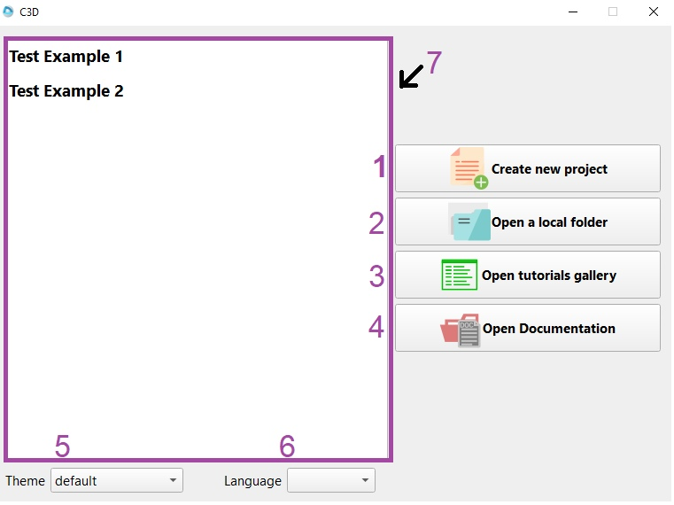  
**Рис. 1.** Форма приветствия.

[]При запуске программы пользователю предлагаются 5 действий, и также 2 типа настройки:  
1. Кнопка «Create new project» открывает основную форму и создает новый проект.
2. Кнопка «Open a local folder» позволяет пользователю выбрать существующий проект, после выбора файла, откроется основная форма и в редактор кода будет помещен текст из выбранного файла.
3. Кнопка «Open tutorials gallery», открывает основную форму и сразу открывает галерею с уроками.
4. Кнопка «Open Documentation», открывает основную форму и сразу открывает документацию.
5. Выбор темы для программы.
6. Выбор языка для программы.
7. Окно для выбора предыдущих работ. Если пользователь сохранил проект, то при следующем запуске программы, в этом окне будет возможность сразу открыть этот проект.

#### <a name="title_2"> Формы программы </a>
-----------------------
[]Для того, чтобы отрыть нужную форму, требуется нажать на соответствующую кнопку, (ещё раз нажатие на кнопку закрывает соответствующую вкладку). Формы для открытия документации, галереи уроков и формы визуализации можно открыть через меню во вкладке «View» или при помощи горячих клавиш: «Ctrl» + «Shift» + «D», «Ctrl» + «Shift» «G», «Ctrl» + «Shift» + «V» соответственно. Расположение кнопок показаны на рисунке 2. Действия кнопок:  
1. Кнопка «Docs» открывает документацию DOxygen ядра c3d.
2. Кнопка «Gallery» открывает галерею с уроками.
3. Кнопка «Scene» открывает форму для отображения моделей.
4. Кнопка «back to tutorial» возвращает пользователя на то место в уроке, где пользователь остановился и сменил или закрыл вкладку с уроком. Кнопка становится активной после того, как будет открыт хотя бы 1 урок.
5. Кнопка «Manuals» открывает вкладку с pdf файлами.
6. Кнопка «TextEdit» открывает редактор кода.
7. Кнопка «Console output» открывает консоль.
8. Кнопка «Scene message» открывает форму для сообщений, которые пользователь оставил в редакторе кода при помощи функции message.

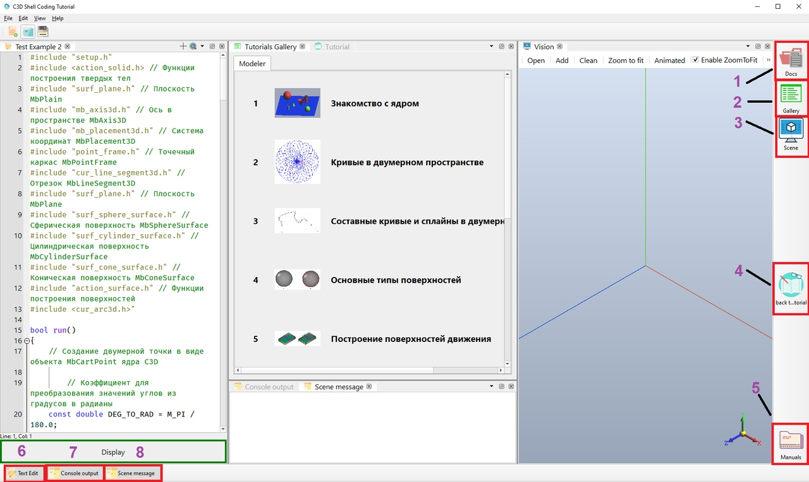  
**Рис. 2.** Расположение кнопок.

#### <a name="title_3"> Построение модели </a>
-----------------------
[]Для построения модели, требуется написать код для построение модели в редакторе кода, после этого нажать на кнопку «Display», если код написан правильно, то в модуле визуализации будет отображена модель (рисунок 3), если скомпилировать код из редактора кода не удалось, то в консоли будет отображено, где совершена ошибка(рисунок 4).  

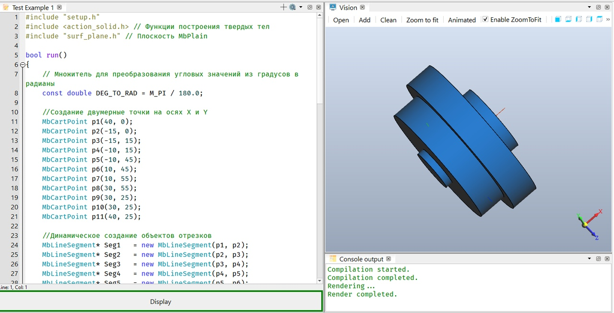  
**Рис. 3.** Успешное построение модели.

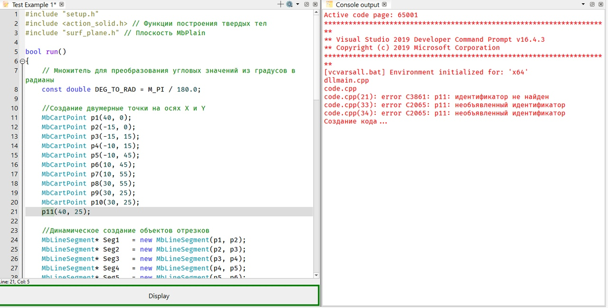  
**Рис. 4.** Сообщение об ошибке.

#### <a name="title_4"> Редактор кода </a>
-----------------------
[]В программе реализована возможность работать сразу с несколькими вкладками для того, чтобы создать вкладку требуется нажать на выделенные кнопки (рисунок 5), или в меню во вкладке File нажать кнопку «New» (также создать новую вкладку можно при помощи сочетания клавиш «Ctrl+N»).  

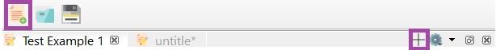  
**Рис. 5.** Создание новой вкладки.

[]Для того чтобы открыть файл (файл или файлы откроются в новых вкладках), требуется нажать на кнопку, показанную на рисунке 6 или меню нажать на кнопку «Open…» (сочетание клавиш «Ctrl» + O).  

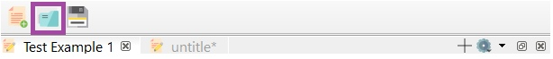  
**Рис. 6.** Открыть файл.

[]Для сохранения файла требуется нажать на кнопку, показанную на рисунке 7 или в меню нажать на одну из кнопок «Save» («Ctrl» + «S») или «Save As…» («Ctrl» + «Shift» + «N»)  

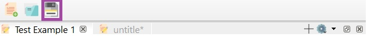  
**Рис. 7.** Сохранить файл.

[]Также есть ещё несколько дополнительных возможностей взаимодействия с редактором кода (рисунок 8).  

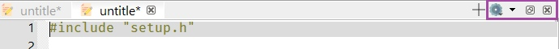  
**Рис. 8.** Дополнительные функции.

1. Первая кнопка является выпадающим список, где пользователь может выбрать 2 действия: удалить содержимое в текущей вкладке в редакторе кода и закрыть все вкладки.
2. Вторая кнопка тоже является выпадающим списком. В этом выпадающем списке отображаются названия вкладок в редакторе кода, кликнув по которой, откроется вкладка.
3. Третья кнопка «вытаскивает редактор кода», то есть редактор кода становится как отдельное окно.
4. Четвертая кнопка сворачивает форму с редактором кода.
Форму поиска и замены текста в реакторе кода можно открыть через меню, во вкладке «Edit» или при помощи сочетания клавиш «Ctrl» + «F». Форма поиска и замены слов показана на рисунке 9.

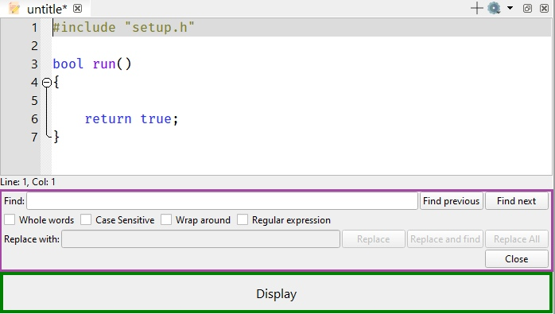  
**Рис. 9.** Форма поиска и замены слов.

[]Если в редакторе кода использовать функцию message. То в форме «Scene message» будет выведено сообщение (рисунок 10) после нажатия кнопки «Display». Также есть функция messageBox (рисунок 11). Сообщения выводятся только при успешной компиляции.  

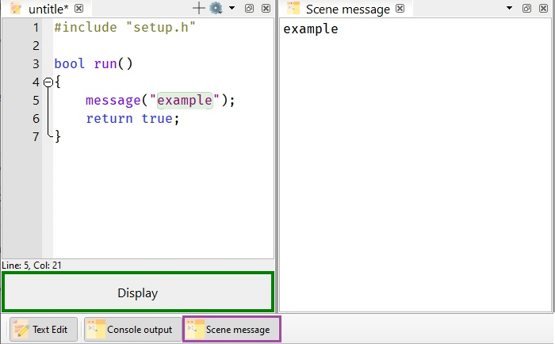  
**Рис. 10.** Использование функции message.

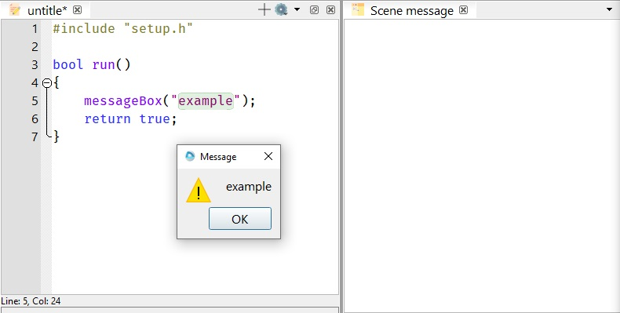  
**Рис. 11.** Использование функции messageBox.

[]Текст из редактора кода, можно найти в документации, для этого требуется:  
1. Выделить слово или поставить курсор на слово, которое требуется найти.
2. Нажать клавишу «F1».

#### <a name="title_5"> Форма визуализации </a>
-----------------------
[]Форма визуализации предназначена для отображения модели на основе кода написанного в редакторе кода. У формы визуализации есть панель инструментов (рисунок 12). Функции на панели инструментов:  
1. Кнопка «Open» загружает модель (расширение c3d) в форму визуализации.
2. Кнопка «Add» загружает к текущей модели ещё модель.
3. Кнопка «Clear» отчищает сцену от деталей.
4. Кнопка «Zoom to fit» выравнивает отображение по габаритам модели.
5. Кнопка «Animated» запускает анимацию вращения вокруг модели.
6. Чекбокс «Enable ZoomToFit» во включенном состоянии, выравнивает отображения загруженных моделей автоматически по габаритам модели.
7. Каждая из этих кнопок разворачивают камеру сцены в соответствии с изображением каждой кнопки.
8. Переключение режимов отображения модели

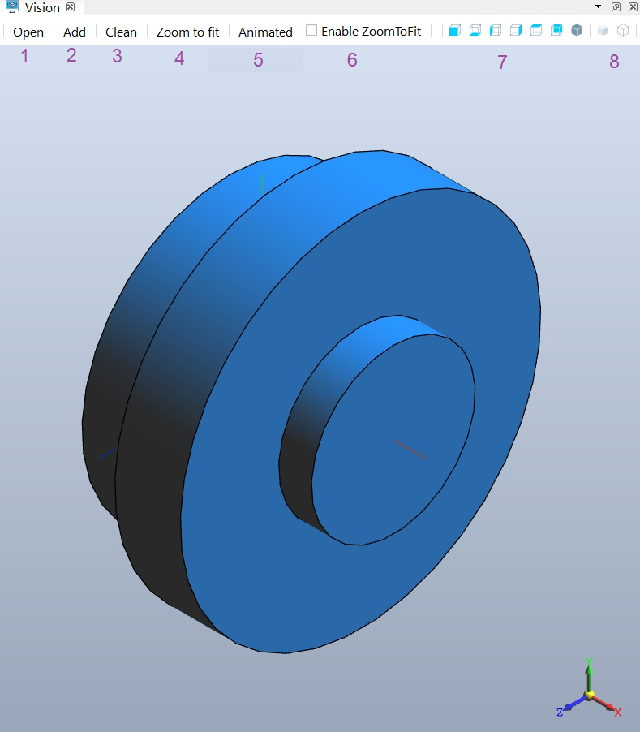  
**Рис. 12.** Форма визуализаци.

#### <a name="title_6"> Загрузка примеров из уроков </a>
-----------------------
[]Примеры из уроков можно загрузить в редактор кода и посмотреть результат в форме визуализации. Для этого требуется:  
1. Открыть галерею с уроками.
2. Выбрать урок.
3. Найти пример (листинг кода).
4. В конце примера нажать на одну из кнопок (рисунок 13). Первая кнопка загрузит пример в текущую вкладку в редакторе кода. Вторая кнопка создает новую вкладку и загрузит код в неё

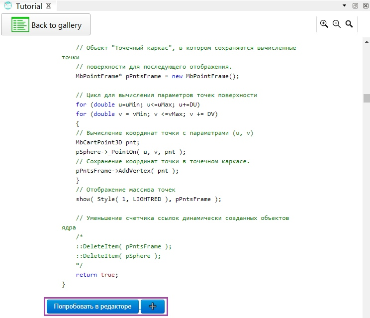  
**Рис. 13.** Загрузка кода из примера в редактор кода.

#### <a name="title_7"> Добавление уроков и файлов pdf формата в программу </a>
-----------------------
[]Программа может отображать новые pdf файлы или новые уроки. Для того, чтобы добавить новый pdf файл для отображения в программе, следует добавить pdf файл в папку «Manuals» (рисунок 14)  

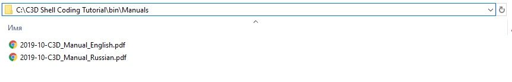  
**Рис. 14.** Добавление файлов pdf формата в программу.

[]Для добавления уроков (необязательно уроков), в папке Tutorials следует создать новую папку. Папка должна содержать файл tutorial.xml (рисунок 15). В этом файле описаны пути к файлам, которые будут отображены в уроке программы (рисунок 16).  

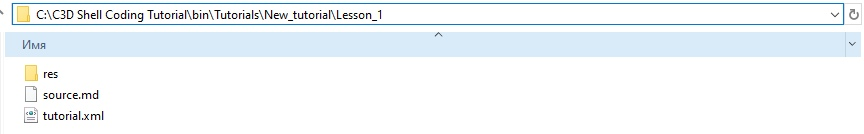  
**Рис. 15.** Создание нового урока.

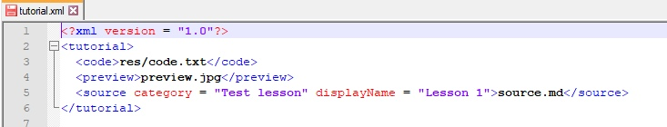  
**Рис. 16.** Описание файла tutorial.xml.

[]Тег code отвечает за загрузку примеров из урока в редактор кода. В указанном теге файл должен содержать коды всех примеров из урока.  
[]Тег preview загружает картинку для урока.  
[]Тег source непосредственно является содержимым урока. Атрибут category создает новую вкладку для темы уроков. Атрибут displayName устанавливает название для урока. 
Пример создания тестового урока показан на рисунке 17.  

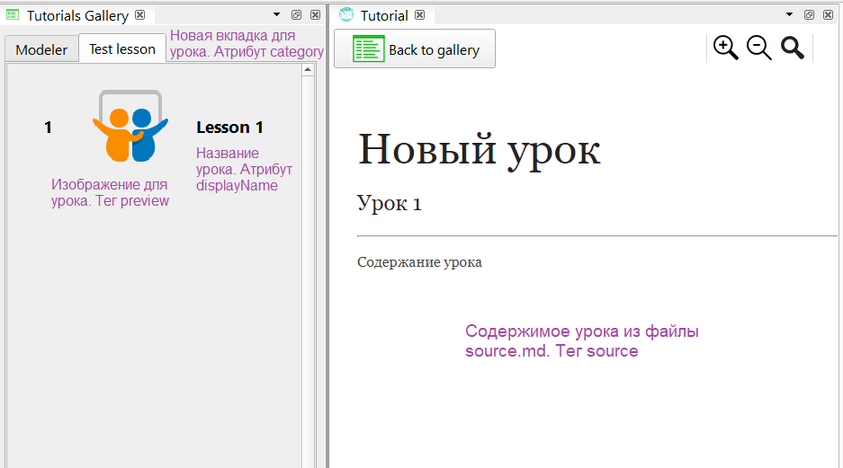  
**Рис. 17.** Пример нового урока.